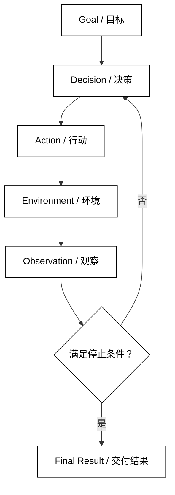

# Agent 是什么

## 学习目标

- 用“目标、决策、行动、观察、循环、停止”描述 Agent，而不是把它等同于某个模型或聊天界面。
- 看懂一个 Agent 运行时的最小数据流，知道每一层负责什么。
- 通过一个不依赖模型和网络的 Python 例子建立源码阅读入口。

## 前置知识

需要有 Python 基础编程能力。不要求先学过某个 Agent 框架；第一章的项目导航是可选参考，不是本篇的理论前置。本文只使用后续文章会反复出现的 Agent、Model、Action 和 Observation 这些最小术语。

## Agent 的工作定义

### Agent

**Agent** 是一个围绕目标持续做出下一步决策、执行行动、读取结果，并在满足停止条件后交付结果的系统。这里的“做出决策”通常由模型参与，但 Agent 不等于模型：模型负责根据输入产生候选输出，Agent 运行时负责把输出解释为行动、执行行动、保存状态和决定是否继续。

白话说，模型像“提出下一步建议的决策器”，Agent 像“把建议放进有边界的工作流程里执行的系统”。只有模型回答一句话时，它仍然可以是普通的模型调用；当系统能根据结果继续行动并处理失败时，才出现 Agent 的闭环特征。

### Goal

**Goal** 是一次运行要达成的结果或判定条件，例如“把三个待办事项整理成表格”。目标应当能被运行时或上层程序判断是否完成；“尽量聪明地处理”是偏好，不是可验证的目标。

本章只把 Goal 当作 Agent 的方向。如何将目标拆成 Instructions 和 Constraints，见后续 [Goal、Instructions 与 Constraints](./03-Goal-Instructions与Constraints)。

### Model

**Model** 是根据当前输入生成文本、结构化决定或行动候选的组件。输入可以包含目标、指令、历史状态和最新观察；输出可能是最终回答，也可能是“调用某个工具并携带参数”的行动提议。

模型通常不能直接改变外部世界。发邮件、写文件或访问数据库这些副作用必须由运行时登记、校验并执行；把模型输出当成已经发生的事实，是 Agent 系统中最危险的边界混淆之一。

### Environment

**Environment** 是 Agent 能观察或影响的外部世界，包括文件系统、数据库、网页、用户审批界面以及一个纯内存的模拟对象。Environment 不一定是远程服务；下面的计数器也足以用来说明“行动导致环境变化，下一步再观察变化”。

### Action

**Action** 是 Agent 请求环境执行的一步操作。它可以是“向用户返回答案”这样的终止动作，也可以是调用工具、更新任务、请求审批等非终止动作。Action 需要有明确的名称、输入和执行结果，不能只在日志里写一句模糊的“继续处理”。

### Observation

**Observation** 是环境在某个行动之后返回给 Agent 的可用事实，例如工具返回的 JSON、文件不存在的错误或用户拒绝审批。Observation 不是模型的臆测，也不等于完整环境；运行时应只把已取得、允许暴露给模型的部分放入下一轮输入。

### Agent Loop

**Agent Loop** 是“读取目标和当前观察 → 产生下一步行动 → 执行动作 → 记录观察 → 判断是否继续”的循环。它至少需要一个当前状态和一个停止分支；没有停止分支的 while True 只能叫未完成的控制流，不能算可交付的 Agent 运行时。

后续 [Observation、Action 与 Agent Loop](./04-Observation-Action与Agent-Loop) 会把这个闭环拆成可观察的状态转移。本篇先用一个确定性策略展示结构，不引入在线模型，以便把模型能力和循环职责分开。



阅读提示：`Decision` 只提出候选动作，只有 Environment 返回新的 `Observation` 后，运行时才有依据继续或交付结果。

## 一个不依赖模型的最小闭环

下面的代码用一个“把计数器推进到目标值”的模拟环境演示 Goal、Action、Observation 和停止分支之间的数据流；它可直接用 Python 运行，不需要密钥。

```python
from dataclasses import dataclass


@dataclass(frozen=True)
class Observation:
    value: int


def choose_action(goal: int, observation: Observation) -> str:
    if observation.value >= goal:
        return "finish"
    return "increment"


def run_agent(goal: int) -> int:
    observation = Observation(value=0)
    steps = 0

    while True:
        action = choose_action(goal, observation)
        if action == "finish":
            # 停止条件：当前观察已经满足目标，循环不再执行环境动作。
            return observation.value

        if action != "increment":
            raise ValueError(f"unsupported action: {action}")

        # 状态变化：环境把当前值增加一，下一次循环只能读取新的观察。
        observation = Observation(value=observation.value + 1)
        steps += 1

        if steps > goal + 1:
            raise RuntimeError("step budget exceeded")


print(run_agent(3))
# 输出：3
```

这个例子中的 choose_action 可以替换成模型调用，但 run_agent 仍然需要保留动作校验、环境执行、观察更新和步数边界。真实系统还要记录每次决策的输入与输出，方便解释“为什么执行了这一步”。

### 决策与执行的责任边界

模型或策略函数只负责提出候选 Action；运行时负责检查动作名称、参数和权限，再把它交给 Environment。Environment 返回 Observation 后，运行时决定哪些字段可以进入下一次模型输入。这样即使模型产生未知动作，也不会自动获得文件、网络或账户权限。

### 结果不是每次循环都能交付

一次循环可能得到中间数据、等待审批或可恢复错误，而不是最终答案。运行时应区分“行动已执行”和“目标已完成”：工具返回 {"status": "accepted"} 只表示请求被接受，不代表业务结果已经产生。停止与失败的详细边界在 [停止条件、超时与失败边界](./06-停止条件超时与失败边界) 中说明。

## 源码阅读时如何定位 Agent

不同项目的命名不同，但可以沿着同一条调用链找职责，而不是先背类名。

### smolagents 的对应关系

阅读 smolagents 时，可以先找负责接收任务并反复运行的 Agent 执行方法，再追到工具调用和结果回填位置。CodeAgent 或工具型 Agent 的具体实现可能随版本变化，但“模型产出下一步 → 执行器执行 → 结果进入下一次上下文”的边界仍是同一条闭环。

### OpenAI Agents SDK 的对应关系

OpenAI Agents SDK 将 Agent 的指令、工具和转交能力放进 Agent 配置，将循环编排交给 Runner。源码阅读重点不是某个便捷入口的参数表，而是 Runner 如何创建一次 Run、处理每个模型结果并决定继续、结束或转交。

### LangGraph 的对应关系

LangGraph 把循环显式表示成 State、Node 和 Edge：Node 做一次处理，Edge 根据状态选择下一步。它把“循环控制”从隐含的 while 提升为可检查的图，但每个节点仍然在做 Action 和 Observation 之间的转换。

### DeepSeek Harness 的对应关系

DeepSeek Harness 的 Driver、Session 或 Plugin 等层会承担比最小 Agent 更多的生命周期和扩展职责。阅读时先找 Driver 如何持有当前运行、如何调用 Agent/工具、如何发布事件；不要把插件注册或 UI 事件误认为模型本身的决策能力。

## 易混点

- **Agent 不等于模型**：模型生成候选决定；Agent 还要负责执行、状态、权限和停止。
- **自主不等于无约束**：可控的目标、动作白名单、步数和超时，正是生产 Agent 的必要条件。
- **Action 不等于 Observation**：Action 是请求做什么，Observation 是环境实际返回什么；模型猜测的结果不能冒充 Observation。
- **聊天界面不一定是 Agent**：如果每次输入都只触发一次模型调用，没有环境行动和后续决策，它更接近问答应用。
- **工具成功不等于任务完成**：工具调用的成功状态只说明这一步被接受或执行，需要再观察目标是否满足。

## 课后小问

1. 为什么把模型输出直接当成文件已经写入是错误的？

   **答案**：模型输出只是候选决定，不是 Environment 的执行结果。

   **解析**：只有经过动作校验、权限检查和实际写入，并收到可验证的 Observation，运行时才能记录“文件写入成功”。这条边界也让失败、重试和审计有了依据。

2. 一个 Agent Loop 最少需要哪两个控制分支？

   **答案**：一个执行下一步 Action 的分支，以及一个明确停止或返回结果的分支。

   **解析**：只有行动没有停止会导致无限循环，只有停止没有行动则无法完成需要多步环境交互的目标。真实实现还应增加异常和预算边界。

## 本节小结

- Agent 是围绕 Goal 进行决策、行动、观察并停止的系统，不是单独的模型。
- Model 提议行动，运行时校验并执行，Environment 返回 Observation。
- 最小 Agent Loop 必须同时包含状态更新和可判定的停止路径。
- 阅读框架源码时，应沿着“决策 → 执行 → 观察 → 再决策”的调用链定位职责。

## 快速回顾

- 能解释 Agent 与 Model、Action 与 Observation 的区别。
- 能从一个运行时找到 Goal、Environment 和停止分支。
- 能说明为什么最小例子可以不用在线模型，但仍然体现 Agent 闭环。
- 下一篇阅读 [Agent 系统组成](./02-Agent系统组成)，把闭环拆成可替换的系统部件。
