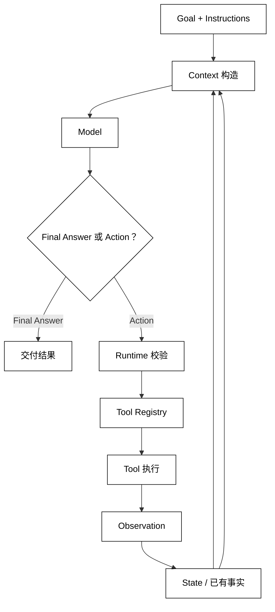

# Agent 系统组成

## 学习目标

- 能把一个 Agent 拆成 Model、Instructions、Tools、State、Context 和运行时协调层。
- 知道“保存事实”“提供给模型”“允许产生副作用”分别属于哪个责任边界。
- 读框架源码时，能从数据流而不是类名判断组件职责。

## 前置知识

- 已阅读 [Agent 是什么](./01-Agent是什么)，理解 Goal、Action、Observation 和最小闭环。
- 具备 Python 基础编程能力；本文不重复讲通用语法或第三方 SDK 用法。

## 组件不是一组配置项

### Agent 系统边界

Agent 系统从任务输入开始，到交付最终结果或明确失败结束。系统内部至少要完成四次转换：

1. 把用户目标和固定指令整理成模型可用的输入。
2. 把模型输出解析为“最终答案”或候选 Action。
3. 把候选 Action 交给有权限边界的执行层，并产生 Observation。
4. 把 Observation 写入运行状态，再决定是否继续。

这些转换可能由一个类完成，也可能分散到 Runner、Executor、ToolRegistry 和 StateStore。名称不是重点；重点是每次转换的输入、输出和副作用是否可追踪。

### Model

Model 负责推理和生成候选输出。它可以是远程大模型、本地模型或测试用的确定性函数。Model 不拥有工具权限，也不应该悄悄写入 StateStore；否则模型调用和业务副作用就无法区分。

模型输出要经过解析和校验。自然语言“我已经删除了文件”是文本，不能自动被当作删除动作；结构化的动作提议也只是待执行请求，仍需经过工具和权限边界。

### Instructions

Instructions 是告诉模型如何理解目标、如何选择动作和如何表达结果的稳定规则。例如“只读文件，不修改内容”“需要付款时先请求审批”。它影响模型决策，但不是程序级的强制安全策略。

可执行的安全要求必须由运行时或工具层再次校验。将“请勿访问其他目录”只写在 Instructions 中，不能代替路径检查和操作系统权限。

### Tools

Tool 是把一个明确能力暴露给 Agent 的受控接口，通常包括名称、参数约束、执行函数和结果格式。Tool 不是“把整个 Python 解释器交给模型”；它应当只公开任务需要的最小能力。

工具执行后返回 Observation。工具的输入应被校验，输出应被限制在模型真正需要的范围；错误也要成为可区分的 Observation，而不是直接吞掉。

### State

State 是一次运行中需要继续使用、且具有明确所有权的事实和控制信息，例如当前目标、已收集的结果、已执行步数、待审批动作和停止原因。State 的字段应该能说明谁写入、什么时候更新、什么时候清理。

State 不是所有日志的总和，也不是无条件把整个会话历史塞给模型。执行轨迹可以持久化用于审计，但只有经过筛选的字段才成为下一次决策的输入。

### Context

Context 是某一次 Model 调用实际看到的输入视图。它可能由 Goal、Instructions、State 摘要和最新 Observation 拼成，也可能为了上下文长度或权限而隐藏部分 State。

同一个 State 可以产生不同的 Context：管理员审批层可能看到完整工具参数，模型只看到脱敏后的结果，用户界面只看到进度。把 Context 当成 State 会导致信息泄露和状态丢失两类问题。

### Runtime

Runtime（运行时协调层）连接 Model、Tools、State 和 Context，负责一次调用的顺序、动作解析、异常转换、日志事件和停止判断。它是 Agent 的“控制平面”，不等于具体模型或某个工具。

### Guardrail

Guardrail 是在输入、模型输出、工具参数或最终结果附近执行的规则检查。它可以拒绝不满足条件的请求，但“检查结果如何处理”仍是运行时责任。更完整的停止、超时和失败边界见 [停止条件、超时与失败边界](./06-停止条件超时与失败边界)。

## 从 Goal 到 Observation 的数据流

### 输入层

输入层接收用户 Goal、可选的用户上下文和系统级 Instructions。它应先建立运行记录，再让 Model 参与决策；这样即使第一次调用失败，也能知道请求何时开始、使用了哪些约束。

### 决策层

决策层把 Context 交给 Model，得到两类结果之一：最终答案，或带工具名和参数的候选 Action。解析器应拒绝缺少名称、参数类型错误或未知动作的结果。

### 执行层

执行层查找已注册的 Tool，检查参数和权限，执行函数并把返回值统一为 Observation。执行层不应根据模型自然语言猜测一个未注册的工具。

### 状态层

状态层记录 Action、执行结果和控制字段，例如已用步数或待审批状态。更新 State 后，运行时才构造下一次 Context；不能让 Model 看到一个尚未写入的“虚构结果”。



阅读提示：`State` 保存运行时事实，`Context` 只是一次 Model 调用的投影；只有 Tool 真实返回 `Observation` 后，结果才回到 State。

## 一个单步组件装配例子

下面的代码把一个确定性决策器、只读工具、运行状态和 Context 装配成一次可观察的单步执行；它用于看清组件边界，不实现完整循环。

```python
from __future__ import annotations

from dataclasses import dataclass, field
from typing import Callable


@dataclass
class RunState:
    goal: str
    facts: list[str] = field(default_factory=list)
    last_observation: str | None = None


@dataclass(frozen=True)
class Tool:
    name: str
    execute: Callable[[str], str]


def lookup_status(argument: str) -> str:
    # 外部能力：这个示例只读内存数据，不修改文件或访问网络。
    records = {"build": "green", "deploy": "waiting"}
    return records.get(argument, "unknown")


def decide(context: dict[str, object]) -> dict[str, str]:
    if "build" in str(context["goal"]).lower():
        return {"kind": "tool", "name": "lookup_status", "argument": "build"}
    return {"kind": "final", "text": "没有需要查询的状态"}


def run_once(state: RunState, tools: dict[str, Tool]) -> str:
    context = {
        "goal": state.goal,
        "facts": tuple(state.facts),
        "last_observation": state.last_observation,
    }
    decision = decide(context)

    if decision["kind"] == "final":
        return decision["text"]

    tool = tools.get(decision["name"])
    if tool is None:
        raise ValueError(f"unknown tool: {decision['name']}")

    # 状态变化：只有真实工具执行后，结果才写入 State。
    observation = tool.execute(decision["argument"])
    state.last_observation = observation
    state.facts.append(f"{tool.name} -> {observation}")
    # 输出契约：调用者拿到 Observation，同时可以继续构造下一次 Context。
    return observation


state = RunState(goal="查询 build 状态")
registry = {"lookup_status": Tool("lookup_status", lookup_status)}
print(run_once(state, registry))
print(state.facts)
# 输出：green
# 输出：['lookup_status -> green']
```

代码中的 context 是一次调用的输入视图，state 是运行时持有的事实，registry 是可用能力清单。决策器返回 final 时可以结束；返回 tool 时还要经过注册表查找和执行，才能得到 Observation。

### 工具注册表的作用

Tool registry 不只是方便查找函数，它是能力白名单。注册表可以按租户、用户或当前运行生成不同的可用工具集合；在源码中看到工具注册、过滤或权限包装时，应把它们视为执行边界，而不是模型提示词的一部分。

### Context 构造器的作用

Context 构造器决定 State 的哪些字段、以何种格式进入 Model。好的构造器会保留任务相关事实、压缩过长历史、移除敏感字段，并明确缺失字段的默认语义；它不应在构造过程中偷偷执行工具。

### 状态更新的原子性

一次工具执行通常需要把 Action、结果和控制字段作为一个逻辑更新写入。若工具已经产生副作用但 State 更新失败，下一次恢复可能重复执行；因此后续章节讨论取消、重试和恢复时，都要先确认状态写入的所有权。

## 源码阅读的组件映射

### smolagents

smolagents 中的 Agent 配置、工具对象和执行方法分别对应 Instructions/Tools/Runtime。阅读时沿着“工具如何注册 → 模型结果如何解析 → 工具结果如何回填”追踪，而不要把工具函数本身当成 Agent。

### OpenAI Agents SDK

OpenAI Agents SDK 通常将 instructions 和 tools 作为 Agent 能力描述，把 RunContext 或 Runner 相关对象作为运行期输入与编排边界。具体类名会随版本变化，源码阅读应检查 Runner 何时生成 context、何时保存结果以及哪个分支结束运行。

### LangGraph

LangGraph 的 StateGraph 把 State 的字段定义、节点更新和边的选择显式化。它的节点可能调用模型或工具，但节点本身不应被误读为完整 Agent；真正的运行顺序由图的边和执行器共同决定。

### DeepSeek Harness

DeepSeek Harness 的 Session、Plugin、Hook 和事件层可能同时扩展 Context、Tools 和 Runtime。阅读时先区分“注册能力的生命周期”与“当前 Agent 是否选择能力”，再看事件如何携带状态变化。

## 易混点

- **Instructions 不是安全隔离**：提示规则能影响模型，但不能替代工具参数校验、权限和沙箱。
- **State 不是 Context**：State 是运行时拥有的事实集合，Context 是一次模型调用看到的投影。
- **Tool 不是任意函数**：可成为 Tool 的函数要有稳定输入、结果和副作用边界。
- **Runtime 不是 Model**：Runtime 控制调用顺序、错误和停止；Model 只负责生成候选输出。
- **日志不自动等于状态**：审计日志可以不可变地追加，但恢复所需 State 必须有明确写入和读取契约。

## 课后小问

1. 为什么同一个 State 需要构造成不同的 Context？

   **答案**：不同调用者的权限、信息需求和上下文长度不同，不能把全部运行状态无条件暴露给模型或用户。

   **解析**：Context 是视图，State 是事实所有权。把两者分开，既能隐藏敏感字段，也能在模型输入压缩后保留完整恢复信息。

2. 模型提出一个未知工具名时，哪个组件应拒绝它？

   **答案**：运行时的动作解析或 Tool registry 应拒绝，而不是依赖模型自己纠正。

   **解析**：模型输出不具备执行权限。只有注册表和执行层知道当前运行允许哪些能力，拒绝结果还应作为可诊断的失败记录。

## 本节小结

- Agent 系统由 Model、Instructions、Tools、State、Context 和 Runtime 协同构成。
- Model 产生候选决定，Tool 执行受控副作用，State 保存事实，Context 提供一次调用的输入视图。
- Instructions 和 Guardrail 影响决策，但不能替代程序级权限和参数校验。
- 源码阅读应沿着数据流寻找解析、执行、状态更新和停止边界。

## 快速回顾

- 能画出 Goal → Context → Model → Action → Tool → Observation → State 的数据流。
- 能指出 State 与 Context、Instructions 与 Guardrail 的区别。
- 能解释 Tool registry 为什么既是查找结构又是能力白名单。
- 下一篇阅读 [Goal、Instructions 与 Constraints](./03-Goal-Instructions与Constraints)，继续明确“要完成什么”和“哪些行动不允许”。
