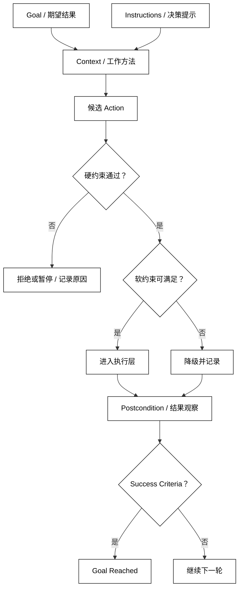

# Goal、Instructions 与 Constraints

## 学习目标

- 区分用户想达成的 Goal、指导决策的 Instructions 和不可违反的 Constraints。
- 把模糊目标转换成可检查的成功条件、前置条件和结果边界。
- 读源码时识别哪些规则只是给模型的提示，哪些规则由程序强制执行。

## 前置知识

- 已阅读 [Agent 是什么](./01-Agent是什么) 和 [Agent 系统组成](./02-Agent系统组成)。
- 已了解 Model、Tools、State、Context、Action 和 Observation 的基本责任边界。

## 三种输入承担不同责任

### Goal

Goal 是一次 Agent 运行要完成的任务结果。它回答“最终要改变或交付什么”，例如“检查 build 状态并在失败时生成报告”。Goal 通常来自用户，也可能由上层 Workflow 生成。

好的 Goal 包含对象、期望结果和必要的完成判定。只写“处理一下部署”会把成功标准留给模型猜；写成“读取当前部署状态，若失败则生成包含错误原因的报告，不执行回滚”更容易被程序和人共同检查。

### Instructions

Instructions 是告诉 Agent 如何工作的一组规则，回答“在达成目标时应遵循什么方法”。它可以规定回答风格、决策顺序、需要询问的情况和可使用的能力。

Instructions 适合表达稳定偏好和流程提示，例如“先读取状态再给结论”“把不确定的字段标成 unknown”。它不是不可绕过的安全边界：如果一条规则涉及账户、文件或网络权限，仍然需要在 Tool 和 Runtime 中执行检查。

### Constraints

Constraints 是对输入、动作、资源或结果施加的边界，回答“什么不能做，或必须满足什么条件”。例如只读某个目录、最多执行五步、金额超过阈值必须审批。

约束分为**硬约束**和**软约束**。硬约束不满足就拒绝或暂停；软约束可以在冲突时降级并记录。例如“不可写入生产目录”是硬约束，“优先使用简短报告”通常是软约束。

### Success Criteria

Success Criteria 是判断 Goal 是否达成的可检查条件。它可以是状态字段、输出结构或外部观察，例如“报告文件存在且包含状态和错误原因”。没有成功条件，Agent 可能在得到一段听起来合理的文字后过早停止。

### Preconditions 与 Postconditions

Preconditions 是执行某个 Action 前必须成立的条件；Postconditions 是 Action 成功后应能观察到的结果。比如写入报告前，前置条件是目标目录已获授权，后置条件是读取报告能看到新版本内容。

把前置和后置条件写在 Tool 或 Runtime 层，能避免只依靠模型“记住流程”。模型可以提出行动，但不能伪造后置条件。

## 规则如何进入一次运行

### 输入规范化

运行时先把用户目标转换成内部的 Goal 结构，明确对象、输出和成功判定。不要在这一步偷偷执行行动；规范化失败应直接返回需要补充的信息。

### 指令合并

运行时把稳定 Instructions 和本次 Goal 相关的局部 Instructions 组合成 Context。组合过程要可追踪：如果一条局部指令覆盖了全局要求，系统应能说明覆盖关系或拒绝冲突。

### 约束执行

Runtime 在模型决策前后都可以检查 Constraints，但涉及副作用的检查必须靠近执行位置再做一次。模型输入中的“不得删除”只能减少错误决策，不能保证工具不会收到删除请求。

### 冲突处理

Goal、Instructions 和 Constraints 冲突时，先保留硬约束，再在剩余空间中满足 Goal，最后用软约束优化表达方式。若硬约束让 Goal 不可完成，应返回明确的阻塞原因，而不是自行放宽约束。



阅读提示：先由 Goal 和 Instructions 形成候选决定，再由 Runtime 强制检查硬约束；软约束只能在不破坏硬边界时降级。

## 用结构化对象表达任务边界

下面的代码把 Goal、Instructions 和 Constraints 组合成一次“检查动作是否允许”的本地判断；它展示规则的职责位置，不依赖模型或框架。

```python
from dataclasses import dataclass


@dataclass(frozen=True)
class Goal:
    description: str
    success_criteria: str


@dataclass(frozen=True)
class Constraints:
    allowed_directory: str
    max_steps: int
    read_only: bool = True


@dataclass(frozen=True)
class Action:
    name: str
    path: str
    step: int
    writes: bool = False


def check_action(action: Action, constraints: Constraints) -> tuple[bool, str]:
    if action.step > constraints.max_steps:
        return False, "step budget exceeded"
    if not action.path.startswith(constraints.allowed_directory):
        return False, "path is outside the allowed directory"
    if constraints.read_only and action.writes:
        return False, "write action is forbidden"
    return True, "allowed"


goal = Goal(
    description="检查项目状态",
    success_criteria="返回状态和可定位的错误原因",
)
instructions = ("先读取状态；找不到记录时返回 unknown；不要猜测缺失字段。")
constraints = Constraints(allowed_directory="workspace/", max_steps=3)
candidate = Action(name="read_status", path="workspace/build.json", step=1)

allowed, reason = check_action(candidate, constraints)
print(goal.description)
print(instructions)
print(allowed, reason)
# 输出：检查项目状态
# 输出：先读取状态；找不到记录时返回 unknown；不要猜测缺失字段。
# 输出：True allowed
```

这里的 check_action 是硬约束执行器，候选 Action 即使来自可信代码也要经过它。Goal 和 Instructions 帮助 Model 选择方向，Constraints 决定候选是否有资格进入执行层。

### 路径约束不是字符串前缀就足够

示例为了突出责任边界使用了简单前缀判断；真实文件工具还要规范化路径、处理符号链接、检查实际权限，并拒绝类似 workspace/../secrets 的逃逸路径。不要把示例判断当成通用安全实现。

### 步数约束需要由运行时持有

max_steps 是运行控制字段，不应由 Model 自己递增。每次尝试执行 Action 前，Runtime 增加或检查计数；无论 Action 成功、失败还是被取消，都要定义计数是否消耗，避免重试绕过预算。

### 输出约束需要验证结果

“返回状态和错误原因”不仅是 Instructions，还应通过结果解析器检查字段是否存在。若模型只给出“看起来失败”，运行时应把它标为格式不完整或继续获取 Observation，而不是假定成功。

## 源码阅读时寻找规则的真正位置

### 提示层规则

模板、system instruction、agent instruction 或 prompt builder 中的文字通常属于提示层。它们影响 Model，但不天然阻止越权行动；阅读时要继续寻找对应的执行校验。

### schema 层规则

Action schema、参数类型和必填字段把候选输出限制成可解析结构。schema 能减少格式错误，但不能证明路径、用户身份或业务状态真实有效。

### 执行层规则

Tool wrapper、middleware、guardrail 或 executor 中的检查才接近真实副作用边界。它们应返回明确的拒绝原因，并把检查结果放进 State 或事件，而不是静默忽略。

### 上层业务规则

审批、配额和领域状态可能属于 Workflow 或业务服务，而不属于 Agent。阅读源码时不要把“模型做出推荐”和“业务系统允许提交”混成一个判断。

## 与主线项目的对应关系

### smolagents

smolagents 的 instructions、工具描述和执行器分别体现提示规则、能力清单与执行边界。具体封装可能变化，源码阅读时优先检查工具调用前是否有参数验证和结果回填。

### OpenAI Agents SDK

OpenAI Agents SDK 中 Agent 的 instructions 更接近决策提示，工具函数及其输入定义更接近候选动作契约，Runner/guardrail 负责在运行中处理边界。不要因为 instructions 写了“只能只读”就跳过工具侧授权检查。

### LangGraph

LangGraph 可以把约束写在节点和边的条件中：节点负责一次转换，边负责是否允许下一跳。图结构让部分流程规则可视化，但外部副作用仍应在节点调用的工具层复核。

### DeepSeek Harness

DeepSeek Harness 的 Hook、Plugin 或 Driver 配置可能注入全局指令、拦截动作或增加审批。阅读时要区分“扩展提供了规则”与“规则是否在副作用发生前真正执行”。

## 易混点

- **Goal 不是 Instructions**：Goal 描述要达成的结果，Instructions 描述达到结果时的工作方式。
- **Instructions 不是 Constraints**：Instructions 主要影响模型，Constraints 必须由程序在关键边界强制检查。
- **Schema 不等于授权**：参数格式正确不代表用户有权限或路径安全。
- **拒绝不是失败吞掉**：违反硬约束应留下原因和状态，让用户能修正目标或申请审批。
- **软约束不能覆盖硬约束**：为了“更快”或“更简短”而绕过只读、预算或审批，会破坏系统契约。

## 课后小问

1. 用户说“尽快完成部署”，这是 Goal 还是 Constraint？

   **答案**：它更像 Goal 的偏好或软约束，缺少可检查的完成条件。

   **解析**：需要补充目标对象、成功标准和允许的操作范围；“尽快”不能授权跳过审批、超时边界或健康检查。

2. 为什么同一条“不得写入生产目录”要在提示和工具里各出现一次？

   **答案**：提示层帮助 Model 选出正确动作，工具层在真实副作用发生前强制拒绝。

   **解析**：两层目标不同：前者降低错误提议，后者保证错误提议不会造成越权。只保留提示会把安全寄托在模型遵守文字上。

## 本节小结

- Goal 定义结果，Instructions 指导方法，Constraints 规定不可逾越的边界。
- Success Criteria、Preconditions 和 Postconditions 把自然语言目标变成可检查契约。
- 软约束可以降级，硬约束不满足时应拒绝或暂停并说明原因。
- 源码阅读要追到执行层，确认提示、schema 和业务授权分别在哪里生效。

## 快速回顾

- 能把一句任务拆成 Goal、Instructions、Constraints 和 Success Criteria。
- 能判断一条规则应放在提示层、schema 层还是工具执行层。
- 能解释为什么模型遵守指令不能替代程序级权限。
- 下一篇阅读 [Observation、Action 与 Agent Loop](./04-Observation-Action与Agent-Loop)，将候选动作和环境反馈连成显式状态转移。
