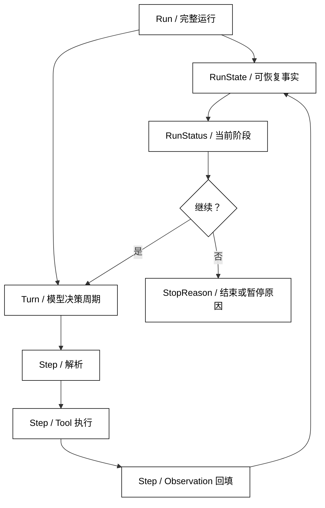

# Run、Turn、Step 与运行状态

## 学习目标

- 用 Run、Turn、Step 三个层次描述 Agent 的时间边界。
- 设计能支持观察、恢复和诊断的运行状态，而不是只保留最后一段文本。
- 理解不同框架对这些词的命名可能不同，源码阅读时如何找到对应生命周期。

## 前置知识

- 已阅读本章前四篇，理解 Goal、Action、Observation 和 Agent Loop。
- 已了解 State 与 Context 的区别；本文把它们放进一次运行的生命周期中观察。

## 三层时间边界

### Run

Run 是从接受一个 Goal 到交付最终结果、失败或取消的完整运行实例。它应该有稳定的 run_id、开始时间、当前状态和最终结束原因。

一次用户请求通常对应一个 Run，但恢复操作可能继续原 Run，也可能创建带有父 ID 的新 Run。具体策略要由系统定义，不能让重试代码无意中生成无法关联的多个运行。

### Turn

Turn 是一次“根据当前 Context 请求 Model 做决定”的交互周期。一个 Turn 可能得到 Final Answer，也可能得到一个或多个 Action。若动作执行后需要重新请求 Model，通常进入下一个 Turn。

不同框架可能把用户消息到最终回答称为一个 Turn，也可能把每次模型调用都称为 Turn。因此源码阅读时不要只依赖名称，应检查 Turn 的开始事件、模型调用次数和结束条件。

### Step

Step 是一次可单独记录的状态转移或执行动作，例如解析一次模型结果、执行一次 Tool、写入一次 Observation。一个 Turn 可以包含多个 Step；一个 Run 可以包含多个 Turn。

Step 应有 step_id、输入摘要、输出摘要和结果状态。把整轮工作压成一条“处理中”日志，会丢失最有价值的失败位置和副作用边界。

### 嵌套关系

常见的心智模型是：

Run

→ Turn（一次模型决策周期）

→ Step（解析、执行、回填等可追踪动作）

但这不是所有框架的固定协议。某些工具调用会被视为独立 Turn，某些框架把模型调用和工具执行都记为 Step。稳定的判断依据是父子 ID、生命周期事件和状态更新，而不是字段名称。



阅读提示：`Run` 是生命周期容器；`RunState` 保存可恢复事实，`RunStatus` 表示当前阶段，`StopReason` 只在结束或暂停时解释原因。`Turn` 是模型决策周期，`Step` 是可诊断的状态转移；具体框架可调整分组，但父子 ID 和生命周期事件不能丢。

## 运行状态的核心字段

### RunStatus

RunStatus 表示当前生命周期阶段。一个最小集合可以是 queued、running、waiting、completed、failed、cancelled。

- queued：已接受但尚未开始执行。
- running：正在进行模型调用、动作校验或工具执行。
- waiting：等待用户审批、外部回调或恢复信号。
- completed：成功满足目标并交付结果。
- failed：无法按当前策略继续。
- cancelled：调用者主动请求停止，或系统执行取消策略。

状态转换应由 Runtime 统一控制。不要允许任意工具直接把 Run 从 running 改成 completed；完成必须经过 Success Criteria 检查。

### RunState

RunState 是运行时持有的可恢复事实集合。它通常包含 Goal、当前状态、Turn/Step 计数、最近 Observation、待处理 Action、错误摘要和最终结果引用。

RunState 不必把全部模型输入原样保存，但要足够让系统解释当前处于哪一步、为什么继续或停止。敏感数据应按权限和保留策略存储。

### StopReason

StopReason 是结束或暂停的结构化原因，例如 goal_reached、max_steps、timeout、tool_error、awaiting_approval。它不是给用户显示的完整文案，而是程序、日志和监控共享的稳定分类。

多个原因同时发生时，应规定优先级，例如用户取消优先于普通工具失败；不要在异常处理的不同层随意覆盖原始原因。第 06 篇会详细讨论停止条件和失败边界。

### Run ID 与父子关系

run_id、turn_id 和 step_id 让日志、事件和结果可以关联。重试、转交或恢复操作应保留 parent_run_id 或 attempt 信息，否则同一个目标的多个执行可能被误认为互不相关。

## 一个可追踪的运行状态

下面的代码用本地列表记录一个 Run 的 Turn 和 Step，展示状态如何随着“读取状态 → 生成报告”推进；它不调用模型，也不依赖网络。

```python
from __future__ import annotations

from dataclasses import dataclass, field
from enum import Enum


class RunStatus(str, Enum):
    QUEUED = "queued"
    RUNNING = "running"
    COMPLETED = "completed"
    FAILED = "failed"


@dataclass
class Step:
    step_id: int
    name: str
    status: str
    output: str = ""


@dataclass
class Turn:
    turn_id: int
    steps: list[Step] = field(default_factory=list)


@dataclass
class RunState:
    run_id: str
    goal: str
    status: RunStatus = RunStatus.QUEUED
    turns: list[Turn] = field(default_factory=list)
    stop_reason: str | None = None


def execute_run(state: RunState) -> str:
    state.status = RunStatus.RUNNING
    turn = Turn(turn_id=1)
    state.turns.append(turn)

    turn.steps.append(Step(1, "read_status", "running"))
    turn.steps[-1].output = "green"
    turn.steps[-1].status = "completed"

    turn.steps.append(Step(2, "make_report", "running"))
    turn.steps[-1].output = "report: build=green"
    turn.steps[-1].status = "completed"

    # 状态变化：只有目标结果已产生，Run 才进入 completed。
    state.status = RunStatus.COMPLETED
    state.stop_reason = "goal_reached"
    return turn.steps[-1].output


state = RunState(run_id="run-001", goal="生成 build 报告")
print(execute_run(state))
print(state.status.value, state.stop_reason)
print([(step.name, step.status) for step in state.turns[0].steps])
# 输出：report: build=green
# 输出：completed goal_reached
# 输出：[('read_status', 'completed'), ('make_report', 'completed')]
```

示例把 Step 作为最小诊断单元，把 Turn 作为一组相关 Step，把 Run 作为最终状态所有者。真实运行中每个 Step 还应记录开始和结束时间、错误摘要及必要的输入/输出引用。

### 状态更新的所有权

Runtime 应是 RunStatus 的主要写入者；Tool 只返回结果，Model 只产生候选决定。若工具直接把状态改成 completed，后续的成功条件、审计和取消都可能被绕过。

### 状态与事件的关系

State 表示当前事实，事件表示事实如何变化。事件可以追加记录 step_started、step_completed 或 status_changed，状态则可以由事件重放或快照恢复。两者不要混成“每条日志都能恢复”的强保证，除非系统真的实现了完整事件持久化。

### 快照与恢复

长时间运行的 Run 可以周期性保存 State 快照。恢复时要验证快照版本、待执行 Action 和外部副作用是否已经发生；仅恢复内存计数器而不核对工具结果，可能造成重复写入。

## 源码阅读时还原生命周期

### 先找 Run 的入口和出口

搜索 run、execute、invoke 或 runner 等入口，确认什么时候创建 run_id，哪些分支写入 completed、failed 或 cancelled。入口名称不重要，开始和结束状态的写入才是边界。

### 再找 Turn 的循环位置

观察模型调用前后是否递增 turn_id，工具调用是否启动新的 Turn，或者只是当前 Turn 内的 Step。把实际事件顺序画出来，能避免被抽象名误导。

### 最后找 Step 的持久化和错误传播

检查每个工具和模型调用是否有开始、成功、失败状态，以及异常如何回到 Run。若某个子任务失败后父 Run 仍显示 completed，应继续追踪父子状态合并逻辑。

## 与主线项目的对应关系

### smolagents

smolagents 的一次 agent 执行可以视为 Run，模型推理和工具执行组成若干 Step。具体是否暴露 Turn/Step 对象取决于版本；阅读时用执行日志和循环变量重建层次。

### OpenAI Agents SDK

OpenAI Agents SDK 的 Runner 负责一次 Run 的生命周期，工具调用、转交和 guardrail 结果可能表现为不同的事件或步骤。不要把流式事件名称直接当成统一的 Turn 标准，先确认父 ID 和结束状态。

### LangGraph

LangGraph 的一次图执行对应 Run，节点执行和边跳转可以对应 Step；图中一次模型节点及其后续工具节点是否算同一 Turn，由上层应用的事件分组决定。

### DeepSeek Harness

DeepSeek Harness 的 Driver、Session 和事件系统可能为 Run 之外增加会话或任务层。阅读时要把 Session 的长期边界与当前 Run 的一次执行分开，避免把会话历史误当成当前状态。

## 易混点

- **Run 不等于一次模型调用**：Run 可以包含多个 Turn、工具执行和等待状态。
- **Turn 不是固定协议术语**：不同框架对 Turn 的分组不同，必须查看实际生命周期。
- **Step 不只是“模型思考一步”**：解析、工具执行和状态写入都可以是可追踪 Step。
- **Status 不等于 StopReason**：Status 说明当前阶段，StopReason 说明为何结束或暂停。
- **快照不等于幂等恢复**：恢复前仍需确认外部副作用和待执行动作的真实情况。

## 课后小问

1. 一个 Run 显示 completed，但最后一个工具步骤失败，最可能缺少哪类边界？

   **答案**：缺少由 Runtime 统一执行的结果校验和父子状态合并。

   **解析**：工具失败只能先结束该 Step；只有成功条件成立，父 Run 才能进入 completed。否则应进入 failed 或等待修复。

2. 为什么不能用最后一条日志推断 Run 的当前状态？

   **答案**：日志可能缺少父子关系、覆盖顺序或关键失败事件，且不一定是可恢复的事实来源。

   **解析**：State 由明确所有者更新，事件用于解释变化；可靠系统应定义快照或事件重放契约，而不是依赖文本日志猜测。

## 本节小结

- Run 是完整运行，Turn 是模型决策周期，Step 是可独立追踪的状态转移或动作。
- RunStatus、RunState 和 StopReason 共同描述运行当前阶段、可恢复事实和结束原因。
- Runtime 应统一拥有父 Run 的状态写入权，工具和模型只提供结果或候选。
- 源码阅读时以生命周期事件和父子 ID 为准，不要假设术语跨框架完全一致。

## 快速回顾

- 能把一次执行拆成 Run → Turn → Step，并说明每层的开始和结束。
- 能区分 queued、running、waiting、completed、failed、cancelled 的语义。
- 能解释 State、事件、快照和恢复之间的关系。
- 下一篇阅读 [停止条件、超时与失败边界](./06-停止条件超时与失败边界)，把“何时结束”变成明确的运行契约。
