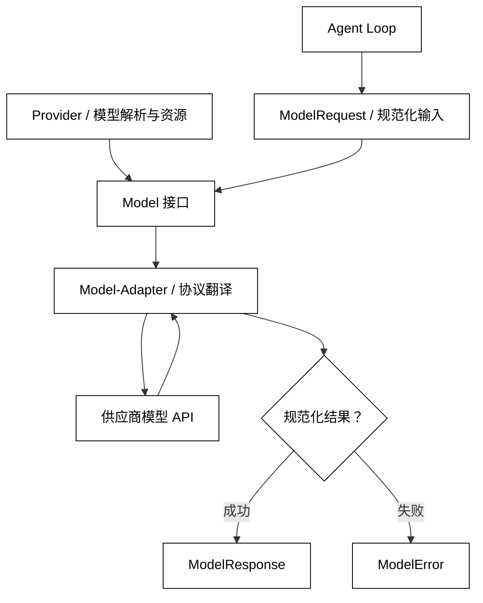

# Model、Provider 与 Model-Adapter

## 学习目标

- 说清 `Model`、`Provider` 和 `Model-Adapter` 分别拥有哪一段责任。
- 能用不依赖密钥的 Python 小实现表达一次模型调用的输入、输出和失败边界。
- 读框架源码时，先找到规范化请求/响应接口，再追踪供应商适配，而不是从 HTTP 客户端开始。
- 知道模型能力、版本、延迟和费用是运行时事实，不能只靠模型名称猜测。

## 核心知识点

模型调用是 Agent Loop 的一个边界：上游准备已经排序的消息和本次生成设置，下游收到规范化的输出或明确的失败。`Model` 负责“如何请求一次推理”，`Provider` 负责“从哪里找到模型以及如何管理供应商级资源”，`Model-Adapter` 负责“把供应商线上的请求/响应翻译成核心对象”。三者不是三个同义词，也不要求分别对应三个类。

可以先记住这条数据流：



阅读提示：`Provider` 负责找到模型与资源，`Model-Adapter` 只在边界翻译请求/响应；Agent Loop 只消费规范化的 `ModelResponse` 或 `ModelError`。

本文只讨论推理边界。`Message` 的字段和顺序见[下一篇](./02-Message-Role与消息顺序)，内容块见[第三篇](./03-Text-Image-Audio与Content-Block)。

## `Model`：一次推理的稳定接口

`Model` 是运行时真正被 Agent Loop 调用的抽象。它不应该要求上游知道某家服务的 JSON 字段，也不应该偷偷决定工具执行、会话持久化或停止策略。输入通常包含模型标识、消息集合和生成设置，输出至少要能表达文本、结束原因和使用量；使用量的细节会在[Token、上下文窗口与 Usage](./05-Token-上下文窗口与Usage)中展开。

白话说：`Model` 像插座规格，调用方只关心“插入一份请求后得到一份可读的响应”，不关心插座后面接的是哪家发电厂。

### `ModelRequest`：调用边界的输入

用途：用一个不可变请求对象把消息、模型名和生成参数放在同一份可审计输入中，避免在调用链上散落隐式参数。

```python
from __future__ import annotations

from dataclasses import dataclass, field
from typing import Any


@dataclass(frozen=True)
class ModelRequest:
    model: str
    messages: tuple[dict[str, Any], ...]
    temperature: float = 0.0
    max_output_tokens: int = 256
    metadata: dict[str, str] = field(default_factory=dict)


request = ModelRequest(
    model="demo-small",
    messages=({"role": "user", "content": "用一句话解释 Adapter"},),
)
print(request.model, request.max_output_tokens)
# 输出：demo-small 256
```

关键点是“规范化”。`messages` 在这里暂时用字典表达，后续文章会把它提升为 `Message` 与 `ContentBlock`；真实 SDK 可能使用数据类、Pydantic 模型或字典，但边界职责相同。`metadata` 用于 trace ID、租户或实验标签时，必须先定义允许记录的字段，不能把密钥和完整隐私内容塞进去。

### `ModelResponse`：调用边界的输出

用途：把供应商响应压缩成 Agent Loop 能理解的最小结果，同时保留排查所需的安全元数据。

```python
from __future__ import annotations

from dataclasses import dataclass, field
from typing import Any


@dataclass(frozen=True)
class ModelResponse:
    text: str
    model: str
    finish_reason: str
    usage: dict[str, int] = field(default_factory=dict)
    provider_request_id: str | None = None
    raw: Any = None


response = ModelResponse(
    text="Adapter 隔离协议差异。",
    model="demo-small",
    finish_reason="stop",
    usage={"input_tokens": 12, "output_tokens": 8},
)
print(response.text, response.finish_reason)
# 输出：Adapter 隔离协议差异。 stop
```

`raw` 不是让业务层依赖供应商字段的后门。若确实需要原始事件，应放在明确命名的诊断或流式事件层，并规定保留、脱敏和版本策略。`finish_reason` 也不是所有供应商都使用同一组值，Adapter 应把已知值映射到本课程约定的稳定集合，未知值保留为可观测信息而不是假装成功。

### `Model` Protocol：让调用方依赖能力

用途：用标准库 `Protocol` 描述调用方需要的最小能力，并让假模型可以在本地测试中替代真实服务。

```python
from dataclasses import dataclass
from typing import Any, Protocol


@dataclass(frozen=True)
class Request:
    messages: tuple[dict[str, Any], ...]


@dataclass(frozen=True)
class Response:
    text: str
    finish_reason: str


class Model(Protocol):
    def generate(self, request: Request) -> Response:
        """执行一次同步推理。"""


class EchoModel:
    def generate(self, request: Request) -> Response:
        # 关键输入：只取最后一条用户内容，模拟一个无网络的测试模型。
        content = str(request.messages[-1]["content"])
        # 关键状态变化：模型边界把输入变成规范化 Response。
        return Response(text=f"收到：{content}", finish_reason="stop")


model: Model = EchoModel()
result = model.generate(Request(messages=({"role": "user", "content": "你好"},)))
print(result)
# 输出：Response(text='收到：你好', finish_reason='stop')
```

`Protocol` 只表达结构，不负责网络、重试或权限。生产实现可以是同步方法、异步方法或另一个带流式方法的接口；关键是让上层依赖的契约比供应商 SDK 更窄、更稳定。

## `Provider`：解析模型名并拥有供应商资源

`Provider` 解决的是模型发现和资源所有权：根据逻辑名称返回一个具体 `Model`，管理同一供应商的客户端、连接池、区域或默认配置。它不应在每次调用时重新读取环境变量、创建连接，亦不应把 Agent 的业务状态塞进全局 Provider。

### `ModelProvider.get_model`：按名称解析模型

用途：用一个小型 Provider 把逻辑模型名映射为实现，并展示“查找失败”和“模型缓存”属于 Provider 边界。

```python
from typing import Protocol


class Model(Protocol):
    name: str

    def generate(self, prompt: str) -> str:
        ...


class LocalModel:
    def __init__(self, name: str) -> None:
        self.name = name

    def generate(self, prompt: str) -> str:
        return f"{self.name}: {prompt.upper()}"


class ModelProvider:
    def __init__(self, factories: dict[str, type[LocalModel]]) -> None:
        self._factories = factories
        self._cache: dict[str, Model] = {}

    def get_model(self, name: str) -> Model:
        if name not in self._factories:
            raise LookupError(f"unknown model: {name}")
        # 关键状态变化：同一模型名复用一个实现实例。
        self._cache.setdefault(name, self._factories[name](name))
        return self._cache[name]


provider = ModelProvider({"demo-small": LocalModel})
model = provider.get_model("demo-small")
print(model.generate("hello"), provider.get_model("demo-small") is model)
# 输出：demo-small: HELLO True
```

Provider 的缓存策略应与客户端生命周期对齐：如果模型实现持有异步连接，就要有对应的关闭方法；如果配置按租户变化，不能把第一个租户的客户端错误复用给所有租户。`get_model` 的异常应保留“配置不存在”和“供应商暂时不可用”的区分，不能把两者都改成“模型回答失败”。

### 默认 Provider 与显式 Provider

同一应用常见两种解析方式：全局默认 Provider 适合单一供应商的小应用；运行级或 Agent 级显式 Provider 适合测试、路由和多模型工作流。优先级必须写在配置契约中，例如“本次调用显式模型对象 > 本次运行 Provider > 应用默认 Provider”。否则更换一个环境变量就可能悄悄改变整个 Agent 的模型。

`Provider` 不是负载均衡器的同义词。它可以包含路由，但路由规则仍需单独记录选择原因、能力检查和降级结果；第 09 篇再讨论限流、重试与模型降级。

## `Model-Adapter`：翻译供应商协议

不同供应商的字段、消息内容块、结束原因、使用量和流式事件都可能不同。Adapter 的工作是两头翻译：把内部 `ModelRequest` 转成供应商请求，把供应商成功/失败响应转成内部 `ModelResponse`/`ModelError`。它可以校验供应商能力，但不应把供应商的所有可选字段泄漏到整个代码库。

### `build_payload`：生成供应商请求

用途：用一个极小 Adapter 表示内部请求到供应商字段的单向翻译，并在边界上做参数转换。

```python
from dataclasses import dataclass
from typing import Any


@dataclass(frozen=True)
class CoreRequest:
    model: str
    messages: tuple[dict[str, Any], ...]
    max_output_tokens: int


class DemoAdapter:
    def build_payload(self, request: CoreRequest) -> dict[str, Any]:
        # 关键输入：内部名称 max_output_tokens 映射为供应商名称 max_tokens。
        return {
            "model": request.model,
            "messages": list(request.messages),
            "max_tokens": request.max_output_tokens,
        }


payload = DemoAdapter().build_payload(
    CoreRequest("demo-small", ({"role": "user", "content": "hi"},), 32)
)
print(payload)
# 输出：{'model': 'demo-small', 'messages': [{'role': 'user', 'content': 'hi'}], 'max_tokens': 32}
```

适配器应把“字段不存在”和“字段不支持”尽早报告。比如某模型不支持音频输入，不应发送请求后再把供应商的模糊 400 当作模型内容错误；能力检查发生在 Adapter 或调用前置校验更容易观测。

### `decode_response`：解析供应商响应

用途：把一个供应商格式的成功载荷解码为稳定响应，演示供应商字段不应越过 Adapter。

```python
from dataclasses import dataclass
from typing import Any


@dataclass(frozen=True)
class CoreResponse:
    text: str
    finish_reason: str


class DemoAdapter:
    def decode_response(self, payload: dict[str, Any]) -> CoreResponse:
        # 关键输入：只读取已约定的供应商字段，未知字段不会进入业务对象。
        choice = payload["choices"][0]
        message = choice["message"]
        # 关键状态变化：供应商 stop_reason 被规范化为 finish_reason。
        return CoreResponse(
            text=str(message.get("content", "")),
            finish_reason=str(choice.get("stop_reason", "unknown")),
        )


payload = {"choices": [{"message": {"content": "ok"}, "stop_reason": "stop"}]}
response = DemoAdapter().decode_response(payload)
print(response)
# 输出：CoreResponse(text='ok', finish_reason='stop')
```

真实 Adapter 还要处理空 choices、供应商错误对象、分页式内容、工具/结构化输出片段和 usage 位置变化。解析失败属于协议错误，不应伪装成空文本；否则 Agent Loop 可能把“供应商返回格式变了”当作正常终止。

## `InferenceBoundary`：明确调用前后不变量

调用边界至少应该固定四个不变量：请求消息已经排序且完成基本校验；生成参数已解析并经过能力检查；响应要么是完整规范化对象，要么是分类错误；诊断信息带有本次请求的关联标识。这样上层才能安全地决定是重试、换模型、等待用户还是停止。

### `invoke`：只编排一次调用

用途：用一个纯本地函数把请求校验、模型调用和响应检查集中在边界处，不让 Agent Loop 处理供应商字典。

```python
from dataclasses import dataclass
from typing import Protocol


@dataclass(frozen=True)
class Request:
    text: str


@dataclass(frozen=True)
class Response:
    text: str
    finish_reason: str


class Model(Protocol):
    def generate(self, request: Request) -> Response:
        ...


def invoke(model: Model, request: Request) -> Response:
    if not request.text.strip():
        raise ValueError("model request must contain text")
    # 关键状态变化：边界只把已验证请求交给 Model。
    response = model.generate(request)
    if response.finish_reason not in {"stop", "length"}:
        raise RuntimeError(f"unsupported finish reason: {response.finish_reason}")
    # 输出契约：调用方得到完整 Response，或得到可分类异常。
    return response


class FixedModel:
    def generate(self, request: Request) -> Response:
        return Response(f"回答：{request.text}", "stop")


print(invoke(FixedModel(), Request("边界")))
# 输出：Response(text='回答：边界', finish_reason='stop')
```

这个例子没有展示重试，因为重试会改变一次调用的时间和副作用语义，放在第 09 篇更合适。边界函数也不负责判断“回答是否正确”；那是结构化校验、业务校验或评测层的职责。

## 能力、版本和运行元数据

### `ModelCapabilities`：声明可用能力

模型名称不是能力清单。一个名字相近的模型可能分别支持文本、图片、音频、结构化输出或流式返回；能力还可能随供应商端点和版本改变。调用前应读取或配置显式能力，缺失能力时给出可操作错误。

用途：用能力快照表示一次调用前可检查的输入模态、流式和结构化输出支持。

```python
from dataclasses import dataclass


@dataclass(frozen=True)
class ModelCapabilities:
    text_input: bool = True
    image_input: bool = False
    audio_input: bool = False
    streaming: bool = True
    structured_output: bool = False


capabilities = ModelCapabilities(image_input=True, structured_output=True)
if not capabilities.image_input:
    raise ValueError("selected model cannot accept image input")
print(capabilities.structured_output)
# 输出：True
```

能力声明是前置检查，不是安全授权。即使模型支持图片，也要验证图片来源、大小和是否允许发送；即使模型支持结构化输出，也要在本地再次解析校验。

### `ModelIdentity`：记录可复现信息

用途：保存一次调用使用的逻辑模型、供应商、适配器版本和能力快照，方便比较质量与定位回归。

```python
from dataclasses import dataclass


@dataclass(frozen=True)
class ModelIdentity:
    logical_name: str
    provider: str
    adapter_version: str
    endpoint: str


identity = ModelIdentity("support-small", "local-demo", "adapter-1", "offline")
print(f"{identity.provider}/{identity.logical_name} via {identity.adapter_version}")
# 输出：local-demo/support-small via adapter-1
```

记录 endpoint 时应只保留区域或逻辑别名，避免把带查询参数的签名 URL 写进日志。版本字段要能区分模型版本和 Adapter 版本：前者影响回答能力，后者影响协议转换，两者回滚方式不同。

### `ModelError`：在边界分类失败

用途：用稳定异常类型把供应商错误映射到上层决策所需的分类，避免按异常字符串判断是否重试。

```python
class ModelError(Exception):
    """所有已分类的模型边界错误。"""


class InvalidRequest(ModelError):
    pass


class AuthenticationFailure(ModelError):
    pass


class RateLimited(ModelError):
    pass


class ProviderUnavailable(ModelError):
    pass


failure = RateLimited("retry after provider hint")
print(type(failure).__name__, str(failure))
# 输出：RateLimited retry after provider hint
```

认证失败、参数不支持、上下文超限和暂时不可用的处理不同。错误分类不等于马上重试：是否重试还要看本次调用有没有产生可见副作用、是否有幂等键以及是否处于流式传输中，详见[Rate-Limit、超时、重试与模型降级](./09-Rate-Limit-超时-重试与模型降级)。

## 四个主线项目中的对应位置

这些项目的命名不同，但读源码时可以用同一张地图：先找“模型接口”，再找“模型名如何解析”，最后找“供应商 payload 如何转换”。不要把下列对应关系理解为 API 永久稳定契约。

### smolagents：`Model` 与 API 模型基类

smolagents 把模型调用放在 `Model` 抽象下，API 类模型再处理客户端、请求参数和供应商响应。阅读时重点看模型如何返回框架能消费的结果，以及 `ApiModel` 如何承接限流或客户端管理；不要从工具执行器反推模型协议。

### OpenAI Agents SDK：`Model`、`ModelProvider` 与运行配置

OpenAI Agents SDK 的运行时依赖规范化 `Model` 接口，`ModelProvider` 负责按名称解析模型；具体 Responses 或 Chat Completions 适配器拥有请求构造、能力检查、usage 转换和流式终止事件。源码阅读顺序应是模型接口 → Provider → 一个具体适配器，再回到 Runner 的调用点。

### LangGraph：节点调用模型，图本身不替代 Provider

LangGraph 的核心是状态图。节点可以调用任意模型对象并把结果写回状态，但 Graph、Node、Edge 不会自动消除供应商协议差异。阅读 LangGraph 项目时，要把“节点如何拿到模型”与“模型如何适配供应商”分开看，否则会把工作流编排职责误认为模型网关。

### DeepSeek Harness：LLM 包与插件边界

DeepSeek Harness 处于开发预览阶段，仓库将 LLM、插件、会话和事件放在更大的可组合运行时中。源码阅读时可以用本篇的四问定位：谁定义规范化请求？谁选择 Provider？哪个包翻译外部协议？错误和事件在哪一层被记录？具体内部名称可能变化，不应把预览期路径当成稳定 SDK。

## 易混点

- `Model` 是一次推理的能力接口，不是完整 Agent；它不自动拥有工具执行、会话和停止策略。
- `Provider` 负责模型解析和供应商资源，不等于“每次请求随机选模型”的负载均衡器。
- `Model-Adapter` 翻译协议，不应把供应商响应字典泄漏给业务层。
- 模型名不保证能力、版本、上下文窗口或稳定性；能力和身份应显式记录。
- `raw` 数据可以用于诊断，但不能成为绕过规范化边界的业务依赖。
- 错误类型告诉上层发生了什么，不能单独决定是否重试；幂等、超时和流式状态也会影响决定。

## 课后小问

1. 为什么 Agent Loop 不应该直接读取供应商响应里的 `choices[0]`？

   答案：那会让循环绑定某一家协议。解析、结束原因和使用量字段变化时，所有上层代码都要改。Adapter 把供应商格式翻译成稳定响应后，循环只依赖核心契约。

2. `Provider` 缓存模型实例一定正确吗？

   答案：不一定。若实例持有连接，缓存需要生命周期关闭；若配置按租户或请求变化，盲目缓存可能串配置。缓存策略必须与资源所有权和隔离边界一起设计。

3. 模型返回了格式合法的 JSON，就说明业务结果可信了吗？

   答案：不说明。格式合法只证明解析层可以读取字段；字段值是否符合 schema、权限和业务事实，要由后续校验决定。结构化输出将在第 07 篇讨论。

## 本节小结

`Model` 把一次推理抽象成稳定输入/输出，`Provider` 负责模型解析和供应商级资源，`Model-Adapter` 隔离外部协议。明确这条边界后，Agent Loop 可以独立测试，模型可以替换，协议差异也能集中处理。模型能力、身份和错误分类必须成为可观测数据，而不是隐藏在异常字符串和模型名称里。

## 快速回顾

```text
规范化 ModelRequest
        ↓
Model 接口 ← Provider 解析具体实现
        ↓
Adapter 翻译外部协议
        ↓
ModelResponse / ModelError
```

- 先找接口，再找 Provider，最后读 Adapter。
- 先校验请求和能力，再发送外部调用。
- 只向上层暴露规范化响应和可分类错误。
- 不把模型能力、版本和原始 payload 当成永久稳定事实。
