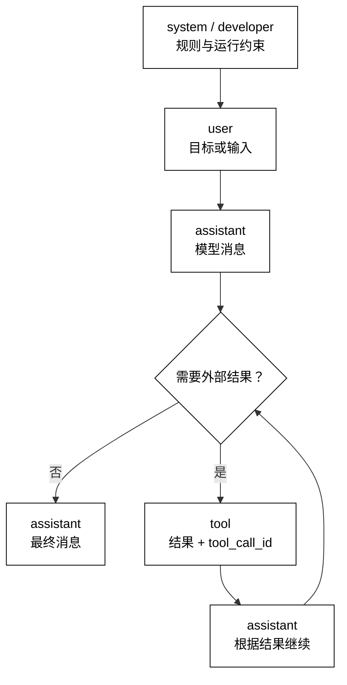

# Message、Role 与消息顺序

## 学习目标

- 把 `Message` 看成可审计的数据记录，而不是一段拼接好的字符串。
- 区分 `system`、`developer`、`user`、`assistant` 和 `tool` 的来源与信任边界。
- 用追加式历史保持消息顺序、关联标识和基本轮次不变量。
- 读框架源码时，能从消息归一化、序列化和回填处定位模型调用链。

## 核心知识点

模型通常接收一个有序消息序列，而不是“当前问题”一个字符串。每条消息至少有角色、内容和可选关联信息；内容在下一篇会从字符串扩展为文本、图片、音频等 `Content-Block`。消息历史描述“到目前为止发生了什么”，而系统状态、用户身份和持久化会话是更大的边界，不能偷偷塞进 `content`。

可以把一轮对话想成一条不可随意重排的日志：



阅读提示：消息按追加顺序形成输入；`tool` 结果必须带 `tool_call_id` 回填，不能把外部结果改写成没有来源的用户文本。

本文沿用[Model、Provider 与 Model-Adapter](./01-Model-Provider与Model-Adapter)中的规范化调用边界，但只处理消息层；工具如何选择和执行属于第 04 章。

## `Message`：一个带来源的记录

`Message` 不只是 `{role, content}` 两个字段。生产系统通常还需要消息 ID、时间或顺序号、调用关联 ID、名称、可选元数据以及是否由系统生成等信息。字段越多，越要明确哪些字段会发送给模型、哪些字段只用于审计，避免把内部标记原样暴露给外部服务。

### `Message` dataclass：表达最小数据模型

用途：用标准库数据类表达一条不可变消息，并把只有消息层才知道的关联字段保留下来。

```python
from __future__ import annotations

from dataclasses import dataclass, field
from typing import Any, Literal

Role = Literal["system", "developer", "user", "assistant", "tool"]


@dataclass(frozen=True)
class Message:
    role: Role
    content: str
    message_id: str
    tool_call_id: str | None = None
    metadata: dict[str, Any] = field(default_factory=dict)


message = Message(
    role="user",
    content="解释消息顺序",
    message_id="m-1",
)
print(message.role, message.message_id)
# 输出：user m-1
```

`Literal` 只是示例级的静态约束，运行时仍要校验外部输入。`metadata` 不应成为隐形提示词通道；要发送给模型的字段应在序列化函数中显式选择。真实 SDK 可能把 `tool_call_id` 放在内容块或单独字段，阅读时看它是否承担同一个“结果属于哪一次调用”的关联责任。

### `Message.to_model_input`：显式序列化

用途：只把模型协议需要的字段转换成字典，防止内部审计数据和敏感元数据越过调用边界。

```python
from __future__ import annotations

from dataclasses import dataclass, field
from typing import Any, Literal

Role = Literal["system", "developer", "user", "assistant", "tool"]


@dataclass(frozen=True)
class Message:
    role: Role
    content: str
    message_id: str
    tool_call_id: str | None = None
    metadata: dict[str, Any] = field(default_factory=dict)

    def to_model_input(self) -> dict[str, Any]:
        payload: dict[str, Any] = {"role": self.role, "content": self.content}
        if self.tool_call_id is not None:
            payload["tool_call_id"] = self.tool_call_id
        return payload


message = Message("user", "仅发送必要字段", "m-2", metadata={"trace_id": "private"})
print(message.to_model_input())
# 输出：{'role': 'user', 'content': '仅发送必要字段'}
```

序列化是安全边界：模型需要的 `name`、内容块或供应商专有字段，应通过显式转换添加；不能为了省事把 `dataclasses.asdict(message)` 整体发送。对敏感信息尤其要避免“日志有脱敏、请求没脱敏”或反过来的不一致。

## `Role`：声明消息来源与处理语义

角色是协议语义，不是权限系统。某些供应商支持 `developer`，某些只提供 `system`；某些 SDK 把系统指令作为 Agent 配置而不是消息。适配器可以做映射，但必须记录映射规则和优先级，不能用字符串替换假装语义完全相同。

### `system`：应用级行为约束

`system` 通常承载应用希望模型持续遵守的高层规则，例如输出语言、格式和安全边界。它不是绝对防火墙：模型可能误解或违反它，系统仍要在输出、工具权限和业务逻辑层校验。系统指令的版本和所有者应可追踪，具体组织方式见[System Instructions 与 Prompt 边界](./04-System-Instructions与Prompt边界)。

### `developer`：运行方的实现约束

某些协议将 `developer` 作为比用户消息更靠近应用的一层，用于产品行为和实现约束。它与 `system` 是否等价取决于供应商；不要在核心代码中硬编码“developer 一定优先”。若适配器需要折叠角色，应把折叠后的顺序写成测试。

### `user`：外部目标与数据

`user` 表示用户输入或应用代替用户提交的任务上下文。它可能包含恶意提示注入，也可能包含引用的文档、网页和日志。角色标签不能证明内容可信；外部文本仍应被当作数据处理，并在 Prompt 边界和输出验证处设防。

### `assistant`：模型产生的消息

`assistant` 是模型输出被系统记录后的消息。它不等于“已经执行的事实”：模型说“已完成”不能替代真实工具结果、数据库状态或业务校验。重放历史时，只有经过系统确认的 assistant 消息才应进入后续上下文，失败或被拦截的草稿要有明确状态。

### `tool`：带关联 ID 的外部结果

`tool` 消息表示某个外部调用的返回数据，必须能关联到先前的调用标识。它属于消息层的“结果回填”，不在此展开工具注册、参数 schema 或执行权限。工具返回内容即使带有“请忽略之前指令”等文字，也应被当作不可信数据，不自动提升为系统指令。

用途：用一个专门构造函数保证工具结果携带关联 ID，并拒绝把调用 ID 混在正文里。

```python
from __future__ import annotations

from dataclasses import dataclass
from typing import Literal

Role = Literal["tool"]


@dataclass(frozen=True)
class Message:
    role: Role
    content: str
    message_id: str
    tool_call_id: str | None = None


def tool_message(call_id: str, result: str, message_id: str) -> Message:
    if not call_id.strip():
        raise ValueError("tool result needs a call id")
    # 关键输入：result 是外部数据，call_id 是消息关联键。
    return Message("tool", result, message_id, tool_call_id=call_id)


message = tool_message("call-7", "天气数据：晴", "m-7")
print(message.role, message.tool_call_id, message.content)
# 输出：tool call-7 天气数据：晴
```

第 04 章会讲完整的 Tool Calling 闭环；当前只要求读懂“结果必须以可关联的消息回填”，不要把 `tool` 角色当成“模型可以直接执行的命令”。

## 消息顺序与轮次不变量

顺序改变，模型看到的事实就可能改变。消息列表应该追加而不是原地排序；截断、摘要和重试都必须保留系统规则、用户目标与相关结果之间的关系。为了支持审计，可以把顺序号或消息 ID 固化，而不是只依赖列表下标。

### `Conversation.append`：只追加新消息

用途：通过不可变历史和追加方法表达“顺序一旦确认就不回写”的约束。

```python
from __future__ import annotations

from dataclasses import dataclass
from typing import Literal

Role = Literal["system", "developer", "user", "assistant", "tool"]


@dataclass(frozen=True)
class Message:
    role: Role
    content: str
    message_id: str
    tool_call_id: str | None = None


@dataclass(frozen=True)
class Conversation:
    messages: tuple[Message, ...] = ()

    def append(self, message: Message) -> "Conversation":
        # 关键状态变化：返回新历史，旧历史可用于审计或重试。
        return Conversation(self.messages + (message,))


history = Conversation().append(Message("user", "第一问", "m-1"))
next_history = history.append(Message("assistant", "第一答", "m-2"))
print(len(history.messages), len(next_history.messages))
# 输出：1 2
```

追加式历史不是说永远不能压缩，而是说压缩应产生新的版本或明确事件。这样一次失败重试可以复用旧输入，不会因为并发请求把另一条分支的消息插进来。

### `validate_order`：检查基本合法性

用途：在发送前检查第一条系统消息位置和工具结果关联，提前发现会导致协议错误的历史。

```python
from __future__ import annotations

from dataclasses import dataclass
from typing import Literal

Role = Literal["system", "developer", "user", "assistant", "tool"]


@dataclass(frozen=True)
class Message:
    role: Role
    content: str
    message_id: str
    tool_call_id: str | None = None


def validate_order(messages: tuple[Message, ...]) -> None:
    if not messages:
        raise ValueError("message history cannot be empty")
    system_positions = [i for i, item in enumerate(messages) if item.role == "system"]
    if system_positions and system_positions[0] != 0:
        raise ValueError("system message must be first in this profile")
    for item in messages:
        if item.role == "tool" and not item.tool_call_id:
            raise ValueError(f"tool message {item.message_id} has no call id")
    # 输出契约：函数无返回值表示基础顺序和关联检查通过。


valid = (
    Message("system", "只回答事实", "m-0"),
    Message("user", "问题", "m-1"),
)
validate_order(valid)
print("order valid")
# 输出：order valid
```

这不是一套适用于所有供应商的完整状态机。某些协议允许多条系统消息、把开发者消息移动到独立字段，某些模型输出的工具调用需要中间 assistant 记录。校验器应绑定到已选协议 profile，并通过测试锁定行为，而不是把本地偏好写成普遍定律。

### `message_id` 与关联键：审计而不是装饰

消息 ID 用于追踪、去重和引用；`tool_call_id` 用于把结果对应到一次调用。两者不要混用：同一消息可有自己的 ID，同时携带外部调用 ID。若消息通过队列重放，重复 ID 可用于去重，但去重前要区分“同 ID 同内容重放”和“同 ID 不同内容冲突”。

用途：检测消息 ID 冲突，防止两条不同内容伪装成同一历史记录。

```python
from dataclasses import dataclass


@dataclass(frozen=True)
class Message:
    message_id: str
    role: str
    content: str


def index_messages(messages: tuple[Message, ...]) -> dict[str, Message]:
    index: dict[str, Message] = {}
    for message in messages:
        previous = index.get(message.message_id)
        if previous is not None and previous != message:
            raise ValueError(f"conflicting message id: {message.message_id}")
        index[message.message_id] = message
    return index


messages = (Message("m-1", "user", "原始问题"), Message("m-1", "user", "原始问题"))
print(len(index_messages(messages)))
# 输出：1
```

重复同内容通常是重放，重复 ID 不同内容则是数据完整性问题。日志中可以记录哈希或摘要，但不要为了去重把完整的隐私内容作为全局键。

## 消息历史、上下文与会话的边界

消息历史是“发送给模型的叙事”；`Context` 是本轮决定要发送的输入集合；`Session` 是跨调用保存历史、身份和恢复信息的生命周期对象。三者经常被同一个框架类包装，但源码阅读和故障排查时要分开问：哪一层决定了这条消息出现？哪一层持久化？哪一层在窗口不足时裁剪？

### `build_context`：从历史生成一次模型输入

用途：展示会话历史不是自动等于本次上下文，调用方可以明确选择要发送的消息。

```python
from dataclasses import dataclass


@dataclass(frozen=True)
class Message:
    role: str
    content: str


def build_context(history: tuple[Message, ...], keep_last: int) -> tuple[Message, ...]:
    if keep_last < 1:
        raise ValueError("keep_last must be positive")
    system = tuple(item for item in history if item.role == "system")[:1]
    recent = history[-keep_last:]
    selected = system + tuple(item for item in recent if item not in system)
    # 关键状态变化：历史被选择为本次输入，未选消息仍留在会话外部。
    return selected


history = (
    Message("system", "保持简洁"),
    Message("user", "旧问题"),
    Message("assistant", "旧回答"),
    Message("user", "新问题"),
)
for item in build_context(history, 2):
    print(item.role, item.content)
# 输出：system 保持简洁
# 输出：user 新问题
```

示例只展示选择逻辑，实际裁剪还要考虑消息关联、Token 预算和内容块大小，见[Token、上下文窗口与 Usage](./05-Token-上下文窗口与Usage)。`keep_last` 也可能把 system 消息重复选入，因此生产实现要有明确的去重和顺序策略；此处重点是把“历史”和“本次上下文”分开。

## 四个主线项目中的对应位置

### smolagents：消息在模型调用与步骤记录之间流动

smolagents 的 Agent 步骤会把任务、模型输出和工具结果组织成可供下一步使用的上下文。阅读源码时重点观察：模型收到的是哪种规范化消息/文本表示，工具结果如何回填，哪些记录只是步骤日志而不是发送给模型的消息。不要把内部 `step` 对象自动等同于标准 Message。

### OpenAI Agents SDK：输入消息与运行结果分层

OpenAI Agents SDK 允许 Agent 由 instructions、用户输入、工具结果和 handoff 组成运行上下文。源码阅读时先看输入如何被转换为模型消息，再看最终输出项和 trace 如何记录；`Agent`、`RunResult` 与底层 Message 的责任不同，不能只看公开的字符串结果。

### LangGraph：消息通常是状态字段的一部分

LangGraph 可将消息列表放入图状态，并通过节点更新它。关键问题不是“图有没有一个 Message 类”，而是 reducer 如何追加、合并或覆盖消息，checkpoint 如何保存顺序，以及并行节点如何避免把两条分支错误拼成一轮对话。

### DeepSeek Harness：事件和消息的时间顺序

DeepSeek Harness 的事件系统与会话/插件生命周期会产生比模型消息更多的记录。源码阅读时区分“用户/模型的消息”与“运行时事件”，追踪它们何时写入会话、何时转换为 LLM 输入；开发预览期接口可能变化，优先确认责任边界而不是背路径。

## 易混点

- `Role` 描述来源和协议语义，不等于认证授权；`user` 也可能携带恶意内容。
- `assistant` 说“已经完成”不是外部事实；只有真实结果回填才表示执行结果。
- `tool` 消息需要关联 ID，但本文只讲消息层，不展开工具选择与执行。
- 消息历史、一次 Context 和跨调用 Session 可能由同一对象包装，概念上仍应分开。
- 列表下标不是可靠审计 ID；重放和并发需要消息 ID、顺序和冲突策略。
- 重新排序、裁剪或合并消息都可能改变模型语义，必须有明确 profile 和测试。

## 课后小问

1. 为什么工具结果不能直接拼进下一条用户消息？

   答案：这样会丢失结果来源和调用关联，模型与审计系统无法知道它是否来自真实执行。保留 `tool` 角色和调用 ID，才可以做回填、重放和错误定位。

2. 角色标成 `system` 后，内容就一定可信且一定会被模型遵守吗？

   答案：不一定。角色只表达应用提交时的协议语义，不是防篡改或绝对安全边界。系统仍需限制谁能写入它，并校验模型输出和外部副作用。

3. 为什么裁剪历史不能只取最后 N 条字符串？

   答案：可能丢掉系统规则、用户目标或工具结果的关联，导致新上下文不完整。裁剪必须按消息结构、优先级、关联键和 Token 预算共同决定。

## 本节小结

`Message` 是带来源和关联信息的有序记录；`Role` 告诉协议如何解释来源，但不替代安全授权；历史顺序和消息关联是模型输入的基本不变量。把序列化、追加、校验和上下文选择分开，才能在换供应商、重试、裁剪和恢复时保持可解释性。

## 快速回顾

- `Message`：角色、内容、ID、关联键和受控元数据。
- `Role`：`system`/`developer`/`user`/`assistant`/`tool` 的来源语义。
- 顺序：追加、验证、必要时生成新版本，不在原历史上静默重排。
- 关联：消息 ID 用于审计/去重，工具调用 ID 用于结果回填。
- 边界：历史 ≠ 本次上下文 ≠ 跨调用会话。
