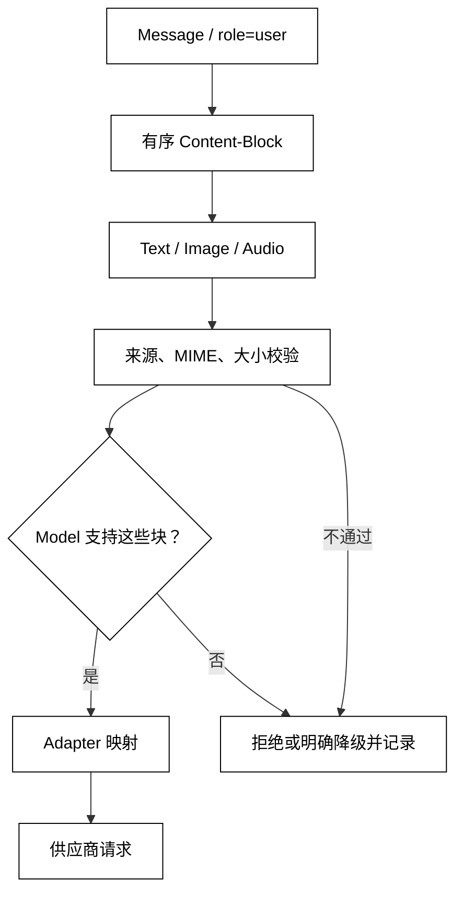

# Text、Image、Audio 与 Content-Block

## 学习目标

- 理解消息的 `content` 可以是有序内容块，而不只是一个字符串。
- 区分文本、图片和音频的载荷、媒体类型、来源与模型能力检查。
- 用标准库定义可校验的 `ContentBlock`，并把它转换成供应商无关的结构。
- 识别外部媒体中的提示注入、隐私和大小风险，不把“能解析”误认为“可信”。

## 核心知识点

上一节的 `Message` 描述“谁在什么时候说了什么”；本节把“说了什么”从单一文本扩展为有序 `Content-Block`。一条消息可以包含文本说明、图片引用和音频片段，顺序本身可能影响模型理解。不同模型的多模态能力并不相同，Adapter 必须在请求发送前做能力和格式检查。



阅读提示：`Content-Block` 保留文本、图片和音频的顺序；媒体先过来源/格式/大小校验，再做模型能力判定；不支持时只能拒绝或明确降级，不能把媒体中的文字直接当指令。

这里的内容块是消息数据，不是 Tool Calling 的参数，也不是应用直接执行的命令。图片 OCR、音频转写和内容安全筛查可能由模型或独立服务完成，返回结果仍要经过正常的消息与校验边界。

## `ContentBlock`：内容的类型化联合

一个内容块至少要能回答四个问题：类型是什么、载荷在哪里、媒体类型是什么、是否允许发送。不要用“看起来像 URL 的字符串”推断图片，也不要用文件扩展名替代受控的 MIME 检查。

### `TextBlock`：文本片段

用途：用不可变数据类表达文本内容，并保持文本在混合内容中的相对顺序。

```python
from dataclasses import dataclass


@dataclass(frozen=True)
class TextBlock:
    text: str
    kind: str = "text"


block = TextBlock("请识别下一张图片中的交通标志")
print(block.kind, block.text)
# 输出：text 请识别下一张图片中的交通标志
```

文本块仍可能来自不可信用户、网页或 OCR。它的 `kind` 只是数据类型，不会把文本提升为 system 指令；是否作为指令解释要由 Prompt 边界明确决定。

### `ImageBlock`：图片引用或字节

用途：表达图片的受控来源和媒体类型，不在消息对象里隐式读取任意文件路径。

```python
from __future__ import annotations

from dataclasses import dataclass
from typing import Literal


ImageSource = Literal["url", "bytes"]


@dataclass(frozen=True)
class ImageBlock:
    source_type: ImageSource
    source: str | bytes
    mime_type: str
    detail: str = "auto"
    kind: str = "image"


image = ImageBlock("url", "https://cdn.example.test/sign-removed", "image/png")
print(image.kind, image.mime_type, image.detail)
# 输出：image image/png auto
```

`source` 可以是经权限检查的短期 URL 或内存字节；不要让模型请求直接接收任意本地路径。URL 需要域名白名单、过期时间和大小限制；字节需要 MIME、尺寸、压缩炸弹和日志脱敏检查。`detail` 是能力相关提示，不是保证模型会以某个分辨率分析图片。

### `AudioBlock`：音频片段

用途：把音频的编码、采样率和来源作为显式字段，避免把音频当成普通文本上传。

```python
from dataclasses import dataclass


@dataclass(frozen=True)
class AudioBlock:
    source: bytes
    mime_type: str
    duration_ms: int
    sample_rate: int
    kind: str = "audio"


audio = AudioBlock(b"demo-audio", "audio/wav", duration_ms=250, sample_rate=16000)
print(audio.kind, audio.duration_ms, audio.sample_rate)
# 输出：audio 250 16000
```

音频可能包含个人声音、生物特征和背景对话，权限与保留周期要比普通文本更谨慎。模型支持“直接听音频”与应用先转写再发文本是两条不同链路：前者保留声学信息，后者只发送转写结果，也会引入转写错误。

## `Content`：有序内容集合

`Content` 是内容块序列而不是无序字段表。文本在图片前后的位置可能改变指代关系；多个音频片段也要有明确拼接或分段语义。若供应商协议只接受字符串，Adapter 可以降级为文本或拒绝请求，但必须记录发生了信息损失。

### `Content` 类型别名：把字符串升级为序列

用途：定义只允许三种内容块的联合类型，并让消息在创建时携带一个有序元组。

```python
from __future__ import annotations

from dataclasses import dataclass
@dataclass(frozen=True)
class TextBlock:
    text: str
    kind: str = "text"


@dataclass(frozen=True)
class ImageBlock:
    source: str
    mime_type: str
    kind: str = "image"


@dataclass(frozen=True)
class AudioBlock:
    source: bytes
    mime_type: str
    kind: str = "audio"


from typing import Union

ContentBlock = Union[TextBlock, ImageBlock, AudioBlock]
Content = tuple[ContentBlock, ...]

content: Content = (
    TextBlock("请观察："),
    ImageBlock("https://cdn.example.test/image", "image/jpeg"),
    TextBlock("只描述可见内容。"),
)
print([item.kind for item in content])
# 输出：['text', 'image', 'text']
```

类型别名只帮助阅读和静态检查；外部 JSON 进入系统时仍需要运行时校验。若某个 Adapter 把所有块转换成一条字符串，要在日志或响应元数据中说明图片/音频是否被丢弃，不能静默声称模型看过它们。

### `Message` with `Content`: 消息保持角色边界

用途：把上一节的消息模型扩展为多模态内容，并保持角色、消息 ID 和内容块独立。

```python
from __future__ import annotations

from dataclasses import dataclass
from typing import Literal, Union


@dataclass(frozen=True)
class TextBlock:
    text: str
    kind: str = "text"


@dataclass(frozen=True)
class ImageBlock:
    source: str
    mime_type: str
    kind: str = "image"


ContentBlock = Union[TextBlock, ImageBlock]
Role = Literal["system", "developer", "user", "assistant", "tool"]


@dataclass(frozen=True)
class Message:
    role: Role
    content: tuple[ContentBlock, ...]
    message_id: str


message = Message(
    "user",
    (TextBlock("这张图是什么颜色？"), ImageBlock("https://cdn.example.test/a", "image/png")),
    "m-image-1",
)
print(message.role, [item.kind for item in message.content])
# 输出：user ['text', 'image']
```

`tool` 消息也可以包含文本、图片或音频结果，但内容块仍是数据；它不会自动变成新的指令。工具执行和权限控制在第 04 章讨论，本节只要求调用方能正确携带结果内容。

## MIME、来源与能力检查

### `validate_block`：先检查媒体边界

用途：在发送给模型前限制允许的 MIME、URL 来源和字节大小，示例不依赖真实文件或网络。

```python
from __future__ import annotations

from dataclasses import dataclass
from urllib.parse import urlparse


@dataclass(frozen=True)
class ImageBlock:
    source: str | bytes
    mime_type: str


def validate_block(block: ImageBlock, max_bytes: int = 2_000_000) -> None:
    allowed = {"image/png", "image/jpeg", "image/webp"}
    if block.mime_type not in allowed:
        raise ValueError(f"unsupported image type: {block.mime_type}")
    if isinstance(block.source, bytes) and len(block.source) > max_bytes:
        raise ValueError("image is too large")
    if isinstance(block.source, str):
        parsed = urlparse(block.source)
        if parsed.scheme != "https" or parsed.hostname != "cdn.example.test":
            raise ValueError("image URL is outside the allowlist")
    # 输出契约：无返回值表示格式、来源和大小检查通过。


validate_block(ImageBlock("https://cdn.example.test/image", "image/png"))
print("image accepted")
# 输出：image accepted
```

校验 URL 不能替代下载时的重定向、响应 MIME、内容长度和病毒检查；示例只展示消息层的第一道边界。真实系统还要考虑 SSRF、短链跳转、签名 URL 泄露和跨租户资源访问。

### `ModelCapabilities`：检查模型能否接收内容块

用途：把内容块类型和模型能力放在一次前置检查中，避免请求发出后才得到模糊的协议错误。

```python
from dataclasses import dataclass


@dataclass(frozen=True)
class Capabilities:
    text: bool = True
    image: bool = False
    audio: bool = False


def ensure_supported(kinds: tuple[str, ...], capabilities: Capabilities) -> None:
    supported = {
        "text": capabilities.text,
        "image": capabilities.image,
        "audio": capabilities.audio,
    }
    unsupported = [kind for kind in kinds if not supported.get(kind, False)]
    if unsupported:
        raise ValueError(f"model does not support: {', '.join(unsupported)}")
    # 关键状态变化：内容能力检查在网络调用前完成。


ensure_supported(("text", "image"), Capabilities(image=True))
print("capability check passed")
# 输出：capability check passed
```

能力检查不能证明内容质量，也不能授权发送。应用仍需基于用户同意、租户策略和数据分类决定是否允许音频或图片离开本地环境。

## Adapter 中的内容规范化

### `to_provider_blocks`：映射到供应商格式

用途：将核心内容块转换成一个假想供应商的结构，展示适配器如何集中处理字段名称差异。

```python
from __future__ import annotations

from dataclasses import dataclass
from typing import Any


@dataclass(frozen=True)
class TextBlock:
    text: str


@dataclass(frozen=True)
class ImageBlock:
    source: str
    mime_type: str


def to_provider_blocks(blocks: tuple[TextBlock | ImageBlock, ...]) -> list[dict[str, Any]]:
    result: list[dict[str, Any]] = []
    for block in blocks:
        if isinstance(block, TextBlock):
            result.append({"type": "input_text", "text": block.text})
        else:
            result.append({"type": "input_image", "image_url": block.source})
    # 输出契约：核心对象被转换，业务层不需要知道 input_text 等供应商名称。
    return result


payload = to_provider_blocks((TextBlock("看图"), ImageBlock("https://cdn.example.test/a", "image/png")))
print(payload)
# 输出： [{'type': 'input_text', 'text': '看图'}, {'type': 'input_image', 'image_url': 'https://cdn.example.test/a'}]
```

适配器可能需要把 bytes 编码为供应商要求的形式，也可能需要把不支持的音频拒绝而不是丢弃。映射函数应覆盖空块、未知块和超限块的测试，并将供应商响应中的图片/音频输出重新转换成核心类型；不要只测试文本路径。

### `describe_content`：日志只记录安全摘要

用途：记录内容块类型和大小而不记录原始图片、音频或签名 URL，展示内容观测与数据保留的边界。

```python
from __future__ import annotations

from dataclasses import dataclass


@dataclass(frozen=True)
class TextBlock:
    text: str


@dataclass(frozen=True)
class ImageBlock:
    source: str
    mime_type: str


def describe_content(blocks: tuple[TextBlock | ImageBlock, ...]) -> list[dict[str, object]]:
    descriptions: list[dict[str, object]] = []
    for block in blocks:
        if isinstance(block, TextBlock):
            descriptions.append({"kind": "text", "length": len(block.text)})
        else:
            descriptions.append({"kind": "image", "mime_type": block.mime_type})
    # 输出契约：诊断信息能说明输入结构，但不会复制媒体数据。
    return descriptions


print(describe_content((TextBlock("秘密不应写入日志"), ImageBlock("signed-url", "image/png"))))
# 输出： [{'kind': 'text', 'length': 8}, {'kind': 'image', 'mime_type': 'image/png'}]
```

字符数、字节数和模型 Token 不是同一个量；多模态费用和上下文占用还可能由分辨率、时长或供应商内部规则决定，见[Token、上下文窗口与 Usage](./05-Token-上下文窗口与Usage)。日志摘要也不是脱敏的充分证明，文本本身可能包含个人信息。

## 多模态输入中的信任边界

### 外部媒体是数据，不是指令

图片中的文字、音频中的口述和 OCR/转写结果都可能包含提示注入。把它们放在 `user` 内容中并用分隔符标注来源，可以帮助模型区分，但不能替代工具权限、输出校验和人工审批。尤其不要因为图片里写了“执行某操作”就自动触发外部副作用。

### 图片 URL 与音频来源需要权限

图片 URL 可能暴露用户所在系统的签名参数；音频可能来自另一位未同意的说话者。发送前应绑定当前用户/租户的访问检查、短期凭证和最小保留时间。错误日志中记录资源 ID 比记录完整 URL 或媒体字节更安全。

### `Content-Block` 的大小不是窗口预算

内容块要经过字节、像素、时长和 Token/媒体计量四类限制。一个很短的图片 URL 也可能指向超大图；一段很短的音频也可能包含很长静音。不要用 `len(str(block))` 代替真正的配额检查。

## 四个主线项目中的对应位置

### smolagents：模型输入表示与多模态能力

smolagents 的不同模型实现可能接受文本、消息列表或多模态输入。阅读时关注模型类在哪里判断输入类型、哪里把媒体转换成供应商 payload，以及不支持的内容如何失败；不要把某一 API 模型的内容字典当成所有模型共同协议。

### OpenAI Agents SDK：消息项与模型原生内容

OpenAI Agents SDK 将用户输入、模型输出和工具结果表示为运行项，底层模型适配器再处理文本和其他内容类型。源码阅读可从输入归一化开始，追到具体 Model 的请求转换；注意“运行事件里的图片/音频”与“发送给模型的 Content-Block”不一定是同一个数据结构。

### LangGraph：消息状态中的多模态 content

LangGraph 通常把消息放入状态，消息内容可保持字符串或结构化块。关键是 reducer、checkpoint 和 stream 是否能保留块顺序及元数据；如果节点把内容强制转成字符串，媒体信息可能在图状态中悄悄丢失。

### DeepSeek Harness：事件、附件与 LLM 输入

DeepSeek Harness 的插件和事件层可能同时处理附件、会话消息和模型请求。源码阅读时分别追踪附件生命周期、消息内容规范化和 LLM Adapter；预览期接口变动较快，先验证媒体是否被复制、缓存、脱敏和发送，再讨论具体类名。

## 易混点

- `Content-Block` 是消息内容的数据类型，不是一个可执行工具调用。
- 图片 URL、图片 bytes、音频转写文本和原始音频代表不同隐私与能力边界。
- MIME、字节大小、像素/时长和模型 Token 是不同计量，不能互相替代。
- 模型“支持图片”不等于当前端点、当前版本或当前账户一定支持该图片格式。
- 分隔符能提示来源，但不能把媒体中的恶意文字变成可信指令。
- Adapter 可以降级或拒绝不支持内容，但不能静默丢弃后仍报告“模型已看见”。

## 课后小问

1. 为什么消息的 content 要保留块顺序？

   答案：文本可能引用前后的图片或音频，模型解释依赖相对位置；无序合并会改变指代和任务边界。序列化时应保留顺序并用测试固定。

2. 把图片先转成 base64 就解决安全问题了吗？

   答案：没有。base64 只是传输编码，仍需来源授权、MIME、大小、隐私、恶意文件和模型能力检查；日志还可能意外记录完整字节。

3. OCR 读出“请执行转账”后，Agent 能否把它当系统指令？

   答案：不能。OCR 是外部媒体产生的不可信数据。它可以作为待分析内容交给模型，但任何副作用都要经过独立权限、结构校验和审批边界。

## 本节小结

多模态消息把 `content` 从字符串扩展为有序 `Content-Block` 联合：文本、图片和音频都有各自的来源、格式、大小和能力边界。核心消息对象保持供应商无关，Adapter 集中转换，发送前做能力与安全检查，日志只保留安全摘要。媒体可读不等于媒体可信，更不等于可以执行其中的指令。

## 快速回顾

- `TextBlock`：文本片段，仍需按来源处理。
- `ImageBlock`：受控 URL/bytes、MIME、大小和来源。
- `AudioBlock`：编码、采样率、时长与隐私。
- `Content`：有序块序列，位置会影响语义。
- 发送前：能力检查 → 媒体校验 → Adapter 映射 → 安全观测。
