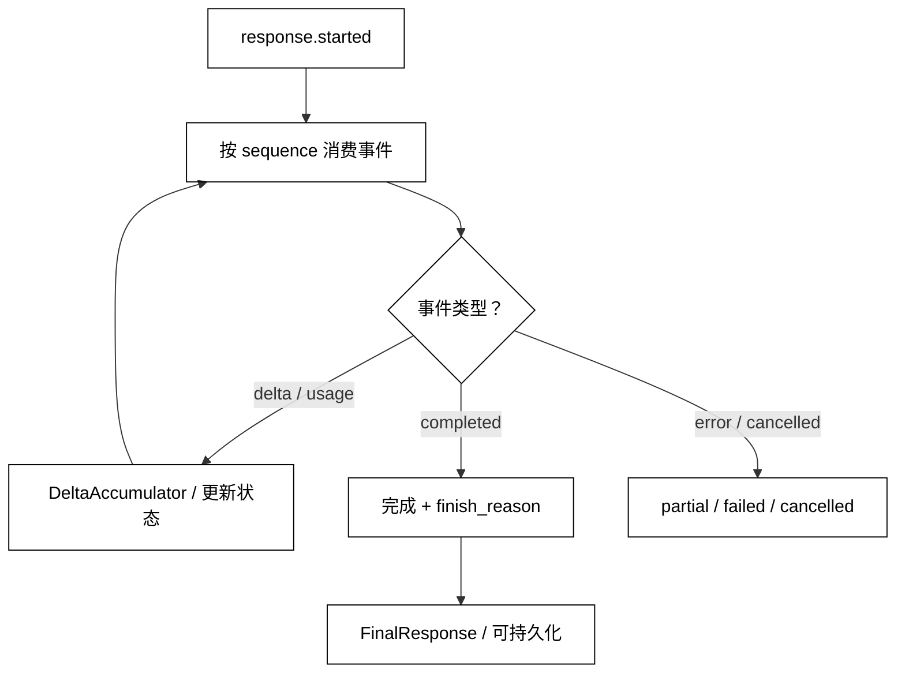

# Streaming、Delta 与模型事件

## 学习目标

- 区分一次完整响应、流式事件和 `Delta` 增量片段。
- 用状态累加器按序处理文本、Usage、完成和错误事件。
- 说明断线、取消、重复事件和部分输出的语义边界。
- 知道流式 Structured Output、工具消息和 UI 展示为什么不能直接复用最终结果逻辑。

## 核心知识点

Streaming 改变的是结果交付方式，不是模型输出的可信度。普通调用可能一次返回 `ModelResponse`；流式调用返回一个事件序列，客户端需要把 Delta 应用到本地状态，等完成事件后才得到可持久化的最终响应。事件可能包含文本片段、角色/内容块开始、Usage、完成、取消和错误。



阅读提示：`DeltaAccumulator` 按顺序聚合中间事件；只有合法终止事件才能生成 `FinalResponse`，错误或取消仍可保留 partial 文本但不能冒充成功。

事件顺序、事件 ID 和终止状态是协议的一部分。不能把“收到两段文本”当成“请求成功”，也不能把 UI 已显示的部分内容当成可执行的结构化结果。

## `ModelEvent`：流式协议的最小联合

### `ModelEvent` dataclass：统一事件信封

用途：用一个事件信封表达事件类型、顺序、响应 ID 和负载，让消费端不依赖供应商字段。

```python
from __future__ import annotations

from dataclasses import dataclass
from typing import Any


@dataclass(frozen=True)
class ModelEvent:
    event_type: str
    sequence: int
    response_id: str
    data: Any = None


event = ModelEvent("output.delta", 2, "response-1", {"text": "你好"})
print(event.event_type, event.sequence, event.data)
# 输出：output.delta 2 {'text': '你好'}
```

`event_type` 应使用有限集合或版本化命名；未知事件不能简单当作成功文本丢弃。`data` 可以是内容块、usage 或错误对象，生产实现应按类型进一步解析，而不是让业务层随意读取字典。

### `response.started`：建立响应上下文

开始事件可以携带响应 ID、模型身份或能力信息。客户端应在此时创建累加状态，并清空同一响应 ID 的旧缓冲；不能用一个全局字符串同时接收多个并发响应。

### `output.delta`：增量而非快照

Delta 通常表示“在已有输出上追加/应用的一小段变化”，不一定是独立可读文本。内容块、工具调用参数或 reasoning 片段可能各自有不同 Delta 规则。消费端要按事件类型选择 reducer，不能把所有 `data` 转成字符串拼接。

### `usage`：终态或独立计量

Usage 可能在最终事件前/后单独发送，也可能只有完成时才可用。中途断线时它可能缺失；缺失表示未知，不表示零。Usage 字段语义见[Token、上下文窗口与 Usage](./05-Token-上下文窗口与Usage)。

### `response.completed`：成功终止

完成事件应携带 finish reason 或最终状态，表明流可以安全收束。只有在完成事件且累加器状态一致时，才应把结果标为成功；`length` 可能表示达到输出预算，仍要由上层决定是否可接受。

### `response.error`：明确失败终止

错误事件说明流没有按完整成功契约结束。客户端可以保留已收到文本用于 UI 或诊断，但持久化为最终回答时要标记为 partial/failed，不能把半段内容冒充成功结果。错误分类和重试规则见下一篇。

## `DeltaAccumulator`：按事件更新状态

### `StreamState`：可观测的局部状态

用途：定义累加器需要的最小状态，包括响应 ID、文本、最后序号、Usage 和终止原因。

```python
from __future__ import annotations

from dataclasses import dataclass
from typing import Any


@dataclass
class StreamState:
    response_id: str | None = None
    text: str = ""
    last_sequence: int = -1
    usage: dict[str, int] | None = None
    terminal: str | None = None
    error: str | None = None


state = StreamState()
print(state.terminal, state.text)
# 输出：None
```

状态字段不要和最终领域对象混用。`terminal=None` 表示流仍未结束，不是成功；`error` 与 partial text 可以同时存在，客户端必须保留这种组合。

### `apply_event`：应用文本与终态事件

用途：按序应用开始、文本增量、Usage、完成和错误事件，演示重复/乱序事件如何被拒绝。

```python
from __future__ import annotations

from dataclasses import dataclass
from typing import Any


@dataclass
class StreamState:
    response_id: str | None = None
    text: str = ""
    last_sequence: int = -1
    usage: dict[str, int] | None = None
    terminal: str | None = None
    error: str | None = None


def apply_event(state: StreamState, event: dict[str, Any]) -> None:
    sequence = int(event["sequence"])
    if sequence <= state.last_sequence:
        raise ValueError("duplicate or out-of-order event")
    state.last_sequence = sequence
    kind = event["type"]
    if kind == "started":
        state.response_id = str(event["response_id"])
    elif kind == "delta":
        if state.terminal:
            raise ValueError("delta after terminal event")
        state.text += str(event["text"])
    elif kind == "usage":
        state.usage = dict(event["usage"])
    elif kind == "completed":
        state.terminal = str(event.get("finish_reason", "stop"))
    elif kind == "error":
        state.terminal = "error"
        state.error = str(event["message"])
    else:
        raise ValueError(f"unknown event type: {kind}")
    # 关键状态变化：每个事件只更新它拥有的字段，终态不可悄悄回退。


state = StreamState()
for event in (
    {"type": "started", "sequence": 0, "response_id": "r-1"},
    {"type": "delta", "sequence": 1, "text": "你好"},
    {"type": "completed", "sequence": 2, "finish_reason": "stop"},
):
    apply_event(state, event)
print(state.response_id, state.text, state.terminal)
# 输出：r-1 你好 stop
```

真实供应商可能允许同一序号的事件重放，或者使用事件 ID 而不是连续序号。Adapter 应把上游规则映射成明确的去重策略；如果不能证明重复事件安全，就宁可把流标成需要恢复，而不是重复追加文本。

### `finalize`：只在合法终态生成结果

用途：把累加状态转换为最终结果，并拒绝未结束或错误流。

```python
from dataclasses import dataclass


@dataclass(frozen=True)
class FinalResponse:
    text: str
    finish_reason: str


def finalize(state) -> FinalResponse:
    if state.terminal is None:
        raise RuntimeError("stream has not terminated")
    if state.terminal == "error":
        raise RuntimeError(state.error or "stream failed")
    # 输出契约：仅完成/长度等非错误终态可进入最终响应。
    return FinalResponse(state.text, state.terminal)


class State:
    terminal = "stop"
    text = "完成"
    error = None


print(finalize(State()))
# 输出：FinalResponse(text='完成', finish_reason='stop')
```

如果产品要展示 partial 文本，应另定义 `PartialResponse`，包含 response ID、已接收序号和失败原因；不要通过把 `finish_reason` 写成 `stop` 来绕过终态检查。

## 内容块与 Delta

### 文本 Delta：可以追加，但仍需按块处理

连续文本 Delta 常可按顺序拼接，但要考虑 Unicode 分片、Markdown 边界和重复事件。UI 可以实时渲染，持久化层应等合法终态。中间的文本可能包含敏感信息，日志采样要按权限和脱敏规则执行。

### 图片/音频 Delta：不一定是字节追加

多模态输出可能发送内容块开始、引用、元数据或独立资源事件；不能把所有事件当 UTF-8 文本。内容块模型见[Text、Image、Audio 与 Content-Block](./03-Text-Image-Audio与Content-Block)，流式 Adapter 应维护块 ID 和块内偏移。

### Structured Output Delta：完成前不是对象

JSON 的一段 `{"status"` 不是可用结果。可以显示原始文本，但只有完成后才能解析 Schema；增量解析器即使能识别一个字段，也要标记对象不完整，禁止以部分字段触发写操作。

## 取消、断线与重连

### `cancelled`：主动终止与错误不同

用户取消、客户端超时和服务器错误可能都结束流，但原因和重试策略不同。取消通常表示调用方不再需要结果，不应自动重试；如果应用需要保留已收文本，应记录为 cancelled/partial 而非失败后丢失。

### `disconnect`：已收到的内容不代表服务端状态

网络断开后，服务端可能已经完成生成，也可能还在运行。客户端不能仅凭 partial text 猜测；应使用供应商支持的响应查询、游标恢复或幂等机制。若协议不支持恢复，重试可能产生另一份不同回答，必须向上层报告不确定性。

### `resume`：事件 ID/游标是协议能力

只有供应商明确提供游标、事件 ID 或响应查询时，才能实现安全恢复。客户端保存最后已确认事件，并在重连时请求从该位置继续；若恢复接口不保证幂等，就要去重或放弃自动拼接。不要自行把 sequence 当成远端可恢复游标。

## 流式资源与背压

### `async for`：消费速度影响内存

高速模型事件如果被 UI、日志或慢速处理器阻塞，缓冲可能无限增长。生产实现要设置队列上限、丢弃策略和取消传播；不能为了“完整显示”把所有事件永远堆在内存中。

用途：用标准库生成器模拟有界消费，并在收到取消后停止产生新事件。

```python
from collections.abc import Iterator


def events(limit: int, cancelled: bool = False) -> Iterator[str]:
    for index in range(limit):
        if cancelled:
            # 关键状态变化：消费方取消后不再生成后续事件。
            return
        yield f"delta-{index}"


print(list(events(3)))
# 输出：['delta-0', 'delta-1', 'delta-2']
```

示例没有实现真正的异步背压；重点是把取消作为状态传播，而不是只关闭 UI。网络客户端还要在 finally 中释放连接、取消读取任务并记录终止原因。

## 事件观测与持久化

### Event ID、sequence 和 trace ID

事件 ID 用于去重，sequence 用于排序，trace ID 用于把一条流关联到 Agent run；三者责任不同。日志记录事件类型、大小、延迟和终态通常比记录每个 token 内容更安全。若必须保存内容，使用访问控制、加密和保留期限。

### Partial 与 final 的数据模型

UI 缓存可以保存 partial；业务数据库、向量索引或下游工具输入通常只接受 final/validated。两者应有不同状态字段，避免恢复任务时把 partial 当已完成输出。

## 四个主线项目中的对应位置

### smolagents：步骤/模型流与最终结果

smolagents 的某些模型或 Agent 运行可逐步产出日志/内容。阅读时区分模型流事件、工具/代码执行步骤和最终 Agent 返回值，确认取消或异常时步骤是否会被标记为完成。不要把控制台打印的增量当成已持久化的消息。

### OpenAI Agents SDK：模型流与运行事件

OpenAI Agents SDK 将模型流、运行事件和最终输出分层暴露。源码阅读时先找底层 Model 的 stream response，再看 Runner 如何把它转换为用户事件、工具事件和完成状态；Raw provider event 与规范化 event 的重试/去重语义可能不同。

### LangGraph：图流模式与消息 Delta

LangGraph 的 stream API 可能同时输出状态更新、消息 token 和自定义事件。阅读时确认 stream mode、节点边界和 checkpoint 更新时机；消息 Delta 只代表一部分输出，图状态更新则可能是快照或增量，不能混用 reducer。

### DeepSeek Harness：事件系统的时间顺序

DeepSeek Harness 以插件和事件系统为核心，模型事件可能与 UI、会话、Hook 事件交错。源码阅读时给事件分类（模型内容、生命周期、错误、用户操作），追踪谁负责排序/持久化/去重；开发预览期需防止把内部事件名当稳定协议。

## 易混点

- Streaming 是交付方式，不是模型更“实时”或更可信。
- Delta 是增量，不一定是完整文本或 JSON 对象。
- 收到文本不等于成功；需要完成事件和合法终态。
- Usage 可能晚到或缺失，缺失不等于零。
- 客户端 sequence 不一定是远端恢复游标；重连要看协议保证。
- partial 可用于 UI，通常不能直接进入业务数据库或副作用。
- 事件 ID、顺序号和 trace ID 是三种不同关联键。

## 课后小问

1. 为什么收到 `{"status":"ok"` 就不能把结构化结果交给下游？

   答案：这是未完成的 JSON 增量，可能后续变成错误或不同字段。必须等合法终态再解析和 Schema 校验，部分显示与业务使用要分开。

2. 网络断开后直接重新请求会有什么风险？

   答案：服务端可能已完成原请求，重试会生成另一份回答并重复费用；如果之前部分内容已展示或持久化，还会产生重复/冲突。只有协议提供恢复或幂等保证时才安全自动处理。

3. 为什么错误事件仍可以有 partial 文本？

   答案：错误发生在流结束前，客户端已经收到部分 Delta。它可以作为 UI 诊断，但必须带 failed/partial 状态，不能伪装成成功 final。

## 本节小结

流式模型调用返回的是有序事件序列。客户端需要按事件类型和顺序维护累加器，区分 partial、completed、cancelled 和 error；只有合法完成事件才生成最终响应。事件去重、取消、背压、断线恢复和 Usage 观测决定了流式实现是否可审计，不能用“把字符串拼起来”替代协议设计。

## 快速回顾

- 事件：started、delta、usage、completed、error/cancelled。
- 状态：response ID、最后序号、累加内容、Usage、终止原因。
- 成功：完成事件 + 状态一致；否则是 partial/failed。
- 恢复：依赖明确游标/事件 ID/响应查询，不自行猜测。
- 下游：UI 可显示 partial，结构化校验和副作用等 final。
