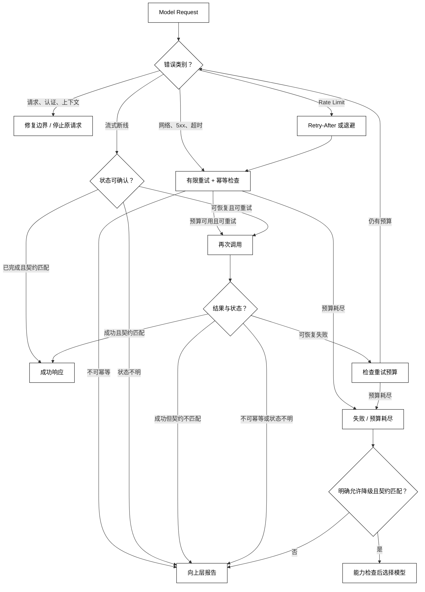

# Rate-Limit、超时、重试与模型降级

## 学习目标

- 按请求错误、认证错误、上下文错误、限流、超时和供应商故障分类处理。
- 理解 Retry-After、指数退避、抖动、并发预算和幂等边界。
- 区分普通调用与流式调用在断线/部分输出后的重试风险。
- 设计带能力和契约检查的模型降级，而不是“失败就换一个模型”。

## 核心知识点

模型调用失败不是一种错误。错误分类决定是否等待、是否重试、是否换模型以及应该向用户返回什么。一个安全的决策链是：



阅读提示：先按错误类别决定修复、等待或有限重试；Attempt 的可恢复失败要回到分类与预算检查，不可幂等或流式状态不明直接报告；只有明确允许且契约匹配的可恢复失败，才进入降级候选。

此前文章定义的 `Model`、`Model-Adapter`、消息、预算和流式终态都是本篇的前置边界；本篇不展开 Tool Calling 的执行重试与幂等，工具会有额外的副作用风险。

## 错误分类

### `ModelFailure`：稳定错误层级

用途：定义应用能识别的错误类别，避免根据供应商异常字符串判断是否重试。

```python
from __future__ import annotations

class ModelFailure(Exception):
    """已映射到模型调用边界的失败。"""


class InvalidRequest(ModelFailure):
    pass


class AuthenticationFailure(ModelFailure):
    pass


class ContextOverflow(ModelFailure):
    pass


class RateLimited(ModelFailure):
    def __init__(self, message: str, retry_after: float | None = None) -> None:
        super().__init__(message)
        self.retry_after = retry_after


class TransientProviderFailure(ModelFailure):
    pass


class TimeoutFailure(ModelFailure):
    pass


failures = (InvalidRequest("bad field"), RateLimited("slow down", 0.5), TimeoutFailure("read timeout"))
print([type(failure).__name__ for failure in failures])
# 输出：['InvalidRequest', 'RateLimited', 'TimeoutFailure']
```

分类时应保留 HTTP 状态、供应商错误码、请求 ID 和是否已收到输出等元数据，但不把完整异常 message 原样展示给用户。未知错误默认按不可安全重试处理，除非协议明确说明它是暂时失败。

### 可重试与不可重试

通常不可重试：参数/schema 错误、认证失败、权限拒绝、上下文超限、内容策略拒绝。通常可有限重试：明确的 429、连接重置、服务端 502/503/504、可恢复的读取超时。供应商的 500 不自动等于安全重试，尤其是请求可能已被处理时。

### `retryable`：用表而非字符串

用途：把错误类别映射成初始重试判断，后续仍要结合幂等和流状态。

```python
RETRYABLE = {
    "invalid_request": False,
    "authentication": False,
    "context_overflow": False,
    "rate_limited": True,
    "transient_provider": True,
    "timeout": True,
}


def retryable(category: str) -> bool:
    # 关键输入：未知类别默认不重试，避免把新错误误判为可恢复。
    return RETRYABLE.get(category, False)


print(retryable("rate_limited"), retryable("unknown"))
# 输出：True False
```

是否实际重试还要看本次请求有没有副作用、流是否已输出、剩余预算和请求方是否允许延迟；这个表不是完整决策器。

## `Rate Limit`：容量而不是业务失败

### 请求数与 Token 配额

限流可能按请求数、输入/输出 Token、并发数、租户、模型或区域分别计算。降低并发不一定解决 Token 配额，减少输入也不一定解决请求数配额。观测中要记录限制维度和 Provider 返回的 retry hint。

### `Retry-After`：服务器的等待提示

`Retry-After` 可能是秒数或日期，Adapter 应解析成明确的等待时长并限制最大值。客户端还要加随机抖动，避免一批实例在同一秒再次冲击服务。没有提示时才使用本地退避策略。

用途：解析一个安全范围内的 Retry-After 秒数，防止恶意或异常值让客户端无限等待。

```python
from __future__ import annotations

def parse_retry_after(value: str | None, maximum: float = 60.0) -> float | None:
    if value is None:
        return None
    try:
        seconds = float(value)
    except ValueError as error:
        raise ValueError("Retry-After must be seconds in this profile") from error
    if seconds < 0:
        raise ValueError("Retry-After cannot be negative")
    # 关键状态变化：将服务端提示限制在应用可接受的等待窗口。
    return min(seconds, maximum)


print(parse_retry_after("2.5"))
# 输出：2.5
```

如果超过最大等待时间，应该返回“稍后再试”或进入队列，而不是让 HTTP 请求无限占用线程。不要把 Retry-After 当用户可见的精确承诺，网络和队列延迟仍会变化。

### 并发信号量：限制客户端压力

Rate limit 保护的是供应商也保护客户端。应用可以按 Provider/模型设置并发上限，并在排队时记录等待时间；信号量只是本地节流，不会替代服务端配额或租户公平性。

用途：用标准库线程信号量模拟固定并发配额，展示释放资源的边界。

```python
from threading import BoundedSemaphore


slots = BoundedSemaphore(2)
acquired = slots.acquire(timeout=0.01)
try:
    # 关键状态变化：只有拿到客户端并发槽位才允许进入 Provider。
    print("slot acquired", acquired)
finally:
    if acquired:
        slots.release()
# 输出：slot acquired True
```

生产异步客户端应使用异步信号量和取消安全的 finally；不要在等待 Provider 期间持有数据库事务或用户请求锁。

## 超时：连接、读取和总时长

### `TimeoutBudget`：分阶段预算

一次模型请求可能包含排队、连接、写入、首字节、持续读取和总时长。只设置一个 socket timeout 可能让流式读取永远不结束，也可能把慢首 token 错判为服务挂死。应用应明确 connect/read/overall 的预算，并把剩余时间传给重试。

用途：用单调时钟计算总预算剩余时间，避免系统时钟调整导致超时失效。

```python
from dataclasses import dataclass
from time import monotonic


@dataclass(frozen=True)
class TimeoutBudget:
    deadline: float

    @classmethod
    def start(cls, seconds: float) -> "TimeoutBudget":
        if seconds <= 0:
            raise ValueError("timeout must be positive")
        return cls(monotonic() + seconds)

    def remaining(self) -> float:
        return max(0.0, self.deadline - monotonic())


budget = TimeoutBudget.start(0.1)
print(0 <= budget.remaining() <= 0.1)
# 输出：True
```

`monotonic()` 的输出随运行时间变化，示例只断言范围。超时发生后要记录阶段和是否收到任何输出；流式读到部分 Delta 后超时与尚未发送请求的连接超时，重试风险不同。

### 总超时与重试预算

如果总超时 10 秒，却每次重试都给 10 秒，客户端可能实际占用 30 秒。重试应从总 deadline 中扣除等待、连接和读取时间；当剩余预算不足以完成一次合理调用时，直接失败并说明原因。

## 指数退避与抖动

### `backoff_delay`：限制次数和最大等待

用途：计算带 full jitter 的退避时长，避免多个实例在固定时刻同步重试。

```python
from __future__ import annotations

import random


def backoff_delay(attempt: int, base: float = 0.5, cap: float = 8.0, seed: int | None = None) -> float:
    if attempt < 1:
        raise ValueError("attempt starts at 1")
    upper = min(cap, base * (2 ** (attempt - 1)))
    # 关键状态变化：在指数上限内加入随机抖动，限制重试洪峰。
    return random.Random(seed).uniform(0, upper)


print(round(backoff_delay(3, seed=7), 3))
# 输出：0.648
```

退避不是修复逻辑错误的办法。每次等待应可观测，且由总 deadline、最大尝试数和调用方的用户体验共同限制；服务端已提供 Retry-After 时，通常优先遵守其提示并做上限保护。

### `max_attempts`：有限尝试

重试次数应包含首次调用还是只包含补偿调用，要在契约里写清。推荐记录 `attempt=1` 表示首次发送，避免日志和告警少算一次。不要把指数退避写成无穷循环；服务不可用时，快速失败和进入队列通常比持续冲击更安全。

## 幂等与流式重试

### 请求幂等键：确认“同一个请求”

对纯文本生成，重复请求通常没有外部副作用，但仍可能产生重复费用、不同回答和重复事件。若 Provider 支持幂等键，应使用稳定的业务请求 ID、输入摘要和模型身份生成，并记录服务端是否接受；随机重试 ID 会让服务端无法去重。

用途：用标准库哈希从稳定输入生成一个幂等键，避免把密钥或完整 Prompt 直接当键。

```python
import hashlib


def idempotency_key(request_id: str, model: str, payload_digest: str) -> str:
    canonical = f"{request_id}|{model}|{payload_digest}"
    # 关键输入：摘要应已脱敏，键用于关联而不是保存原始内容。
    return hashlib.sha256(canonical.encode()).hexdigest()[:24]


print(idempotency_key("req-7", "demo-small", "digest-1"))
# 输出：0180701d00ad7970177ed1bd
```

这里写出该组输入的实际键；测试仍应验证同样输入产生同样键、不同模型或摘要产生不同键。幂等键不是认证凭证，也不应单独承担权限校验。

### 流式断线：先判定状态再重试

流已经返回 partial Delta 时，客户端不能把“连接失败”直接当作“服务端未处理”。若协议支持 response 查询/游标恢复，优先恢复；没有恢复能力时，重试要标记为新尝试并避免把两次文本无条件拼接。用户应知道答案可能不完整或正在重新生成。

### 非幂等动作：本篇只保守处理

模型输出本身可能被下游用于发送邮件、写数据库或调用工具。即使模型请求无副作用，重复消费结果也可能有副作用。工具执行的超时、重试和去重要在第 04 章单独设计；不要因为“模型调用可重试”就认为后续所有动作也可重试。

## 模型降级与 fallback

### `ModelProfile`：能力和契约优先

降级不是简单地从“大模型”换成“小模型”。候选模型必须满足任务所需的输入模态、上下文窗口、结构化输出、语言和安全策略；同时要记录模型身份变化，让质量和成本评估知道发生了降级。

用途：用 profile 表达模型能力和任务要求，只有满足硬约束的候选才进入 fallback。

```python
from dataclasses import dataclass


@dataclass(frozen=True)
class ModelProfile:
    name: str
    context_window: int
    structured_output: bool
    image_input: bool


def choose_fallback(candidates: tuple[ModelProfile, ...], required_window: int, needs_schema: bool) -> ModelProfile:
    for candidate in candidates:
        if candidate.context_window >= required_window and (not needs_schema or candidate.structured_output):
            # 关键状态变化：按声明能力筛选，而不是按名字猜测模型质量。
            return candidate
    raise LookupError("no model satisfies the output contract")


selected = choose_fallback(
    (ModelProfile("primary", 1000, True, False), ModelProfile("fallback", 800, True, False)),
    required_window=700,
    needs_schema=True,
)
print(selected.name)
# 输出：primary
```

能力满足只是最低条件。真正选择还要考虑区域可用性、租户许可、延迟、成本和质量阈值；fallback 顺序应可配置且可观测，不能静默改变用户期待。

### `fallback_reason`：记录为何换模型

用途：把降级原因作为运行元数据保存，区分限流、超时和能力不匹配。

```python
from dataclasses import dataclass


@dataclass(frozen=True)
class FallbackDecision:
    primary: str
    selected: str
    reason: str
    attempt: int


decision = FallbackDecision("primary", "fallback", "rate_limited", 2)
print(decision)
# 输出：FallbackDecision(primary='primary', selected='fallback', reason='rate_limited', attempt=2)
```

降级后的响应仍要走同样的 Message、Schema、Usage 和安全校验。若 fallback 不支持流式或结构化输出，应返回契约不满足，而不是偷偷切换成另一种响应格式。

### 熔断与恢复

当某 Provider 连续失败时，短时间内直接绕过它可以保护延迟和配额；恢复探测需要半开状态和明确阈值。熔断器属于更大运行时设计，本节只要求在源码中辨认“失败计数、打开、半开、关闭”的状态，不把一次偶发错误永久切走。

## 一个本地可运行的重试决策器

### `call_with_retry`：只对明确的暂时错误重试

用途：用脚本化失败序列演示有限重试、退避函数和成功输出；没有网络、密钥或真实等待。

```python
from dataclasses import dataclass
from typing import Callable


class RateLimited(Exception):
    pass


class InvalidRequest(Exception):
    pass


@dataclass(frozen=True)
class RetryResult:
    value: str
    attempts: int


def call_with_retry(
    call: Callable[[], str], max_attempts: int, delay: Callable[[int], float]
) -> RetryResult:
    if max_attempts < 1:
        raise ValueError("max_attempts must be positive")
    for attempt in range(1, max_attempts + 1):
        try:
            value = call()
            # 输出契约：成功返回值和实际尝试次数。
            return RetryResult(value, attempt)
        except RateLimited:
            if attempt == max_attempts:
                raise
            _ = delay(attempt)
            # 关键状态变化：仅 RateLimited 进入下一次尝试；示例不真实 sleep。
        except InvalidRequest:
            raise
    raise AssertionError("unreachable")


failures = iter((RateLimited("busy"), RateLimited("busy"), "ok"))


def scripted_call() -> str:
    result = next(failures)
    if isinstance(result, Exception):
        raise result
    return result


print(call_with_retry(scripted_call, 3, lambda attempt: 0.0))
# 输出：RetryResult(value='ok', attempts=3)
```

真实实现应在 delay 后等待、继承总超时、传递取消信号并记录每次错误；示例省略 sleep 是为了可重复运行。把未知异常默认当成成功或可重试都很危险，应先在 Adapter 中分类。

## 四个主线项目中的对应位置

### smolagents：API 模型的限流与模型替换

smolagents 的 API 模型层会处理客户端、速率限制和供应商调用参数。阅读时看重试发生在模型层还是 Agent 步骤层，是否会重复代码执行/工具结果，以及模型替换是否检查能力。模型层重试不应悄悄重跑带副作用的 Agent 步骤。

### OpenAI Agents SDK：Model/Provider 错误与 Runner 边界

OpenAI Agents SDK 将模型、Provider 和 Runner 分层，底层错误会影响一次 run 是否继续。源码阅读时找错误基类和模型解析入口，确认哪些网络失败由 Adapter 转换、哪些由 Runner 决定是否重试/降级；保留 trace 中的 attempt、模型和终态。

### LangGraph：节点重试与状态幂等

LangGraph 的节点/边可以被运行时重试、恢复或从 checkpoint 继续。关键是节点写入 State 前后是否可重复，模型调用和外部副作用是否分离，fallback 是否改变 State schema。不要因为图能恢复就认为每个节点都天然幂等。

### DeepSeek Harness：Provider、插件和运行时恢复

DeepSeek Harness 的插件化运行时可能在模型、会话和事件层分别处理失败、超时与恢复。阅读源码时把模型请求重试、事件重放、插件生命周期和用户可见错误分开；该项目处于开发预览期，兼容性变化和内部策略都应以当前源码为准。

## 易混点

- 429/超时/5xx 可能可重试，但请求错误、认证失败、上下文超限通常不能靠等待修复。
- Retry-After 是等待提示，不是无限等待授权；要有上限和取消。
- 总超时必须包含退避和所有尝试，不能每次重试重新获得完整时长。
- 流式断线后服务端状态未知，partial 输出不能无条件与新结果拼接。
- 幂等键用于关联/去重，不是认证凭证；模型结果被下游消费后仍可能产生副作用。
- fallback 必须满足输入模态、窗口、Schema 和安全契约，并记录原因。
- 客户端信号量只能节流本地并发，不能代替服务端配额和租户隔离。

## 课后小问

1. 参数错误收到 400 后为什么不能用指数退避重试？

   答案：错误是确定性输入问题，等待不会改变参数；重试只会浪费时间并可能触发限流。应修正请求或返回明确错误。

2. 流式已经显示一半回答后超时，能否直接从头重试并把两段拼起来？

   答案：不能。服务端可能已完成原请求，第二次回答可能不同；拼接会重复或矛盾。优先使用协议提供的恢复/查询，否则将其标记为 partial/不确定并由上层决定。

3. 为什么 fallback 选择不能只按“主模型失败就选最便宜模型”？

   答案：便宜模型可能不支持图片、上下文长度、结构化输出或安全策略，导致下游契约破坏。先筛硬能力，再在允许集合内按成本/延迟选择，并记录降级原因。

## 本节小结

韧性设计从错误分类开始：不可重试的输入/权限/窗口问题要修正边界，限流和暂时故障才进入有上限、带抖动和总超时的重试。流式断线要考虑部分输出与服务端不确定状态；模型降级必须先满足能力和响应契约，并沿用同一套消息、Schema、Usage 与安全校验。每次尝试、等待、模型变化和最终终态都应可观测。

## 快速回顾

- 分类：请求、认证、窗口、限流、超时、供应商暂时故障。
- 等待：Retry-After 优先，退避带 jitter，有上限可取消。
- 重试：受总 deadline、attempt、幂等和流状态约束。
- 降级：能力/契约先行，原因、模型和尝试次数入 trace。
- 终态：成功、partial、cancelled、failed 不能混写成一个字符串。
- 下一篇阅读[Function Calling 与 JSON Schema](/courses/agent/04-Tool-Calling与Agent-Loop/01-函数调用与JSON-Schema)，把模型边界连接到工具定义和执行边界。
