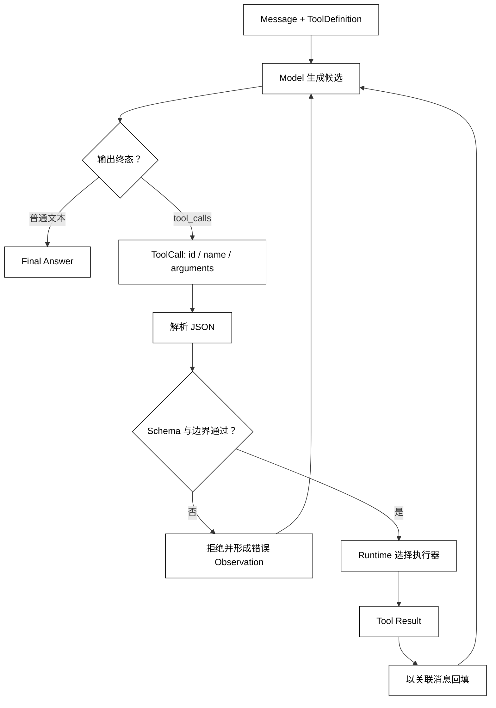

# Function Calling 与 JSON Schema

## 学习目标

- 说清 Function Calling 为什么只是“结构化地提出动作”，而不是让模型直接执行函数。
- 能从 ToolDefinition、ToolCall 和 Message 还原一次调用的数据流。
- 知道 JSON Schema 约束形状的边界，以及解析、校验、权限和执行分别由谁负责。
- 用标准库构造一个不需要真实模型或密钥的最小调用消息。

## 前置知识

- 已阅读第 03 章的 Model、Message 和 StructuredOutput。
- 已了解第 02 章中 Model 提议 Action、Runtime 校验并执行、Environment 返回 Observation 的边界。
- 本篇只定义调用协议；注册与能力发现见[工具定义、注册与能力发现](./02-工具定义注册与能力发现)，参数转换见[参数校验、类型转换与错误反馈](./04-参数校验类型转换与错误反馈)。

## 核心知识点

Function Calling（也常称 Tool Calling）是模型输出一种可机器解析的“调用提议”。模型根据消息和工具说明生成工具名及 JSON 参数；运行时随后解析、校验、授权并决定是否执行。JSON Schema 描述参数的形状，不能证明参数对应的事实正确，更不会自动授予文件、网络或账户权限。



阅读提示：ToolCall 只表示模型走到调用分支，真正的副作用从 Executor 开始；解析或边界拒绝也要形成可诊断结果再决定是否继续。

### Function Calling：把自然语言请求变成候选动作

Function Calling 的专业含义是“模型输出符合工具调用协议的结构”；白话说，就是让模型把“查上海天气”表达成“请调用 get_weather，参数是 {"city":"上海"}”。它减少了应用从自然语言猜参数的工作，但没有改变模型不能直接触碰外部世界的事实。

调用模式通常至少有三种语义：允许模型选择工具、强制选择某个工具、禁止工具而直接回答。具体字段随供应商不同，核心仍是运行时要把“模型想调用什么”与“应用允许调用什么”分开。

### ToolDefinition：工具的机器可读说明

用途：用一个稳定的数据结构向模型暴露工具名、用途和参数 Schema；注册与能力发现会在下一篇把多个定义组成允许集合。

```python
from dataclasses import dataclass
from typing import Any


@dataclass(frozen=True)
class ToolDefinition:
    name: str
    description: str
    parameters: dict[str, Any]


weather = ToolDefinition(
    name="get_weather",
    description="读取一个城市的模拟天气",
    parameters={
        "type": "object",
        "properties": {"city": {"type": "string"}},
        "required": ["city"],
        "additionalProperties": False,
    },
)

print(weather.name, weather.parameters["required"])
# 输出：get_weather ['city']
```

description 帮模型理解何时适用，parameters 帮解析器知道形状；二者都不是安全策略。比如描述写“只读”，仍需要执行器和权限层强制只读。

### JSONSchema：参数形状契约

JSON Schema 是描述 JSON 值类型、必填字段、枚举、范围和额外字段策略的契约。这里的 JSONSchema 是课程中的概念名，不要求使用第三方校验库；标准库可以完成小范围演示，生产系统应选有明确版本和错误路径的校验器。

需要区分四层结果：

| 层次 | 问题 | 通过意味着什么 |
| --- | --- | --- |
| JSON 解析 | 文本是不是合法 JSON？ | 得到 Python 基础对象 |
| Schema 校验 | 对象字段和类型是否符合定义？ | 可以进入参数转换边界 |
| 业务校验 | 城市是否在允许范围、金额是否可用？ | 语义满足领域规则 |
| 权限/审批 | 当前主体现在能否做？ | 才可能进入执行器 |

Schema 通过不等于业务成功；业务通过也不等于已经得到用户批准。

### ToolCall：一次带关联标识的调用提议

用途：从 Assistant Message 中提取调用 id、名称和 JSON 参数，形成后续校验器能够消费的对象；此代码不会执行任何工具。

```python
import json
from dataclasses import dataclass
from typing import Any


@dataclass(frozen=True)
class ToolCall:
    call_id: str
    name: str
    arguments: dict[str, Any]


def parse_tool_call(message: dict[str, Any]) -> ToolCall:
    calls = message.get("tool_calls", [])
    if len(calls) != 1:
        raise ValueError("demo parser expects exactly one tool call")
    item = calls[0]
    function = item["function"]
    arguments = json.loads(function["arguments"])
    if not isinstance(arguments, dict):
        raise ValueError("tool arguments must be a JSON object")
    return ToolCall(str(item["id"]), str(function["name"]), arguments)


assistant_message = {
    "role": "assistant",
    "tool_calls": [{
        "id": "call_1",
        "function": {
            "name": "get_weather",
            "arguments": '{"city": "上海"}',
        },
    }],
}

call = parse_tool_call(assistant_message)
print(call)
# 输出：ToolCall(call_id='call_1', name='get_weather', arguments={'city': '上海'})
```

call_id 用来把执行结果与原始调用关联起来；不能用数组位置或工具名代替，因为同一轮可能请求同一个工具多次。arguments 是未经 Schema 和业务校验的不可信输入，不能直接传给 Python 函数。

### tool_choice：选择策略不是授权

tool_choice 表示本次模型生成偏好，例如“自动选择”“必须调用某个工具”或“禁止工具”。它解决的是生成控制，不解决用户权限、租户范围、审批和沙箱。即使请求要求模型必须调用 delete_file，Runtime 也可以因为当前身份不允许而拒绝。

### ToolMessage：为下一次推理回填事实

工具执行后，运行时通常把结果作为带 tool_call_id 的消息回填到消息序列。这里的消息是观察数据，不是模型可以绕过校验重新解释的命令；结果内容还需要脱敏、大小限制和来源标记。完整执行与回填在[工具执行、Tool Result 与消息回填](./05-工具执行Tool-Result与消息回填)展开。

## 最小数据流：模型提议不等于函数调用

一次完整交互至少有四个边界：

1. 应用把 Message 与 ToolDefinition 放入规范化模型请求。
2. 模型返回文本或 ToolCall，但没有执行权限。
3. Runtime 解析并做 Schema、业务、权限检查。
4. Executor 执行后产生 Tool Result，再通过关联消息回填。

如果第 2 步的文本被直接 eval，或者第 2 步的函数名直接用于 globals()[name]，模型就获得了未声明的代码执行入口。正确做法是只从显式注册表取执行器，并在副作用前保留拒绝出口。

## 源码阅读心智模型

### smolagents

先找模型结果被解析为工具调用或最终答案的位置，再找工具注册表和执行器。不要因某个 Tool 对象带有 Python 函数就认为模型获得了任意函数权限；真正的边界在“名称如何映射到执行器”和“结果如何进入下一步”。

### OpenAI Agents SDK

可把 Function Calling 对应到 Agent 工具定义、模型响应中的工具项和 Runner 的执行分支。阅读重点是 Runner 在解析调用后如何选择工具、如何构造结果消息，以及工具异常如何影响下一次模型请求。

### LangGraph

在图中，模型节点产出工具调用，工具节点执行并更新 State；边决定回到模型还是结束。图的显式节点不等于自动安全，参数校验和权限仍应位于副作用前。

### DeepSeek Harness

阅读 Harness 时先定位 LLM 输出协议、工具定义注册和 Driver 执行入口，再看 Plugin/Hook 是否改变了这条链。开发预览中的内部字段可能变化，应记录责任边界而不是背固定类名。

## 易混点

- **Function Calling 不是远程执行**：模型输出的是提议，执行器才产生副作用。
- **JSON 合法不等于 Schema 合法**：字符串形式的“10”未必满足数字参数。
- **Schema 通过不等于有权限**：参数形状、业务规则和授权是三层检查。
- **工具名称不应直接映射任意函数**：只能从显式注册表取执行器。
- **call_id 不是用户身份**：它只关联一次模型提议和对应结果，不能作为认证凭据。
- **工具结果不是最终答案**：回填后还要由下一轮决策判断继续、成功或失败。

## 课后小问

1. 为什么不能把 Function Calling 当成“模型调用了函数”？

   **答案**：模型只生成结构化调用提议，Runtime 还要解析、校验、授权并决定是否执行。

   **解析**：把生成和执行混为一谈会跳过未知工具、越权参数和审批拒绝路径，也会让日志把“想做什么”误报成“已经做了什么”。

2. 为什么 ToolCall 需要 call_id？

   **答案**：同一轮可以有多个调用，call_id 让每个 Tool Result 精确回到对应调用。

   **解析**：只用工具名或数组位置无法稳定关联重复调用、并行完成或重试后的结果；关联 id 还便于审计和去重。

3. JSON Schema 通过后，为什么仍不能直接执行删除操作？

   **答案**：Schema 只约束输入形状，权限、审批、危险等级和沙箱属于后续安全边界。

   **解析**：{"path": "report.txt"} 可能完全符合 Schema，但当前用户未必能删除该路径。副作用必须经过独立策略检查。

## 本节小结

- Function Calling 是模型表达下一步工具意图的协议，不是执行授权。
- ToolDefinition 描述能力和参数，ToolCall 携带一次调用的 id、名称和 JSON 参数。
- JSON Schema 只负责数据形状；解析、Schema、业务、权限和执行是不同责任边界。
- 只有执行器返回 Tool Result 后，事实才可以通过关联消息回填 Agent Loop。

## 快速回顾

- 看到 tool_calls，先问：谁解析、谁校验、谁授权、谁执行？
- 看到 Schema，先区分语法、形状、语义和权限四层。
- 看到 call_id，把它当成结果关联键，不当成认证凭据。
- 下一篇阅读[工具定义、注册与能力发现](./02-工具定义注册与能力发现)，把单个定义组成可控的工具集合。
