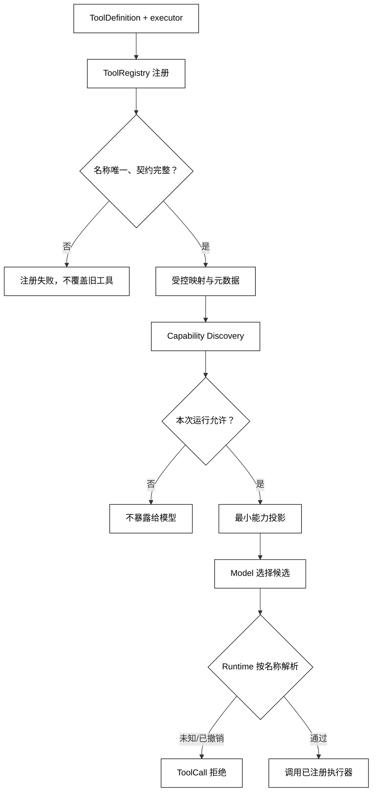

# 工具定义、注册与能力发现

## 学习目标

- 了解 ToolRegistry 如何把 ToolDefinition 和真实执行器组成受控映射。
- 区分“系统拥有某个工具”与“本次运行允许模型看到或调用某个工具”。
- 设计重复注册、未知名称、能力投影和租户隔离的失败边界。
- 能用本地 Python 注册表模拟能力发现，不依赖框架或在线服务。

## 前置知识

- 已阅读[Function Calling 与 JSON Schema](./01-函数调用与JSON-Schema)，理解 ToolDefinition、ToolCall 和 Schema 只表达调用协议。
- 已了解第 02 章的 Tool、ToolRegistry、State、Context 和 Observation。
- 下一篇会讨论模型如何在允许集合中选择工具；本篇不把注册表变成模型决策器。

## 核心知识点

Tool Registry（工具注册表）是“工具名称 → 定义、执行器和策略元数据”的受控映射。Capability Discovery（能力发现）是把这张内部表按当前运行上下文投影成可供模型或用户理解的能力清单。白话说，注册表是后台通讯录，能力发现是针对当前访客生成的门牌列表；通讯录里有的工具不一定要让每个访客看见。



阅读提示：能力发现是一个按运行上下文生成的只读投影，不能反向改变注册表；最终执行前仍要重新按名称解析，防止模型使用过期或未允许的能力。

### ToolRegistry：保存定义与执行器的显式映射

注册表至少要保存三类信息：给模型看的 ToolDefinition、只给 Runtime 使用的执行器、用于过滤和审计的策略元数据。不要让模型传入 Python 模块路径、类名或任意表达式，再由注册表动态导入。

### register：拒绝重复和不完整定义

用途：用标准库实现一个最小注册表，演示名称唯一、执行器显式传入和重复注册拒绝。

```python
from dataclasses import dataclass
from typing import Any, Callable


@dataclass(frozen=True)
class ToolDefinition:
    name: str
    description: str
    parameters: dict[str, Any]


@dataclass(frozen=True)
class RegisteredTool:
    definition: ToolDefinition
    executor: Callable[[dict[str, Any]], str]
    read_only: bool


class ToolRegistry:
    def __init__(self) -> None:
        self._tools: dict[str, RegisteredTool] = {}

    def register(self, tool: RegisteredTool) -> None:
        name = tool.definition.name
        if not name or name in self._tools:
            raise ValueError(f"tool name is unavailable: {name!r}")
        if not callable(tool.executor):
            raise TypeError(f"executor is not callable: {name}")
        self._tools[name] = tool

    def get(self, name: str) -> RegisteredTool:
        if name not in self._tools:
            raise LookupError(f"unknown tool: {name}")
        return self._tools[name]

    def names(self) -> tuple[str, ...]:
        return tuple(sorted(self._tools))


registry = ToolRegistry()
registry.register(RegisteredTool(
    ToolDefinition("get_status", "读取模拟状态", {"type": "object"}),
    lambda _: "green",
    read_only=True,
))
print(registry.names())
try:
    registry.register(RegisteredTool(
        ToolDefinition("get_status", "覆盖旧定义", {"type": "object"}),
        lambda _: "red",
        read_only=True,
    ))
except ValueError as error:
    print(type(error).__name__, str(error))
# 输出：('get_status',)
# 输出：ValueError tool name is unavailable: 'get_status'
```

注册成功不代表工具马上可用：版本、配置、凭证和外部连接可以在启动或首次调用时另行检查。无论采用哪种生命周期，都要记录注册失败而不是静默覆盖旧定义。

### Capability Discovery：按上下文投影能力

能力发现不是把完整注册表序列化给模型。投影时至少考虑当前 Agent、租户、身份、数据域、读写等级和工具版本；执行器内部的凭证、网络地址和实现细节不应进入模型上下文。

用途：将注册表过滤为本次运行允许的最小能力清单，并让用户界面与模型看到一致的名称集合。

```python
from dataclasses import dataclass


@dataclass(frozen=True)
class Capability:
    name: str
    summary: str
    read_only: bool
    scopes: frozenset[str]


def discover(capabilities: list[Capability], subject_scopes: set[str]) -> list[Capability]:
    visible = [
        item for item in capabilities
        if item.scopes.issubset(subject_scopes)
    ]
    # 输出契约：只返回能力说明，不暴露执行器、密钥或内部路径。
    return sorted(visible, key=lambda item: item.name)


catalog = [
    Capability("get_status", "读取构建状态", True, frozenset({"build:read"})),
    Capability("publish", "发布结果", False, frozenset({"release:write"})),
]
visible = discover(catalog, {"build:read"})
print([(item.name, item.read_only) for item in visible])
# 输出：[('get_status', True)]
```

“隐藏”只是减少模型误选，不是安全授权。即使某工具没有出现在 Context 中，恶意或错误的 ToolCall 仍可能手工写出它的名称；Runtime 必须对每次调用执行 allowlist 检查。

### allowed_tools：固定本次运行的允许集合

用途：把能力发现的结果固化为不可变允许集合，使模型上下文、Runtime 校验和审计日志共享同一个边界。

```python
from dataclasses import dataclass


@dataclass(frozen=True)
class AllowedTools:
    names: frozenset[str]
    source: str

    def permits(self, name: str) -> bool:
        return name in self.names


allowed = AllowedTools(frozenset({"get_status"}), "subject:demo")
print(allowed.permits("get_status"), allowed.permits("publish"))
# 输出：True False
```

允许集合应绑定 Run 或 Turn，而不是全局可变单例。工具撤销、会话身份变化或策略刷新时，可以创建新的集合并在旧运行中明确停止或等待，不要让同一条轨迹悄悄改变权限。

### resolve：执行前再次查找

模型返回名称后，Runtime 要先做“是否允许”再做“注册表解析”。二者顺序可以因系统而异，但结果必须是：未知、未暴露、已撤销和契约失配都不落到默认函数上；拒绝本身要成为可回填的错误 Observation。

## 注册、发现和执行的责任边界

| 责任 | 负责什么 | 不负责什么 |
| --- | --- | --- |
| 注册表 | 名称唯一、定义到执行器的映射 | 判断当前用户是否可以调用 |
| 能力发现 | 过滤并生成最小描述 | 代替执行前授权 |
| Model | 在可见定义中提出候选 | 证明调用已经执行 |
| Runtime | allowlist、参数、权限和生命周期检查 | 修改模型本身的事实判断 |
| Executor | 处理实际副作用并返回结果 | 决定模型下一步策略 |

## 源码阅读心智模型

### smolagents

先定位 Tool 对象如何被收集、名称如何生成、执行器如何调用。再看 Agent 是把所有工具都发给模型，还是按当前任务过滤；如果没有显式 allowlist，要把这当成需要补充的运行边界。

### OpenAI Agents SDK

可沿 Agent 配置中的工具集合追到 Runner 的调用解析。重点检查每次运行是否重新计算工具可见性，以及工具函数抛错时是否仍保留工具名称和调用 id。

### LangGraph

图节点可能共享一组工具，也可能由不同节点拥有不同工具集合。阅读时区分“节点能访问的 Python 对象”与“模型消息中公开的 ToolDefinition”，避免把图的可达性当成用户授权。

### DeepSeek Harness

在 Harness 中先找 Plugin/Skill 注册点和能力清单生成点，再追到 Driver 执行入口。重点是插件卸载、版本变化和权限刷新是否会使旧 ToolCall 进入过期执行器。

## 易混点

- **注册不等于暴露**：后台注册表可以比当前模型可见清单大。
- **发现不等于授权**：隐藏工具降低误选概率，执行前仍须检查权限。
- **名称唯一不等于实现安全**：执行器仍要校验参数、资源范围和副作用。
- **能力描述不是秘密存储**：不应在 description 中放密钥、内部地址或租户数据。
- **全局注册表不等于全局可调用**：运行级身份和 allowlist 必须参与解析。

## 课后小问

1. 为什么重复注册时不能简单覆盖旧工具？

   **答案**：覆盖会让已经生成的 ToolCall 在同一条轨迹中指向不同实现，破坏可重放性和审计。

   **解析**：如果确实要升级，应使用版本化名称或显式替换流程，记录旧定义失效时间，并决定旧 Run 是完成、迁移还是停止。

2. 能力发现返回空列表时，是否说明系统没有工具？

   **答案**：不一定，只能说明当前运行上下文没有可暴露工具。

   **解析**：注册表可能存在工具，但身份、租户、数据域或策略过滤会让它们不可见。应把“无可用能力”与“系统未注册”分开记录。

3. 为什么 Runtime 还要对模型手写的未知工具名做检查？

   **答案**：模型输出是不可信输入，不能假设它只会使用上下文中出现的名称。

   **解析**：旧上下文、提示注入或模型幻觉都可能产生未注册名称；显式拒绝可以防止动态导入和默认执行器漏洞。

## 本节小结

- ToolRegistry 将 ToolDefinition、执行器和策略元数据组成显式映射。
- Capability Discovery 只投影当前运行允许的最小能力集合，不替代授权。
- 重复注册、未知名称、撤销和过期能力都必须有明确拒绝路径。
- Runtime 每次调用都要重新检查 allowlist 并按名称解析，不能依赖模型“自觉”。

## 快速回顾

- 注册表回答“系统知道哪些工具”，能力投影回答“本次让模型看到哪些工具”。
- 允许集合应绑定运行上下文，不能靠全局可变列表。
- 执行前最后一次名称解析是防止过期、越权和动态导入的关键。
- 下一篇阅读[模型如何选择工具和生成参数](./03-模型如何选择工具和生成参数)，进入“有能力可选”之后的模型决策边界。
