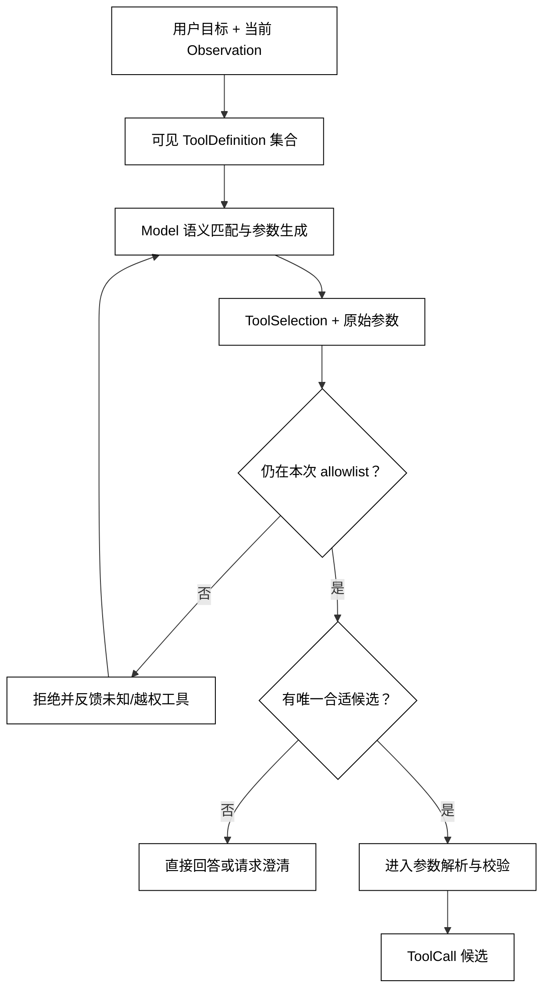

# 模型如何选择工具和生成参数

## 学习目标

- 理解模型根据工具描述、用户目标和当前观察提出 ToolSelection 的过程。
- 区分模型的候选选择与 Runtime 的允许集合、参数校验和最终授权。
- 说明工具描述、重名能力、无匹配和多工具选择为什么会影响调用质量。
- 用确定性本地策略模拟“选择工具 + 生成参数”，而不是把示例误称为真实模型推理。

## 前置知识

- 已阅读[工具定义、注册与能力发现](./02-工具定义注册与能力发现)，知道 ToolRegistry 和 Capability Discovery 已经生成本次运行的可见集合。
- 已了解[Function Calling 与 JSON Schema](./01-函数调用与JSON-Schema)中的 ToolCall、ToolDefinition 和 JSON Schema。
- 参数的严格校验与错误反馈在下一篇展开；本篇生成的参数仍是不可信候选。

## 核心知识点

Tool Selection 是模型从可见工具中提出“用哪个工具”的决策，Argument Generation 是模型同时生成调用参数。白话说，模型先回答“这件事应该找哪位同事”，再填写“请他处理哪些字段”；这两步都只是草稿，Runtime 还要核对名单和表格。



阅读提示：模型选择只负责提出候选；即使模型自报高置信度，Runtime 仍要先检查 allowlist，再把参数交给独立校验器。

### ToolSelection：从能力描述中选候选

模型不是从 Python 函数地址中选择工具，而是根据名称、描述、参数说明和当前消息做语义匹配。工具描述应说明用途、输入含义、不可做的事和典型边界；把几十种能力都写成“处理数据”会让选择变得含糊。

常见结果有四类：

| 结果 | 运行时含义 |
| --- | --- |
| 唯一工具 | 可以进入参数解析，但不能跳过校验 |
| 多个近似工具 | 需要更明确描述、路由规则或向用户澄清 |
| 没有匹配 | 直接回答、拒绝或请求补充信息 |
| 选到不可用工具 | 以错误 Observation 反馈，不能偷偷换成默认工具 |

### tool_choice：控制生成自由度

tool_choice 可以让调用方允许自动选择、要求某个工具或禁止工具。它是生成策略，不是 Permission。即使调用方要求某工具，工具仍可能因身份、租户或危险等级在 Runtime 处被拒绝。

模型提供商还可能返回多个 ToolCall。是否允许并行、是否要求单一调用、是否需要依赖前一调用的结果，应由 Runtime 的执行策略决定，而不是从模型返回数组长度猜测。

### Argument Generation：依据 Schema 生成字段

参数生成不是把整条用户消息原样塞进函数。模型应根据每个参数的描述生成字段，保持 id、日期、单位和枚举的明确语义。例如“下周一”需要结合时区和当前日期解析，不能让工具函数悄悄猜一个时区。

生成的参数可能出现：

- 必填字段遗漏或多出无关字段；
- 数字以字符串出现，布尔值写成 true/false 之外的词；
- 日期、金额、单位和时区含义不明确；
- 把用户提供的外部文本误当作工具参数中的系统指令。

这些都是下一篇校验器的输入，不是模型“已经修好”的证明。

### model_propose：用确定性策略模拟模型边界

用途：用本地关键词策略模拟模型的选择与参数生成，观察“候选提议”和“允许工具集合”是两件事；真实模型只替换这一层。

```python
from __future__ import annotations

from dataclasses import dataclass
from typing import Any


@dataclass(frozen=True)
class ToolDefinition:
    name: str
    description: str
    keywords: frozenset[str]
    required: tuple[str, ...]


@dataclass(frozen=True)
class Proposal:
    tool_name: str | None
    arguments: dict[str, Any]
    reason: str


def model_propose(goal: str, tools: list[ToolDefinition]) -> Proposal:
    normalized_goal = goal.lower()
    scored = [
        (sum(keyword.lower() in normalized_goal for keyword in tool.keywords), tool)
        for tool in tools
    ]
    score, selected = max(scored, key=lambda pair: (pair[0], pair[1].name))
    if score == 0:
        return Proposal(None, {}, "no matching capability")
    arguments: dict[str, Any] = {}
    if selected.name == "get_weather":
        arguments["city"] = "上海"
    return Proposal(selected.name, arguments, f"keyword score={score}")


catalog = [
    ToolDefinition(
        "get_weather", "读取城市天气", frozenset({"天气", "weather", "上海"}), ("city",)
    ),
    ToolDefinition(
        "get_status", "读取构建状态", frozenset({"构建", "build", "状态"}), ("project",)
    ),
]

proposal = model_propose("查询上海天气", catalog)
allowed = {"get_weather"}
print(proposal)
print(proposal.tool_name in allowed)
# 输出：Proposal(tool_name='get_weather', arguments={'city': '上海'}, reason='keyword score=2')
# 输出：True
```

代码中的关键词匹配只是可重复的测试替身，不代表真实模型的内部算法。它刻意把结果先叫 Proposal，避免把候选参数误当成已校验输入。

### ToolChoice 与 Runtime allowlist

Runtime 应把模型提出的名称与当前允许集合做交集，而不是由模型自行扩大集合。对于没有匹配的目标，较好的行为是直接说明没有能力或请求澄清，不要为了“完成任务”强行调用语义相近但副作用不同的工具。

### 选择质量：描述、冲突和反馈

工具选择质量可以从三个可观察点改进：

1. 描述是否能区分相似工具的用途、边界和输入；
2. 能力发现是否只暴露本次任务所需的最小集合；
3. 被拒绝的调用是否把字段级原因反馈给模型或用户，而不是只返回“失败”。

反馈的作用是帮助下一轮修正候选，不是让模型绕过拒绝。重复收到同一拒绝时，Runtime 应进入失败或澄清终态，防止循环。

## 模型决策与执行责任边界

| 层 | 允许决定 | 不应决定 |
| --- | --- | --- |
| Model | 选候选工具、填候选参数、请求澄清 | 获得新工具权限、宣布副作用已完成 |
| Schema Validator | 字段形状和可控转换 | 当前主体是否有业务权限 |
| Runtime | allowlist、预算、审批和是否执行 | 把未经验证的参数当事实 |
| Tool | 执行并返回结果 | 修改模型的选择理由 |

## 源码阅读心智模型

### smolagents

查看工具描述如何被拼进模型提示，以及模型结果如何被解析成工具名和参数。重点追踪“解析失败后是否再请求一次”“未知工具是否有停止边界”，而不是只看最常见的成功调用。

### OpenAI Agents SDK

可沿模型响应中的 function/tool item 追到 Runner 分支，区分 Agent 配置的工具集合、模型选择和实际执行。工具选择策略可能由模型端和运行配置共同影响，不能只从单个请求字段推断全局行为。

### LangGraph

图中的路由节点可能先根据状态选择工具或子图，模型节点也可能输出 ToolCall。源码阅读时要标记这两种选择的责任：状态路由不是模型 Tool Calling，图边也不替代参数校验。

### DeepSeek Harness

先找 Driver 如何向模型提供能力清单，再看 Hook/Plugin 是否追加或过滤工具。重点检查扩展产生的工具描述是否带有版本、权限和撤销语义，避免把动态注入的能力当成永久白名单。

## 易混点

- **模型置信度不是授权**：高置信度的选择仍可能越权或参数错误。
- **tool_choice 不是 Permission**：它控制生成，不决定当前主体能否执行。
- **选择成功不等于参数成功**：工具名正确，字段仍可能缺失、类型错误或语义不明。
- **没有匹配不等于应该猜**：澄清或失败比调用相近的危险工具更可靠。
- **多 ToolCall 不自动等于并行**：执行方式要看依赖、共享状态和副作用。

## 课后小问

1. 为什么工具描述写得越长不一定越好？

   **答案**：描述首先要可区分、可操作；冗长且含糊的文字可能稀释关键输入和边界。

   **解析**：应把用途、必填字段、单位、返回语义和禁止场景写清，并用能力发现控制暴露数量，而不是把所有内部说明都塞进上下文。

2. 模型选择了未暴露的工具，Runtime 应该自动换一个相似工具吗？

   **答案**：默认不应自动换，应该拒绝并反馈，或请求用户澄清。

   **解析**：相似名称可能意味着不同资源范围和副作用；自动替换会把模型错误升级为未经授权的动作。

3. 为什么候选参数不能直接传给函数？

   **答案**：候选参数尚未经过 JSON 解析、Schema、类型转换、业务和权限检查。

   **解析**：模型可能遗漏字段、把单位写错或混入不可信文本。执行器只应接收已通过边界的领域输入。

## 本节小结

- ToolSelection 和 Argument Generation 是模型根据可见能力提出的候选决策。
- tool_choice 控制生成自由度，不授予权限；Runtime allowlist 才是执行前的硬边界之一。
- 无匹配、多匹配和参数不完整都应有澄清或拒绝终态，不应靠默认工具猜测。
- 本地策略可以模拟选择层，但不能冒充真实模型质量或安全保证。

## 快速回顾

- 先判断“有没有唯一合适工具”，再生成参数。
- 把模型候选、Schema 校验、Runtime 授权和 Tool 执行分开。
- 选择反馈应可诊断、有限次，重复拒绝最终进入失败或澄清。
- 下一篇阅读[参数校验、类型转换与错误反馈](./04-参数校验类型转换与错误反馈)，把候选参数变成可执行输入。
