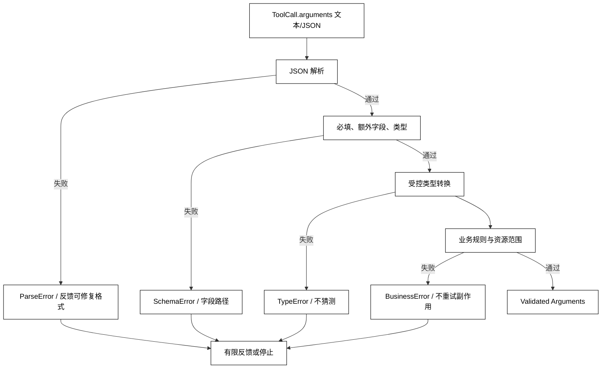

# 参数校验、类型转换与错误反馈

## 学习目标

- 把参数处理拆成 JSON 解析、Schema 校验、受控类型转换和业务校验。
- 区分可修复的格式错误、不可修复的权限错误和工具运行时错误。
- 设计字段路径、错误代码和安全摘要组成的结构化反馈。
- 用标准库实现一个拒绝未知字段、禁止危险隐式转换的参数校验器。

## 前置知识

- 已阅读[模型如何选择工具和生成参数](./03-模型如何选择工具和生成参数)，知道模型生成的参数只是候选。
- 已了解第 03 章的 SchemaValidation、StructuredOutput 和 Constraints，以及本章前面的 ToolCall、ToolResult。
- 本篇只把参数变成可交给执行器的输入；执行和结果消息见[工具执行、Tool Result 与消息回填](./05-工具执行Tool-Result与消息回填)。

## 核心知识点

参数校验是副作用前的程序边界。白话说，模型交来的表格要先确认能读、字段齐全、类型可控、业务上允许，才把它交给真正办事的函数。类型转换不是“尽量把任何字符串猜成想要的值”，而是只执行契约明确允许的转换。



阅读提示：只有到达 Validated Arguments 才能进入执行器；任何错误都要保留字段路径和类别，避免把“无法转换”误报成工具成功。

### Parse：把文本变成 JSON 值

模型返回的 arguments 可能是 JSON 字符串，也可能已经被适配器解析。解析器应拒绝非法 JSON、顶层非对象和重复字段等协议问题；不能用 eval 或执行表达式代替 JSON 解析。

### SchemaValidation：检查字段形状

Schema 校验至少要固定必填字段、额外字段策略、JSON 类型、枚举和范围。是否允许额外字段是版本契约，不应由模型临时决定。拒绝未知字段可以早点发现模型拼错名称，也可以避免下游误以为某字段被应用。

### TypeConversion：只允许契约内的转换

安全的转换例子是把明确的十进制字符串转换为整数；不安全的例子是把“yes”“1”“空字符串”都猜成布尔值，或把任意对象转成路径。转换要记录原始类型和目标类型，失败时返回字段路径，不要吞掉异常。

### validate_arguments：最小可运行校验器

用途：用标准库演示必填、额外字段、类型转换和错误路径；代码只处理内存数据，不会调用工具或产生副作用。

```python
from typing import Any


class ToolArgumentError(ValueError):
    def __init__(self, code: str, path: str, message: str) -> None:
        super().__init__(message)
        self.code = code
        self.path = path

    def as_feedback(self) -> dict[str, str]:
        return {"code": self.code, "path": self.path, "message": str(self)}


def _convert(value: Any, expected: str, path: str) -> Any:
    if expected == "string":
        if isinstance(value, str):
            return value
        raise ToolArgumentError("type_error", path, "expected string")
    if expected == "integer":
        if isinstance(value, bool):
            raise ToolArgumentError("type_error", path, "expected integer")
        if isinstance(value, int):
            return value
        if isinstance(value, str) and value.strip().lstrip("-").isdigit():
            return int(value)
        raise ToolArgumentError("type_error", path, "expected integer")
    if expected == "boolean":
        if isinstance(value, bool):
            return value
        raise ToolArgumentError("type_error", path, "expected boolean")
    raise ToolArgumentError("schema_error", path, f"unsupported type: {expected}")


def validate_arguments(raw: dict[str, Any], schema: dict[str, Any]) -> dict[str, Any]:
    if not isinstance(raw, dict):
        raise ToolArgumentError("schema_error", "$", "arguments must be an object")
    properties = schema["properties"]
    required = set(schema.get("required", []))
    missing = required - raw.keys()
    if missing:
        field = sorted(missing)[0]
        raise ToolArgumentError("missing_field", f"$.{field}", "required field is missing")
    if schema.get("additionalProperties") is False:
        extra = set(raw) - properties.keys()
        if extra:
            field = sorted(extra)[0]
            raise ToolArgumentError("unknown_field", f"$.{field}", "field is not allowed")

    converted: dict[str, Any] = {}
    for name, value in raw.items():
        converted[name] = _convert(value, properties[name]["type"], f"$.{name}")
    return converted


tool_schema = {
    "type": "object",
    "properties": {
        "project": {"type": "string"},
        "limit": {"type": "integer"},
        "include_archived": {"type": "boolean"},
    },
    "required": ["project", "limit"],
    "additionalProperties": False,
}

try:
    validate_arguments(
        {"project": "demo", "limit": "10", "include_archived": "yes"},
        tool_schema,
    )
except ToolArgumentError as error:
    print(error.as_feedback())

validated = validate_arguments({"project": "demo", "limit": "10"}, tool_schema)
print(validated)
# 输出：{'code': 'type_error', 'path': '$.include_archived', 'message': 'expected boolean'}
# 输出：{'project': 'demo', 'limit': 10}
```

这里允许字符串“10”转换成整数，是因为规则明确且无歧义；“yes”不自动转换成布尔值。真实系统还应做长度、范围、日期时区、资源归属和敏感字段检查。

### additionalProperties：未知字段的契约

严格拒绝未知字段有助于发现版本漂移和模型误写；允许未知字段则适合明确规定可扩展元数据的协议。无论选择哪种模式，都应在 Schema 版本中写清，并避免把未知字段静默带进工具参数。

### 业务校验：Schema 通过后仍可能拒绝

例如 project 字符串满足类型，但不一定属于当前租户；limit 是整数，但可能超过本次运行的上限；path 是字符串，但可能逃出沙箱根目录。业务校验需要可信状态和权限信息，不应交给模型自证。

### Error Feedback：把失败变成可行动信息

结构化反馈通常包含 code、path、expected 或安全的 message。对模型反馈“$.limit 应为非负整数”比回显完整用户数据更安全；对用户还应隐藏内部路径、凭证和堆栈。反馈应该有次数上限，重复同一个错误后进入失败终态。

不同错误的处理策略不同：

| 错误 | 是否可让模型修正 | 是否可重试执行 |
| --- | --- | --- |
| JSON 语法错误 | 有限一次 | 尚未执行，可重新解析 |
| 缺字段/类型错误 | 可以反馈字段路径 | 不应调用工具 |
| 业务范围/权限拒绝 | 通常需补充信息或人工处理 | 不应盲重试 |
| 工具已执行后失败 | 交由执行重试策略 | 先判断幂等和副作用 |

## 与执行器的接口不变量

校验器交给执行器的结果应满足：顶层形状固定、字段已转换、未知字段已按契约处理、业务范围已检查、敏感值未写入普通日志。执行器仍要防御外部状态变化，但不应再猜测模型参数的类型。

## 源码阅读心智模型

### smolagents

追踪模型输出解析、参数绑定和 Tool 调用之间的顺序。检查异常是在哪里被包装成工具结果、是否把 Python traceback 直接送入下一轮、以及参数转换是否与工具 Schema 共用同一份定义。

### OpenAI Agents SDK

沿工具调用的参数解析和函数签名映射阅读。区分 SDK 的结构解析、应用的业务校验和工具函数内部的防御检查；类型成功不代表领域对象可信。

### LangGraph

确认校验发生在 State 写入和副作用节点之前。若错误状态被 checkpoint 保存，应明确它是可修复草稿、等待人工还是终止失败，不能让下一节点把未校验字段当成事实。

### DeepSeek Harness

查找工具 payload 的 schema、错误事件和 Hook 拦截位置。重点看插件是否能绕过统一校验器，以及错误反馈是否保留 correlation id 以便追踪一次调用。

## 易混点

- **解析成功不等于类型正确**：JSON 字符串、数字和布尔是不同类型。
- **转换不等于猜测**：只有契约明确的无歧义转换才应自动发生。
- **Schema 通过不等于业务允许**：租户范围、资源归属和额度要查可信状态。
- **错误反馈不是堆栈回显**：应保留可行动信息，避免泄露内部实现和敏感输入。
- **校验失败不应调用工具**：否则会把“准备处理”变成真实副作用。

## 课后小问

1. 为什么 Python 中不能把 bool 当作合法 integer？

   **答案**：Python 的 bool 是 int 的子类，但 JSON Schema 的 boolean 和 integer 是不同类型。

   **解析**：若不显式排除 bool，true 可能被当成 1 传入 limit、金额或重试次数，导致非常隐蔽的业务错误。

2. 为什么字段错误要带路径？

   **答案**：路径能让 Runtime、模型和用户知道具体哪一个字段需要修正。

   **解析**：只返回“参数错误”无法决定是补字段、改类型还是请求澄清；路径还能帮助审计把错误定位到某个 ToolCall。

3. 业务权限拒绝后，能否让模型把参数再生成一次？

   **答案**：只有在拒绝原因确实是缺少可补充信息时才可以有限反馈；不能用重新生成绕过权限。

   **解析**：权限和资源范围是硬边界，换一种字符串并不会改变主体权限；反复尝试还可能形成越权探测。

## 本节小结

- 参数处理应按解析、Schema、受控转换、业务校验分层。
- 未知字段、类型错误和业务拒绝要有不同错误代码和停止/反馈策略。
- 只把通过校验的领域输入交给执行器，不能用 eval 或宽松猜测代替校验。
- 反馈要可行动、可脱敏、有限次，并保留 ToolCall 关联信息。

## 快速回顾

- JSON 语法、字段形状、类型转换和业务语义不是同一层。
- “10”可以在明确规则下转成整数，“yes”不能默认转成布尔值。
- 校验错误应阻止副作用，执行后的失败进入另一套重试与幂等策略。
- 下一篇阅读[工具执行、Tool Result 与消息回填](./05-工具执行Tool-Result与消息回填)，把 Validated Arguments 交给受控执行器。
