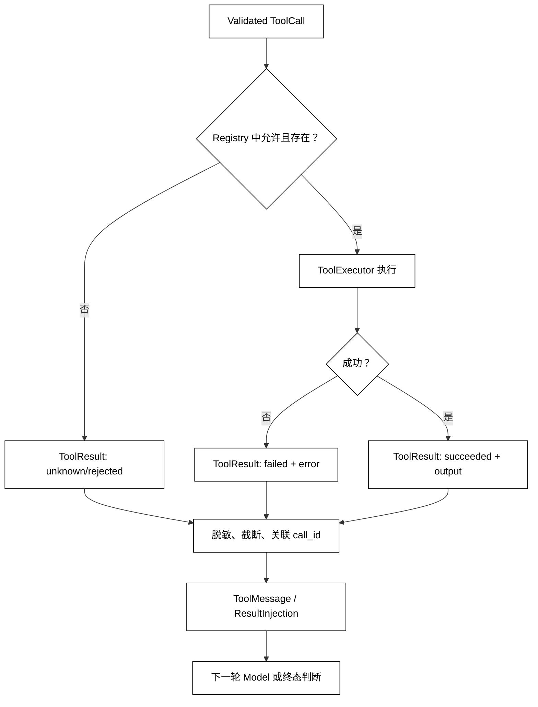

# 工具执行、Tool Result 与消息回填

## 学习目标

- 区分 ToolCall、ToolExecutor、ToolResult 和 ToolMessage 的责任。
- 让一次执行结果带有调用关联、状态、错误分类和可供模型消费的摘要。
- 理解 ResultInjection 如何把事实回填到下一轮 Message，而不是把日志当成上下文。
- 处理未知工具、参数失败、运行时异常和结果过大的边界。

## 前置知识

- 已阅读[参数校验、类型转换与错误反馈](./04-参数校验类型转换与错误反馈)，知道只有通过校验的参数才能进入执行器。
- 已了解第 03 章的 Message、Role、MessageHistory，以及第 02 章的 Observation、ToolResult 和 AgentLoop。
- 本篇只演示本地模拟执行，不访问网络、文件或真实账户。

## 核心知识点

ToolExecutor 负责把已经通过边界检查的调用交给已注册函数；Tool Result 是执行事实的结构化表示；ToolMessage 是把该事实按消息协议关联回原 ToolCall 的载体。白话说，调用是工单，执行器是柜台，结果是回执，消息回填是把回执放回这张工单的上下文。



阅读提示：无论成功还是拒绝都要形成 ToolResult，再决定继续或停止；只有带 call_id 的 ToolMessage 进入下一轮，模型才有可关联的事实。

### ToolExecutor：只调用显式注册的执行器

执行器入口应该接收已验证的领域参数和运行上下文，不应接收原始模型文本。未知名称、撤销能力和权限拒绝必须在调用函数前返回失败结果，不能落到“默认工具”。

### ToolResult：描述执行事实

一个实用的 ToolResult 至少包含 call_id、tool_name、status、output 或 error。status 应区分 succeeded、failed、rejected、timed_out 和 cancelled；“函数没有抛异常”只能说明 Python 调用返回，不能自动说明业务成功。

输出还应有来源和大小策略：外部文本是不可信 Observation，必要时要脱敏、截断并保留摘要；用户能看到的消息和模型能看到的消息可以是不同投影，但不能丢失审计所需的原始关联。

### execute：把异常统一包装为结果

用途：用本地字典模拟两个工具，展示成功、未知名称和执行异常如何产生结构化结果；代码不做真实副作用。

```python
from __future__ import annotations

import json
from dataclasses import asdict, dataclass
from typing import Any, Callable


@dataclass(frozen=True)
class ToolCall:
    call_id: str
    name: str
    arguments: dict[str, Any]


@dataclass(frozen=True)
class ToolResult:
    call_id: str
    tool_name: str
    status: str
    output: Any = None
    error: str | None = None

    def for_message(self) -> str:
        return json.dumps(asdict(self), ensure_ascii=False, sort_keys=True)


def get_status(arguments: dict[str, Any]) -> dict[str, str]:
    if arguments.get("project") != "demo":
        raise ValueError("project is not available")
    return {"build": "green"}


def always_fails(_: dict[str, Any]) -> dict[str, str]:
    raise RuntimeError("simulated provider failure")


EXECUTORS: dict[str, Callable[[dict[str, Any]], Any]] = {
    "get_status": get_status,
    "always_fails": always_fails,
}


def execute(call: ToolCall) -> ToolResult:
    executor = EXECUTORS.get(call.name)
    if executor is None:
        return ToolResult(call.call_id, call.name, "rejected", error="unknown tool")
    try:
        output = executor(call.arguments)
    except Exception as error:
        return ToolResult(call.call_id, call.name, "failed", error=str(error))
    return ToolResult(call.call_id, call.name, "succeeded", output=output)


for call in [
    ToolCall("call_1", "get_status", {"project": "demo"}),
    ToolCall("call_2", "missing", {}),
    ToolCall("call_3", "always_fails", {}),
]:
    result = execute(call)
    print(result.status, result.call_id, result.error or result.output)
# 输出：succeeded call_1 {'build': 'green'}
# 输出：rejected call_2 unknown tool
# 输出：failed call_3 simulated provider failure
```

示例把异常文本限制在模拟错误中。生产环境应避免把堆栈、访问令牌和完整参数直接放进 ToolResult；错误摘要要能帮助 Runtime 分类，也要满足最小披露。

### ResultInjection：按关联 id 回填消息

用途：把 ToolResult 变成带 tool_call_id 的消息，并保持 Assistant tool call 后立即跟随对应结果的顺序。

```python
from dataclasses import dataclass
from typing import Any


@dataclass(frozen=True)
class Result:
    call_id: str
    tool_name: str
    status: str
    content: str


def inject(messages: list[dict[str, Any]], result: Result) -> list[dict[str, Any]]:
    # 关键状态变化：只追加事实结果，不改写已经发生的 Assistant 消息。
    next_messages = [*messages, {
        "role": "tool",
        "tool_call_id": result.call_id,
        "name": result.tool_name,
        "content": result.content,
    }]
    return next_messages


history = [{
    "role": "assistant",
    "tool_calls": [{"id": "call_1", "name": "get_status"}],
}]
updated = inject(history, Result("call_1", "get_status", "succeeded", '{"build":"green"}'))
print(updated[-1])
# 输出：{'role': 'tool', 'tool_call_id': 'call_1', 'name': 'get_status', 'content': '{"build":"green"}'}
```

ResultInjection 不是把结果拼到 system 指令，也不是把用户文本变成可信规则。下一轮 Model 可以读取它作为 Observation，但 Runtime 仍决定哪些字段能进入 Context，以及何时交付最终答案。

### 成功、拒绝、失败和最终答案

ToolResult 的 succeeded 表示执行器返回了一个成功状态，不一定表示 Goal 已完成；rejected 表示动作在副作用前被边界挡住；failed 表示执行过程中出现异常或业务失败。只有 Success Criteria 满足时，Runtime 才能交付 Final Answer。

如果执行器返回“accepted”“queued”或“dry_run”，要把它作为中间状态或等待状态，而不是直接告诉用户“已经完成”。如果结果需要人工确认，应进入 waiting，并保留原始 call_id 和待处理动作。

## 结果回填的安全和容量边界

- **来源**：标记结果来自哪个工具、哪个调用和哪个时间点。
- **大小**：截断或摘要大文本，防止上下文窗口被一个结果占满。
- **敏感性**：过滤凭证、个人数据和内部堆栈；审计存储与模型 Context 可以有不同字段。
- **顺序**：并行结果按 call_id 关联，不能依赖完成先后改变语义。
- **版本**：ToolResult 字段演进时，消息适配器要保留未知状态的可观测性。

## 源码阅读心智模型

### smolagents

从工具执行入口追踪返回值如何被转换成 Agent 可读文本，再确认异常是否被记录为独立状态。若执行器返回值直接字符串化且没有工具名或调用 id，后续并行、重试和审计都会变困难。

### OpenAI Agents SDK

沿 Runner 的工具执行分支查看结果对象和下一次模型输入的构造。重点是工具异常是否让 Run 失败、转成可恢复结果或触发 guardrail，不要把所有异常都归为普通文本。

### LangGraph

工具节点通常把结果写回 State，再由边回到模型节点。检查结果写入前是否完成脱敏和校验，以及 checkpoint 保存的是原始结果、投影结果还是两者的引用。

### DeepSeek Harness

在 Driver、Plugin 和事件总线之间查找 ToolResult 的发布点。确认事件记录与 Model Context 的投影不同，避免为了方便观察而把内部错误和敏感参数送回模型。

## 易混点

- **ToolResult 不是 Final Answer**：工具成功只说明这一动作的状态。
- **日志不是回填**：只有进入消息或 State 的结果才会影响下一轮决策。
- **异常包装不是隐瞒失败**：应保留类别、调用 id 和安全摘要。
- **回填结果不是新指令**：外部工具文本仍可能含有提示注入，必须按不可信数据处理。
- **call_id 不能丢**：没有关联 id，重复、并行和重试结果可能串到错误的调用上。

## 课后小问

1. 未知工具名为什么也要产生 ToolResult？

   **答案**：未知名称是一次可观察的调用拒绝，需要回填原因或进入明确失败终态。

   **解析**：如果静默丢弃，模型可能重复发同一调用，用户也无法知道是能力不存在还是工具执行失败。

2. 工具返回 accepted，为什么不能直接交付“已完成”？

   **答案**：accepted 只表示请求被接受，业务后置状态可能尚未产生。

   **解析**：Runtime 应根据工具协议进入 waiting 或继续观察，直到 Success Criteria 被事实确认。

3. 为什么 ToolMessage 需要 tool_call_id？

   **答案**：它把结果与 Assistant 的某一次 ToolCall 精确关联。

   **解析**：同名工具可以同时调用多次；按工具名或完成顺序回填会造成错误上下文，影响后续决策和审计。

## 本节小结

- ToolExecutor 只调用显式注册且通过前置校验的执行器。
- ToolResult 要区分成功、拒绝、失败、超时和取消，并保留关联 id。
- ResultInjection 将事实以 ToolMessage 回填下一轮，而不是修改旧消息或拼接系统指令。
- 结果要经过来源、容量、敏感信息和顺序处理，成功回执仍不自动等于任务完成。

## 快速回顾

- 看执行入口：是否只按注册表解析？未知名称是否拒绝？
- 看结果对象：是否有 call_id、状态、输出/错误和脱敏策略？
- 看回填位置：结果是否真正进入下一次 Context 或 State？
- 下一篇阅读[多工具并行调用与依赖调用](./06-多工具并行调用与依赖调用)，处理多次 ToolCall 的调度和结果汇合。
