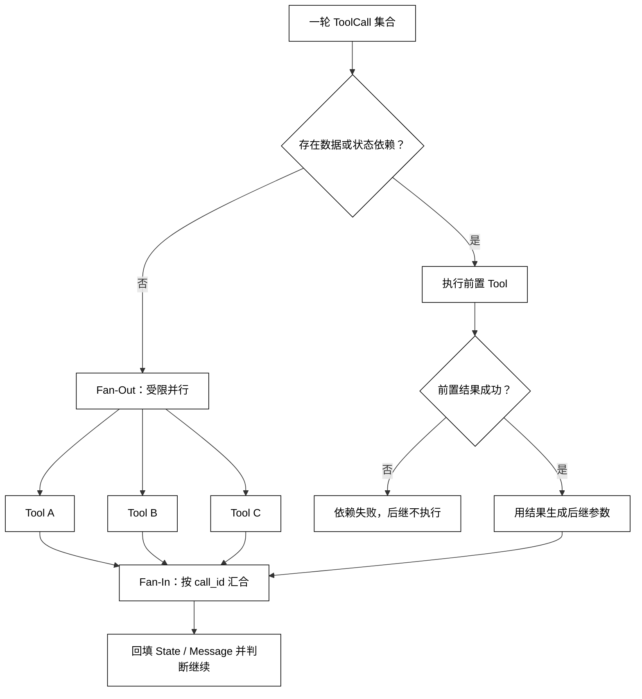

# 多工具并行调用与依赖调用

## 学习目标

- 区分可以并行的独立 ToolCall 与必须串行的 ToolDependency。
- 理解 Fan-Out、Fan-In 如何保持调用关联、结果顺序和部分失败语义。
- 设计并发上限、取消、共享 State 和副作用审批边界。
- 用 Python 标准库模拟本地并行读取和依赖调用，不依赖真实服务。

## 前置知识

- 已阅读[工具执行、Tool Result 与消息回填](./05-工具执行Tool-Result与消息回填)，理解每个调用都要产生可关联的 ToolResult。
- 已了解第 02 章的 State、AsyncRun 和 Cancellation，以及本章的 ToolCall、ToolResult。
- 本篇不把并行等同于自动更快；资源、依赖和副作用必须先满足条件。

## 核心知识点

Parallel Tool 是对多个独立 ToolCall 的调度；ToolDependency 表示一个调用需要另一个调用的输出或状态。Fan-Out 是把一组调用发出去，Fan-In 是收集并按关联信息合并结果。白话说，互不影响的三份查询可以同时问；“先拿订单 id 再查订单详情”必须排队。



阅读提示：并行分支只在互不依赖且策略允许时启动；依赖分支的失败必须阻断后继，不能用空值伪造前置结果。

### ParallelTool：判断独立性而不是看函数名

两个工具是否能并行，取决于它们是否读取/写入同一资源、是否要求前一结果、是否共享不可重入客户端，以及是否需要按顺序审批。两个看起来都是“查询”的工具也可能争用同一个锁或依赖同一会话状态。

只读、不同资源、无顺序要求的调用通常适合并行；写入、扣款、删除、发布等动作默认按依赖图和审批策略串行，除非领域服务提供明确的并发契约。

### ToolDependency：把依赖表达成边

依赖边不仅传递参数，还传递可执行条件和失败语义。前置工具返回 failed、rejected、timed_out 或 partial 时，后继通常应进入 blocked，而不是把缺失字段替换为默认值。

### Fan-Out 与 Fan-In：保持关联和结果顺序

Fan-Out 要受并发上限、队列长度和每工具超时约束；Fan-In 要按 call_id 或声明顺序聚合，不能按哪个线程先完成就改变业务顺序。每个分支的失败可以作为独立 ToolResult，聚合器再决定“部分成功是否足够”。

### run_parallel：标准库模拟独立查询

用途：用 ThreadPoolExecutor 模拟两个独立的只读查询，演示并发上限和按 call_id 排序的 Fan-In；示例不会修改共享外部状态。

```python
from concurrent.futures import ThreadPoolExecutor, as_completed
from dataclasses import dataclass
from time import sleep


@dataclass(frozen=True)
class ToolCall:
    call_id: str
    name: str
    value: str


@dataclass(frozen=True)
class ToolResult:
    call_id: str
    status: str
    output: str


def read_metric(call: ToolCall) -> ToolResult:
    sleep(0.01)
    return ToolResult(call.call_id, "succeeded", f"{call.name}={call.value}")


def run_parallel(calls: list[ToolCall], max_workers: int = 2) -> list[ToolResult]:
    results: list[ToolResult] = []
    with ThreadPoolExecutor(max_workers=max_workers) as pool:
        futures = [pool.submit(read_metric, call) for call in calls]
        for future in as_completed(futures):
            results.append(future.result())
    # 关键输出契约：完成顺序不决定回填顺序。
    return sorted(results, key=lambda result: result.call_id)


calls = [
    ToolCall("call_b", "latency", "120ms"),
    ToolCall("call_a", "build", "green"),
]
for result in run_parallel(calls):
    print(result.call_id, result.output)
# 输出：call_a build=green
# 输出：call_b latency=120ms
```

真实异步执行还要处理 future 异常、取消未开始任务、超时和线程/连接池耗尽。线程池只演示调度，不会自动让不可并行的副作用变安全。

### dependency_run：先决调用失败就阻断

用途：用纯内存函数演示依赖结果传入后继工具，且前置失败时不执行后继。

```python
from dataclasses import dataclass


@dataclass(frozen=True)
class Result:
    name: str
    status: str
    value: str


def lookup_order(customer: str) -> Result:
    if customer != "demo":
        return Result("lookup_order", "failed", "customer not found")
    return Result("lookup_order", "succeeded", "order-7")


def read_order(order_id: str) -> Result:
    return Result("read_order", "succeeded", f"{order_id}: packed")


def run_dependency(customer: str) -> list[Result]:
    first = lookup_order(customer)
    if first.status != "succeeded":
        # 关键状态变化：后继不会用空值或默认 id 制造假结果。
        return [first, Result("read_order", "blocked", "dependency failed")]
    return [first, read_order(first.value)]


for result in run_dependency("missing"):
    print(result.name, result.status, result.value)
# 输出：lookup_order failed customer not found
# 输出：read_order blocked dependency failed
```

### State 与共享写入

并行分支写共享 State 时要先定义所有权：由每个分支写独立键、由 Fan-In 单点合并，或使用带版本/锁的事务更新。直接让多个工具修改同一个可变字典会产生竞态，日志也无法说明哪个结果覆盖了哪个结果。

### 部分失败、取消和资源上限

部分成功不是自动成功。Runtime 应按 Goal 和 Success Criteria 决定是否接受，或要求失败分支重试/人工处理。父 Run 取消时，要记录已完成、运行中、已取消和未开始的分支；不能把未开始误报为失败，也不能保证所有外部调用都能被本地取消。

## 并行副作用的审批与审计

并行读操作通常可以共享一次低风险授权；多个写操作应分别记录工具、资源、参数摘要和审批决定，或者由领域服务提供一个原子批量操作。不能因为“同时执行”就省略逐项权限和幂等键。审批与 Sandbox 的组合见[审批、权限、Sandbox 与危险操作](./08-审批权限Sandbox与危险操作)。

## 源码阅读心智模型

### smolagents

确认 Agent 是否一次只执行一个 ToolCall，还是把多个调用交给并发执行器。若支持并行，追踪结果如何回填、异常是否隔离、最大并发由谁控制。

### OpenAI Agents SDK

阅读 Runner 或工具执行层如何处理同一模型响应中的多个工具项。注意“模型返回多个调用”与“SDK 并发执行”是两件事，要找明确的调度策略和取消语义。

### LangGraph

并行节点可能通过图的分支表达，依赖通过边或状态条件表达。重点看 Fan-In 是否解决同一 State 的写冲突，以及一个节点失败是否传播到整个图。

### DeepSeek Harness

在 Driver、事件系统和 Plugin 执行器中查找任务调度、并发限制和结果聚合。开发预览期尤其要记录事件顺序是否稳定，不要把线程完成顺序当作业务顺序。

## 易混点

- **多个 ToolCall 不等于可以并行**：依赖和共享副作用决定调度。
- **并行完成顺序不等于消息顺序**：回填要按 call_id 或契约顺序。
- **部分成功不等于整体成功**：要由 Success Criteria 定义聚合结果。
- **取消不等于回滚**：本地取消可能无法撤销已经发出的外部请求。
- **Fan-In 不只是 list 拼接**：还要处理失败、重复、顺序、版本和 State 冲突。

## 课后小问

1. 前置工具超时后，后继工具能否使用默认参数继续？

   **答案**：默认不能，后继应进入 blocked 或等待恢复。

   **解析**：默认值可能改变资源对象和副作用语义；只有领域契约明确允许降级时，才可以生成新的、可审计的分支。

2. 为什么 Fan-In 不能按完成先后直接拼结果？

   **答案**：线程完成顺序不稳定，直接拼接会让同一输入产生不同消息顺序。

   **解析**：按 call_id、声明顺序或依赖拓扑排序聚合，才能稳定回放、评测和下一轮模型输入。

3. 并行读操作是否可以跳过每个工具的权限检查？

   **答案**：不能。并行只改变时间调度，不改变每个资源的授权边界。

   **解析**：不同工具可能访问不同租户数据；一次总授权不能替代逐项资源范围检查和审计记录。

## 本节小结

- 独立 ToolCall 才适合 Fan-Out；有数据或顺序依赖的调用必须沿依赖边执行。
- Fan-In 要保持 call_id、顺序、失败状态和 State 写入的一致性。
- 并发上限、取消、部分失败和共享状态所有权是 Runtime 的责任。
- 并行副作用仍要逐项权限、审批、幂等和审计，不能以并发为理由绕过安全边界。

## 快速回顾

- 先画依赖图，再决定并行度。
- 让每个分支返回独立 ToolResult，聚合器负责稳定合并。
- 未开始、已取消、失败和部分成功要分开记录。
- 下一篇阅读[超时、重试、幂等与去重](./07-超时重试幂等与去重)，处理单个调用和并行分支的时间与重复执行风险。
