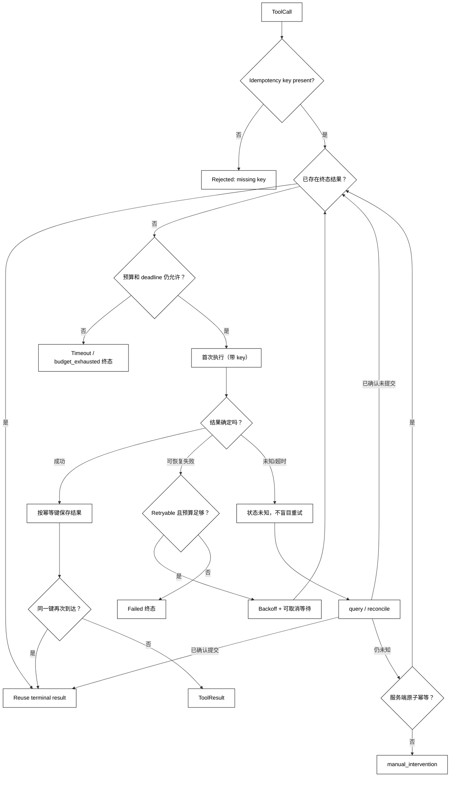

# 超时、重试、幂等与去重

## 学习目标

- 区分单次工具超时、Run 总 deadline 和重试预算。
- 只对可恢复错误进行有限重试，并正确使用退避和取消。
- 解释幂等键如何让“客户端不知道上次是否成功”的重放变得安全。
- 区分同一调用的去重、模型重复生成和业务层重复请求。

## 前置知识

- 已阅读[多工具并行调用与依赖调用](./06-多工具并行调用与依赖调用)，理解分支失败和取消语义。
- 已了解第 02 章的 Timeout、RetryBudget、RunDeadline、Cancellation，以及第 03 章的 Backoff、IdempotencyKey 和 ModelFailure。
- 本篇讨论工具执行的可靠性；模型请求可重试不代表工具副作用天然可重试。

## 核心知识点

工具超时只说明 Runtime 在规定时间内没有得到确定结果，不说明外部操作一定没有发生。重试是再次发起请求，幂等是让相同逻辑操作重复到达时结果不再重复产生副作用，去重是识别并合并重复调用。白话说，电话断线后不能假设对方没收到转账；要用业务编号让对方识别“这是同一笔”。



阅读提示：入口先检查幂等键和已有终态；已有结果直接 Reuse，未见结果才 Execute。只有确认未提交或服务端提供原子幂等时才允许重试，未知状态无法核实时必须进入 `manual_intervention`。

### Timeout：为一次调用和整条运行设界

单次 timeout 限制一个工具等待多久；Run deadline 限制整个 Agent Loop，包括排队、每次尝试、退避和回填。若每次重试都重新获得完整 timeout，整体运行可能超过用户期望，也会挤占资源。

超时处理至少要标记 timed_out、attempt、elapsed 和是否已发出请求。取消本地 future 不一定撤销远端副作用；有取消协议时要等待确认，没有时要进入未知状态。

### RetryBudget：有限的失败恢复

RetryBudget 可以按总次数、总时间、每工具次数和成本控制。可重试通常包括明确的暂时不可用、限流、连接建立失败；参数错误、权限拒绝、未知工具、上下文超限通常不可通过等待修复。

重试决策还要看：

- 失败发生在副作用之前还是之后；
- 服务端是否返回了唯一请求 id 或幂等确认；
- 当前调用是否已经部分写入；
- 用户是否允许等待或降级。

### Backoff：退避不是无限等待

指数退避加随机抖动能减少重试风暴，但必须受总 deadline、最大间隔和取消信号约束。Retry-After 是服务端提示，不是无上限授权；不应让一个工具长期占满整个 Agent Loop。

### Idempotency：相同逻辑操作只产生一次效果

幂等性由业务操作和服务端契约共同提供。幂等键应绑定逻辑操作，例如“为订单 order-7 创建一次发票”，不能每次模型重试都生成新键。幂等键不是认证凭据，也不能替代权限检查。

一次调用的入口顺序应固定为“检查键 → 查询已有终态 → 未命中才执行”。已有终态必须复用原结果，不能因为当前模型又生成了一个 ToolCall 就再造一次副作用。

### Deduplication：识别重复请求

去重可以发生在 Runtime、队列、工具服务或数据库唯一约束层。Runtime 去重能合并尚未发送或已经缓存的调用；服务端去重更重要，因为客户端超时后可能不知道远端是否已处理。去重记录要有 TTL、作用域和冲突策略，避免不同租户碰撞。

### execute_with_retry：本地模拟幂等重试

用途：用内存服务演示“先查询再执行”、确认未提交后的有限重试、未知副作用的 reconcile 和人工接管；代码不访问网络，也不产生真实副作用。

```python
from __future__ import annotations

from dataclasses import dataclass
from time import monotonic, sleep


class TransientToolError(Exception):
    pass


class UnknownSideEffect(Exception):
    pass


@dataclass(frozen=True)
class RetryBudget:
    max_attempts: int
    deadline_seconds: float


class IdempotentService:
    def __init__(self, atomic_idempotency: bool = True) -> None:
        self.results: dict[str, dict[str, object]] = {}
        self.attempts: dict[str, int] = {}
        self.atomic_idempotency = atomic_idempotency

    def query(self, key: str) -> dict[str, object] | None:
        # 关键输入：同一个业务 key 查询服务端已经保存的终态。
        result = self.results.get(key)
        return dict(result) if result is not None else None

    def execute(self, key: str) -> dict[str, object]:
        # 关键副作用边界：服务端仍以 key 作为原子去重边界。
        existing = self.query(key)
        if existing is not None:
            return {"status": "reused", "original": existing}
        attempt = self.attempts.get(key, 0) + 1
        self.attempts[key] = attempt
        if attempt == 1:
            raise TransientToolError("temporary unavailable; confirmed not committed")
        result = {"status": "succeeded", "value": f"created:{key}", "attempt": attempt}
        self.results[key] = result
        return result

    def reconcile(self, key: str) -> dict[str, object] | None:
        # 未知响应先走查询/对账，不能把超时猜成未提交。
        return self.query(key)


class UnknownService(IdempotentService):
    def execute(self, key: str) -> dict[str, object]:
        self.attempts[key] = self.attempts.get(key, 0) + 1
        raise UnknownSideEffect("response lost after request")

    def reconcile(self, key: str) -> dict[str, object] | None:
        return None


def execute_with_retry(
    service: IdempotentService,
    key: str,
    budget: RetryBudget,
) -> dict[str, object]:
    if not key:
        return {"status": "rejected", "reason": "missing_idempotency_key"}
    existing = service.query(key)
    if existing is not None:
        return {"status": "reused", "original": existing}
    started = monotonic()
    for attempt in range(1, budget.max_attempts + 1):
        if monotonic() - started >= budget.deadline_seconds:
            return {"status": "timed_out", "key": key}
        try:
            return service.execute(key)
        except TransientToolError as error:
            if "confirmed not committed" not in str(error):
                return {"status": "manual_intervention", "reason": "commit_state_unknown"}
            if attempt == budget.max_attempts:
                return {"status": "failed", "error": str(error)}
            sleep(0.001)  # 退避示意；生产值还要受总 deadline 和取消约束。
            existing = service.query(key)
            if existing is not None:
                return {"status": "reused", "original": existing}
        except UnknownSideEffect:
            reconciled = service.reconcile(key)
            if reconciled is not None:
                return {"status": "reconciled", "original": reconciled}
            if service.atomic_idempotency and attempt < budget.max_attempts:
                sleep(0.001)
                continue
            return {"status": "manual_intervention", "reason": "unknown_side_effect"}
    return {"status": "failed", "error": "unreachable"}


service = IdempotentService()
budget = RetryBudget(max_attempts=2, deadline_seconds=1.0)
print(execute_with_retry(service, "order-7", budget))
print(execute_with_retry(service, "order-7", budget))
unknown = UnknownService(atomic_idempotency=False)
print(execute_with_retry(unknown, "order-8", budget))
# 输出：{'status': 'succeeded', 'value': 'created:order-7', 'attempt': 2}
# 输出：{'status': 'reused', 'original': {'status': 'succeeded', 'value': 'created:order-7', 'attempt': 2}}
# 输出：{'status': 'manual_intervention', 'reason': 'unknown_side_effect'}
```

第二次从入口查询到已有终态，返回 reused 和原始结果；未知服务无法 reconcile 且没有原子幂等保证，所以返回 manual_intervention，没有盲目再发一次请求。

### 未知状态：不要用盲重试掩盖不确定性

如果请求已发出但客户端超时，重试可能重复扣款、创建任务或发送通知。先 query/reconcile：确认已提交就 Reuse，确认未提交才可以重新 Execute；仍未知时，只有服务端原子幂等才能安全重试，否则必须暂停到 manual_intervention，而不是让模型决定“再试一次”。

## 重试、幂等和消息回填

每次尝试都要记录 attempt、错误分类、等待时长、幂等键摘要和最终状态。ToolResult 回填时应说明“重试后成功”“已去重复用”“状态未知”还是“预算耗尽”，不能只写一个 succeeded/failed 字符串。

模型可能在收到失败后再次生成同一 ToolCall。Runtime 的去重层要用逻辑操作键识别这种重复，而不是只比较模型生成的 call_id；call_id 只关联一次模型消息，不能自动保证业务幂等。

## 源码阅读心智模型

### smolagents

追踪工具执行异常是否由 Agent Loop 直接重试，以及重试预算在哪里保存。重点检查模型重新生成相同调用时是否有工具级幂等策略，而不是只看模型 API 的网络重试。

### OpenAI Agents SDK

区分 Runner 的模型调用重试、工具函数异常传播和应用提供的幂等实现。源码若只按异常类型重试，应进一步检查是否知道副作用已经发生。

### LangGraph

图节点重试和工具内部重试可能叠加，形成乘法式尝试。检查 checkpoint、节点重放和幂等键是否一致，以及超时/取消后状态如何恢复。

### DeepSeek Harness

从 Driver 的 deadline、事件和任务队列入口查重试策略，再看 Plugin 是否拥有自己的重试循环。要确认总预算是否跨越扩展边界传播，避免插件重新获得无限次数。

## 易混点

- **超时不等于未执行**：远端可能已经提交，只是响应丢失。
- **重试不等于恢复**：不可重试错误会被重复放大。
- **幂等不等于去重**：幂等是重复操作效果稳定，去重是识别并复用某次结果；两者可以分层实现。
- **幂等键不等于 call_id**：业务键跨模型重试保持稳定，call_id 通常每次消息都不同。
- **取消不等于回滚**：取消等待不能撤销已发生的外部副作用。

## 课后小问

1. 网络超时后，为什么不能马上重新发起扣款？

   **答案**：超时只说明没有在期限内收到确定响应，扣款可能已经成功。

   **解析**：必须使用幂等键查询或服务端状态查询；缺少去重能力时应暂停，避免把不确定状态升级为重复副作用。

2. 参数错误是否适合指数退避重试？

   **答案**：不适合，参数错误不会因等待而改变。

   **解析**：应反馈字段错误或终止；重试预算应保留给明确的暂时故障，并计入总 deadline。

3. 为什么每次模型重复生成调用都不能生成新幂等键？

   **答案**：新键会让服务把同一逻辑操作当成不同操作，绕过去重。

   **解析**：幂等键应由业务操作标识、租户和资源范围稳定生成，同时避免跨租户碰撞和长期泄露业务信息。

## 本节小结

- Timeout、RetryBudget 和 Run deadline 共同决定一次调用能等待和尝试多久。
- 只对可恢复错误有限重试，退避要可取消且计入总预算。
- 幂等键和服务端去重是处理“超时但状态未知”的关键，不能靠猜测。
- ToolResult 和审计必须记录尝试、等待、复用和最终终态。

## 快速回顾

- 先问“副作用是否可能已经发生”，再决定重试。
- 让同一逻辑操作复用稳定的幂等键，不把 call_id 当业务键。
- 把 succeeded、deduplicated、unknown、timed_out 和 failed 分开。
- 下一篇阅读[审批、权限、Sandbox 与危险操作](./08-审批权限Sandbox与危险操作)，把自动执行前的高风险门控补齐。
