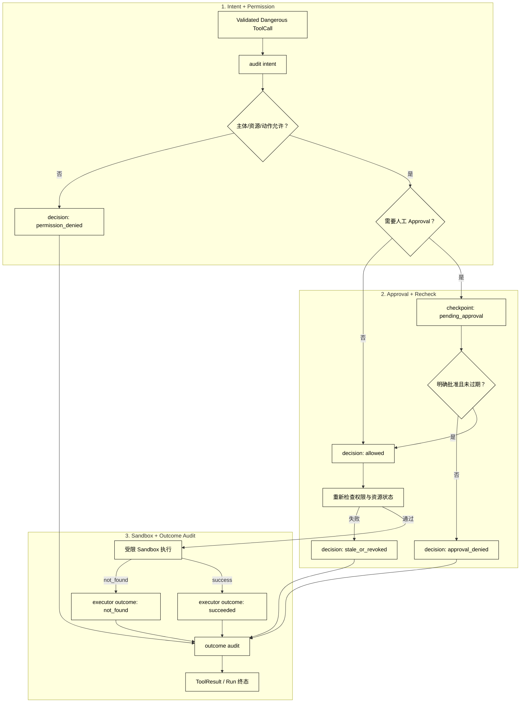

# 审批、权限、Sandbox 与危险操作

## 学习目标

- 区分 Permission（程序授权）、Approval（人工决定）、Sandbox（执行隔离）和 Audit（可追溯记录）。
- 为危险 ToolCall 设计“拒绝、等待、批准后再次检查、执行、审计”的完整路径。
- 理解 Prompt、Schema 和模型置信度为什么不能替代权限与审批。
- 用纯内存 Sandbox 演示危险操作，不接触真实文件、Shell、网络或账户。

## 前置知识

- 已阅读[超时、重试、幂等与去重](./07-超时重试幂等与去重)，理解重试不能绕过权限，也不能掩盖未知副作用。
- 已了解第 02 章的 Guardrails、State、Constraints 和 StopReason，以及本章的 ToolRegistry、ToolCall。
- 本篇只讲工具执行前的安全边界；MCP 授权和生产 Sandbox 将在后续章节展开。

## 核心知识点

Permission 是程序根据主体、资源和动作做的授权判断；Approval 是用户或有权限的审批者对具体动作的明确决定；Sandbox 限制即使执行器出错也能触及的资源；Audit 记录系统为何允许、拒绝或等待。白话说，门禁系统先核对“你有没有资格”，再问“这一次是否同意”，把人带进一个隔离房间，最后留下门禁记录。



阅读提示：图分三阶段：先记录 intent 并判断 Permission，再处理 Approval 和恢复后的 Recheck，最后才进入 Sandbox；每个 decision 都汇入 outcome audit。等待期间权限、资源状态和参数都可能变化，不能拿旧快照直接执行。

### Permission：谁能对哪个资源做什么

Permission 是确定性的程序判定，至少要包含主体、动作、资源、租户和当前状态。工具定义里的 read_only、描述里的“仅查看”和模型消息里的“请安全执行”都不能替代真正的授权检查。

权限拒绝是安全终态，不应让模型通过改写路径、工具名或参数无限试探。若主体可以申请额外权限，应转成明确的 waiting 或人工流程，而不是自动升级。

### Approval：对具体副作用的明确决定

Approval 应绑定具体 ToolCall 或逻辑操作摘要，包括资源、参数范围、风险和过期时间。笼统的“同意本次任务”不应覆盖后来新生成的删除、发送或支付动作。

批准后要重新校验身份、权限、资源版本和幂等键；批准不是永久 token，也不是跳过校验的后门。拒绝、过期、撤回和审批系统不可用都应有不同可观测原因。

### DangerousOperation：按副作用而不是名字分级

危险操作通常包括删除、发布、写入生产、发送外部消息、支付、修改权限和执行任意代码。风险等级要由资源和动作的实际后果决定：一个名为 update 的工具可能比一个名为 read 的工具更危险。

把危险等级放进注册元数据和策略中，才能让 Runtime 在模型选择之前就过滤能力，并在执行前再次检查。不要仅靠工具名称前缀或模型提示判断风险。

### Sandbox：减少执行器的破坏半径

Sandbox 是执行环境约束，不是授权替代。它可以限制可见文件、网络、系统调用、CPU/内存和时间；如果工具本来就不需要文件或网络，最安全的 Sandbox 是根本不给这些能力。

本篇示例只使用内存字典模拟文件，明确不调用 open、unlink、subprocess 或网络库。真实 Sandbox 仍需独立评估逃逸、依赖、主机权限和数据外带风险。

### enforce：危险操作的完整门控

用途：用内存 Sandbox 和结构化 AuditSink 演示权限拒绝、审批拒绝、资源不存在和成功执行；每条路径都写 intent、decision、outcome，示例不会修改真实文件。

```python
from dataclasses import dataclass
from typing import Callable


@dataclass(frozen=True)
class DangerousOperation:
    call_id: str
    subject: str
    action: str
    path: str


class AuditSink:
    def __init__(self) -> None:
        self.events: list[dict[str, str]] = []

    def record(
        self,
        phase: str,
        operation: DangerousOperation,
        status: str,
        reason: str,
    ) -> None:
        # 关键可观测状态：每条路径都保存结构化 intent/decision/outcome。
        self.events.append({
            "phase": phase,
            "call_id": operation.call_id,
            "status": status,
            "reason": reason,
        })

    def has(self, call_id: str, phase: str, reason: str) -> bool:
        return any(
            event["call_id"] == call_id
            and event["phase"] == phase
            and event["reason"] == reason
            for event in self.events
        )


class MemorySandbox:
    def __init__(self, files: dict[str, str]) -> None:
        self.files = dict(files)
        self.executor_calls = 0

    def delete(self, path: str) -> str:
        self.executor_calls += 1
        if path not in self.files:
            raise FileNotFoundError(path)
        del self.files[path]
        return f"deleted:{path}"


def permission_allows(operation: DangerousOperation) -> bool:
    return operation.subject == "operator" and operation.path.startswith("/demo/")


def enforce(
    operation: DangerousOperation,
    sandbox: MemorySandbox,
    approve: Callable[[DangerousOperation], bool],
    audit: AuditSink,
) -> str:
    audit.record("intent", operation, "requested", f"{operation.action}:{operation.path}")
    if not permission_allows(operation):
        audit.record("decision", operation, "denied", "permission_denied")
        audit.record("outcome", operation, "rejected", "permission_denied")
        return "rejected:permission_denied"
    if not approve(operation):
        audit.record("decision", operation, "denied", "approval_denied")
        audit.record("outcome", operation, "rejected", "approval_denied")
        return "rejected:approval_denied"
    # 关键状态变化：批准后重新检查权限，再进入仅含内存文件的 Sandbox。
    if not permission_allows(operation):
        audit.record("decision", operation, "denied", "permission_revoked")
        audit.record("outcome", operation, "rejected", "permission_revoked")
        return "rejected:permission_revoked"
    audit.record("decision", operation, "approved", "permission_granted")
    try:
        result = sandbox.delete(operation.path)
    except FileNotFoundError:
        audit.record("outcome", operation, "failed", "not_found")
        return "failed:not_found"
    audit.record("outcome", operation, "succeeded", result)
    return f"succeeded:{result}"


sandbox = MemorySandbox({"/demo/draft.txt": "local-only"})
audit = AuditSink()
permission_denied = DangerousOperation("call_denied", "guest", "delete", "/demo/draft.txt")
before = sandbox.executor_calls
print(enforce(permission_denied, sandbox, lambda _: True, audit))
assert sandbox.executor_calls == before
assert audit.has("call_denied", "outcome", "permission_denied")

approval_denied = DangerousOperation("call_approval", "operator", "delete", "/demo/draft.txt")
before = sandbox.executor_calls
print(enforce(approval_denied, sandbox, lambda _: False, audit))
assert sandbox.executor_calls == before
assert audit.has("call_approval", "outcome", "approval_denied")

not_found = DangerousOperation("call_missing", "operator", "delete", "/demo/missing.txt")
print(enforce(not_found, sandbox, lambda _: True, audit))
assert audit.has("call_missing", "outcome", "not_found")

success = DangerousOperation("call_success", "operator", "delete", "/demo/draft.txt")
print(enforce(success, sandbox, lambda _: True, audit))
assert audit.has("call_success", "outcome", "deleted:/demo/draft.txt")
print(len(audit.events))
# 输出：rejected:permission_denied
# 输出：rejected:approval_denied
# 输出：failed:not_found
# 输出：succeeded:deleted:/demo/draft.txt
# 输出：12
```

即使示例批准了删除，副作用也只发生在 MemorySandbox 的字典中；这不是对真实文件删除的安全保证。生产系统应把审批、权限、Sandbox 和审计接到独立可验证的组件。

### Audit：记录决定和结果

审计记录要能回答：谁发起、哪个 Run/ToolCall、针对什么资源、检查了哪些策略、谁批准、何时执行、结果是什么、是否重试或去重。参数和输出应按敏感级别脱敏，不能为了“完整”把凭证和全部个人数据写入日志。

审计不是事后打印一行字符串。高风险操作应在决定前写入 intent，在批准后写入 decision，在执行后写入 outcome；写审计失败时要有明确的 fail-closed 或人工处理策略。

## 失败终态和恢复

| 状态 | 是否产生副作用 | 恢复方向 |
| --- | --- | --- |
| permission_denied | 否 | 请求有权限的主体或修改目标 |
| pending_approval | 否（应冻结调用） | 收到同一操作的批准/拒绝/过期 |
| approval_denied/expired | 否 | 新审批必须生成新的决定 |
| stale_or_revoked | 否 | 重新读取资源和权限，再创建新调用 |
| sandbox_failed | 不确定 | 保留审计，按工具契约处理未知状态 |
| succeeded | 是或已确认 | 回填结果并继续/结束 |

不要把拒绝反馈改写成“工具不可用”而丢掉安全原因；用户需要知道下一步是补充授权、等待审批还是更换目标。

## 源码阅读心智模型

### smolagents

查找工具执行前是否存在独立的权限/确认钩子，以及代码执行工具使用了什么隔离。若只有 Prompt 里的“请谨慎操作”而没有程序门控，应视为未完成的安全边界。

### OpenAI Agents SDK

沿 guardrail、工具函数和 Runner 的中断/继续路径阅读。区分 guardrail 的拒绝信号与真实系统 Permission/Approval；SDK 能暂停流程不代表它自动知道业务授权。

### LangGraph

审批可以表示为 interrupt 和 checkpoint，但节点恢复后仍要重新校验资源和权限。阅读时确认 pending state 不会被误当成已批准，也确认重放不会重复危险副作用。

### DeepSeek Harness

重点追踪 Hook、Plugin 和 Driver 如何拦截工具调用、发布审批事件和恢复 Run。开发预览中的审批字段可能变化，应优先记录 fail-closed、审计和资源重检的责任边界。

## 易混点

- **Permission 不是 Approval**：有权限不代表这一次已经获批，获批也不应扩大永久权限。
- **Approval 不是身份认证**：批准者身份和审批范围要单独验证。
- **Sandbox 不是授权**：隔离环境减少破坏半径，不能让越权请求合法。
- **Prompt 不是安全控制**：提示可能被模型误解或被注入内容影响。
- **Audit 不是阻断器**：日志记录不能替代执行前的拒绝与等待。
- **批准后不能沿用旧快照**：权限、资源版本和参数必须重新检查。

## 课后小问

1. 为什么审批通过后还要重新检查权限？

   **答案**：审批等待期间主体、资源状态、租户策略或调用参数可能已经变化。

   **解析**：审批是针对当时的具体操作决定；重新检查可以防止撤权、资源替换和过期参数穿过执行边界。

2. Sandbox 是否可以替代 Permission？

   **答案**：不能。Sandbox 限制执行器能触及的环境，Permission 判断请求主体是否有权做这件事。

   **解析**：被授权主体也需要隔离执行；未授权请求也不能因为在 Sandbox 内就被允许。

3. 为什么拒绝也要写 Audit？

   **答案**：拒绝路径需要可解释、可追踪，并能发现反复越权或策略配置错误。

   **解析**：只记录成功会隐藏攻击探测、用户误操作和权限回归，无法复盘模型为何不断提出危险调用。

## 本节小结

- Permission、Approval、Sandbox 和 Audit 分别负责授权、人工决定、执行隔离和可追溯性。
- 危险 ToolCall 应沿“权限 → 审批 → 重新检查 → Sandbox → 审计”的路径运行。
- 拒绝、等待、过期、撤权和未知状态是不同终态，不能统一成成功或普通错误。
- 示例中的内存 Sandbox 只用于教学，不能被误读为真实系统安全保证。

## 快速回顾

- 先问谁有权，再问这次是否获批，最后限制执行环境。
- 审批绑定具体调用和资源；恢复时重新检查，不用旧授权快照。
- 任何拒绝和等待都要产生可观测 Audit 和可恢复/不可恢复原因。
- 下一篇阅读[完整可观测 Agent Loop](./09-完整可观测Agent-Loop)，把工具决策、执行、审批、重试和终态串成一条可回放轨迹。
