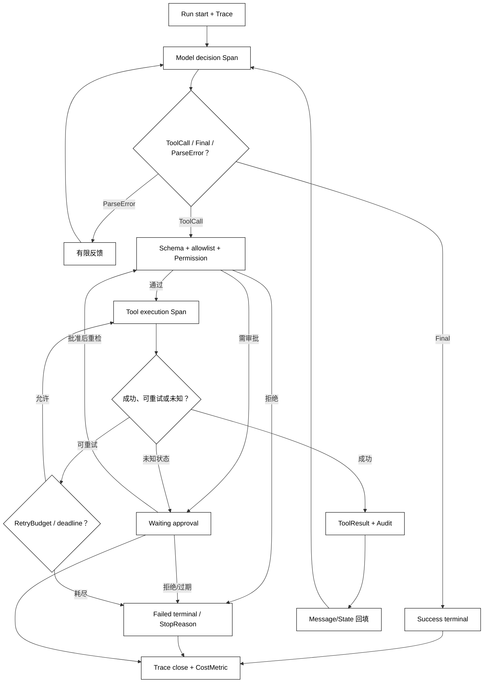

# 完整可观测 Agent Loop

## 学习目标

- 把模型决策、工具校验、审批、执行、重试、回填和停止原因串成一条可回放轨迹。
- 区分 Trace、Span、RunLog 和 CostMetric 的粒度与责任。
- 设计成功、失败、等待审批、超时、取消和预算耗尽的明确终态。
- 用一个无网络、无密钥的 Python 模拟运行展示如何从失败轨迹回到测试用例。

## 前置知识

- 已完成本章前八篇，理解 ToolCall、ToolResult、RetryBudget、Approval、Permission、Sandbox 和 Audit。
- 已了解第 02 章的 AgentLoop、StopReason、Run、State，以及第 03 章的 Usage 和 EventStream。
- 本篇把前面抽象组合起来，不新增任何真实供应商 API。

## 核心知识点

可观测 Agent Loop 不只是“多打几行日志”。它要为每个决策和副作用建立稳定关联，让人能回答：模型看到了什么、提出了什么、Runtime 拒绝了什么、工具实际做了什么、为何重试、是否审批、最终为何停止。Trace 是一次 Run 的轨迹，Span 是其中一个有开始/结束的操作，RunLog 是可检索事件记录，CostMetric 是用量、延迟、重试和费用等指标。



阅读提示：每条边都要有终态语义和关联事件；尤其是审批等待、重试预算耗尽和未知副作用状态，不能被压缩成普通“继续”。

### Trace：一次 Run 的关联容器

Trace 通常绑定 run_id、subject、目标摘要、开始/结束时间和终态。它不应保存未经脱敏的所有 Prompt 或凭证；完整输入可按安全策略引用到受控存储，模型 Context 与审计视图可以不同。

### Span：一个有边界的操作

Span 适合表示一次模型请求、参数校验、审批等待、工具尝试、回填和人工接管。每个 Span 要有开始、结束、状态、父子关系和可检索属性；重试可以是同一工具 Span 的子 Span，也可以按系统的统计口径单独计数，但要固定口径。

### RunLog：事件比自然语言日志更可回放

RunLog 应记录事件类型、时间、trace_id、step、call_id、状态和安全摘要，例如 tool_call_proposed、validation_rejected、approval_requested、tool_retry、tool_result、run_failed。事件字段要有版本，未知事件不可静默丢弃。

### CostMetric：用量和资源预算

CostMetric 可以包括模型调用次数、输入/输出 Token、工具尝试次数、等待时长、并发峰值和估算费用。估算不是账单事实，尤其是本地模拟和供应商计费规则不同；指标要标明来源和计算口径。

### ObservableLoop：本地完整模拟

用途：用脚本模型、一次可重试的本地工具和 Trace 记录展示“模型 → ToolCall → 重试 → ToolResult → 回填 → Final”的成功路径；它不访问网络，也不执行危险操作。

```python
from dataclasses import dataclass, field
from typing import Any


class RetryableError(Exception):
    pass


@dataclass
class Trace:
    trace_id: str
    events: list[str] = field(default_factory=list)
    model_calls: int = 0
    tool_attempts: int = 0

    def record(self, event: str) -> None:
        self.events.append(event)

    def summary(self, status: str, stop_reason: str) -> dict[str, Any]:
        return {
            "trace_id": self.trace_id,
            "status": status,
            "stop_reason": stop_reason,
            "events": self.events,
            "cost_metric": {
                "model_calls": self.model_calls,
                "tool_attempts": self.tool_attempts,
                "estimated_tokens": self.model_calls * 10,
            },
        }


class ScriptedModel:
    def __init__(self) -> None:
        self.turn = 0

    def generate(self, _: list[dict[str, Any]]) -> dict[str, Any]:
        self.turn += 1
        if self.turn == 1:
            return {
                "kind": "tool_call",
                "call_id": "call_1",
                "name": "get_status",
                "arguments": {"project": "demo"},
            }
        return {"kind": "final", "text": "build is green"}


class LocalStatusTool:
    def __init__(self) -> None:
        self.attempts = 0

    def run(self, arguments: dict[str, Any]) -> dict[str, str]:
        self.attempts += 1
        if self.attempts == 1:
            raise RetryableError("temporary read failure")
        return {"status": "green", "project": arguments["project"]}


def run_agent(model: ScriptedModel, tool: LocalStatusTool, max_steps: int = 3) -> dict[str, Any]:
    trace = Trace("run-demo")
    trace.record("run_started")
    messages: list[dict[str, Any]] = [{"role": "user", "content": "检查 demo"}]

    for _ in range(max_steps):
        trace.model_calls += 1
        trace.record("model_requested")
        decision = model.generate(messages)
        if decision["kind"] == "final":
            trace.record("model_final")
            trace.record("run_completed")
            return trace.summary("completed", "success")
        if decision.get("name") != "get_status":
            trace.record("validation_rejected")
            trace.record("run_failed")
            return trace.summary("failed", "unknown_tool")

        result: dict[str, str] | None = None
        for attempt in range(2):
            trace.tool_attempts += 1
            trace.record("tool_started")
            try:
                result = tool.run(decision["arguments"])
                trace.record("tool_succeeded")
                break
            except RetryableError:
                trace.record("tool_retry")
        if result is None:
            trace.record("run_failed")
            return trace.summary("failed", "retry_budget_exhausted")

        # 关键状态变化：真实 ToolResult 先回填，模型下一轮才可形成最终答案。
        messages.append({
            "role": "tool",
            "tool_call_id": decision["call_id"],
            "content": result,
        })
        trace.record("tool_result_backfilled")

    trace.record("run_failed")
    return trace.summary("failed", "max_steps")


print(run_agent(ScriptedModel(), LocalStatusTool()))
# 输出：{'trace_id': 'run-demo', 'status': 'completed', 'stop_reason': 'success', 'events': ['run_started', 'model_requested', 'tool_started', 'tool_retry', 'tool_started', 'tool_succeeded', 'tool_result_backfilled', 'model_requested', 'model_final', 'run_completed'], 'cost_metric': {'model_calls': 2, 'tool_attempts': 2, 'estimated_tokens': 20}}
```

示例中的 estimated_tokens 是固定的测试指标，不是任何供应商账单；真实系统应从 ModelResponse 或 Usage 事件读取实际口径。若模型返回危险 ToolCall，循环应在 validation/approval 分支终止或等待，而不能沿成功脚本继续。

### StopReason：终态必须可分类

至少区分 success、unknown_tool、validation_error、permission_denied、approval_denied、approval_expired、tool_failed、retry_budget_exhausted、timeout、cancelled、max_steps 和 unknown_side_effect。终态分类决定用户反馈、是否可恢复、评测断言和告警路由。

### 失败轨迹到回归测试

从一次失败 Trace 提炼测试用例时，保留最小输入、模型候选、allowlist、参数错误、审批决定、每次尝试和最终 StopReason。不要只复制最终异常字符串；需要断言关键边界没有被跳过，例如 permission_denied 后工具函数调用次数必须为零。

### 审批与重试的可观测关系

审批等待应有独立 Span 和过期时间，恢复后重新创建校验事件。重试应记录错误分类、attempt、backoff、幂等键摘要和结果复用；如果状态未知，Trace 应进入 waiting 或 manual_intervention，而不是记录为普通可重试失败。

## 源码阅读心智模型

### smolagents

先找到 Agent 的主循环和终态，再把模型调用、工具执行和异常包装映射到 Span。检查日志是否能回答“哪一个工具调用导致终止”，以及脚本/代码执行是否有独立安全事件。

### OpenAI Agents SDK

沿 Runner、工具、handoff、guardrail 和 tracing 的关系阅读。重点是一次 Run 的 span 父子层级、工具重试口径和最终输出如何与错误/等待状态区分。

### LangGraph

把每个节点和边视为可观测的状态转换，检查 checkpoint、interrupt 和重放事件能否重建 ToolCall 与审批决定。图成功结束不等于每个节点的业务副作用已确认。

### DeepSeek Harness

优先定位 Driver 的 Run 生命周期、事件总线、Plugin/Hook 的 span 注入和 Session 关联。预览期内部事件字段可能改变，应关注 trace 关联、错误传播和审计边界。

## 易混点

- **有日志不等于可观测**：缺少 trace_id、call_id、状态和顺序就无法回放。
- **Span 不等于重试次数**：一个操作可以有多个尝试，统计口径要显式。
- **成功终态不等于所有副作用已确认**：accepted、unknown 和 waiting 要单独分类。
- **CostMetric 不等于账单**：模拟值和估算值必须标注来源。
- **Trace 不应保存所有秘密**：可观测性也需要脱敏、访问控制和保留期限。

## 课后小问

1. 为什么需要同时记录 model_requested 和 tool_started？

   **答案**：前者表示模型提出/请求了什么，后者表示 Runtime 确实进入了工具执行边界。

   **解析**：如果只有模型事件，无法证明副作用发生；如果只有工具事件，无法复盘为何选中该工具。二者之间的校验、审批和拒绝事件也要可见。

2. 审批被拒绝时，Trace 应该怎样结束？

   **答案**：记录 approval_requested、approval_denied 和明确 StopReason，工具执行次数为零或保持在副作用前。

   **解析**：拒绝不是普通工具失败，也不应自动重试；用户需要知道是无权限、审批拒绝还是审批过期。

3. 如何从“重试三次后失败”判断是否可以继续重试？

   **答案**：检查错误分类、总 deadline、RetryBudget、幂等/未知状态和用户策略，而不是只看次数。

   **解析**：可恢复网络错误和参数错误的处理不同；副作用已发出但响应未知时，继续重试可能造成重复操作。

## 本节小结

- 完整可观测 Loop 把决策、校验、审批、执行、重试、回填和终态放进同一条关联轨迹。
- Trace、Span、RunLog 和 CostMetric 分别解决 Run 关联、操作边界、事件回放和资源统计。
- StopReason 必须区分成功、拒绝、等待、超时、取消、预算耗尽和未知副作用。
- 失败 Trace 应能被压缩成可重复的回归测试，而不是只留下自然语言日志。

## 快速回顾

- 先画事件顺序，再看每个失败边界是否有终态。
- 记录 trace_id、run_id、step、call_id、attempt 和安全摘要。
- 审批恢复后重检；重试遵守预算和幂等；未知状态进入等待或人工接管。
- 下一章阅读[State 与 Context](/courses/agent/05-状态上下文会话与记忆/01-State与Context)，把本章产生的 ToolResult、Trace 和运行状态放进可持久化上下文。
