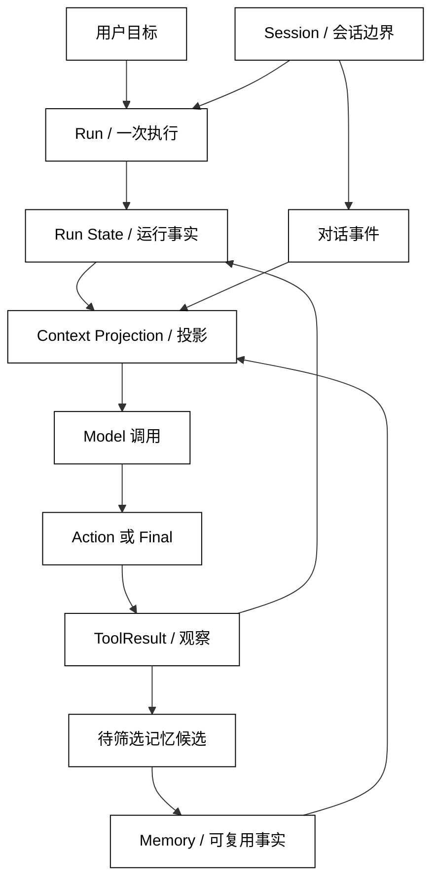

# State、Context、Session 与 Memory 的边界

## 学习目标

- 用同一条数据流区分 State、Context、Session 和 Memory，而不是把它们都叫“上下文”。
- 能指出每类数据的所有者、生命周期、可见范围和持久化策略。
- 读源码时先找状态写入、上下文投影和会话挂载点，再看类名或 SDK API。

## 前置知识

- 已阅读第02–04章，理解 Run、Message、ToolCall、ToolResult、Trace 和幂等边界。
- 已知道 Context Window 是一次模型调用的容量边界；本文不重复讲 Python 基础。

## 四个词先分工

### State：运行时拥有的事实

State 是系统为了继续执行、暂停、恢复或解释一次运行而持有的事实集合。它可以包括目标、当前阶段、已确认的 ToolResult、待审批动作、版本号和停止原因。白话说，State 是“系统自己记在账本里的当前进度”，不是模型刚刚看到的那段文字。

State 的关键属性是所有权：谁有权写入，谁负责校验，谁在恢复时读取。模型和工具可以提出结果或事件，但不应直接把任意字段改成 completed；运行时要把事实转换成合法状态转移。

### Context：一次调用看到的视图

Context 是某一次 Model 调用实际收到的输入。它通常由 Goal、Instructions、State 的投影、最近消息、工具结果和经过授权的 Memory 组成。白话说，Context 是“这一次把哪些账本内容递给模型看”。

同一个 State 可以投影出多份 Context：模型需要任务相关事实，审批界面可能需要完整参数，审计系统需要事件而不是提示词。Context 可以被裁剪、脱敏或摘要，而 State 仍应保留恢复所需的事实。

### Session：跨 Run 的容器

Session 表示一段可被多个 Run 挂载的交互范围，常带有 session_id、租户、用户、生命周期和并发策略。白话说，Session 是“这位用户在这个工作空间的一本会话账簿”，它可以跨越几次 Run，但不等于任何一次 Run 的状态。

Session 的所有权通常落在会话服务或持久化层。一个 Run 可以在 Session 中追加对话事件；另一个 Run 是否能读取这些事件，必须经过租户、用户、项目和权限检查。

### Memory：有意保留的可复用事实

Memory 是从运行或会话中筛选、标注来源和保留期限后，允许未来检索的事实。白话说，Memory 是“从账簿里挑出来、以后值得再查的卡片”，不是把所有历史永久保存。

Memory 需要 scope、provenance、confidence、版本和删除语义。把“用户说过一句话”直接写成跨租户的长期事实，会把对话记录、会话状态和长期记忆混为一谈。

### 对象关系：保存、投影和复用

可以用四个问题判断一个字段应该放在哪里：

| 问题 | 主要对象 | 白话解释 |
| --- | --- | --- |
| 这次运行要继续到哪一步？ | Run State | 当前执行进度和控制事实 |
| 这次模型调用需要看到什么？ | Context | 给模型的最小输入视图 |
| 哪些 Run 属于同一段交互？ | Session | 跨 Run 的挂载和隔离边界 |
| 哪个事实值得未来检索？ | Memory | 有来源、有范围、有保留策略的知识卡片 |



阅读提示：图中从 State 到 Context 是“选择和投影”，不是复制；从 Observation 到 Memory 还隔着筛选、权限和保留策略。任何一步缺少所有者，恢复时都会出现“看见了但不能信”或“保存了却不该暴露”的问题。

## 最小责任边界

### Runtime 和 StateStore

Runtime 控制 Run 的顺序、状态转移和停止判断；StateStore 负责按版本保存和读取状态。二者可以由一个类实现，也可以拆开，但写入必须有清晰入口。工具返回成功不等于 Run 已完成，只有 Runtime 根据 Success Criteria 应用事件后才可完成。

### ContextBuilder

ContextBuilder 根据当前 Run、Session、允许的 Memory 和预算构造一次输入。它应说明每个字段的来源、优先级、敏感级别和缺失语义，不应在构造 Context 时偷偷执行副作用操作。

### SessionStore 与 MemoryStore

SessionStore 维护会话生命周期和挂载关系；MemoryStore 维护经过筛选的长期事实。Session 可以保存原始对话事件，但 MemoryStore 不应默认收取全部消息。两者的删除、保留和访问审计也不同。

## 本地模拟：把四种对象串成一次投影

用途：下面的标准库示例用不可变 Memory、可变 RunState 和显式 Session 组装 Context；它只读内存，不访问网络或文件，用来观察“保存的事实”和“模型看到的视图”如何分离。

```python
from __future__ import annotations

from dataclasses import dataclass, field


@dataclass(frozen=True)
class MemoryItem:
    key: str
    value: str
    scope: str
    source: str


@dataclass
class Session:
    session_id: str
    user_id: str
    history: list[str] = field(default_factory=list)


@dataclass
class RunState:
    run_id: str
    goal: str
    phase: str = "planning"
    facts: list[str] = field(default_factory=list)


def build_context(
    session: Session,
    run: RunState,
    memories: list[MemoryItem],
) -> dict[str, object]:
    allowed = [
        item.value
        for item in memories
        if item.scope == "user:" + session.user_id
    ]
    return {
        "goal": run.goal,
        "phase": run.phase,
        "facts": tuple(run.facts),
        "recent_history": tuple(session.history[-2:]),
        "memory": tuple(allowed),
    }


session = Session("sess-1", "alice", ["查构建状态", "构建为 green"])
run = RunState("run-1", "生成项目报告", facts=["build=green"])
memories = [
    MemoryItem("m-1", "偏好中文报告", "user:alice", "explicit_preference"),
    MemoryItem("m-2", "Bob 的项目", "user:bob", "other_user"),
]

context = build_context(session, run, memories)
print(context)
print("state facts:", run.facts)
print("memory count:", len(context["memory"]))
# 输出：{'goal': '生成项目报告', 'phase': 'planning', 'facts': ('build=green',), 'recent_history': ('查构建状态', '构建为 green'), 'memory': ('偏好中文报告',)}
# 输出：state facts: ['build=green']
# 输出：memory count: 1
```

这里的 run.facts 仍是运行时持有的列表；Context 只拿到元组和经过 scope 过滤的 Memory。若模型返回“把 phase 改成 completed”，那仍是候选动作，必须回到 Runtime 的状态转移边界。

## 源码阅读心智模型

### smolagents

把 Agent 的执行循环看成 Runtime，把工具返回和循环变量看成 Run State，把传给模型的消息和工具描述看成 Context 投影。源码阅读先追踪“工具结果在哪里回填、下一轮输入在哪里生成”，不要把工具对象本身当成 Session 或 Memory。

### OpenAI Agents SDK

重点找 Runner 的运行容器、RunContext 一类的运行期输入和 Session/Tracing 的持久化接缝。先区分“本次 Run 可用的依赖”与“跨 Run 保存的对话/事实”，再阅读具体的会话服务实现。

### LangGraph

将图的 State 看成显式状态账本，将节点返回的更新看成候选事件，将 checkpointer 保存的数据看成恢复边界。图节点构造给模型的消息仍是 Context，不等于整个图 State。

### DeepSeek Harness

可把 Session、Driver、事件和插件上下文分别映射到会话容器、Runtime、State 事件和 Context 扩展。阅读时追踪一次事件如何关联 session、run 和工具结果，再判断哪些数据会跨 Run 保留。

## 易混点

- **State 不是 Context**：State 是运行时拥有的事实，Context 是单次调用的输入投影。
- **Session 不是长期 Memory**：Session 规定交互和隔离范围，Memory 只保存被筛选的可复用事实。
- **对话历史不是自动记忆**：原始历史可以用于回放，但只有经过来源、权限和保留检查才应进入长期 Memory。
- **Model 输出不是状态写入**：模型提出 Action，Runtime 校验并应用合法状态转移。
- **持久化不等于可见**：保存的数据还要经过 ContextBuilder 的权限、脱敏和预算选择。

## 课后小问

1. 为什么同一个 State 需要构造成不同的 Context？

   **答案**：不同调用者有不同权限、目标和容量预算。

   **解析**：模型只需要完成任务的最小事实；审批者可能需要完整参数；审计者需要事件顺序。若无投影层，最容易出现敏感数据泄露和上下文超限。

2. 用户在 Session 中说“以后都用中文”，是否应立即成为长期 Memory？

   **答案**：不应无条件立即写入，应确认范围、来源和保留策略。

   **解析**：它可能只是当前请求的临时指令，也可能是用户明确偏好。写入 Memory 前要区分意图并记录 provenance；进入 Context 前还要做 scope 检查。

3. 工具返回成功后，谁决定 Run 是否完成？

   **答案**：Runtime 根据目标和成功条件应用状态转移。

   **解析**：工具只证明一次外部操作的结果。是否满足 Goal、是否还需回填和是否存在待审批动作，属于运行时控制平面。

## 本节小结

- State、Context、Session、Memory 分别承担运行事实、单次输入视图、跨 Run 容器和可复用事实四种责任。
- 数据流是 Goal → Run State/Session → Context 投影 → Model → Action/Observation，再由 Runtime 决定是否更新 State 或筛选 Memory。
- 所有对象都必须有 owner、scope、生命周期和审计语义；保存数据不代表模型可以看到。
- 源码阅读应沿着“谁写状态、谁构造输入、谁挂载会话、谁筛选记忆”四条线追踪。

## 快速回顾

- 能用一句白话解释 State、Context、Session、Memory 的差别。
- 能画出 Observation 回到 State、候选事实进入 Memory 的两条不同路径。
- 能指出 ContextBuilder、StateStore、SessionStore、MemoryStore 的责任边界。
- 下一篇阅读 [Run State 与状态所有权](./02-Session生命周期)，把“谁能写当前进度”具体化。
