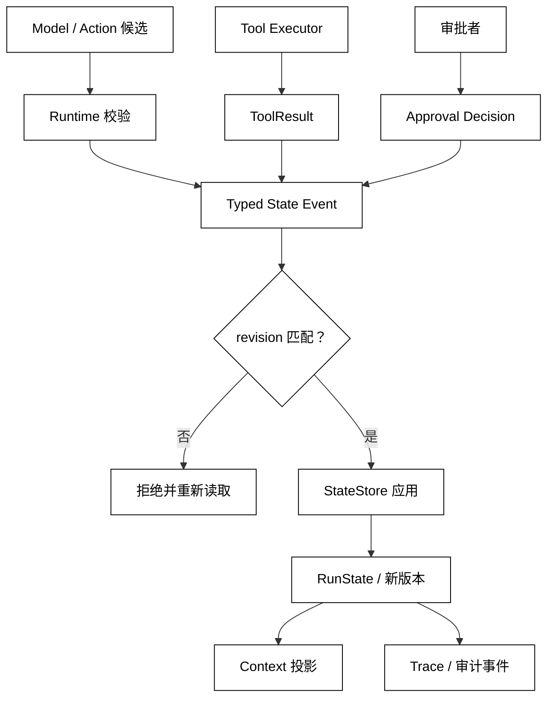

# Run State 与状态所有权

## 学习目标

- 把 Run State 看成可恢复的事实和控制面，而不是模型输出或日志拼接。
- 能为状态字段指定唯一写入者、合法事件和并发版本。
- 读源码时区分“提出更新”的组件与“应用更新”的运行时。

## 前置知识

- 已阅读 [State、Context、Session 与 Memory 的边界](./01-State与Context)。
- 已理解第02章的 Run、Turn、Step、RunStatus，以及第04章的 ToolResult 和幂等边界。

## Run State 保存什么

### 状态是事实，不是意图

Run State 应保存继续一次运行所需的最小事实，例如 run_id、goal、status、当前 step、已确认的观察、待处理 Action、版本和 stop_reason。模型说“我准备调用工具”是意图；工具真的返回结果并被 Runtime 接受，才是可以写入 State 的事实。

白话说，Run State 是“这趟工作已经发生了什么、现在卡在哪里”的工作账本。它不是全部 Prompt，也不是为了审计而追加的完整 Trace；Trace 可以保留更多事件，State 只保留恢复和控制需要的投影。

### 状态所有权

StateOwnership 指定谁能创建、读取、更新和关闭一类状态。典型边界如下：

| 数据或动作 | 提议者 | 最终写入者 | 需要检查 |
| --- | --- | --- | --- |
| 模型候选 Action | Model | Runtime | schema、工具白名单、权限 |
| ToolResult | Tool Executor | Runtime/StateStore | call_id、幂等键、执行状态 |
| RunStatus | Runtime | StateStore | 合法状态转移和停止原因 |
| 审批决定 | 用户或审批服务 | Runtime | 身份、过期时间、checkpoint 版本 |
| 诊断事件 | 各组件 | Trace/EventStore | 顺序、脱敏和关联 ID |

“最终写入者”不是说它一定是唯一进程，而是说所有写入都必须经过同一套契约。让某个工具直接修改 RunStatus，等于绕过运行时的成功条件和失败边界。

### 状态来源和可解释性

每个字段都应能回答三个问题：来源是什么、何时被接受、能否在恢复时重新验证。例如 facts 中的 build=green 应带有 tool call 关联；手写的 summary 不应冒充工具事实；从旧版本恢复时要知道它来自哪一个 checkpoint。

## 从候选事件到状态

Runtime 可以把组件输出统一成事件，再按版本应用到 Run State。事件不是“日志字符串”，而是带有类型、来源、版本、时间和安全摘要的状态变更提议。StateStore 接受事件后递增 revision；ContextBuilder 只读取已提交的 State。



阅读提示：模型、工具和审批者都可能产生“更新提议”，但只有 Runtime/StateStore 能把它变成新的 Run State。revision 是并发护栏，不是业务状态本身。

## 合法状态转移

### RunStatus 的写入规则

一个最小状态集可以是 queued、running、waiting、completed、failed、cancelled。状态转移还要带原因：waiting 需要 pending_approval 或 external_callback，failed 需要 tool_error 或 timeout，completed 需要 Success Criteria 已满足。

不要因为收到一段文本就把 status 设为 completed；也不要在重试时清掉原始错误。状态机应保留足够的历史引用，让用户能区分“没有执行”“执行失败”和“执行结果未知”。

### State、Trace 和 Context 的边界

StateStore 的快照适合恢复，Trace/EventStore 适合回放和审计，ContextBuilder 适合按预算构造模型输入。三者可以共享底层数据库，但读写接口和保留策略不同。把 Trace 全量拼进 Context 会浪费预算，把 Context 当唯一 State 又无法解释被裁剪的信息。

## 本地模拟：只有 Runtime 能应用更新

用途：下面的标准库示例用事件和 revision 模拟一个最小 StateStore；模型和工具只能返回提议，Runtime 负责校验、应用和生成下一版状态。示例全程在内存中运行。

```python
from __future__ import annotations

from dataclasses import dataclass, field


@dataclass
class RunState:
    run_id: str
    status: str = "queued"
    revision: int = 0
    facts: list[str] = field(default_factory=list)
    stop_reason: str | None = None


@dataclass(frozen=True)
class StateEvent:
    kind: str
    source: str
    value: str
    expected_revision: int


class StateStore:
    def __init__(self, state: RunState) -> None:
        self.state = state

    def apply(self, event: StateEvent) -> RunState:
        if event.expected_revision != self.state.revision:
            raise RuntimeError("revision conflict")
        if event.kind == "run_started":
            if self.state.status != "queued":
                raise ValueError("run cannot start from " + self.state.status)
            self.state.status = "running"
        elif event.kind == "tool_result":
            if self.state.status != "running":
                raise ValueError("tool result requires running state")
            self.state.facts.append(event.value)
        elif event.kind == "run_completed":
            if "build=green" not in self.state.facts:
                raise ValueError("success criterion is not met")
            self.state.status = "completed"
            self.state.stop_reason = "goal_reached"
        else:
            raise ValueError("unknown event: " + event.kind)
        self.state.revision += 1
        return self.state


state = RunState("run-7")
store = StateStore(state)
store.apply(StateEvent("run_started", "runtime", "", 0))
tool_proposal = StateEvent("tool_result", "tool:get_status", "build=green", 1)
store.apply(tool_proposal)
store.apply(StateEvent("run_completed", "runtime", "", 2))
print(state.status, state.revision, state.facts)
try:
    store.apply(StateEvent("run_completed", "model", "", 1))
except (RuntimeError, ValueError) as error:
    print(type(error).__name__, str(error))
# 输出：completed 3 ['build=green']
# 输出：RuntimeError revision conflict
```

工具只提供了 tool_proposal；它没有直接改变 status。最后一个事件能成功，是因为 Runtime 先验证了 build=green 和当前 revision。过期事件被拒绝后，调用者应重新读取 State 决定重算，而不是盲目覆盖。

## 源码阅读心智模型

### smolagents

寻找主循环里保存“当前步骤、工具结果、停止条件”的变量或对象，再确认它们是否在每轮模型调用前更新。若工具函数可以直接修改循环控制字段，应把它视为潜在的所有权泄漏。

### OpenAI Agents SDK

重点看 Runner 如何接受工具结果、guardrail 结果和最终输出，以及 RunContext 中哪些字段是依赖注入、哪些字段会跨 Run 持久化。不要把给工具的上下文对象自动当成可写 State。

### LangGraph

把节点返回的 dict 或事件看成更新提议，把 checkpointer 和图执行器看成 State 所有者。阅读 reducer、版本和恢复逻辑时，重点检查两个节点同时更新同一字段时如何合并或拒绝。

### DeepSeek Harness

沿 Driver、Session 和事件总线寻找状态写入点；Plugin/Hook 可以产生事件，但运行时应在统一入口校验其来源和顺序。若多个插件直接操作共享 Session 字段，要检查是否有 revision 或锁。

## 易混点

- **事件不是状态**：事件是带来源的变更提议，State 是应用后的当前快照。
- **ToolResult 不等于完成**：工具结果只满足某个事实，是否达成 Goal 由 Runtime 判断。
- **Trace 不等于恢复快照**：Trace 可追加、可审计；State 必须可读、可校验、可恢复。
- **revision 不等于时间戳**：revision 用于检测并发覆盖，时间戳只能帮助排序，不能单独提供 CAS 语义。
- **Model 看到字段不代表能写字段**：Context 是读视图，写入仍需经过 Runtime。

## 课后小问

1. 为什么 Tool Executor 不应直接设置 RunStatus=completed？

   **答案**：工具只知道一次操作的结果，不知道全局 Goal、成功条件和其他待处理动作。

   **解析**：Runtime 需要确认所有必要事实、审批和回填都完成。把完成权分散到工具，会导致某个局部成功掩盖整体失败。

2. 两个并发事件都带 revision=4 时，StateStore 应怎么做？

   **答案**：只接受第一个成功提交的事件，第二个报告 revision conflict 并重新读取。

   **解析**：这就是比较并交换式的乐观并发控制。第二个事件不能静默覆盖第一个事件，是否重算应由上层根据事件类型决定。

3. 为什么 ContextBuilder 只能读取已提交 State？

   **答案**：未提交的提议不具备事实语义，可能违反权限或版本检查。

   **解析**：模型若看到尚未落盘的结果，下一轮可能基于幻觉继续执行；恢复时又无法重建这条路径。

## 本节小结

- Run State 是一次运行的可恢复事实和控制面，拥有明确写入者和合法状态转移。
- Model、Tool、User 产生事件或更新提议；Runtime/StateStore 校验来源、权限、成功条件和 revision 后才应用。
- State 快照、Trace 事件和 Context 投影各自服务于恢复、审计和模型输入，不能互相替代。
- 并发更新必须有版本或等价的冲突检测；冲突后重读和重算比静默覆盖安全。

## 快速回顾

- 能给一个 Run State 字段写出提议者、写入者和校验条件。
- 能解释 ToolResult、StateEvent、State 快照和 Context 的顺序。
- 能说明 revision conflict 为什么是业务信号而不是普通日志。
- 下一篇阅读 [Session 生命周期与隔离](./03-Checkpoint中断与恢复)，把 Run 挂载到跨 Run 的会话边界。
