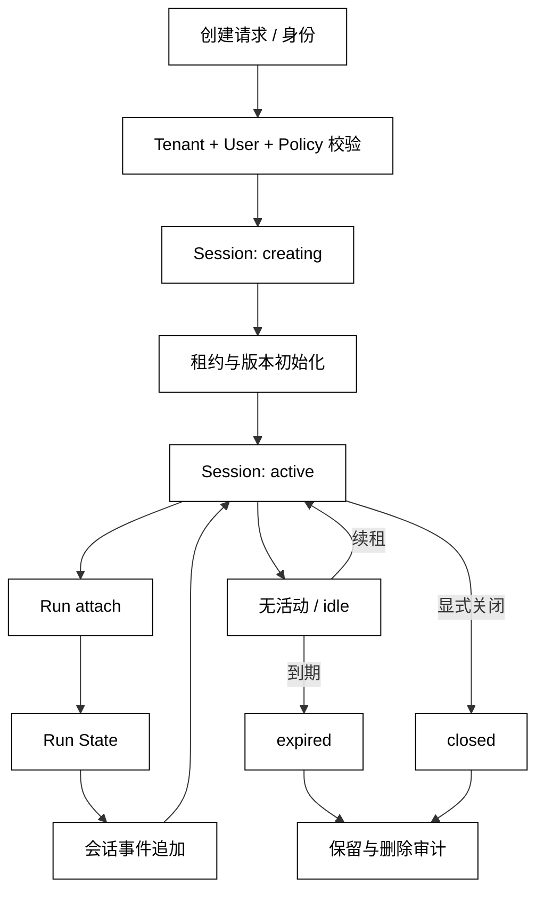

# Session 生命周期与隔离

## 学习目标

- 区分 Session、Run 和用户账号的生命周期与所有权。
- 设计创建、挂载、空闲、关闭和过期时的隔离检查。
- 读源码时识别会话租约、并发策略和删除审计，而不是只找一个 session_id 字符串。

## 前置知识

- 已阅读 [Run State 与状态所有权](./02-Session生命周期)。
- 已理解第02章的 Run 生命周期、第04章的权限边界，以及 State 与 Context 的投影关系。

## Session 是哪一层边界

### Session、Run、User 的关系

Run 是一次从 Goal 到结果或暂停的执行；Session 是可以挂载多个 Run 的交互容器；User/Tenant 是更高层的身份与数据隔离边界。一个 Session 可以包含多次查询和恢复，但不应让一个 Run 的临时变量自动污染所有未来 Run。

白话说：Run 是“一趟任务”，Session 是“这段对话的房间”，Tenant 是“房间属于谁”。房间可以暂时关门，但房间里的账簿和租户边界仍有不同的生命周期。

### 生命周期和租约

常见生命周期是 creating → active → idle → closed 或 expired。active 只表示可挂载，不表示永远可写；lease_until 可防止客户端崩溃后无限占用；closed/expired 的 Session 不应被悄悄重新激活，恢复要有显式新 Session 或管理员操作。

关闭策略要同时处理：正在运行的 Run、未完成的 checkpoint、短期对话、长期 Memory 引用和审计事件。删除会话不能等价于删除所有长期记忆，除非产品策略明确把二者绑定。

### 隔离检查

每次 attach、read、append 和 resume 都应检查 tenant_id、user_id、project_id、session status 和 revision。只用一个可猜的 session_id 作为授权依据，会把“知道 ID”错误地当成“拥有会话”。

## 从身份到一次挂载

SessionStore 持有会话元数据，Runtime 持有当前 Run State，ContextBuilder 按会话授权读取历史。挂载是一次有副作用的状态变更，不能在构造 Context 时隐式完成。



阅读提示：Run 只能挂载到通过身份和版本检查的 active Session；expired/closed 是终点，不是“读一下再自动打开”的捷径。租约解决占用问题，授权解决归属问题，二者不能互相替代。

## 会话数据的分层

### 会话元数据

元数据包括 session_id、tenant_id、user_id、created_at、last_activity、status、lease_until 和 revision。它属于 SessionStore，用来做授权、并发和生命周期判断。

### 对话事件

对话事件记录谁在什么时候说了什么、哪个 Run 产生了结果。它可以支持回放和短期 Context，但必须经过 scope 和保留策略才能给模型读取。

### Run 挂载状态

挂载关系应记录 run_id、attached_at、detached_at 和状态。一个 Session 是否允许并发 Run，要由显式策略决定：串行可以避免共享历史乱序，并行则需要每个 Run 的写入序列和冲突处理。

## 本地模拟：租户隔离和租约

用途：下面的标准库示例建立一个只读可观察的 SessionStore，模拟创建、挂载、过期和跨租户拒绝；没有网络和真实时间依赖，所有时间用整数 tick 表示。

```python
from __future__ import annotations

from dataclasses import dataclass


@dataclass
class Session:
    session_id: str
    tenant_id: str
    user_id: str
    status: str = "active"
    lease_until: int = 0
    attached_run: str | None = None
    revision: int = 0


class SessionStore:
    def __init__(self) -> None:
        self.sessions: dict[str, Session] = {}

    def create(self, session_id: str, tenant_id: str, user_id: str, now: int) -> Session:
        session = Session(session_id, tenant_id, user_id, lease_until=now + 3)
        self.sessions[session_id] = session
        return session

    def attach(
        self,
        session_id: str,
        tenant_id: str,
        user_id: str,
        run_id: str,
        now: int,
    ) -> Session:
        session = self.sessions[session_id]
        if (session.tenant_id, session.user_id) != (tenant_id, user_id):
            raise PermissionError("session scope mismatch")
        if session.status != "active" or now > session.lease_until:
            session.status = "expired"
            raise RuntimeError("session is not attachable")
        if session.attached_run is not None:
            raise RuntimeError("session already has a run")
        session.attached_run = run_id
        session.lease_until = now + 3
        session.revision += 1
        return session

    def detach(self, session_id: str, run_id: str) -> None:
        session = self.sessions[session_id]
        if session.attached_run != run_id:
            raise RuntimeError("run is not attached")
        session.attached_run = None
        session.revision += 1


store = SessionStore()
store.create("s-a", "tenant-a", "alice", now=1)
store.attach("s-a", "tenant-a", "alice", "run-1", now=2)
store.detach("s-a", "run-1")
print(store.sessions["s-a"].status, store.sessions["s-a"].revision)
try:
    store.attach("s-a", "tenant-b", "bob", "run-x", now=2)
except (PermissionError, RuntimeError) as error:
    print(type(error).__name__, str(error))
try:
    store.attach("s-a", "tenant-a", "alice", "run-2", now=9)
except (PermissionError, RuntimeError) as error:
    print(type(error).__name__, str(error))
# 输出：active 2
# 输出：PermissionError session scope mismatch
# 输出：RuntimeError session is not attachable
```

示例把租户和用户检查放在 attach 前，把租约判断放在生命周期边界；代码没有尝试“帮忙恢复”过期 Session。恢复一个 Run 时应先建立新的合法挂载，再读取 checkpoint 和 State。

## 源码阅读心智模型

### smolagents

如果一个 Agent 对象被重复调用，先确认框架是否隐含复用对话、工具结果或本地变量；这可能是调用方自己的 Session，也可能只是一次 Run 的内存状态。源码中没有显式 Session 不代表不存在会话语义。

### OpenAI Agents SDK

区分 Runner 的单次运行容器、Session 服务提供的跨 Run 历史，以及 tracing 的持久化。阅读时重点看“何时读取历史、何时追加新消息、关闭或并发时由谁加锁”。

### LangGraph

把 thread/session 标识看作图执行与 checkpoint 的挂载边界，再检查 checkpoint store 是否按租户或用户分区。图的 State 能恢复，不等于任意调用者都能读取这份 State。

### DeepSeek Harness

从 Session 初始化、Driver 挂载、事件上下文和插件生命周期追踪隔离字段。重点检查插件是否复用全局对象、关闭时是否释放监听器，以及跨 Session 的 Memory 是否经过 scope 过滤。

## 易混点

- **Session 不是 Run**：Session 可跨 Run，Run 结束不一定关闭 Session。
- **租约不是授权**：lease 只控制活跃占用，tenant/user 校验才决定归属。
- **关闭不是删除**：closed 表示不再接受新操作；数据删除、保留和审计是另一套策略。
- **并发策略不是默认行为**：串行挂载和并行 Run 都可以，但必须显式规定事件顺序和冲突处理。
- **同一 ID 不代表同一权限**：每次读取、恢复和追加都要重新做 scope 检查。

## 课后小问

1. 为什么恢复 Run 前不能只凭 session_id 读取历史？

   **答案**：session_id 只标识候选对象，不能证明调用者属于相同租户和用户。

   **解析**：恢复是高权限读写操作，还要检查状态、revision、租约和 Run 所属关系。把 ID 当授权会造成跨租户数据泄露。

2. Session 关闭时，长期 Memory 是否必须全部删除？

   **答案**：不一定，取决于产品定义的 scope 和保留策略。

   **解析**：Session 可能只是一次对话容器，而 Memory 可能属于用户或项目。删除要求必须能精确指向 Memory scope，并留下可审计的删除结果。

3. 同一个 Session 允许两个 Run 并发时，最少需要补什么？

   **答案**：需要明确事件序列、revision/锁、读写冲突策略和 Context 的可见顺序。

   **解析**：否则两个 Run 可能互相覆盖历史、把尚未确认的结果拼进对方 Context，最终无法恢复真实顺序。

## 本节小结

- Session 是跨 Run 的交互和隔离容器；Run State 是单次执行事实，User/Tenant 是更高层身份边界。
- Session 生命周期、租约、挂载和删除应由 SessionStore/Runtime 共同协调，不能藏在 Context 构造里。
- 任何 attach、read、append、resume 都要检查 tenant、user、status、lease 和版本。
- 并发 Run 要么串行化，要么显式提供事件顺序和冲突检测。

## 快速回顾

- 能解释 Session 与 Run、租约与授权、关闭与删除的三组差别。
- 能说出一次 attach 至少需要哪些检查。
- 能指出会话元数据、对话事件和 Run State 的不同所有者。
- 下一篇阅读 [Checkpoint、Suspend 与 Resume](./04-上下文压缩与摘要)，看 Session 中断后如何安全恢复。
