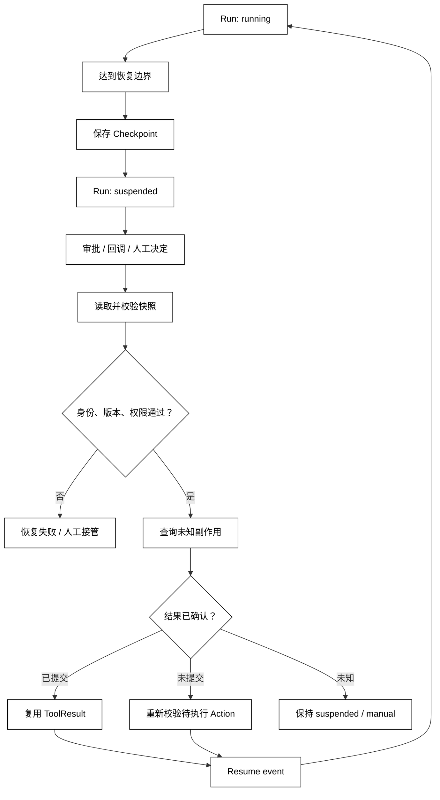

# Checkpoint、Suspend 与 Resume

## 学习目标

- 区分可恢复的 Checkpoint、运行状态 waiting/suspended 和最终失败。
- 设计审批、外部回调或进程退出后的 Resume 边界。
- 明白恢复前为什么要重新检查权限、版本和外部副作用，而不是从上次代码行继续执行。

## 前置知识

- 已阅读 [Session 生命周期与隔离](./03-Session生命周期与隔离)。
- 已理解第02章的 StopReason、第04章的幂等、未知副作用和审批边界。

## Checkpoint 保存什么

### 快照不是“暂停键”

Checkpoint 是某个明确边界上可验证的持久化快照，至少要包含 run_id、session_id、state_revision、下一步意图、待审批 Action、幂等键摘要、schema_version 和创建原因。它描述“恢复时从哪里重新进入”，不是保存 Python 调用栈，也不是承诺外部操作一定没有发生。

白话说，Checkpoint 是“把账本、待办和检查清单拍照存档”。进程退出后可以拿照片重建控制状态，但不能把网络请求的半途状态当作已经回滚。

### Suspend 的语义

Suspend 表示当前 Run 暂时不能继续，但仍保留可恢复关系。常见原因是 pending_approval、external_callback、manual_intervention 或 resource_wait。Suspend 不是 completed，也不是 failed；它应有 reason、expires_at 和待处理主体。

### Resume 的语义

Resume 是一次新的受控状态转移：读取 Checkpoint → 校验身份和版本 → 处理外部决定 → 重新检查权限与参数 → 恢复执行。Resume 不是“把旧函数继续调用”，更不是自动重放有副作用的 ToolCall。

## 安全恢复的顺序

1. 读取 checkpoint 并确认 session、tenant、run 归属。
2. 检查 checkpoint schema、State revision 和资源版本是否仍兼容。
3. 对待执行动作重新做 schema、权限、审批和预算检查。
4. 对之前可能发出的副作用执行 query/reconcile；已确认成功就复用结果，未确认则进入人工或幂等处理。
5. 以新的 resume event 写回 State，再进入下一步。



阅读提示：Checkpoint 是持久化边界，Suspend 是生命周期状态，Resume 是重新校验后的事件。图中的 Reconcile 防止把“响应丢失”误判成“工具没有执行”。

## 审批和外部副作用

### 审批挂起

审批请求应绑定具体 call_id、参数摘要、请求者、过期时间和 checkpoint revision。用户批准后，Runtime 仍需重新检查当前权限和资源版本；批准的是某个快照上的动作，不是无期限的通行证。

### 未知副作用

如果进程在 ToolCall 发出后崩溃，恢复时可能只有“请求已发送但结果未知”。没有幂等键或查询接口时，不应直接重试。先 query/reconcile，能确认已提交就复用结果，确认未提交才允许按策略重试，无法确认则保持 suspended 并交给人工。

### 重放与幂等

纯计算步骤可以重放；有副作用的步骤必须依赖幂等键、去重记录或可查询状态。Checkpoint 的恢复顺序应重新产生审计事件，而不是把旧日志复制成“刚刚发生”。

## 本地模拟：审批挂起后安全恢复

用途：下面的标准库示例模拟一个待审批动作。它展示旧 revision 会被拒绝、批准后重新检查并使用幂等键；没有真实工具调用，不会产生外部副作用。

```python
from __future__ import annotations

from dataclasses import dataclass


@dataclass
class RunState:
    run_id: str
    status: str = "running"
    revision: int = 0
    pending_action: str | None = None
    idempotency_key: str | None = None
    result: str | None = None


@dataclass(frozen=True)
class Checkpoint:
    run_id: str
    revision: int
    action: str
    idempotency_key: str


def suspend_for_approval(state: RunState, action: str) -> Checkpoint:
    state.status = "suspended"
    state.pending_action = action
    state.idempotency_key = "idem-" + state.run_id
    state.revision += 1
    return Checkpoint(
        state.run_id,
        state.revision,
        action,
        state.idempotency_key,
    )


def resume(
    state: RunState,
    checkpoint: Checkpoint,
    approved: bool,
    current_revision: int,
) -> str:
    if current_revision != state.revision or checkpoint.revision != state.revision:
        raise RuntimeError("stale checkpoint")
    if state.status != "suspended":
        raise RuntimeError("run is not suspended")
    if not approved:
        state.status = "failed"
        state.pending_action = None
        state.revision += 1
        return "approval_denied"
    if state.idempotency_key != checkpoint.idempotency_key:
        raise RuntimeError("idempotency key changed")
    state.status = "running"
    state.result = "would execute " + checkpoint.action
    state.pending_action = None
    state.revision += 1
    return state.result


def reconcile_unknown(state: RunState, query_result: str | None) -> str:
    if state.status != "suspended":
        raise RuntimeError("unknown side effect requires suspended state")
    if query_result == "committed":
        state.result = "reuse committed result"
        state.status = "running"
        state.revision += 1
        return "reused"
    if query_result == "not_committed":
        return "safe_to_recheck"
    return "manual_intervention"


state = RunState("run-approval")
checkpoint = suspend_for_approval(state, "publish:demo")
print(state.status, checkpoint.revision, checkpoint.idempotency_key)
try:
    resume(state, checkpoint, approved=True, current_revision=checkpoint.revision - 1)
except RuntimeError as error:
    print(type(error).__name__, str(error))
print(resume(state, checkpoint, approved=True, current_revision=checkpoint.revision))
print(state.status, state.revision)
unknown = RunState(
    "run-unknown",
    status="suspended",
    revision=1,
    pending_action="publish:demo",
)
print(reconcile_unknown(unknown, query_result=None), unknown.status)
# 输出：suspended 1 idem-run-approval
# 输出：RuntimeError stale checkpoint
# 输出：would execute publish:demo
# 输出：running 2
# 输出：manual_intervention suspended
```

示例中的 would execute 是本地占位结果，故意没有真正发布；未知副作用的 query_result=None 明确停留在 suspended 并返回 manual_intervention。真实系统在继续前仍要通过工具权限、资源版本和幂等检查。

## 源码阅读心智模型

### smolagents

关注主循环在异常、最大步数或人工介入时保存了哪些变量；若框架只保留消息列表，恢复语义可能仍由应用层负责。区分“重新创建 Agent”与“恢复同一 Run”。

### OpenAI Agents SDK

沿 RunResult.interruptions → RunResult.to_state() → Runner.run(state) 追踪审批暂停；RunState 保存 pending approvals 和可恢复运行元数据，Session history 仍是另一条持久化边界。具体 API 会变化，但判断标准不变：恢复前是否重新校验，并且是否能区分等待、不可恢复和终态。

### LangGraph

把 checkpointer 保存的 StateSnapshot 看成 Checkpoint，把 interrupt 产生的暂停看成 Suspend，把同一 thread_id 上的 Command(resume=...) 看成 Resume。LangGraph 会从 interrupt 所在节点开头重跑，因此要检查节点前半段和外部副作用是否幂等，并区分未提交、已提交和无法确认。

### DeepSeek Harness

从 ctx.agents/agent-loop 的 Driver 运行入口、ctx.sessions 的 SessionEvent append-only 日志、Plugin/Hook 事件和 SessionPersistence flush/checkpoint 入口观察挂起原因与恢复事件。插件可以请求暂停，但最终生命周期、未知副作用和权限复核应由统一 Driver/Session 约束控制；具体事件名以当前仓库为准。

## 易混点

- **Checkpoint 不是内存快照**：它只保存定义好的可恢复数据，不保存不可移植的调用栈。
- **Suspend 不是失败**：等待审批或外部回调时，Run 仍可恢复。
- **Resume 不是重放全部步骤**：纯计算可重放，副作用要查状态或依赖幂等。
- **Approval 不是永久授权**：恢复时必须再次检查用户、权限、参数和版本。
- **未知副作用不是普通超时**：无法确认结果时，直接重试可能产生重复提交。

## 课后小问

1. 为什么 Checkpoint 要带 state_revision？

   **答案**：确保恢复基于的快照仍是当前合法状态，而不是被后续更新覆盖的旧版本。

   **解析**：没有 revision，审批者可能批准旧参数，恢复流程却把它应用到新目标上。版本检查是把决定绑定到具体状态的最小护栏。

2. 网络超时后为什么不立即重试 ToolCall？

   **答案**：超时只说明响应未知，不说明副作用没有发生。

   **解析**：应先用幂等键查询或对账。没有确认手段时，保持 suspended 并人工处理比重复写入更安全。

3. Resume 成功后，为什么还要追加新的事件？

   **答案**：恢复本身是一次状态转移，需要被审计和回放。

   **解析**：只修改内存 status 会让审计看不出谁在何时批准、使用哪个 checkpoint 恢复，也无法定位并发冲突。

## 本节小结

- Checkpoint 是带版本、原因和恢复所需事实的持久化边界；Suspend 是暂态；Resume 是重新校验后的状态转移。
- 恢复流程必须检查身份、Session、schema、revision、权限、资源版本和未知副作用。
- 审批决定绑定到具体 checkpoint，副作用步骤需要幂等或 query/reconcile，无法确认时转人工。
- 恢复事件应可审计，不能用“继续执行旧调用栈”代替明确的 Runtime 流程。

## 快速回顾

- 能说出 Checkpoint、Suspend、Resume 的各自责任。
- 能画出审批挂起到恢复前的版本和副作用检查。
- 能解释为什么“请求已发出但响应丢失”必须单独分类。
- 下一篇阅读 [Context 构建、选择与预算](./05-Context构建选择与预算)，把恢复后的 State 变成受控模型输入。
