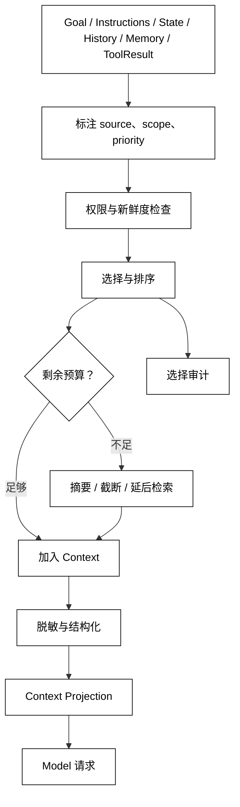

# Context 构建、选择与预算

## 学习目标

- 把 ContextBuilder 看成带权限和预算的选择器，而不是简单字符串拼接器。
- 能为 Goal、State、历史、Memory 和 ToolResult 指定来源、优先级和敏感级别。
- 区分“没有放进 Context”与“系统没有保存”两种完全不同的情况。

## 前置知识

- 已阅读 [State、Context、Session 与 Memory 的边界](./01-State与Context) 和 [Run State 与状态所有权](./02-Run-State与状态所有权)。
- 已理解第03章的 Token、Context Window、Usage、Truncation 和预算；本文不假设某个供应商 API。

## Context 是一次投影

### 输入来源

一次 Context 通常由固定 Instructions、用户 Goal、当前 Run State、最近对话、已确认 ToolResult、授权 Memory 和工具能力描述组成。每个片段都应带 source、scope、priority、sensitivity 和 freshness，便于审计“为什么看到了它”。

白话说，ContextBuilder 是“从多个抽屉里挑出这次必须给模型看的卡片，并装进有限大小的信封”。抽屉里有东西，不代表这次要全部放入信封。

### 选择规则

选择不是简单按时间倒序。任务约束、未决事实和最新工具结果通常比旧闲聊更重要；敏感字段必须先脱敏或拒绝；跨用户 Memory 没有 scope 证据时不能进入 Context；冲突事实应同时保留来源或显式标记待确认。

一个可解释的选择策略至少回答：

1. 哪些来源是必须保留的？
2. 哪些片段可以摘要、截断或延后检索？
3. 超出预算时谁被淘汰，淘汰会损失什么？
4. 被选内容是否仍满足权限、版本和新鲜度？

### 预算不是只有 Token

Model 的输入预算通常用 Token 计量，但 ContextBuilder 还要考虑输出预留、工具描述、延迟、隐私字段和成本。标准库模拟可以用字符数估算相对变化，但不能把估算值当作供应商账单。

## 从来源到模型输入

ContextBuilder 读取已提交 State 和 Session 事件，通过 scope/permission 过滤，再按优先级和剩余预算选择。它返回一个可审计的 projection，记录选中、舍弃和脱敏原因；Model 只消费 projection，不应自行读取 StateStore。



阅读提示：预算决策发生在权限检查之后；不能为了塞入更多内容而把未授权片段降级为“低优先级”。压缩与截断改变可见信息，State 和原始历史仍由各自存储层负责。

## 责任边界

### StateStore：保证事实可读

StateStore 提供版本一致的事实。它不负责决定每次模型请求的语言、排序或上下文预算，否则状态保存和提示策略会互相耦合。

### ContextBuilder：负责选择和解释

ContextBuilder 负责投影、脱敏、排序、预算和来源标注。它不应修改 Run State，也不应把一次模型调用结果偷偷写进 Memory。

### Model：消费视图，不拥有账本

Model 只能基于当前 projection 产生 Action 或 Final。若事实缺失，模型可以请求补充工具或澄清，但不能假设 Context 外的 State 一定存在。

## 本地模拟：按优先级和预算构建 Context

用途：下面的纯标准库示例用字符数近似预算，展示权限过滤、优先级选择和敏感字段脱敏；费用同时计入 source 标签、消息结构开销和输出预留。估算只用于教学，不代表真实 Token 计费。

```python
from __future__ import annotations

from dataclasses import dataclass


@dataclass(frozen=True)
class Candidate:
    source: str
    text: str
    priority: int
    scope: str
    sensitive: bool = False


@dataclass(frozen=True)
class ContextBudget:
    context_window: int
    output_reserve: int
    message_overhead: int = 4

    @property
    def input_limit(self) -> int:
        if self.output_reserve >= self.context_window:
            raise ValueError("output reserve must leave input capacity")
        return self.context_window - self.output_reserve


def render(item: Candidate, text: str) -> str:
    return "<" + item.source + "> " + text


def build_context(
    candidates: list[Candidate],
    allowed_scope: str,
    budget: ContextBudget,
) -> tuple[list[str], list[str], dict[str, int]]:
    selected: list[str] = []
    decisions: list[str] = []
    costs: dict[str, int] = {}
    used = 0
    ordered = sorted(candidates, key=lambda item: -item.priority)
    for item in ordered:
        if item.scope != allowed_scope:
            decisions.append(item.source + ":scope_denied")
            continue
        text = "[redacted]" if item.sensitive else item.text
        rendered = render(item, text)
        cost = len(rendered) + budget.message_overhead
        costs[item.source] = cost
        if used + cost > budget.input_limit:
            decisions.append(item.source + ":budget_skipped")
            continue
        selected.append(rendered)
        decisions.append(item.source + ":included")
        used += cost
    return selected, decisions, costs


candidates = [
    Candidate("goal", "部署 demo", 100, "tenant-a"),
    Candidate("tool_result", "build=green", 90, "tenant-a"),
    Candidate("memory", "偏好中文", 40, "tenant-a"),
    Candidate("other_user", "secret=42", 80, "tenant-b"),
    Candidate("history", "很久以前的闲聊", 10, "tenant-a"),
]
budget = ContextBudget(context_window=60, output_reserve=12, message_overhead=4)
selected, decisions, costs = build_context(candidates, "tenant-a", budget)
print(selected)
print(decisions)
# 输出：['<goal> 部署 demo', '<tool_result> build=green']
# 输出：['goal:included', 'tool_result:included', 'other_user:scope_denied', 'memory:budget_skipped', 'history:budget_skipped']
print(costs, budget.input_limit)
# 输出：{'goal': 18, 'tool_result': 29, 'memory': 17, 'history': 21} 48
```

输出说明：context_window=60 先为输出预留12，只剩48个输入字符预算；goal 的标签/结构/文本成本18，tool_result成本29，二者合计47，memory因此被跳过。真实系统还应从 ModelResponse Usage 读取 token，而不是把字符估算当账单。

## 源码阅读心智模型

### smolagents

追踪每轮调用前如何拼接任务、工具说明和历史观察；把那段逻辑看成 ContextBuilder，并检查是否存在长度、敏感字段或工具结果的选择策略。不要因为代码最终得到一个字符串，就认定它包含完整 State。

### OpenAI Agents SDK

区分 RunContextWrapper.context 这种本地依赖、Session history 和模型请求消息；再沿 SessionSettings、session_input_callback 与 Usage 观察历史输入和输出预留如何影响一次 Run。它们不是统一的 ContextBuilder API，重点是哪些字段在请求前被注入、哪些只给工具、哪些会跨 Run 保留。

### LangGraph

节点输入通常是图 State 的一个投影；沿 StateSnapshot.values、reducer 和 Store namespace 检查节点如何选择消息、工具结果和 checkpoint 字段。图状态的完整性不等于每个节点都能看到全部内容。

### DeepSeek Harness

把 ctx.agents/agent-loop 中 Driver 的模型请求装配、ctx.sessions 的 Session 派生消息、Skill/Plugin provider 内容和 Event 过滤看成分层 ContextBuilder；真实检索锚点是 Driver、SessionEvent、ctx.skills 和 hook/extension 入口。重点检查扩展能力是否能绕过 scope 或预算，把任意持久化数据塞进模型输入。

## 易混点

- **Context 截断不等于 State 丢失**：被舍弃片段可能仍在历史或 Store 中。
- **预算不是权限**：低优先级不代表可以跳过授权检查，高优先级也不能越权。
- **最近不一定最重要**：未决动作和最新 ToolResult 可能比更近的闲聊更关键。
- **字符数不是 Token 账单**：标准库估算只帮助观察选择变化，真实计量要使用模型返回的 Usage。
- **Model 看不到不等于不存在**：缺失事实应触发检索、工具或澄清，而不是猜测。

## 课后小问

1. 为什么权限检查必须在预算裁剪之前？

   **答案**：越权数据不能因为“马上要被裁剪”就暂时进入处理链。

   **解析**：日志、缓存和排序阶段都可能留下敏感内容；先授权再排序能缩小泄露面，并让选择审计可解释。

2. ContextBuilder 选不到旧 Memory 时，应该删除 Memory 吗？

   **答案**：不应该，选择失败和数据删除是不同操作。

   **解析**：本次预算不足可以延后检索、摘要或请求用户确认；删除需要独立的保留策略和审计授权。

3. 为什么 StateStore 不直接返回完整 State 给 Model？

   **答案**：完整 State 可能包含控制字段、秘密、其他用户数据和无关事件。

   **解析**：Context 是按调用目的构造的最小视图。直接暴露 State 会同时破坏隐私、预算和责任边界。

## 本节小结

- Context 是一次 Model 调用的选择性投影，不是 State 的副本。
- ContextBuilder 按来源、scope、优先级、新鲜度、敏感级别和预算选择内容，并记录舍弃原因。
- 权限检查先于预算裁剪；Context 超限可摘要、截断或延后检索，但不自动删除 State/Memory。
- 读源码时寻找请求前的装配、过滤、脱敏和 token/成本计量，而不是只看最终消息数组。

## 快速回顾

- 能解释“保存了但没进入 Context”和“没有保存”的区别。
- 能列出 ContextBuilder 至少要记录的来源和选择信息。
- 能说明为什么模型输入预算不能替代租户隔离。
- 下一篇阅读 [上下文压缩、摘要与信息损失](./06-上下文压缩摘要与信息损失)，继续处理预算不足但不能随意丢事实的问题。
