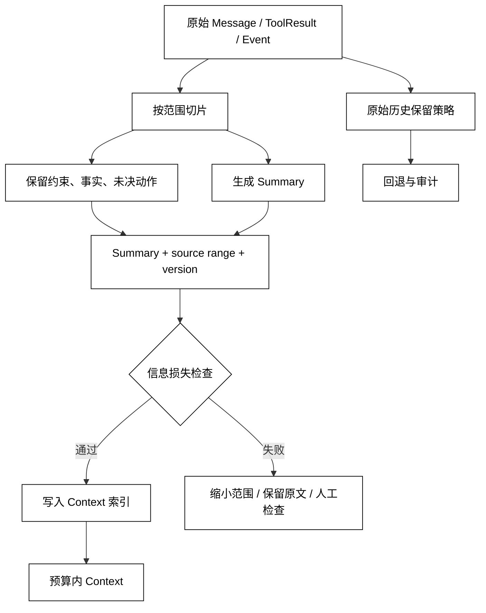

# 上下文压缩、摘要与信息损失

## 学习目标

- 区分截断、压缩、摘要和持久化，它们对信息的影响不同。
- 能为摘要声明来源区间、保留事实、未知事实和版本。
- 设计压缩后的校验与回退，让模型知道哪些内容被省略而不是把摘要当原始证据。

## 前置知识

- 已阅读 [Context 构建、选择与预算](./05-短期记忆与长期记忆)。
- 已理解第03章的 Context Window、Token、Truncation、Usage 和预算概念。

## 四种操作不是一回事

### 截断 Truncation

截断是直接丢掉一段输入，通常从最旧或最低优先级开始。它成本低、结果可预测，但可能切掉前置约束、工具调用和未决承诺。截断后的 Context 不应暗示模型拥有完整历史。

### 压缩 Compaction

压缩是把一组事件转换成更短的表示，通常包含摘要、保留的结构化事实和指向原始事件的引用。压缩需要声明输入范围和信息损失，不能只返回一段没有来源的自然语言。

### 摘要 Summary

摘要是压缩结果的一种表达。可靠摘要要区分 confirmed facts、open questions、decisions、pending actions 和 provenance；“看起来连贯”不等于“事实完整”。

### 持久化 Persistence

持久化只是把数据写入 Store。压缩可以写回 Context 索引，但不应默认覆盖原始事件；原始历史、State 和 Summary 的保留策略要分别定义。

## 信息损失预算

一个摘要至少要保留：

- 当前 Goal 和不可违反的约束；
- 已确认的 ToolResult 与来源；
- 未完成、待审批或可能产生副作用的动作；
- 冲突事实、未知结果和需要用户澄清的问题；
- source_range、summary_version、created_by 和时间。

可以牺牲寒暄和重复描述，但不能静默牺牲安全约束或副作用状态。压缩后应做回归检查：摘要是否仍能回答“当前做到哪一步、下一步不能做什么、哪些结果尚未确认”。

## 从历史到带证据的摘要

压缩器读取有序事件，选择要保留的结构化事实，再把剩余事件生成可追溯摘要。ContextBuilder 只在预算允许且来源可信时使用 Summary；恢复或审计仍可回到原始事件。



阅读提示：Summary 进入 Context 前要经过 Verify；原始 History 走 Archive/Recovery 路径，不应因为压缩成功就被不可逆覆盖。

## 校验摘要是否安全

### 来源覆盖

记录摘要覆盖的最小和最大事件 ID、包含了哪些 ToolResult、跳过了哪些事件。没有 source_range 的摘要无法判断它是否覆盖当前状态。

### 状态一致性

将摘要中的 build=green、approval=pending 等关键事实与 Run State 对比；不一致时宁可保留原文或触发人工检查，也不要让摘要覆盖事实。

### 用户可见的缺口

当 Context 使用了摘要，应让模型知道“旧历史已压缩、需要原文时可检索”。这样模型会请求补充，而不是把摘要中的空白编造成确定事实。

## 本地模拟：压缩并保留信息损失提示

用途：下面的标准库示例把旧事件压缩成一条带 source_range 的 Summary，同时保留最近事件；它刻意标记未决动作，展示压缩不是静默删除。

```python
from __future__ import annotations

from dataclasses import dataclass


@dataclass(frozen=True)
class Event:
    event_id: int
    kind: str
    text: str
    important: bool = False


@dataclass(frozen=True)
class Summary:
    source_range: tuple[int, int]
    confirmed: tuple[str, ...]
    pending: tuple[str, ...]
    omitted_count: int


def compact(events: list[Event], keep_recent: int = 2) -> tuple[Summary, list[Event]]:
    old = events[:-keep_recent]
    recent = events[-keep_recent:]
    confirmed = tuple(
        event.text
        for event in old
        if event.important and event.kind == "fact"
    )
    pending = tuple(
        event.text
        for event in old
        if event.important and event.kind == "pending"
    )
    summary = Summary(
        (old[0].event_id, old[-1].event_id),
        confirmed,
        pending,
        len(old) - len(confirmed) - len(pending),
    )
    return summary, recent


events = [
    Event(1, "message", "用户问候"),
    Event(2, "fact", "build=green", important=True),
    Event(3, "pending", "deploy 等待审批", important=True),
    Event(4, "message", "请保持中文"),
    Event(5, "message", "下一步是什么？"),
]
summary, recent = compact(events)
print(summary)
print([(event.event_id, event.text) for event in recent])
# 输出：Summary(source_range=(1, 3), confirmed=('build=green',), pending=('deploy 等待审批',), omitted_count=1)
# 输出：[(4, '请保持中文'), (5, '下一步是什么？')]
```

summary 仍保留了 pending 事实和原始区间；若后续发现摘要与 State 冲突，可以按 source_range 找回事件，而不是凭摘要猜测。

## 源码阅读心智模型

### smolagents

检查 Agent Loop 是否只保留最近消息，还是有应用层的摘要/历史 Store；如果摘要在 Prompt 中生成，要寻找它的触发阈值、失败回退和来源标记。

### OpenAI Agents SDK

关注 Session 历史、Runner 上下文和 tracing 如何处理长对话。判断重点不是某个压缩 API 名称，而是摘要是否可追溯、是否与 Run State 分开保留。

### LangGraph

观察 checkpoint 的 State 是否包含消息摘要、消息裁剪或自定义 reducer。节点状态变短不代表信息安全，需检查旧消息能否通过持久化或检索回退。

### DeepSeek Harness

沿 Driver 的上下文事件、Session 历史和 Hook/Plugin 的摘要扩展追踪版本与事件范围。扩展生成的摘要也应遵守同一套信息损失与审计契约。

## 易混点

- **摘要不是事实源**：摘要是有来源的视图，关键事实仍应在 State/Event Store 中可验证。
- **压缩不是删除**：压缩可以保留原始历史和回退引用，删除需要独立保留策略。
- **截断不是摘要**：截断没有语义补偿，不能声称模型知道被丢弃内容。
- **窗口足够不等于没有损失**：把全部历史塞入窗口可能仍有冲突、噪声和敏感信息。
- **摘要成功不等于恢复安全**：恢复仍要依赖版本、状态和副作用检查。

## 课后小问

1. 为什么摘要必须有 source_range？

   **答案**：让系统可以验证摘要覆盖哪些事件，并在冲突时回到原文。

   **解析**：没有范围，摘要无法被审计，模型也无法请求精确补充。source_range 不是引用格式装饰，而是恢复和纠错的入口。

2. 哪一类信息不应为了省预算而直接丢掉？

   **答案**：安全约束、已确认副作用、待审批动作、未知结果和冲突事实。

   **解析**：这些信息决定下一步能否执行；丢掉它们会让模型重复操作、越权或错误宣称完成。

3. 压缩后发现 Summary 与 Run State 不一致，先做什么？

   **答案**：停止使用冲突摘要，保留原始事件并触发重新压缩或人工检查。

   **解析**：Summary 是投影，不应覆盖更高权威的 State。继续使用冲突摘要会把数据错误放大到后续 Context 和 Memory。

## 本节小结

- 截断直接丢输入，压缩把事件变短，摘要是带来源的压缩表示，持久化只是保存行为。
- 安全摘要要保留目标、约束、确认事实、未决动作、未知结果和 source_range/version。
- 压缩后要做状态一致性和信息损失校验；失败时回退到原文或人工检查。
- 原始历史、Run State 和 Summary 应有不同的所有者与保留策略。

## 快速回顾

- 能区分 truncation、compaction、summary、persistence。
- 能列出摘要最少要携带的来源和未决信息。
- 能说明为什么摘要与 State 冲突时不能直接覆盖原始事实。
- 下一篇阅读 [短期记忆与对话历史](./07-短期记忆与对话历史)，把压缩后的会话历史放回短期交互视图。
