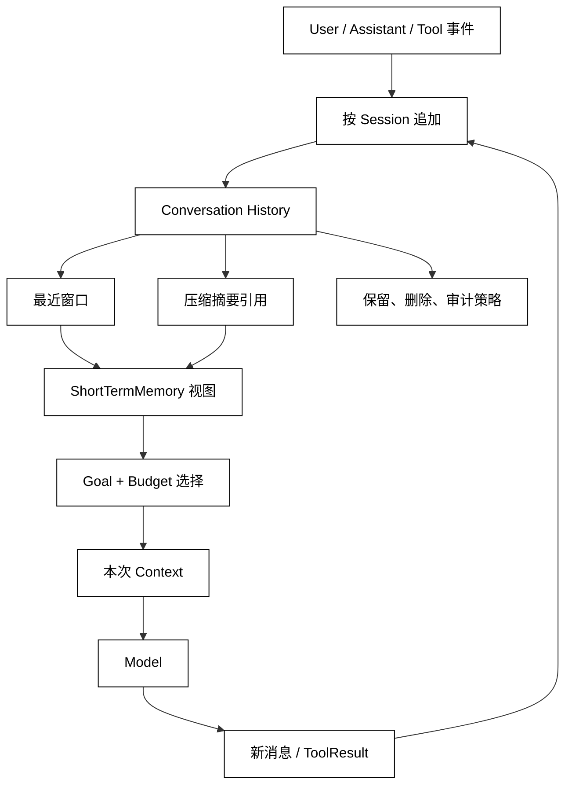

# 短期记忆与对话历史

## 学习目标

- 区分原始对话历史、当前窗口和短期记忆视图。
- 设计按 Session/Run 隔离的追加、回放、摘要和删除边界。
- 明白“最近消息”不一定是“最重要事实”，短期视图也需要来源和权限。

## 前置知识

- 已阅读 [上下文压缩、摘要与信息损失](./06-上下文压缩摘要与信息损失) 和 [Session 生命周期与隔离](./03-Session生命周期与隔离)。
- 已理解 Message、Role、ToolResult、Context Projection 和 Context Window。

## 三个相近对象

### 原始对话历史

Conversation History 是按顺序保存的消息和事件，通常用于回放、审计和重新构造上下文。它可能很长，包含已压缩内容、失败尝试和敏感字段，不能无条件全部发送给模型。

白话说，它是“完整录像”，重点是忠实记录发生过什么。

### 当前 Context Window

Context Window 是一次模型请求可见的输入集合，可能只包含最近消息、Summary、未决 ToolResult 和必要约束。白话说，它是“这一次播放给模型看的片段”。

### ShortTermMemory

ShortTermMemory 是围绕当前 Session/Run 主动维护的短期事实视图，例如当前话题、未完成问题、最近确认结果和压缩摘要引用。它可以从历史计算得到，但不等于复制历史，也不应跨用户复用。

## 追加、读取和回收

### 追加要保留来源

每条短期记录应带 session_id、run_id、event_id、role、created_at 和状态。ToolResult 还要带 call_id；摘要要带 source_range。只保留文本会让恢复和冲突诊断失去关联。

### 读取要绑定 Session

读取短期记忆时先验证 Session scope，再按当前 Goal 选择事实。跨 Run 共享只允许在同一 Session 策略内发生；新 Session 默认没有旧对话，避免把用户 A 的“最近话题”带进用户 B。

### 回收不一定删除

窗口滑动可以把旧消息移出 Context；压缩可以把它们变成带引用的 Summary；Session 关闭可以停止短期读取。真正删除原始历史要遵循 Retention 和审计策略，不能把“本轮不显示”误作删除。

## 短期视图的数据流

短期层接收追加事件，维护顺序和当前 Session 的摘要引用；ContextBuilder 再按照预算选择最近消息与未决事实。长期 Memory 的读取是另一条经过 scope 和检索策略的路径。



阅读提示：ShortTermMemory 是 History 的派生视图，Context 又是它的选择性投影；二者都不应越过 Session scope 直接读取全局数据。

## 对话历史和 Memory 的边界

### 不是每句话都值得长期保存

用户的临时问题、工具失败、敏感输入和会话特有的待办通常只属于当前 Session。长期 Memory 需要明确用途、scope、来源、置信度和删除策略，详见 [长期记忆写入、检索与更新](./08-长期记忆写入检索与更新)。

### 短期事实也可能不可靠

模型的陈述、用户转述和工具返回的可信度不同。短期视图可以保留“待确认”状态，不能因为它最近出现就提升为已确认事实；Memory 写入前更要重新验证来源。

### 压缩引用不能绕过授权

Summary 中即使包含某个用户的事实，也必须按 Session/Memory scope 检查后才能进入 Context。引用 ID 不等于读取权限。

## 本地模拟：按 Session 维护短期视图

用途：下面的标准库示例保存带来源的对话事件，只为同一 Session 生成最近消息和未决事实；它演示窗口滑动，不访问文件或网络。

```python
from __future__ import annotations

from dataclasses import dataclass


@dataclass(frozen=True)
class Message:
    event_id: int
    session_id: str
    role: str
    text: str
    pending: bool = False


class ConversationHistory:
    def __init__(self) -> None:
        self._events: list[Message] = []

    def append(self, message: Message) -> None:
        self._events.append(message)

    def short_term_view(self, session_id: str, limit: int) -> list[str]:
        events = [
            event
            for event in self._events
            if event.session_id == session_id
        ]
        pending_ids = {
            event.event_id
            for event in events
            if event.pending
        }
        recent = [
            event
            for event in events[-limit:]
            if event.event_id not in pending_ids
        ]
        pending = [
            "pending:" + event.text
            for event in events
            if event.pending
        ]
        return pending + [event.role + ":" + event.text for event in recent]


history = ConversationHistory()
history.append(Message(1, "s-a", "user", "查 build"))
history.append(Message(2, "s-a", "tool", "build=green"))
history.append(Message(3, "s-a", "assistant", "等待 deploy 审批", pending=True))
history.append(Message(4, "s-b", "user", "不要混入这条"))
print(history.short_term_view("s-a", limit=2))
print(history.short_term_view("s-b", limit=2))
# 输出：['pending:等待 deploy 审批', 'tool:build=green']
# 输出：['user:不要混入这条']
```

输出中 s-a 没有看到 s-b 的消息；pending 事实被单独放在窗口前，且从 recent 中去重，说明“未决”不是普通最近文本。生产实现还要对消息内容脱敏、限制查询范围并记录 event_id。

## 源码阅读心智模型

### smolagents

观察 Agent 每轮是否复用 messages 列表、何时追加 ToolResult、是否在调用结束后清理。这个列表可能就是调用方的短期历史，不要假定它天然拥有跨会话隔离。

### OpenAI Agents SDK

从 Session.get_items、SessionSettings/session_input_callback 和 Runner 的输入列表区分原始 history 与当前 Context；检查工具结果和最终回答是否关联到同一 Session。RunContextWrapper.context 是本地运行依赖，不是自动的短期历史。

### LangGraph

以 configurable.thread_id 定位 StateSnapshot.values 和 checkpoint 历史，再看 reducer、消息裁剪和摘要节点是否保留 event 顺序与来源。跨 thread 的 Store namespace 是另一条数据路径，不能当作短期 History。

### DeepSeek Harness

从 ctx.agents/agent-loop 的 Driver 运行入口、ctx.sessions/Session.append 和 SessionEvent 追踪消息拼装；Session 文档中的 compaction/start、compaction/summary、compaction/end 事件可作为摘要关联锚点。Plugin/Hook 追加的事件必须进入同一 Session，持久化通过 ctx.sessionPersistence 的 append/flush，而不是全局共享历史。

## 易混点

- **最近消息不等于短期记忆**：短期记忆还要筛选未决事实、摘要和来源。
- **短期记忆不等于长期 Memory**：前者通常绑定 Session，后者需要跨 Session 的明确 scope。
- **移出窗口不等于删除**：历史可能被压缩或归档，删除要走 Retention。
- **模型输出不等于确认事实**：来源和 pending 状态必须保留。
- **Summary 引用不等于授权**：读取前仍要验证 Session 和 Memory scope。

## 课后小问

1. 为什么每条对话事件要带 session_id 和 event_id？

   **答案**：用于隔离会话并保持可回放顺序。

   **解析**：没有 session_id 会跨用户串话，没有 event_id 则无法定位摘要覆盖范围、重复事件和工具结果关联。

2. 某条消息移出当前窗口后，系统还能否恢复它？

   **答案**：如果原始历史或 Summary 引用仍按策略保留，就可以检索或回退；窗口滑动本身不决定删除。

   **解析**：Context 是临时投影，History/Store 才决定保留。把两者混为一谈会导致无法审计或误删数据。

3. 为什么“等待审批”不能只作为一条普通 assistant 文本？

   **答案**：它是控制状态，需要 pending 标记、动作关联和恢复入口。

   **解析**：普通文本无法阻止 Runtime 继续执行，也无法在恢复时判断是用户意见还是未完成的副作用。

## 本节小结

- 原始 History 忠实记录事件，ShortTermMemory 是当前 Session 的派生事实视图，Context 是本次请求的有限投影。
- 短期记录要带 Session/Run/event 来源、顺序和 pending 状态，读取时做 scope 与 Goal 选择。
- 窗口滑动、摘要、归档和删除是不同操作；短期记录不应自动升级为长期 Memory。
- 任何压缩引用和插件追加都要保留授权、来源和可回放关系。

## 快速回顾

- 能说出 History、ShortTermMemory、Context 的三层关系。
- 能解释 pending 事实为什么不能伪装成普通消息。
- 能指出同一 Session 内跨 Run 复用短期记录的最小隔离条件。
- 下一篇阅读 [长期记忆写入、检索与更新](./08-长期记忆写入检索与更新)，把经过筛选的事实提升为可跨会话复用的 Memory。
