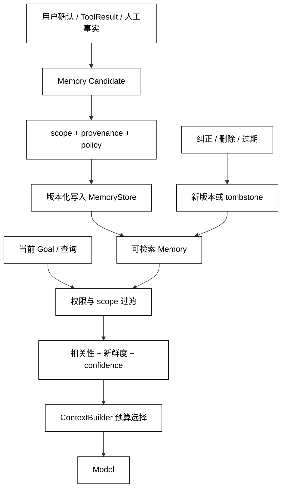

# 长期记忆写入、检索与更新

## 学习目标

- 把 LongTermMemory 看成有范围、有来源、有版本的事实库，而不是“把聊天存起来”。
- 设计候选写入、检索过滤、更新替换和删除撤回的完整数据流。
- 读源码时区分 MemoryStore、检索器、ContextBuilder 和用户授权。

## 前置知识

- 已阅读 [短期记忆与对话历史](./07-短期记忆与对话历史) 和 [Context 构建、选择与预算](./05-短期记忆与长期记忆)。
- 已理解 Session scope、State ownership、ToolResult、权限和版本冲突。

## 一条记忆的最小契约

### 内容与来源

长期记忆至少要有 memory_id、key/value、scope、source_event、created_by、confidence、version、created_at 和 retention。source_event 说明事实从哪条用户消息、工具结果或人工确认产生；没有来源的句子只能是候选，不能冒充可信 Memory。

白话说，Memory 是“带标签和出处的卡片”，不是把一段聊天贴进数据库。未来检索者要知道卡片属于谁、为什么可信、何时过期。

### 写入

写入流程通常是候选提取 → 意图/敏感性判断 → scope 确定 → provenance 验证 → 去重/冲突检查 → 用户或策略授权 → 版本化存储。短期对话不应默认自动写入跨 Session 的用户或项目 Memory。

### 检索

检索先按 tenant/user/project scope 和权限过滤，再按查询相关性、新鲜度、confidence 和版本排序。只有通过过滤的结果才能进入 Context；检索器不应绕过 ContextBuilder 直接把 Store 全量交给 Model。

### 更新与删除

更新可以是同一 key 的新版本、明确 supersedes 关系或 tombstone。删除要能撤回未来检索，并保留必要的审计证据；“把 value 改为空字符串”不是可靠删除语义。

## 记忆数据流

Memory 的写入和读取是两条不同方向的数据流：写入强调来源、授权和版本，读取强调 scope、相关性和预算。两者都经过 MemoryStore，但责任不能合并成一个无条件的 save/load。



阅读提示：scope 过滤发生在 Rank 之前，避免先对不该读取的数据做相关性处理；更新通过新版本或 tombstone 表达，不能静默覆盖旧事实。

## 作用域和保留

### 常见 MemoryScope

- session：仅当前会话有效。
- user：同一用户的多个 Session 可用。
- project：项目成员按权限共享。
- tenant：租户内共享，通常要求更严格的写入策略。

scope 越宽，写入和读取门槛越高。用户在一个项目中的临时决定不应自动变成 tenant 级事实。

### 置信度和新鲜度

confidence 表示来源可信程度，不是模型“感觉很确定”的替代品；freshness 用时间或有效期约束旧事实。检索时可以展示“可能过期”而不是静默当成真值。

### 记忆进入 Context

ContextBuilder 应携带 memory_id、scope、source 和 version 的安全摘要，方便模型和审计知道事实来自哪里；敏感原文只在授权范围内展开。

## 本地模拟：写入、检索、更新和删除

用途：下面的标准库示例使用内存字典实现 scope 过滤、版本化更新和 tombstone 删除，模拟长期 Memory 的最小契约；没有向模型或外部服务发送内容。

```python
from __future__ import annotations

from dataclasses import dataclass


@dataclass
class MemoryItem:
    memory_id: str
    key: str
    value: str
    scope: str
    version: int
    source: str
    deleted: bool = False


class MemoryStore:
    def __init__(self) -> None:
        self.items: dict[str, MemoryItem] = {}

    def upsert(self, item: MemoryItem, expected_version: int | None = None) -> MemoryItem:
        current = self.items.get(item.memory_id)
        actual = 0 if current is None else current.version
        if expected_version is not None and expected_version != actual:
            raise RuntimeError("memory version conflict")
        item.version = actual + 1
        self.items[item.memory_id] = item
        return item

    def retrieve(self, scope: str, query: str) -> list[MemoryItem]:
        return [
            item
            for item in self.items.values()
            if not item.deleted
            and item.scope == scope
            and query.lower() in (item.key + " " + item.value).lower()
        ]

    def tombstone(self, memory_id: str, expected_version: int) -> MemoryItem:
        current = self.items[memory_id]
        if current.version != expected_version:
            raise RuntimeError("memory version conflict")
        return self.upsert(
            MemoryItem(
                current.memory_id,
                current.key,
                current.value,
                current.scope,
                current.version,
                "delete-request",
                deleted=True,
            ),
            expected_version=expected_version,
        )


store = MemoryStore()
item = store.upsert(
    MemoryItem("m-1", "language", "中文", "user:alice", 0, "user-confirmed")
)
print(item.version, [entry.value for entry in store.retrieve("user:alice", "language")])
store.upsert(
    MemoryItem("m-1", "language", "English", "user:alice", item.version, "user-correction"),
    expected_version=item.version,
)
print([entry.value for entry in store.retrieve("user:alice", "language")])
print(store.retrieve("user:bob", "language"))
store.tombstone("m-1", expected_version=2)
print(store.retrieve("user:alice", "language"))
# 输出：1 ['中文']
# 输出：['English']
# 输出：[]
# 输出：[]
```

输出体现四个边界：第一次写入有版本；纠正生成新版本；Bob 的 scope 查不到 Alice；tombstone 让未来检索为空。真实系统还要保留审计、删除证明和并发存储事务。

## 源码阅读心智模型

### smolagents

轻量 Agent 往往没有内建长期 Memory；若应用在工具或循环外维护向量/键值 Store，要把写入触发、scope 和 Context 注入位置单独画出。不要把 messages 列表误称为跨会话 Memory。

### OpenAI Agents SDK

区分 Session 的历史服务和可替换的 Memory/检索服务。阅读时关注记忆候选何时产生、由谁授权、检索结果怎样进入 Runner 的 Context，以及删除如何传播。

### LangGraph

图 State/checkpoint 适合恢复当前执行，长期 Memory 通常是另一种 Store 或节点能力。检查节点更新是否把临时 State 错写到跨线程的 Memory，以及检索是否先做 namespace 过滤。

### DeepSeek Harness

将长期 Memory 看作 Session 之外的持久化插件或服务；Driver 负责把已授权结果投影给模型，Plugin/Hook 负责候选或事件但不能绕过 scope。源码阅读重点是写入审计、更新版本和删除传播。

## 易混点

- **长期 Memory 不是完整聊天记录**：它是有筛选、来源和范围的可复用事实。
- **检索命中不等于可信**：仍需 scope、来源、版本、新鲜度和 Context 预算。
- **更新不是覆盖字符串**：版本和 supersedes/tombstone 才能处理纠正与并发。
- **用户 scope 不等于 tenant scope**：扩大可见范围必须有明确授权。
- **删除不是空值**：删除要阻止未来检索，并按策略保留审计证据。

## 课后小问

1. 为什么 Memory Candidate 不能直接写入 MemoryStore？

   **答案**：候选可能没有明确 scope、来源、授权或冲突处理。

   **解析**：自动提取的事实可能是模型猜测、临时指令或恶意文本。写入前的策略检查决定它能否跨 Session 复用。

2. 检索为什么先过滤 scope 再排序？

   **答案**：不应对无权读取的数据进行相关性处理或暴露统计信号。

   **解析**：排序、缓存和日志都可能泄露内容；先隔离命名空间再做相关性计算是责任边界。

3. 纠正一条偏好时为什么推荐新版本而不是删除旧记录再写？

   **答案**：新版本可以保留来源、顺序和审计关系，避免删除与重写之间出现空窗。

   **解析**：并发读取可以看到一致版本，恢复和审计也能解释何时、谁把中文改成 English。

## 本节小结

- LongTermMemory 是有 memory_id、scope、provenance、confidence、version 和 retention 的持久事实。
- 写入走候选检查、授权、去重和版本化；读取先 scope/permission，再相关性、新鲜度和预算。
- 纠正用新版本或 supersedes，删除用 tombstone；空字符串不等于删除。
- Session/Run State 的恢复存储和长期 Memory 的可复用存储应分离，进入 Context 还要经过最后一层投影。

## 快速回顾

- 能说出一条长期 Memory 的最小字段。
- 能画出候选写入和查询召回的两条路径。
- 能解释为何 scope、version、source 不是可选装饰。
- 下一篇阅读 [记忆污染、并发冲突与数据隔离](./09-记忆污染并发冲突与数据隔离)，处理错误写入、竞态和跨租户泄露。
