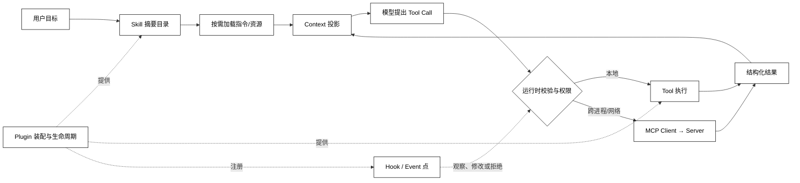

# Skill、Tool、MCP、Plugin 与 Hook 边界

## 学习目标

- 用“工作方法、一次动作、连接协议、可装配扩展、运行时拦截点”分别解释 Skill、Tool、MCP、Plugin 和 Hook。
- 能从一次请求的数据流判断某个对象是在改变上下文、提出动作、跨进程传输，还是参与宿主生命周期。
- 建立阅读 DeepSeek Harness `Everything-is-a-Plugin`、Cordis、skills 和 hooks 源码前的概念地图；不把产品约定误认为行业协议。

## 前置知识

- 已完成第 02–05 章，知道 Agent Loop、Context、Tool、State 和停止边界。
- 已阅读第 06 章的 [MCP 角色与能力](../06-MCP/01-MCP解决什么问题)、[JSON-RPC 消息边界](../06-MCP/03-JSON-RPC请求响应通知与_meta) 以及 [server/discover 能力发现](../06-MCP/05-server-discover与能力发现)。
- 本篇只建立边界；Skill 的目录结构见[下一篇](./02-Skill结构与渐进式上下文)，Plugin 生命周期见[第05篇](./05-Plugin注册与生命周期)。

## 五个词先分开

### Skill：完成一类任务的方法

**Skill** 是面向一类任务的可装载工作方法，通常包含简短说明、详细指令、参考资料、模板、脚本和验证步骤。它改变的是“如何组织一次工作”的上下文投影，通常不直接代表一个副作用动作。

白话说，Skill 像“做代码审查的检查清单和操作手册”；它可以告诉 Agent 先读哪些文件、怎样判断风险、什么时候调用工具，但本身不等于“执行删除文件”的函数。

Skill 不是所有系统都必须具备的标准对象。产品可以把它实现为 Markdown 目录、数据库记录、远程模板或普通配置；重要的是保留“方法与上下文”和“动作执行”的边界。

### Tool：一次可校验的动作

**Tool** 是一次有名称、参数契约、执行入口和结果的动作，例如读取状态、查询数据库或请求审批。Tool 的输入通常需要 schema 校验，执行会产生副作用或外部观察。

白话说，Tool 像扳手：Skill 可以说明什么时候用扳手、用之前检查什么，但只有运行时真正调用 Tool，环境才会发生变化。模型提出 Tool Call 也不等于 Tool 已经执行。

### MCP：能力连接的协议边界

**MCP** 是连接 Host、Client 与 Server 的协议边界，描述如何发现和调用外部能力，以及如何交换资源、提示和结果。它解决的是跨进程或网络连接中的消息、能力和生命周期问题，不规定宿主内部必须如何实现 Skill 或 Plugin。

白话说，MCP 像插座规格：它让两个进程按约定接上，但插座不会替你决定房间里谁有钥匙，也不会把一个本地插件自动变成 Skill。

第 06 章讲的是 MCP 的协议角色与传输；本章只在需要判断边界时引用它，不提前展开协议细节。

### Plugin：宿主可装配的扩展单元

**Plugin** 是宿主可以安装、组合、启用、禁用和卸载的扩展单元。它可以注册 Tool、Skill、Service、Hook、UI 或事件监听器，通常还拥有配置、依赖、资源和清理逻辑。

白话说，Plugin 像一间可搬进宿主的工作室：工作室可以带来多个工具和规则，也要在关门时撤掉它们。一个 Tool 可以被 Plugin 提供，但二者不是同义词。

“Everything is a Plugin”是 DeepSeek Harness 对自身组合方式的架构描述，不是 Agent 行业协议。阅读其他框架时，要先找它的装配和生命周期入口，再判断它是否有名为 Plugin 的对象。

### Hook：已经存在流程上的扩展点

**Hook** 是宿主在既定流程中暴露的拦截或观察点。Hook 可以旁路记录、修改输入、拒绝动作、包装下游结果，或在某些事件发生时触发额外工作；能做什么取决于宿主为该点定义的返回值和错误语义。

白话说，Hook 像门口的检查站：它不是整栋房子，也不一定拥有独立能力；它在某个时刻观察或决定“能否继续、带什么参数继续”。

Hook 可能由 Plugin 注册，但 Plugin 也可以只注册 Service 或 Tool；同样，事件监听器也未必有权拦截。不要用名称推断权限。

## 概念关系与最小数据流

一次“按规范生成报告”的请求可以经过如下边界：先用 Skill 的摘要帮助发现方法，再按需加载指令和资源；模型据此提出 Tool；运行时校验权限并执行本地 Tool 或通过 MCP Client 调用外部 Server；Plugin 负责把这些能力装配进宿主；Hook 在请求、工具执行或结果回填等既定点观察或作出决定。



阅读提示：`Skill` 在上游主要影响 Context，`Tool` 和 `MCP` 进入执行边界，`Plugin` 管理装配，`Hook` 插入既有流程；虚线表示提供或注册关系，不表示 Hook 一定拥有执行权限。

## 一个本地边界分类器

下面的代码用不依赖框架的 `dataclass` 表示五类对象，并按“它改变什么边界”分类；它适合检查设计文档中的命名，不模拟真实网络或模型调用。

```python
from dataclasses import dataclass


@dataclass(frozen=True)
class BoundaryObject:
    name: str
    kind: str
    changes: str


OBJECTS = [
    BoundaryObject("review-practice", "Skill", "context and method"),
    BoundaryObject("read_file", "Tool", "one environment action"),
    BoundaryObject("filesystem-server", "MCP", "process connection"),
    BoundaryObject("audit-plugin", "Plugin", "host composition"),
    BoundaryObject("before_tool", "Hook", "an existing execution point"),
]


def describe(objects: list[BoundaryObject]) -> list[str]:
    return [f"{item.kind}: {item.name} -> {item.changes}" for item in objects]


for line in describe(OBJECTS):
    print(line)
# 输出：Skill: review-practice -> context and method
# 输出：Tool: read_file -> one environment action
# 输出：MCP: filesystem-server -> process connection
# 输出：Plugin: audit-plugin -> host composition
# 输出：Hook: before_tool -> an existing execution point
```

这个分类器故意不把“名字里含 skill/plugin 的对象”当作事实。阅读源码时应继续追踪它是否有注册表、执行器、连接协议、生命周期或拦截返回值。

### Skill 不等于 Tool 清单

Skill 可以引用 Tool，但它还包括顺序、判断、失败处理和验证方法。把全部 Tool 描述塞进 Skill 正文，会让每次运行都携带不必要上下文；更好的做法是先给摘要，使用时再加载具体资源。

### MCP 不等于 Plugin 安装器

MCP Server 可以由一个 Plugin 启动或管理，但协议连接本身只说明能力如何被发现和调用。安装、版本、卸载、权限和宿主资源清理仍属于宿主或部署系统的责任。

### Hook 不等于 Guardrail

Guardrail 通常描述一类输入/输出或动作约束；Hook 是承载约束的运行时位置。某个 Hook 可以实现 Guardrail，也可以只做指标记录；只有阅读返回值和错误传播才能判断它会不会阻断流程。

## 源码阅读心智模型

### DeepSeek Harness：从 Plugin 组合追到 Skill/Hook

DeepSeek Harness 官方仓库将自身描述为“Everything is a Plugin”，并以 Cordis 作为组合基础；当前项目标注为 developer preview，内部接口可能发生破坏性变化。阅读时先找 profile 或 composition 如何挂载 Plugin，再沿 `ctx` 找 Skill registry、工具注册和 Hook/event 监听，不要把仓库中的命名当成跨框架标准。

官方的 [Skills 子系统说明](https://github.com/deepseek-ai/deepseek-harness/blob/master/docs/subsystems/skills.md) 把 provider、`ctx.skills` 和 model-facing consumer 分开；这正好对应“来源、目录、按需加载”的阅读顺序。

### OpenAI Agents SDK：对照 Agent、instructions 与 tools

OpenAI Agents SDK 的核心阅读入口通常是 Agent 配置、Runner、工具调用和 tracing。它可能提供 instructions、tools、handoff 或 guardrail，但不因为这些对象存在就自动形成本文定义的 Skill 或 Plugin。沿 Runner 追踪“上下文如何进入模型、工具如何被执行、结果如何回填”即可建立可比关系。

### MCP：对照连接边界

阅读 MCP SDK 时先定位 Host/Client/Server、transport 和 capability 协商，再看 Tool/Resource/Prompt 如何映射。MCP 的协议消息不替代宿主的 Plugin 生命周期，也不自动赋予远端 Tool 更高权限。

### 四问定位任意实现

1. 谁提供方法说明，何时加载完整内容？这是 Skill 或 Context 侧。
2. 谁把候选动作变成受校验的执行？这是 Tool/Runtime 侧。
3. 谁负责跨进程发现、请求、响应和关闭？这是 MCP/连接侧。
4. 谁安装、组合、拦截和清理扩展？这是 Plugin/Hook/宿主侧。

## 易混点

- **Skill 与 Prompt 不完全相同**：Skill 可以包含 Prompt 片段，但还需要来源、加载、资源和验证边界。
- **Tool Call 与 Tool 执行不同**：模型提出候选动作后，Runtime 仍需做 schema、权限、审批和幂等检查。
- **MCP 与能力本身不同**：同一个 Tool 可以通过本地函数、进程内 Service 或 MCP 暴露，连接方式不改变其业务契约。
- **Plugin 与包管理器不同**：安装文件只是获取扩展；注册、依赖、启用、卸载和失败回滚还没有发生。
- **Hook 的权力取决于扩展点**：观察型事件、串行决策和 waterfall 拦截的返回语义不能互换。
- **产品名不等于行业协议**：DeepSeek Harness、Cordis、Agent SDK 各自的 API 需要以对应版本源码和文档为准。

## 课后小问

1. Skill 为什么不应该直接被当作一个可执行 Tool？

   **答案**：Skill 描述完成一类任务的方法和上下文，Tool 才是带输入契约并进入执行边界的一次动作。

   **解析**：如果把 Skill 当 Tool，运行时会失去“加载指令”和“执行副作用”的区分；模型的一段方法说明也可能被误当成已发生的外部操作。正确的数据流是 Skill 影响 Context，模型提出 Tool Call，Runtime 再校验并执行。

2. MCP Server 被 Plugin 启动时，哪些责任仍然不属于 MCP 协议？

   **答案**：安装版本、宿主依赖、启停清理、用户授权和失败回滚仍由宿主或插件系统负责。

   **解析**：MCP 规定连接双方如何协作，但不规定某个应用如何装载一个扩展。把部署策略写成协议保证，会在更换 Host、Transport 或 Server 时产生错误假设。

3. 一个只记录耗时的 Hook 是否一定能拒绝 Tool？

   **答案**：不一定。

   **解析**：要看宿主为该扩展点定义的是旁路事件、串行决策还是可短路的 waterfall，以及监听器返回值如何被解释。源码阅读必须追到 dispatch 和错误传播，而不能凭“Hook”这个名字判断。

## 本节小结

- Skill 是可按需加载的工作方法，Tool 是一次可校验动作，MCP 是连接能力的协议边界。
- Plugin 管理宿主内扩展的装配和生命周期，Hook 在既有流程点观察、修改或拒绝。
- 五者可以组合，但不存在“一个词自动包含其他四个词”的行业定义。
- 阅读源码时按“上下文 → 执行 → 连接 → 装配 → 拦截”追踪数据流和所有权。

## 快速回顾

- 能用一句话区分 Skill、Tool、MCP、Plugin、Hook。
- 能画出 Skill 加载到 Tool 执行、结果回填的最小数据流。
- 能说明 DeepSeek Harness 的架构口号为什么不能当作 MCP 或 Agent SDK 标准。
- 下一篇阅读 [Skill 结构与渐进式上下文](./02-Skill结构与渐进式上下文)。
