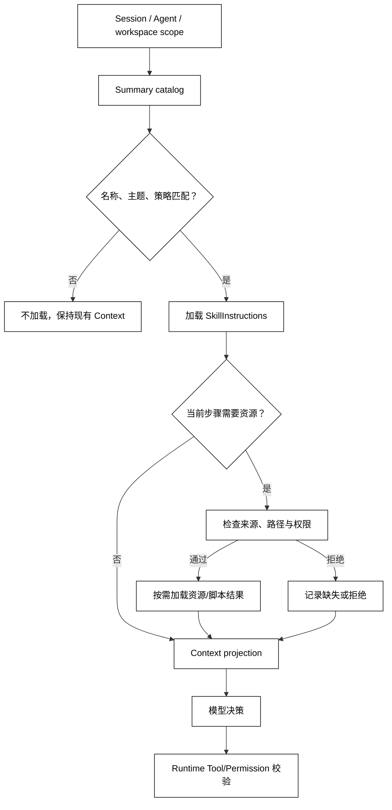

# Skill 结构与渐进式上下文

## 学习目标

- 把一个 Skill 拆成可发现的摘要、按需加载的正文、受约束的资源和可验证的输出。
- 理解 Progressive Disclosure 如何降低初始上下文成本，而不是把权限检查推迟到模型身上。
- 能从源码中区分“列出候选 Skill”和“为一次调用加载完整 Skill”。

## 前置知识

- 已阅读 [Skill、Tool、MCP、Plugin 与 Hook 边界](./01-Skill-Tool-MCP-Plugin与Hook边界)。
- 已了解第 05 章 Context 投影、上下文压缩和 Session 生命周期。
- 需要知道 Tool 是执行边界；本篇不把 Skill 正文当作 Tool 权限。

## Skill 的最小结构

### SkillManifest：发现所需的最小元数据

**SkillManifest** 是用于发现和筛选 Skill 的元数据集合。常见字段包括稳定名称、简短描述、适用范围、版本、来源和是否允许模型/用户调用。它应足够小，让目录可以展示和排序，但不能假装已经包含完整方法。

用途：目录、搜索或模型选择只需要摘要时，读取 Manifest；不要因为为了“方便”而把所有参考文档拼进每一次模型输入。

白话说，Manifest 像书架上的索引卡；它告诉你书名和适用主题，不等于把整本书背进脑中。

### SkillInstructions：可执行的方法说明

**SkillInstructions** 是加载后进入 Context 的操作规则，例如步骤顺序、判断条件、错误处理和输出格式。它解释“怎样完成任务”，但仍不能绕过 Runtime 的权限和工具校验。

用途：在模型真正选择某个 Skill 后，向它提供足够的局部方法；指令要说明外部资料是数据还是规则，防止把被检索文本当作高信任系统指令。

### SkillResources：参考资料与模板

**SkillResources** 是 Skill 需要引用的文档、模板、示例、schema 或资产。资源可以延迟加载，也可以按名称单独请求；资源的来源和访问策略应与指令分开记录。

用途：需要具体 API、项目约定或模板时才读资源，避免目录列表或初始 Prompt 变成不可控的大文本。

### SkillScripts：可验证的辅助程序

**SkillScripts** 是 Skill 声明的脚本或验证步骤。脚本是否能写文件、联网、启动进程，必须由宿主的 Tool、Permission 和 Sandbox 决定；Skill 只提供方法描述或请求一个已登记的执行入口。

用途：把格式检查、生成骨架或本地验证交给可重复程序，把高风险副作用留给显式的执行和审批边界。

## Progressive Disclosure：三层上下文

### Summary Layer：先给候选摘要

第一层只暴露稳定名称、描述和触发线索。模型或用户可以据此决定“是否需要这个 Skill”，而无需读取所有细节。摘要本身应是可审计数据，不应包含隐含的秘密、凭证或未经验证的执行指令。

### Definition Layer：选择后加载正文

第二层加载 Skill 正文、适用条件、步骤和失败处理。加载应绑定当前 workspace、Agent、Session 和策略；同名 Skill 在不同 scope 可见，不代表它们互相覆盖。

### Resource Layer：遇到具体需要再取资源

第三层只读取本次任务引用的资源或执行已声明的验证脚本。资源路径、大小、MIME、版本和访问权限要在运行时检查；不要用目录遍历把整个 Skill 包“顺手”注入 Context。

## 从发现到上下文投影

一次请求的最小链路是：构造查看 scope → 读取摘要 → 按名称和策略匹配 → 加载正文 → 选择资源 → 生成 Context projection → 由模型提出动作。Skill 内容改变的是可见方法，不是执行器的 allowlist。



阅读提示：`Catalog` 到 `Definition` 再到 `Resource` 是渐进加载；最后仍要进入 `Runtime` 校验，Skill 的可见内容不会自动扩大 Tool 权限。

## 一个本地渐进加载器

下面的代码用内存对象模拟三层加载，并在输出中显示每一步实际加入了什么；它适合验证上下文预算和加载顺序，不访问网络和文件系统。

```python
from __future__ import annotations

from dataclasses import dataclass


@dataclass(frozen=True)
class Skill:
    name: str
    summary: str
    instructions: str
    resources: dict[str, str]


class SkillCatalog:
    def __init__(self, skills: list[Skill]) -> None:
        self._skills = {skill.name: skill for skill in skills}

    def summaries(self) -> list[tuple[str, str]]:
        return sorted((skill.name, skill.summary) for skill in self._skills.values())

    def load(self, name: str, resource: str | None = None) -> list[str]:
        skill = self._skills[name]
        projection = [f"summary:{skill.name}", f"instructions:{skill.instructions}"]
        if resource is not None:
            projection.append(f"resource:{resource}={skill.resources[resource]}")
        return projection


catalog = SkillCatalog([
    Skill(
        name="release-review",
        summary="检查发布变更并给出可验证结论",
        instructions="先读取变更，再运行检查，最后区分阻断和提示",
        resources={"checklist": "tests, diff, rollback"},
    ),
])

print(catalog.summaries())
print(catalog.load("release-review"))
print(catalog.load("release-review", "checklist"))
# 输出：[('release-review', '检查发布变更并给出可验证结论')]
# 输出：['summary:release-review', 'instructions:先读取变更，再运行检查，最后区分阻断和提示']
# 输出：['summary:release-review', 'instructions:先读取变更，再运行检查，最后区分阻断和提示', 'resource:checklist=tests, diff, rollback']
```

示例中的 `load` 没有实现真实权限；生产实现应在读取资源前检查 workspace、调用者、资源大小和敏感字段，并将失败作为结构化 Observation，而不是静默拼接空字符串。

### Context Projection：Skill 内容的运行时视图

**Context Projection** 是一次运行把 Skill 摘要、正文和资源选成可见输入的结果。它不是原始 Skill 包，也不是 Session 的全部历史。投影需要记录来源、版本、scope 和选择理由，方便重放和审计。

用途：当同一 Skill 需要面向不同 Agent 或工作目录时，用投影表达“这次看到了什么”，而不要复制多份不可追踪的正文。

### Catalog Cache：可缓存摘要，不缓存越权结论

目录摘要通常适合缓存，但缓存键至少要包含 scope、workspace 和 provider revision。权限、资源存在性或用户配置改变时，旧目录不能继续当作授权结论；重新加载时仍需重新检查。

### Progressive Disclosure 与 Token Budget

渐进加载可减少初始 Token，但不保证总成本一定下降：如果任务最终需要整包资料，后续加载仍会产生用量。应结合命中率、资源大小、上下文窗口和结果质量评估，而不是把“按需”当成免费的保证。

## 源码阅读心智模型

### DeepSeek Harness：provider、registry 与 consumer 分层

当前 DeepSeek Harness 的 Skill 文档把能力拆成 Skill service definition、provider 与 consumer；`ctx.skills` 负责合并来源，model-facing consumer 负责目录和按需加载。源码阅读先看 provider 如何列出候选，再看 registry 如何按 host/scope 合并，最后看 `skill` 工具怎样加载完整内容。

官方文档还明确区分了摘要目录和完整 Skill 内容；这是渐进式上下文的产品实现示例，不等于所有 Agent 框架都要使用同样的字段或 XML 包装。

### OpenAI Agents SDK：instructions 是相邻概念

OpenAI Agents SDK 的 `instructions` 和工具描述可以影响模型上下文，但不要直接把一段动态 instructions 叫作 Skill。要查清它是否有独立的发现、版本、资源和加载生命周期；若没有，就按 Agent 配置或 Prompt 片段理解。

### MCP：Resource 的按需读取与 Skill 不同

MCP Resource 可以提供外部数据，MCP Prompt 可以提供提示模板，但协议层不会替宿主决定哪些内容该进入 Context，也不会自动提供 Skill 的匹配和验证步骤。阅读 MCP 源码时把“协议读取”与“宿主上下文投影”分开。

### 读源码时的三个断点

1. **摘要断点**：哪个函数只返回名称、描述和可见性？
2. **加载断点**：哪个函数读取正文、资源和当前 scope？
3. **执行断点**：哪个 Runtime 仍负责 Tool、Permission、Sandbox 和输出校验？

## 易混点

- **渐进加载不是安全隔离**：没有看到某个 Tool 只表示上下文不可见，不表示运行时绝对不能调用。
- **摘要不是完整契约**：描述用于匹配，真正执行前还要读取版本、参数和策略。
- **资源引用不是资源内容**：路径或 URL 进入 Prompt 前必须经过来源、大小和权限检查。
- **缓存命中不等于当前有效**：Scope、workspace、配置和 provider revision 变化都可能使目录失效。
- **Skill 版本不等于模型版本**：Skill 的方法变更可能影响行为，但不会自动改变下游模型的能力声明。

## 课后小问

1. 为什么要把 Skill 的摘要和正文分成两次加载？

   **答案**：摘要足以完成发现和匹配，正文只在选中后进入 Context，可以减少无关上下文并保留加载审计点。

   **解析**：如果一开始把所有正文都放入 Prompt，模型选择成本和 Token 消耗都会扩大；如果只给摘要又直接执行，则缺少方法细节。两层之间还要绑定 scope、版本和策略。

2. Skill 正文写着“可以删除文件”，是否就获得删除权限？

   **答案**：没有。

   **解析**：正文只是工作方法，删除仍需 Tool allowlist、参数校验、Permission、Approval 或 Sandbox 等运行时边界。把 Prompt 文本当作授权会把不可信输入升级为副作用。

3. 目录缓存何时不能直接复用？

   **答案**：scope、工作目录、provider revision 或策略发生变化，或者上一次发现不完整时，都不能把旧目录当作当前完整结论。

   **解析**：缓存保存的是某次发现的观察，不是永久事实。安全相关的可见性和资源策略应在加载和执行边界重新检查。

## 本节小结

- Skill 的 Manifest、Instructions、Resources 和 Scripts 承担不同的数据和生命周期责任。
- Progressive Disclosure 通过摘要 → 正文 → 资源三层加载控制 Context 成本，但不替代权限和执行校验。
- Context Projection 应记录 scope、版本和来源，以便重放、缓存失效和安全审计。
- 阅读实现时重点找目录断点、加载断点和执行断点。

## 快速回顾

- 能画出 Skill 从摘要到资源的三层加载路径。
- 能说明 Skill 正文为什么不能代替 Tool 权限。
- 能指出目录缓存键和失效事件的最小组成。
- 下一篇阅读 [Skill 发现、匹配、加载与卸载](./03-Skill发现匹配加载与卸载)。
