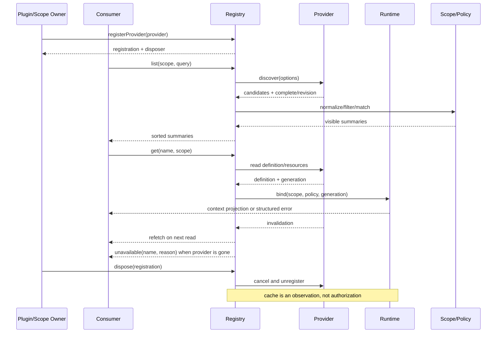

# Skill 发现、匹配、加载与卸载

## 学习目标

- 把 Skill 生命周期拆成发现、规范化、匹配、加载、失效和卸载，而不是把“列目录”当成全部实现。
- 区分 Provider、Registry、Consumer 和 Runtime 的所有权，理解 scope、缓存和取消如何影响结果。
- 用一个本地注册表模拟可重入加载和 disposer，建立阅读 DeepSeek Harness Skill 子系统的入口。

## 前置知识

- 已阅读 [Skill 结构与渐进式上下文](./02-Skill结构与渐进式上下文)。
- 已了解第 05 章的 Session/Context 生命周期与第 06 章的连接关闭语义。
- Plugin 的宿主装配会在[第05篇](./05-Plugin注册与生命周期)展开；本篇只说明 Skill provider 的生命周期。

## 发现链路的四个角色

### SkillProvider：提供候选来源

**SkillProvider** 从本地目录、内嵌包、仓库配置或远程目录返回 Skill candidates。Provider 负责来源和发现状态，不应偷偷替 Consumer 决定当前模型是否能调用，也不应把外部文本直接当成可信指令。

用途：需要增加一个 Skill 来源时，新增 Provider，而不是把扫描文件、匹配关键词和执行 Tool 全塞进 Agent Loop。

Provider 的注册属于 Plugin 或 Scope Owner 的资源。Owner 保存注册返回的 `Registration`/disposer，并在卸载、scope 结束或注册失败时调用 `dispose(registration)`；Consumer 不拥有 Provider 的注册资源。

### SkillRegistry：合并并选择可见项

**SkillRegistry** 保存 provider 注册、scope 层级和当前 revision，并在读取时合并候选。它可以按名称、优先级、来源或 scope 选择 winner；这些规则是实现约定，除非协议明确说明，不应写成通用标准。

### SkillConsumer：把目录转成用户/模型入口

**SkillConsumer** 使用 Registry 的摘要，构造用户菜单或模型-facing Tool，并在调用时请求完整 Skill。Consumer 应保持“可发现”和“可执行”两个层次，不能因为展示了名称就认为正文加载成功。

### SkillRuntime：绑定本次调用

**SkillRuntime** 把加载结果绑定到 Agent、Session、workspace 和策略，负责取消、超时、资源清理及输出回填。它是一次调用的所有权边界，不应依赖全局可变的“当前 Skill”。

### 白话理解：先找书，再借阅，最后归还

可以把发现想成书店搜索：Provider 报告书名，Registry 按书架和读者权限筛选，Consumer 展示目录，Runtime 借出正文；书架下线时要撤掉目录和未完成借阅。搜索到书名不代表已经借到书，更不代表读者有权执行书里的动作。

## 生命周期与失效

### Discover：取得候选

发现阶段读取 Provider 的候选列表。结果应区分完整和不完整：临时来源失败时可以保留 last-good 结果，但不能把不完整观察永久缓存成事实。

### Normalize：验证 Manifest

规范化阶段检查名称、版本、路径、描述长度和声明字段。畸形 candidate 应被拒绝并记录来源；否则后续匹配错误会被误认为模型选择错误。

### Match：结合 scope 和策略

匹配阶段结合用户目标、workspace、Agent scope、用户/模型调用策略和 provider 优先级。匹配只决定“哪一个候选进入下一阶段”，不授予 Tool 或文件权限。

### Load：获取正文与资源

加载阶段读取正文，必要时再读取资源。加载要绑定 cancellation signal 和 provider generation；如果来源在加载期间变化，结果应被标记为过期或重新验证。

### Invalidate：宣布重新发现

Provider、配置或文件变化时，需要使目录缓存失效。失效事件通常只传“需要重新读取”的信号，不应假设所有 Consumer 都共享同一份筛选结果。

### Unload：撤销注册和调用

卸载由持有注册的 Plugin/Scope Owner 发起：Owner 调用 `dispose(registration)`，Registry 再撤销 Provider 注册、停止观察器、取消未完成加载并清理临时资源。Consumer 只能 `list`、`get`、`refetch`，或接收 `unavailable`；它不直接 dispose 注册。已加载的只读正文可以保留为审计快照，但不能继续冒充当前可调用能力。

## 从 Provider 到 Runtime 的数据流



阅读提示：`list` 只产生可见摘要，Consumer 的 `get` 才取正文并绑定 Runtime；Provider 的 invalidation 不应绕过 scope/policy 重新检查，Owner 的 `dispose(registration)` 要覆盖注册和在途工作。

## 一个可卸载的本地 Skill Registry

下面的代码用标准库模拟 Provider 注册、主题匹配、加载计数和 disposer；`PluginOwner` 持有 registration，Consumer 只调用 `list`/`get`，不直接清理 Provider，不执行任意脚本。

```python
from dataclasses import dataclass
from typing import Callable


@dataclass(frozen=True)
class Candidate:
    name: str
    topics: frozenset[str]
    body: str


class SkillRegistry:
    def __init__(self) -> None:
        self._providers: dict[str, Callable[[], list[Candidate]]] = {}
        self._loads = 0

    def register(self, provider_name: str, discover: Callable[[], list[Candidate]]) -> Callable[[], None]:
        if provider_name in self._providers:
            raise ValueError(f"duplicate provider: {provider_name}")
        self._providers[provider_name] = discover

        def dispose() -> None:
            self._providers.pop(provider_name, None)

        return dispose

    def list(self, topic: str) -> list[str]:
        candidates = [candidate for discover in self._providers.values() for candidate in discover()]
        return sorted(candidate.name for candidate in candidates if topic in candidate.topics)

    def get(self, name: str) -> str:
        candidates = [candidate for discover in self._providers.values() for candidate in discover()]
        for candidate in candidates:
            if candidate.name == name:
                self._loads += 1
                return candidate.body
        raise KeyError(name)


class PluginOwner:
    def __init__(self, registry: SkillRegistry) -> None:
        self._registration = registry.register(
            "workspace",
            lambda: [Candidate("release-review", frozenset({"release"}), "check diff then test")],
        )

    def dispose(self) -> None:
        self._registration()


registry = SkillRegistry()
owner = PluginOwner(registry)
print(registry.list("release"))
print(registry.get("release-review"))
owner.dispose()
print(registry.list("release"))
# 输出：['release-review']
# 输出：check diff then test
# 输出：[]
```

真实实现还要为每次发现携带 `scope`、`revision`、`complete` 和取消信号；这个最小版本只用列表展示“Owner 持有 registration、Consumer 读取、Owner 卸载”的责任边界。

### Discovery Revision：让缓存有依据

**Discovery Revision** 是 Provider 或 Registry 用来表示候选变化的版本标识。它可以是递增整数、文件快照摘要或远端 ETag；它不是 Skill 的业务版本，也不能替代权限审计。

用途：让 Consumer 知道“旧目录是否需要重新取”，并在加载时检测发现与正文之间是否发生变化。

### Scope：同名能力的可见范围

**Scope** 表示一次读取可以看到的层级，例如全局、仓库、Agent preset 或 Session。Scope 选择应在 `list` 和 Consumer 的 `get` 两个入口都生效；只在展示时过滤、加载时回到全局查找，会产生越权或幽灵 Skill。

### Disposer：卸载的可组合句柄

**Disposer** 是注册返回并由 Plugin/Scope Owner 持有的清理函数。它应幂等、只撤销该 registration 拥有的资源，并能按照相反顺序释放依赖。把 disposer 交给 Consumer 或丢进全局列表，会让热重载后出现重复监听和陈旧 provider。

### Incomplete Observation：不完整发现

远程目录、文件监听或权限检查可能暂时失败。系统可以返回当前可用 candidates 并标记 `complete=False`，但下一次读取要重试，且不应把该结果当成稳定缓存。缺失不等于“不存在”。

## 源码阅读心智模型

### DeepSeek Harness：看 `ctx.skills` 的注册和读取分离

当前官方 Skills 文档说明，provider 在 plugin apply 阶段同步注册，远程初始化和 discovery 进入 `list()`；registry 按 host 和 per-scope layers 合并，读取时再返回排序后的摘要。源码阅读顺序应是 Owner 的 `registerProvider`/`register` → `list`/snapshot → `get`/consumer → Owner 的 `dispose(registration)` → invalidation，而不是从用户看到的 Skill 文本倒推。

同名 provider 的 scope、rank、provider order 等规则是该实现的选择。即使某个版本采用“最近层优先”，也不要把它写成 Skill 的通用标准。

### OpenAI Agents SDK：找工具和 Agent 生命周期

对照阅读时，先找 Agent/Runner 的配置装配和运行结束清理，再问工具描述是否有独立发现缓存。若框架没有 Skill Registry，就把类似逻辑归入应用层，不要凭功能相似强行映射。

### MCP：连接关闭和能力刷新是另一条生命周期

MCP Client 的 initialize、list、call、close 可能与 Skill 的 discovery/load/unload 对照，但两者不共享对象所有权。远端 Server 断开时，宿主需要撤销暴露的 Tool；这不是 Skill disposer 自动完成的事。

### 读源码的检查清单

- 发现是否有完整性标记和 revision？
- list 与 Consumer 的 get 是否使用同一个 scope 和 policy？
- Provider 失败是拒绝整次读取、返回 last-good，还是返回不完整观察？
- Owner 的 dispose 是否取消在途任务、清理监听器并使缓存失效？Consumer 是否只得到 unavailable？
- 同一 provider 重载是否会导致重复注册或旧版本同时可见？

## 易混点

- **发现成功不等于加载成功**：候选摘要存在，正文路径可能已经删除或当前调用者无权读取。
- **卸载不等于删除文件**：卸载主要撤销运行时注册和资源；包文件是否删除属于安装器或部署层。
- **缓存失效不等于自动执行**：失效只触发下一次发现，不能绕过用户审批或直接执行 Skill。
- **scope 不是线程局部变量**：异步加载必须显式传递 scope，避免从全局隐式读取。
- **Provider 失败不一定等于空列表**：空列表会误导匹配和用户；应区分“没有候选”和“发现不完整”。

## 课后小问

1. 为什么 `list(scope=A)` 后不能无参数 `get(name)`？

   **答案**：加载必须沿用 scope A 和 policy，否则可能把同名的全局或其他 Agent Skill 加载进来。

   **解析**：摘要和正文是同一条可见性链路的两个阶段；只在 list 过滤会造成 presentation/execution 不一致，和 Tool allowlist 错位类似。

2. Provider 发现失败时，为什么 `complete=False` 比返回空列表更准确？

   **答案**：空列表表示“确认没有候选”，而 `complete=False` 表示当前观察可能缺失，需要保留可用结果并安排重试。

   **解析**：把临时 IO、权限或网络错误转换为空列表，会让用户误以为 Skill 不存在，缓存还可能长期固定错误。

3. disposer 为什么应当只撤销自己的资源？

   **答案**：多个 Plugin 或 scope 可以同时注册同类 provider，互相撤销会破坏仍在使用的能力。

   **解析**：按注册句柄建立所有权，配合幂等清理和逆序释放，才能支持热重载、失败回滚与嵌套 composition。

## 本节小结

- Skill discovery 由 Provider 提供候选，Registry 合并可见性，Consumer 暴露入口，Runtime 绑定一次调用。
- 生命周期应显式区分 discover、normalize、match、load、invalidate 和 unload。
- Scope、revision、complete 标记和 disposer 是渐进加载能稳定运行的关键状态。
- 源码阅读要沿注册 → 读取 → 加载 → 清理追踪，而不是只看 Skill 文本。

## 快速回顾

- 能解释 Consumer 的 `list`/`get`/`refetch`/`unavailable` 与 Owner 的 `dispose` 不同责任。
- 能指出不完整发现和空列表的语义差异。
- 能说明 scope 为什么必须贯穿展示与加载。
- 下一篇阅读 [Skill 指令、资源与脚本](./04-Skill指令资源与脚本)。
