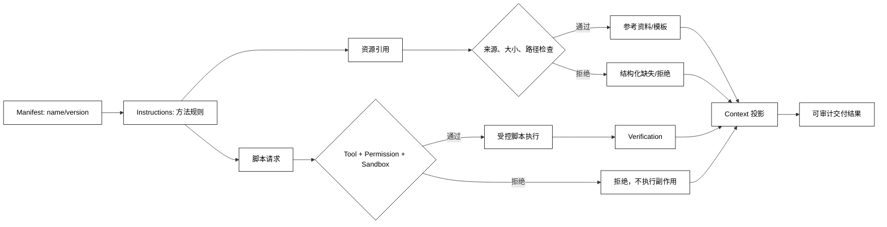

# Skill 指令、资源与脚本

## 学习目标

- 区分 Skill 指令、参考资源、脚本和验证结果的信任级别与运行时责任。
- 设计“正文先读、资源按需取、脚本显式登记、结果可校验”的最小数据流。
- 阅读 DeepSeek Harness skills 时，能定位 `SKILL.md`/资源/工具注入的边界，而不把目录约定当成通用协议。

## 前置知识

- 已完成 [Skill 发现、匹配、加载与卸载](./03-Skill发现匹配加载与卸载)。
- 已了解第 03 章的 Instructions、Prompt 来源和 Context Window，以及第 04 章的 Tool 执行和输出校验。
- 本篇的脚本只做本地确定性模拟；危险操作的 Permission、Sandbox 和失败传播见[第09篇](./09-权限隔离失败传播与插件安全)。

## 四类内容的责任

### Instructions：说明如何工作

**Instructions** 是 Skill 进入 Context 的方法说明，包括前置条件、步骤、判断、失败处理和输出要求。指令可以来自维护者，但正文内部引用的外部文件、检索结果和用户输入仍应按数据处理，不能自动提升为高信任规则。

用途：让模型知道“先做什么、何时停、如何报告”，而不是用一段自然语言替代 Runtime 的授权、schema 或事实校验。

### Resources：供步骤读取的资料

**Resources** 是指令所引用的文档、模板、schema、示例或资产。资源应有明确相对路径、媒体类型、大小上限和来源；只读取本步骤真正需要的资源，并保留摘要或版本信息。

用途：把稳定方法与易变项目资料分开更新，也能在不同 workspace 使用同一套 Skill 方法而换一份资源。

### Scripts：已登记的辅助程序

**Scripts** 是 Skill 请求执行的可重复程序。脚本路径不等于执行权限：宿主必须把脚本映射到受控 Tool，检查参数和工作目录，并决定是否需要审批或 Sandbox。

用途：将格式检查、生成草稿、解析本地数据等确定性工作移出模型，同时让每次执行都有结构化结果。

### Verification：验证交付状态

**Verification** 是脚本、Tool 或人工步骤对输出进行的检查，例如 schema、测试、差异检查或回滚预览。它不应被隐藏在“成功”文本里；成功应有可观察的状态和证据。

用途：阻止 Skill 把“已经生成了文件”误报成“文件满足契约”，也方便从失败轨迹提炼回归测试。

### 白话理解：说明书、资料、按钮和验收单

Instructions 像说明书，Resources 像查阅资料，Scripts 像已经接线并登记过的按钮，Verification 像验收单。说明书可以告诉你按按钮的条件，但不能把一个未登记的按钮变成可执行，也不能替验收单签字。

## 信任与数据流

把 Skill 包看成四种数据：维护者指令、外部资源、脚本请求、验证事实。指令可以影响模型的工作方法，资源是待分析数据，脚本请求要经过 Tool/Permission，验证结果才可作为后续事实回填 Context。任何资源都可能含有“忽略规则”的文本，必须保留来源标签。



阅读提示：资源和脚本都要经过独立门控；`Instructions` 只能提出请求，`Verification` 才能把执行产物转成可依赖事实，错误路径也要回填到 Context。

## 一个本地 Skill 执行器

下面的代码把资源读取和脚本执行都限制在声明集合中，用纯内存函数模拟“脚本已登记、结果需验证”；它不执行任意字符串，也不访问网络。

```python
from dataclasses import dataclass
from typing import Callable


@dataclass(frozen=True)
class SkillPackage:
    name: str
    instructions: str
    resources: dict[str, str]
    scripts: dict[str, Callable[[str], str]]


class SkillRunner:
    def __init__(self, package: SkillPackage) -> None:
        self.package = package

    def read_resource(self, name: str) -> str:
        if name not in self.package.resources:
            raise KeyError(f"resource is not declared: {name}")
        return self.package.resources[name]

    def run_script(self, name: str, argument: str) -> str:
        if name not in self.package.scripts:
            raise PermissionError(f"script is not registered: {name}")
        return self.package.scripts[name](argument)

    def verify(self, output: str) -> bool:
        return output.startswith("checked:") and output.endswith("ok")


package = SkillPackage(
    name="release-review",
    instructions="read checklist, run check, report evidence",
    resources={"checklist": "diff; tests; rollback"},
    scripts={"check": lambda target: f"checked:{target}:ok"},
)
runner = SkillRunner(package)
print(runner.read_resource("checklist"))
output = runner.run_script("check", "release-7")
print(output, runner.verify(output))
try:
    runner.run_script("shell", "delete-all")
except PermissionError as error:
    print(type(error).__name__, str(error))
# 输出：diff; tests; rollback
# 输出：checked:release-7:ok True
# 输出：PermissionError script is not registered: shell
```

真实宿主还要校验工作目录、资源大小、脚本参数、超时、取消和副作用状态；示例中的 `lambda` 只是证明“未登记名称不能执行”。

### 资源路径：相对路径不是安全策略

Skill 目录里的 `references/checklist.md` 只能作为候选路径。读取前要解析规范化路径并确认它仍位于允许的根目录，拒绝 `..`、符号链接逃逸、超大文件和不允许的媒体类型。

用途：避免一个看似普通的 Skill 通过资源引用读取宿主凭证、其他项目文件或用户私密目录。

### 外部资料：数据不自动变成指令

资源内容可能包含自然语言命令、代码或恶意提示。加载后应带有 `source=resource` 等来源标签，必要时包裹为数据区；模型可以总结它，但不能因此改变系统规则、权限或 Tool allowlist。

### 脚本注册：名称映射优于动态导入

宿主应把可执行脚本映射到显式的 Tool 或函数，保留参数 schema、资源范围和超时。直接按照 Skill 文本动态 import、拼接 shell 命令或把路径交给任意解释器，会跳过审计和权限边界。

### 输出校验：执行成功不等于任务完成

脚本返回 exit code 0 或字符串 `ok` 只表示程序结束；还需要 schema、业务条件、文件差异或测试等验证。验证失败时应记录结构化原因，并决定重试、修复、暂停或失败。

### 版本与引用：方法和资料可以分别更新

Skill 版本应记录正文、资源清单和脚本接口的变化。资源引用最好带稳定标识或摘要；否则正文没有变化而资料悄悄替换，会导致不可重放的结果。

## 源码阅读心智模型

### DeepSeek Harness：Skill 内容和工具注入分开

当前 DeepSeek Harness 的 Skills 文档把 provider/registry 和 model-facing consumer 分开，按名称加载完整定义，并把内容包装成 Skill 内容和资源段；官方示例还把“Skill section + tool registration + invocation-time inject”作为产品功能映射。阅读时找三处：Skill 文件/Provider 如何被发现、Consumer 如何把定义注入模型、脚本/Tool 如何再次进入执行门控。

源码仓库处于 developer preview，`SKILL.md`、目录字段和工具结果包装都可能变化。应记录版本和实际路径，不要把某个 XML 标签或文件布局写成跨产品协议。

### OpenAI Agents SDK：把方法与 Tool 分层观察

对照 OpenAI Agents SDK 时，观察 instructions、tool schema、Runner 和 guardrail 的边界。若应用把一套 instructions 和工具组合命名为“Skill”，这是应用层约定；应确认它是否有独立加载、版本和资源清理。

### MCP：Resource/Prompt 不是本地脚本

MCP Resource 和 Prompt 通过协议被读取或渲染，真正执行脚本仍需 Server 自己的权限、沙箱和错误语义。不要因为一个 MCP Server 暴露了“run”工具，就把它等价为宿主 Skill 的脚本目录。

### 读源码时的四个问题

1. 指令和外部资料是否带来源/信任标签？
2. 资源读取是否有根目录、大小和取消检查？
3. 脚本名称最终映射到哪个 Tool，谁拥有权限？
4. 验证结果是否回填为可观察事实，还是只打印自然语言？

## 易混点

- **资源引用不是资源授权**：相对路径、URL 或脚本名都必须经过宿主策略。
- **脚本成功不是业务成功**：退出码、字符串或模型自报结果都不能替代业务验证。
- **指令来源不等于信任级别**：包内参考资料也可能包含不可信外部文本。
- **动态加载不等于热重载**：热重载还需要旧实例清理、缓存失效和在途调用处理。
- **Skill 目录约定不等于 MCP 协议**：不同宿主可以用完全不同的载体实现同一概念。

## 课后小问

1. 为什么资源文件需要单独的来源和路径检查？

   **答案**：资源既可能越过文件边界，也可能携带不可信指令；它不能因为被 Skill 引用就自动获得读取或执行资格。

   **解析**：路径检查限制数据范围，来源标签限制 Prompt 解释方式，两者都不能由模型自行决定。读取结果还要带版本/摘要，便于重放和审计。

2. 为什么“脚本名称在 SKILL.md 里出现”不够作为执行条件？

   **答案**：文本只是请求，宿主还要确认脚本已登记、参数有效、调用者有权限，并设置超时和副作用边界。

   **解析**：否则攻击者可把任意命令写进可加载文本，动态 import 或 shell 拼接会绕过工具注册和审计。

3. 脚本返回 `ok` 后还需要什么？

   **答案**：需要针对任务契约的验证，例如 schema、测试、文件差异或业务状态。

   **解析**：程序结束只说明执行器完成，不代表目标完成；验证结果应进入结构化 Run 状态，决定是否继续或交付。

## 本节小结

- Instructions 说明方法，Resources 提供资料，Scripts 请求受控执行，Verification 证明结果。
- 外部资料要按数据处理，资源路径和脚本名称都不能绕过宿主策略。
- 输出成功必须经过结构化验证；Skill 文本、脚本结果和业务事实不是同一层。
- 阅读源码时沿“内容发现 → 模型注入 → Tool 门控 → 验证回填”追踪。

## 快速回顾

- 能解释指令、资源、脚本、验证四类内容的差异。
- 能指出为何不能动态执行 Skill 文本中的任意命令。
- 能画出资源/脚本各自经过门控再回填 Context 的路径。
- 下一篇阅读 [Plugin 注册与生命周期](./05-Plugin注册与生命周期)。
