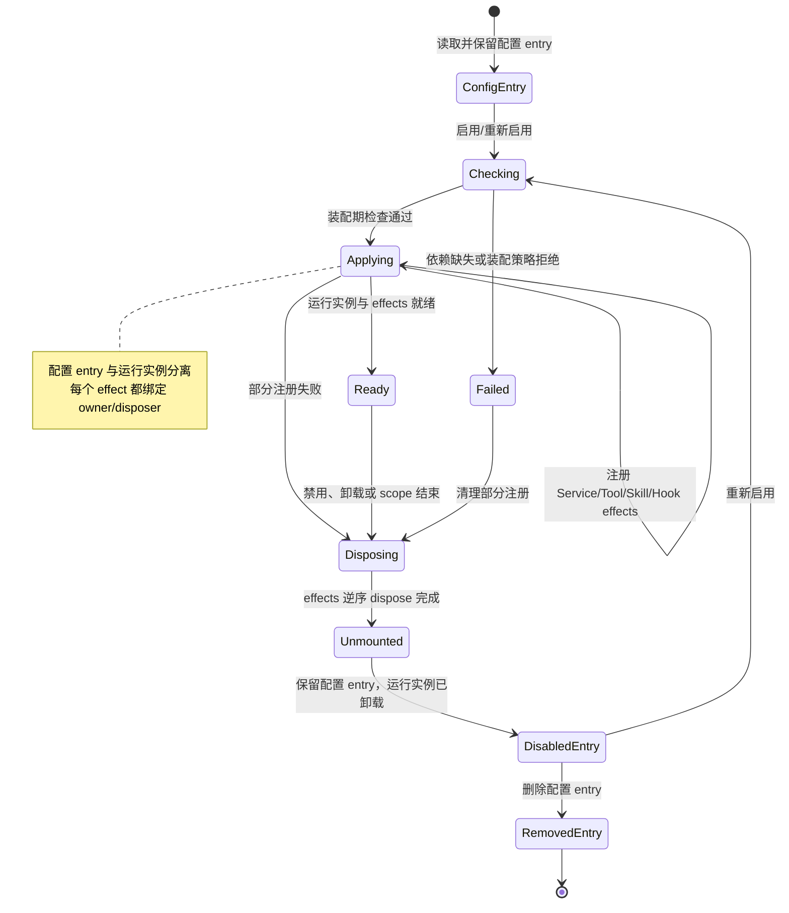

# Plugin 注册与生命周期

## 学习目标

- 把 Plugin 理解为可组合的生命周期单元，而不是“装了几个 Tool 的文件夹”。
- 还原声明、依赖检查、注册、就绪、失败回滚、禁用和卸载的状态流转。
- 用本地 Host 模拟 disposer 和失败回滚，并建立阅读 Cordis/DeepSeek Harness Plugin 的入口。

## 前置知识

- 已完成 [Skill 发现、匹配、加载与卸载](./03-Skill发现匹配加载与卸载) 和 [Skill 指令、资源与脚本](./04-Skill指令资源与脚本)。
- 已了解第 04 章 Tool Registry、第 05 章 Session 生命周期和第 06 章 MCP 初始化/关闭。
- `Dependency Injection` 与能力容器的细节见[下一篇](./06-Dependency-Injection与能力容器)。

## Plugin 的结构与状态

### Plugin Manifest：声明装配意图

**Plugin Manifest** 描述稳定名称、版本、入口、配置 schema、依赖和能力声明。它用于发现和预检，不应把“声明了能力”当成“能力已经注册或已获授权”。

用途：在加载代码前发现缺少依赖、重复名称和不兼容版本，减少半装配状态。

### Registration：把能力挂进宿主

**Registration** 是 Plugin 在宿主 Context 中创建的具体绑定，例如注册 Service、Tool、Skill Provider、Hook 或配置项。注册应返回 disposer 或 effect，使宿主能精确撤销这一次绑定。

用途：将“包存在”与“本次 composition 已生效”分开，支持 scope、测试和热重载。

### Lifecycle：状态而不是一串回调

**PluginLifecycle** 要把持久化的配置 entry 和短暂的运行实例分开看：entry 可以是 present、disabled-entry 或 removed；运行实例可以经历 checking、applying、ready、disposing、unmounted 或 failed。实现可以合并显示字段，但必须能解释配置是否保留、实例是否挂载、effects 是否存在以及谁负责清理。

### Rollback：失败时撤销已成功的部分

当 Plugin 注册了两个 Service 后第三个依赖失败，宿主应按逆序撤销前两个绑定，避免“加载失败但工具仍暴露”。回滚本身也可能失败，需要记录原始错误与清理错误，不能静默吞掉。

### 白话理解：搬入工作室并留下退场清单

Plugin 像一间搬进宿主的工作室：先核对钥匙和水电（依赖），再把设备接上（注册），全部可用后才开门营业（ready）；中途发现设备缺失，就按相反顺序拆走已经接好的设备（rollback）。

## 生命周期数据流



阅读提示：只有 `Ready` 才表示运行实例和全部 effects 已挂载；`Disposing` 之后是 `Unmounted`，配置 entry 可以继续停留在 `DisabledEntry`；重新启用必须回到 `Checking → Applying`，不能复用已卸载实例。

## 一个带回滚的本地 Host

下面的代码用标准库模拟 Plugin 的注册、失败回滚和卸载。每个安装动作都返回清理函数，故意让第三个动作失败以展示宿主如何撤销已完成的前两步。

```python
from dataclasses import dataclass, field
from typing import Callable


@dataclass
class PluginEntry:
    """配置 entry 保留；effects 属于可反复挂载的运行实例。"""

    name: str
    enabled: bool = True
    status: str = "ConfigEntry"
    services: list[str] = field(default_factory=list)
    _effects: list[Callable[[], None]] = field(default_factory=list)

    def _effect(self, install: Callable[[], Callable[[], None]]) -> None:
        disposer = install()
        self._effects.append(disposer)

    def _dispose_effects(self) -> None:
        for disposer in reversed(self._effects):
            disposer()
        self._effects.clear()

    def mount(self, fail: bool = False) -> None:
        if not self.enabled:
            self.status = "DisabledEntry"
            return
        self.status = "Checking"
        self.status = "Applying"
        try:
            self._effect(lambda: (self.services.append("skill"), lambda: self.services.remove("skill"))[1])
            self._effect(lambda: (self.services.append("tool"), lambda: self.services.remove("tool"))[1])
            if fail:
                raise RuntimeError("missing dependency: audit")
            self.status = "Ready"
        except RuntimeError:
            self._dispose_effects()
            self.status = "Failed"
            raise

    def disable(self) -> None:
        self.enabled = False
        self.status = "Disposing"
        self._dispose_effects()
        self.status = "Unmounted"
        self.status = "DisabledEntry"

    def enable(self) -> None:
        self.enabled = True
        self.mount()


entry = PluginEntry("audit")
try:
    entry.mount(fail=True)
except RuntimeError as error:
    print(type(error).__name__, str(error))
print(entry.status, entry.services)

entry.disable()
print(entry.status, entry.services, entry.enabled)
entry.enable()  # 重新检查并创建新的运行实例/effects。
print(entry.status, entry.services)
entry.disable()
print(entry.status, entry.services)
# 输出：RuntimeError missing dependency: audit
# 输出：Failed []
# 输出：DisabledEntry [] False
# 输出：Ready ['skill', 'tool']
# 输出：DisabledEntry []
```

示例把配置 entry、运行实例和 effects 分开：装配失败会回滚 effects 但保留 entry；禁用会 `Disposing → Unmounted → DisabledEntry`，重新启用会重新经过 `Checking → Applying`，而不是复用旧实例。真实 Host 还应记录清理错误和配置删除事件。

### `apply(ctx)`：声明式入口而非全部语义

许多插件系统用 `apply(ctx)` 或相似函数把能力挂入 Context。这个函数只说明装配入口；真正的生命周期还包括依赖等待、scope、配置变更、错误传播和 dispose。看到 `apply` 不代表它是行业标准 API。

### Configuration Entry 与 Runtime Instance：配置保留、实例卸载

禁用通常意味着保留 manifest/配置 entry，但不再对新调用提供能力；运行实例、事件监听和 Service effects 必须先进入 `Disposing`，再成为 `Unmounted`。entry 可标记为 `DisabledEntry`，重新启用时重新检查依赖并创建新实例；只有用户删除配置时才进入 `RemovedEntry`。

### Hot Reload：重新装配而不是覆盖全局对象

热重载应通过稳定 ID 区分“同一个 entry 的新代码”和“旧 entry 删除”，先让旧运行实例 `Disposing → Unmounted`，再从保留的 entry 经过 `Checking → Applying` 挂载新实例。直接覆盖全局注册表容易留下旧监听器、缓存和后台任务。

### Plugin Error：失败传播要有策略

必需 Plugin 失败可以阻止 Host 启动；可选 Plugin 失败可以被隔离并继续，但用户应看到能力不可用和原因。无论策略是什么，都不应把半注册状态当成 `Ready`；失败后的 entry 是否保留、是否标记 `DisabledEntry` 要与运行实例的清理结果分开记录。

## 源码阅读心智模型

### DeepSeek Harness/Cordis：看 composition、effect 和 scope

DeepSeek Harness 用 Cordis 作为组合基础，并把产品功能映射为 Plugin 注册的 Service、Tool、Hook 或事件监听。阅读时先找 profile/config 如何形成 composition，再看 `apply(ctx)` 注册了什么，最后追 `ctx.effect`、`ctx.on` 或对应 disposer 如何在 scope 销毁时清理。

官方 Cordis 教程强调事件监听器和注册都随 Plugin effect 消失，官方组合文档也把“每个注册都是 `ctx.effect`”作为热重载可行的基础。具体 API 以当前仓库为准。

### OpenAI Agents SDK：对照 Runner 装配

OpenAI Agents SDK 的 Agent、Runner、Tool、Guardrail 和 Tracing 可能由应用代码组合，但未必拥有同样的 Plugin 安装生命周期。查找配置创建和 Run 结束清理，确认哪些对象是一次性 Agent 配置、哪些是长期宿主 Service。

### MCP：连接生命周期不等于 Plugin 生命周期

Plugin 可以创建 MCP Client/Server 连接，但 initialize、transport close 和宿主 unload 仍是不同层级。连接断开不一定卸载 Plugin；Plugin 被禁用也不一定删除远端配置。

### 读源码的五个断点

1. Manifest 如何解析和校验？
2. 依赖在 apply 前如何等待或排序？
3. 每次注册的 owner 和 disposer 存在哪里？
4. 一个中途失败会撤销什么，哪些错误会阻止 Host 启动？
5. disable、reload、dispose 是否能处理在途任务和重复监听？

## 易混点

- **安装不等于注册**：包文件存在不代表当前 profile 已经把能力挂入 Context。
- **禁用不等于卸载**：禁用可能保留配置，卸载才撤销注册和清理运行期资源。
- **回调返回成功不等于 Plugin ready**：依赖、所有注册和健康检查都应完成。
- **回滚不等于删除数据**：回滚主要撤销本次注册；外部副作用需要独立对账和补偿。
- **热重载不等于覆盖字典项**：旧 effect、监听器和后台任务必须有明确的 disposer。

## 课后小问

1. 为什么 Plugin 的每个注册都应该返回 disposer？

   **答案**：宿主需要在失败回滚、scope 结束、禁用和热重载时精确撤销自己创建的资源。

   **解析**：没有 disposer，卸载只能清空全局表或依赖约定的名字，容易误删其他 Plugin 或留下事件监听器。effect 句柄把资源所有权和清理顺序绑定起来。

2. Plugin 在第三个 Service 注册失败时，前两个 Service 能否继续对外提供？

   **答案**：默认不应继续；应按必需/可选策略决定是否回滚整个事务，并明确记录部分失败。

   **解析**：若第三个 Service 是必需依赖，半注册状态会导致调用方拿到不完整能力。即使允许部分可用，也必须把状态标为 degraded 而不是 ready。

3. 为什么 DisabledEntry 不等于 Unmounted？

   **答案**：`DisabledEntry` 是保留配置、停止新调用的 entry 状态；`Unmounted` 是运行实例和 effects 已清理的运行状态。

   **解析**：禁用路径必须先 `Disposing → Unmounted`，再保留 entry；重新启用要从 `Checking → Applying` 创建新实例，不能复用已经卸载的对象。

## 本节小结

- Plugin 是拥有配置、依赖、注册和清理的可组合生命周期单元。
- Manifest 预检、apply 注册、ready、rollback、disable、unmount 和 entry removal 要有清晰状态。
- 每个 effect 绑定 owner 和 disposer，失败按逆序清理，避免半注册能力泄漏。
- 阅读 DeepSeek Harness 时沿 composition → `apply(ctx)` → effect/disposer → scope 销毁追踪。

## 快速回顾

- 能画出配置 entry 与运行实例分离的状态机，说明 `Ready → Disposing → Unmounted → DisabledEntry`。
- 能说明安装、注册、禁用、卸载和回滚的差异。
- 能解释为什么热重载依赖可组合的 effect/disposer。
- 下一篇阅读 [Dependency Injection 与能力容器](./06-Dependency-Injection与能力容器)。
