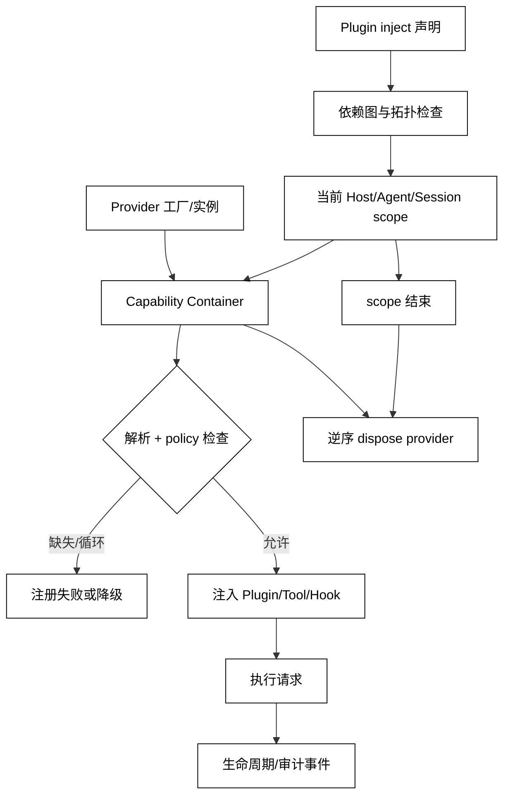

# Dependency Injection 与能力容器

## 学习目标

- 解释 Dependency Injection、Capability、Container、scope 和生命周期所有权之间的关系。
- 区分“能解析到一个对象”和“当前调用者有权使用该能力”。
- 用一个标准库容器模拟依赖排序、作用域覆盖和 disposer，并建立阅读 Cordis `Context` 的心智模型。

## 前置知识

- 已阅读 [Plugin 注册与生命周期](./05-Plugin注册与生命周期)。
- 已了解第 04 章的 Tool Registry、第 05 章的 Context/Session，以及第 06 章的 Capability 协商。
- Hook 对容器事件的观察与拦截见[第07篇](./07-Hook-Interceptor与事件系统)。

## 先区分四个词

### Capability：可被请求的能力契约

**Capability** 是能力的公开契约，例如 `logger.write`、`workspace.read` 或 `skills.list`，包含名称、输入/输出和限制。它描述“能做什么”，不自动说明“谁能做”或“如何获取实现”。

用途：让 Plugin、Tool 和 Hook 依赖稳定的能力名，而不是互相 import 私有实现。

### Container：能力与实现的解析边界

**Container** 保存 capability key 到 provider/factory 的映射，并按照 scope、生命周期和依赖规则返回实例。它可以检测缺失、重复和循环，但不应把解析成功当成授权成功。

白话说，Container 像服务台：你可以问“谁能提供日志服务”，服务台给出当前 scope 的实现；是否允许你使用，仍由策略和调用边界决定。

### Dependency Injection：把依赖显式交给组件

**Dependency Injection** 是组件从宿主获得它需要的能力，而不是在内部读全局单例或动态 import。注入可以发生在构造、工厂参数、Context 或 Plugin 的 `inject` 声明中。

用途：测试时替换 provider，运行时按 scope 隔离，热重载时按 owner 清理，避免组件偷偷依赖全局状态。

### Scope：能力解析的可见范围

**Scope** 决定一个组件看到哪些 provider，例如 host、agent preset、workspace 或一次 Session。父 scope 可以提供默认实现，子 scope 可以覆盖或限制它；规则必须明确，不能靠字典遍历顺序碰运气。

## 注入数据流与生命周期



阅读提示：`Container` 解决“找到实现”，`policy` 决定“本次是否可用”；依赖图在注入前检查，scope 结束时按所有权逆序清理。

## 一个带 scope 的本地容器

下面的代码用父子 scope、工厂和 disposer 模拟同名能力覆盖；它展示解析路径，不执行任何外部副作用。

```python
from __future__ import annotations

from dataclasses import dataclass
from typing import Callable


@dataclass
class Scope:
    parent: "Scope | None" = None
    providers: dict[str, Callable[[], str]] | None = None

    def __post_init__(self) -> None:
        if self.providers is None:
            self.providers = {}
        self._disposers: list[Callable[[], None]] = []

    def provide(self, key: str, factory: Callable[[], str], dispose: Callable[[], None] | None = None) -> None:
        if key in self.providers:
            raise ValueError(f"duplicate capability: {key}")
        self.providers[key] = factory
        if dispose is not None:
            self._disposers.append(dispose)

    def resolve(self, key: str) -> str:
        if key in self.providers:
            return self.providers[key]()
        if self.parent is not None:
            return self.parent.resolve(key)
        raise LookupError(f"missing capability: {key}")

    def dispose(self) -> None:
        for disposer in reversed(self._disposers):
            disposer()
        self._disposers.clear()


host = Scope()
host.provide("logger", lambda: "host-logger")
agent = Scope(parent=host)
agent.provide("logger", lambda: "agent-logger")
agent.provide("workspace.read", lambda: "read-only")
print(agent.resolve("logger"))
print(agent.resolve("workspace.read"))
try:
    agent.resolve("workspace.write")
except LookupError as error:
    print(type(error).__name__, str(error))
agent.dispose()
# 输出：agent-logger
# 输出：read-only
# 输出：LookupError missing capability: workspace.write
```

“解析得到 `workspace.read`”只说明容器存在实现；真正把它暴露为 Tool 前仍应检查调用者、资源路径、审计和当前 Run 的 allowlist。

### `inject`：声明而不是隐式读取

在许多插件容器中，`inject = ["logger", "sessions"]` 之类声明用于拓扑排序和启动等待。它表达必需依赖；可选依赖应有显式 fallback，不能在运行时捕获所有异常后继续使用半初始化对象。

### Provider 生命周期：singleton、scope 和 transient

Provider 可以返回 Host 级共享实例、每个 Agent scope 一个实例，或每次解析都新建实例。生命周期必须和 disposer、并发安全及缓存策略一起定义；“默认单例”不是普遍正确的选择。

### Container 与权限：解析之后再门控

一个 Container 若把 `shell.exec` 注入 Plugin，只表示实现可达；权限策略可能仍禁止当前 Agent、workspace 或请求调用它。安全边界最好在 Tool/Service 的实际入口再次检查，避免能力引用被转发到不该看到的范围。

### 依赖循环：让错误在装配时出现

`a -> b -> a` 应在 graph 检查阶段报告，而不是等某个请求第一次解析才递归爆栈。错误应包含环路和 owner，方便定位 Plugin manifest 或 scope composition。

## 源码阅读心智模型

### DeepSeek Harness/Cordis：Context 是组合面，不是魔法全局

Cordis 的 Context 将服务、Plugin 和事件放在可组合的 scope 中；某些 Plugin 通过 `inject` 声明依赖，服务在对应 Context 层出现后才进入可用状态。阅读时追踪“依赖声明 → scope 组合 → service 挂载 → effect/dispose”，并检查 provider 是 host 级还是 Agent preset 级。

官方 Skills 文档所说的 host+per-scope registry 也体现了这一点：同一名称在不同 scope 可能有不同可见项，读取时按 scope 链合并。具体优先级属于产品实现，不能反推为 DI 标准。

### OpenAI Agents SDK：RunContext 与 DI 不是一回事

OpenAI Agents SDK 的 RunContext 或依赖注入式上下文可以把应用对象传给工具，但它不自动成为全局能力容器。阅读时确认 context 的生命周期、工具可见范围和权限校验分别在哪一层。

### MCP：Capability negotiation 与 DI 的相似/不同

MCP 初始化阶段的 capability 是连接双方声明能支持哪些协议能力；DI Container 处理的是同一进程或 composition 中如何解析实现。二者都叫 capability，但所有权、时间点和失败语义不同。

### 读源码的五个问题

1. provider 注册到哪个 scope，名字是否全局唯一？
2. `inject` 何时检查，缺失依赖是否阻止启动？
3. 父子 scope 的同名覆盖规则是什么？
4. resolve 返回实例时是否再次做 policy/permission 检查？
5. scope dispose 如何释放 provider、事件监听和缓存？

## 易混点

- **解析成功不等于授权成功**：Container 只解决实现发现，Policy 仍决定是否可用。
- **DI 不等于 Service Locator**：组件主动从全局容器取值会隐藏依赖，降低可测试性和所有权清晰度。
- **MCP capability 不等于 DI capability**：协议协商和进程内实例解析解决不同问题。
- **子 scope 覆盖不等于全局替换**：父 scope 的其他消费者仍可能使用原 provider。
- **Provider ready 不等于业务健康**：外部连接、权限或依赖健康还需要独立检查。

## 课后小问

1. 为什么要把 `inject` 依赖在装配阶段检查？

   **答案**：尽早发现缺失和循环依赖，避免请求运行到一半才得到难以定位的解析错误。

   **解析**：装配阶段有完整的 owner、scope 和 manifest，可以输出依赖图；运行时才发现会让半初始化 Plugin 暴露能力。

2. 子 scope 覆盖 `logger` 后，Host 级 Plugin 会自动改用子 scope 的 logger 吗？

   **答案**：不一定，取决于它解析时所在的 scope；已捕获 Host 实例的组件通常不会自动替换。

   **解析**：覆盖规则要和实例生命周期一起看。把“最近层优先”当成全局热替换，会导致旧组件和新组件使用不同审计通道。

3. MCP capability 和 DI capability 为什么不能混用？

   **答案**：前者是连接双方的协议能力声明，后者是宿主组合中的实现解析；时间点、所有权和错误传播不同。

   **解析**：MCP Server 声明支持某能力，不代表本地 Container 已有实现；本地有实现，也不代表远端连接已协商成功。

## 本节小结

- Capability 是契约，Container 解析实现，DI 显式注入，Scope 决定可见范围。
- 依赖图、重复检查、policy 门控和 disposer 共同构成安全的容器生命周期。
- 解析与授权、协议协商与进程内 DI 必须分开描述。
- 阅读 Cordis/Plugin 源码时沿 scope → inject → service → effect/dispose 追踪。

## 快速回顾

- 能解释 Container 和 Permission 的分工。
- 能说出父子 scope、依赖循环和 provider 生命周期的风险。
- 能把 MCP capability 与 DI capability 放在不同层次。
- 下一篇阅读 [Hook、Interceptor 与事件系统](./07-Hook-Interceptor与事件系统)。
