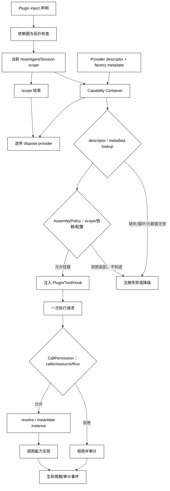

# Dependency Injection 与能力容器

## 学习目标

- 解释 Dependency Injection、Capability、Container、scope 和生命周期所有权之间的关系。
- 区分“查到 provider descriptor”“创建实例”和“当前调用者有权使用该能力”。
- 用一个标准库容器模拟依赖排序、作用域覆盖和 disposer，并建立阅读 Cordis `Context` 的心智模型。

## 前置知识

- 已阅读 [Plugin 注册与生命周期](./05-Plugin注册与生命周期)。
- 已了解第 04 章的 Tool Registry、第 05 章的 Context/Session，以及第 06 章的 Capability 协商。
- Hook 对容器事件的观察与拦截见[第07篇](./07-Hook-Interceptor与事件系统)。

## 先区分四个词

### Capability：可被请求的能力契约

**Capability** 是能力的公开契约，例如 `logger.write`、`workspace.read` 或 `skills.list`，包含名称、输入/输出和限制。它描述“能做什么”，不自动说明“谁能做”或“如何获取实现”。

用途：让 Plugin、Tool 和 Hook 依赖稳定的能力名，而不是互相 import 私有实现。

### Container：能力与实现的解析边界

**Container** 保存 capability key 到 provider descriptor/factory metadata 的映射，并按照 scope、生命周期和依赖规则查找实现。它可以检测缺失、重复和循环，但不应把 descriptor 查到当成实例已经创建，更不能把查找成功当成授权成功。

白话说，Container 像服务台：你可以先问“谁声明能提供日志服务”，服务台只给出当前 scope 的登记卡；是否允许装配、何时构造实例以及这一次能否使用，仍由不同策略和调用边界决定。

### Provider Descriptor：先读元数据，再决定是否构造

**Provider descriptor** 是 provider 的登记信息，至少包含 capability key、scope、依赖、生命周期和 factory 的引用。descriptor/metadata lookup 只读注册表，不调用 factory，因此不应产生连接、打开文件或其他构造副作用。

白话说，先看商品标签，再决定是否把商品从仓库取出来。`AssemblyPolicy` 必须在 `instantiate` 或实例级 `resolve` 之前通过；只有通过后，容器才可以按生命周期创建实例。对 transient provider，一次批准的调用只创建一次，不能因为 policy 检查或重复 resolve 又构造第二个实例。

### Dependency Injection：把依赖显式交给组件

**Dependency Injection** 是组件从宿主获得它需要的能力，而不是在内部读全局单例或动态 import。注入可以发生在构造、工厂参数、Context 或 Plugin 的 `inject` 声明中。

用途：测试时替换 provider，运行时按 scope 隔离，热重载时按 owner 清理，避免组件偷偷依赖全局状态。

### Scope：能力解析的可见范围

**Scope** 决定一个组件看到哪些 provider，例如 host、agent preset、workspace 或一次 Session。父 scope 可以提供默认实现，子 scope 可以覆盖或限制它；规则必须明确，不能靠字典遍历顺序碰运气。

### AssemblyPolicy：装配期能否挂载

**AssemblyPolicy** 判断某个 Plugin/Provider 是否允许进入当前 composition，例如是否满足 scope、配置、依赖和宿主能力要求。它发生在注入前，决定“实现是否可见”；它不是某个用户请求的授权结论。

### Instantiate：通过装配策略后才创建实例

**Instantiate** 是真正调用 provider factory、得到 singleton/scope/transient 实例的步骤。它必须位于 descriptor lookup 和 `AssemblyPolicy` 之后；factory 的连接、句柄或缓存初始化都属于可能失败的构造副作用，不能在 metadata lookup 中提前发生。

### CallPermission：调用期能否使用

**CallPermission** 判断当前 caller、resource 和 Run 是否可以使用已经装配的能力。它发生在 Tool/Service 的实际调用入口，必须重新检查主体、资源、参数和 Run 状态；不能因为装配期允许就跳过。

## 注入数据流与生命周期



阅读提示：`Container` 先做无副作用的 descriptor/metadata lookup；`AssemblyPolicy` 决定实现能否挂载，实例级 `resolve/instantiate` 只能在它之后发生，`CallPermission` 仍位于一次调用入口。二者都不是容器的隐式副作用，依赖图在装配期检查，scope 结束时按所有权逆序清理。

## 一个带 scope 的本地容器

下面的代码用父子 scope、descriptor、工厂和 disposer 模拟同名能力覆盖；metadata lookup 不会调用工厂，只有装配策略和调用权限都通过后才创建实例。工厂只在内存中追加一个标记，用来证明 transient 没有被 policy 检查重复构造。

```python
from __future__ import annotations

from dataclasses import dataclass
from typing import Callable


@dataclass
class ProviderDescriptor:
    key: str
    metadata: dict[str, str]
    factory: Callable[[], str]


@dataclass
class Scope:
    name: str
    parent: "Scope | None" = None
    providers: dict[str, ProviderDescriptor] | None = None

    def __post_init__(self) -> None:
        if self.providers is None:
            self.providers = {}
        self._disposers: list[Callable[[], None]] = []

    def provide(
        self,
        key: str,
        factory: Callable[[], str],
        metadata: dict[str, str],
        dispose: Callable[[], None] | None = None,
    ) -> None:
        if key in self.providers:
            raise ValueError(f"duplicate capability: {key}")
        self.providers[key] = ProviderDescriptor(key, dict(metadata), factory)
        if dispose is not None:
            self._disposers.append(dispose)

    def lookup_descriptor(self, key: str) -> ProviderDescriptor:
        """只读 metadata；不会调用 factory。"""
        if key in self.providers:
            return self.providers[key]
        if self.parent is not None:
            return self.parent.lookup_descriptor(key)
        raise LookupError(f"missing provider descriptor: {key}")

    def instantiate(self, descriptor: ProviderDescriptor) -> str:
        """AssemblyPolicy 之后才调用；transient 每次批准调用只进来一次。"""
        return descriptor.factory()

    def dispose(self) -> None:
        for disposer in reversed(self._disposers):
            disposer()
        self._disposers.clear()


def assembly_policy(scope: Scope, descriptor: ProviderDescriptor) -> bool:
    """只检查 descriptor metadata；不会构造实例。"""
    return (
        descriptor.key != "workspace.write"
        and descriptor.metadata.get("scope") == scope.name
    )


def call_permission(subject: str, resource: str, run_id: str) -> bool:
    """调用期检查：caller、resource 与 Run 是否满足本次使用条件。"""
    return subject == "reviewer" and resource == "workspace.read" and run_id.startswith("run-")


def invoke(scope: Scope, key: str, subject: str, resource: str, run_id: str) -> str:
    """调用入口：lookup -> AssemblyPolicy -> CallPermission -> instantiate。"""
    descriptor = scope.lookup_descriptor(key)  # metadata lookup，不构造实例
    if not assembly_policy(scope, descriptor):
        raise PermissionError("assembly policy denied")
    if not call_permission(subject, resource, run_id):
        raise PermissionError("call permission denied")
    return scope.instantiate(descriptor)  # 对 transient 只构造这一次


created: list[str] = []


def make_read_only() -> str:
    created.append("workspace.read")
    return "read-only"


host = Scope(name="host")
host.provide("logger", lambda: "host-logger", {"scope": "host", "lifecycle": "singleton"})
agent = Scope(name="agent", parent=host)
agent.provide("logger", lambda: "agent-logger", {"scope": "agent", "lifecycle": "scope"})
agent.provide(
    "workspace.read",
    make_read_only,
    {"scope": "agent", "lifecycle": "transient"},
)

descriptor = agent.lookup_descriptor("workspace.read")
print(descriptor.metadata)
print(created)  # lookup 没有调用 factory
print(invoke(agent, "workspace.read", "reviewer", "workspace.read", "run-7"))
print(created)  # instantiate 只调用一次
try:
    invoke(agent, "workspace.read", "guest", "workspace.read", "run-7")
except PermissionError as error:
    print(type(error).__name__, str(error))
print(created)  # 被拒绝的调用没有二次构造
try:
    agent.lookup_descriptor("workspace.write")
except LookupError as error:
    print(type(error).__name__, str(error))
agent.dispose()
# 输出：{'scope': 'agent', 'lifecycle': 'transient'}
# 输出：[]
# 输出：read-only
# 输出：['workspace.read']
# 输出：PermissionError call permission denied
# 输出：['workspace.read']
# 输出：LookupError missing provider descriptor: workspace.write
```

查到 `workspace.read` 的 descriptor 只说明注册表有实现元数据；它没有调用 factory。`assembly_policy` 只检查装配期 scope 和配置，真正进入 Tool 调用入口时还要用 `call_permission` 检查调用者、资源和当前 Run 的 allowlist，最后才允许 `instantiate` 创建一次 transient 实例。

### `inject`：声明而不是隐式读取

在许多插件容器中，`inject = ["logger", "sessions"]` 之类声明用于拓扑排序和启动等待。它表达必需依赖；可选依赖应有显式 fallback，不能在运行时捕获所有异常后继续使用半初始化对象。

### Provider 生命周期：singleton、scope 和 transient

Provider 可以创建 Host 级共享实例、每个 Agent scope 一个实例，或每次获准调用都新建实例。生命周期必须和 disposer、并发安全及缓存策略一起定义；“默认单例”不是普遍正确的选择。无论是哪种生命周期，metadata lookup 都不应提前构造，transient 也不能在 policy 检查与真正调用之间重复 instantiate。

### Container 与 Permission：实例化前后各有门

一个 Container 若登记 `shell.exec` 的 descriptor，只表示 metadata lookup 成功；`AssemblyPolicy` 仍可能禁止该 Provider 进入当前 composition，`CallPermission` 也可能禁止当前 Agent、workspace 或 Run 调用它。实例化前先完成装配策略，Tool/Service 的实际入口再做调用权限检查，避免构造副作用或能力引用被转发到不该看到的范围。

### 依赖循环：让错误在装配时出现

`a -> b -> a` 应在 graph 检查阶段报告，而不是等某个请求第一次解析才递归爆栈。错误应包含环路和 owner，方便定位 Plugin manifest 或 scope composition。

## 源码阅读心智模型

### DeepSeek Harness/Cordis：Context 是组合面，不是魔法全局

Cordis 的 Context 将服务、Plugin 和事件放在可组合的 scope 中；某些 Plugin 通过 `inject` 声明依赖，服务在对应 Context 层出现后才进入可用状态。阅读时追踪“依赖声明 → `AssemblyPolicy`/scope 组合 → service 挂载 → `CallPermission` → effect/dispose”，并检查 provider 是 host 级还是 Agent preset 级。

官方 Skills 文档所说的 host+per-scope registry 也体现了这一点：同一名称在不同 scope 可能有不同可见项，读取时按 scope 链合并。具体优先级属于产品实现，不能反推为 DI 标准。

### OpenAI Agents SDK：RunContext 与 DI 不是一回事

OpenAI Agents SDK 的 RunContext 或依赖注入式上下文可以把应用对象传给工具，但它不自动成为全局能力容器。阅读时确认 context 的生命周期、工具可见范围和权限校验分别在哪一层。

### MCP：Capability negotiation 与 DI 的相似/不同

MCP 初始化阶段的 capability 是连接双方声明能支持哪些协议能力；DI Container 处理的是同一进程或 composition 中如何解析实现。二者都叫 capability，但所有权、时间点和失败语义不同。

### 读源码的五个问题

1. provider 注册到哪个 scope，名字是否全局唯一？
2. `inject` 与 `AssemblyPolicy` 何时检查，缺失依赖是否阻止启动？
3. 父子 scope 的同名覆盖规则是什么？
4. descriptor lookup、`AssemblyPolicy`、`instantiate/resolve` 和调用入口的 `CallPermission` 分别发生在什么时候？
5. scope dispose 如何释放 provider、事件监听和缓存？

## 易混点

- **查到 descriptor 不等于创建实例或授权成功**：Container 只做 metadata lookup，`AssemblyPolicy` 与 `CallPermission` 分别决定能否装配、能否调用，`instantiate/resolve` 只能在前者之后发生。
- **DI 不等于 Service Locator**：组件主动从全局容器取值会隐藏依赖，降低可测试性和所有权清晰度。
- **MCP capability 不等于 DI capability**：协议协商和进程内实例解析解决不同问题。
- **子 scope 覆盖不等于全局替换**：父 scope 的其他消费者仍可能使用原 provider。
- **Provider ready 不等于业务健康**：外部连接、权限或依赖健康还需要独立检查。

## 课后小问

1. 为什么要把 `inject` 依赖在装配阶段检查？

   **答案**：尽早发现缺失和循环依赖，避免请求运行到一半才得到难以定位的解析错误。

   **解析**：装配阶段有完整的 owner、scope 和 manifest，可以输出依赖图；运行时才发现会让半初始化 Plugin 暴露能力。

2. 子 scope 覆盖 `logger` 后，Host 级 Plugin 会自动改用子 scope 的 logger 吗？

   **答案**：不一定，取决于它解析时所在的 scope；已捕获 Host 实例的组件通常不会自动替换。

   **解析**：覆盖规则要和实例生命周期一起看。把“最近层优先”当成全局热替换，会导致旧组件和新组件使用不同审计通道。

3. MCP capability 和 DI capability 为什么不能混用？

   **答案**：前者是连接双方的协议能力声明，后者是宿主组合中的实现解析；时间点、所有权和错误传播不同。

   **解析**：MCP Server 声明支持某能力，不代表本地 Container 已有实现；本地有实现，也不代表远端连接已协商成功。

## 本节小结

- Capability 是契约，Container 查 descriptor，DI 显式注入，Scope 决定可见范围，instantiate 才创建实现实例。
- 依赖图、重复检查、`AssemblyPolicy`、`CallPermission` 和 disposer 共同构成安全的容器生命周期。
- metadata lookup、instance creation、装配期 policy、调用期 permission、协议协商与进程内 DI 必须分开描述。
- 阅读 Cordis/Plugin 源码时沿 scope → inject → service → effect/dispose 追踪。

## 快速回顾

- 能解释 Container 和 Permission 的分工。
- 能说出父子 scope、依赖循环和 provider 生命周期的风险。
- 能把 MCP capability 与 DI capability 放在不同层次。
- 下一篇阅读 [Hook、Interceptor 与事件系统](./07-Hook-Interceptor与事件系统)。
