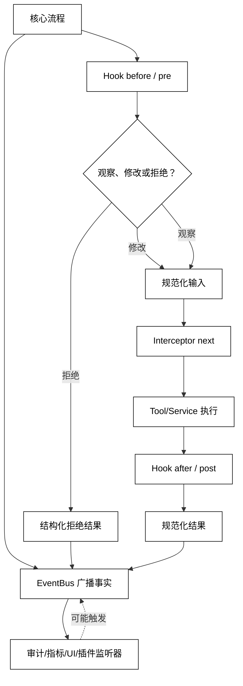

# Hook、Interceptor 与事件系统

## 学习目标

- 区分广播事件、观察型 Hook、可修改的 Interceptor 和能短路的决策点。
- 理解 payload、关联 ID、顺序、重入、错误传播和 disposer 对可观测性的影响。
- 用本地 EventBus 模拟观察、修改和拒绝三种行为，并建立阅读 Cordis waterfall 与 DeepSeek Harness hooks 的方法。

## 前置知识

- 已阅读 [Plugin 注册与生命周期](./05-Plugin注册与生命周期) 和 [Dependency Injection 与能力容器](./06-Dependency-Injection与能力容器)。
- 已了解第 04 章的 Trace、Audit、Tool 执行和第 05 章的事件/状态关系。
- 权限和失败隔离会在[第09篇](./09-权限隔离失败传播与插件安全)集中处理。

## 四种扩展语义

### Event：宣布发生了什么

**Event** 是发布者向不特定监听者宣布状态变化或事实，例如 `tool/result`、`session/created`。广播事件通常收集不到监听器返回值，监听器失败是否影响发布者必须由契约明确。

用途：把记录、指标、UI 更新和审计从核心流程解耦；事件本身不一定能阻止动作。

### Hook：宿主预留的时机

**Hook** 是流程中的命名扩展点，例如 `before_tool`、`after_model` 或 `turn_stopping`。它可以只是事件，也可以允许返回决定；“Hook”这个词本身不说明调用顺序和阻断能力。

用途：让宿主稳定暴露少量受控 seam，而不是让 Plugin 任意修改内部函数。

### Interceptor：包住并决定下游调用

**Interceptor** 通常收到输入和 `next()`，可以在下游前检查、改写输入，在下游后改写结果，或不调用 `next()` 直接拒绝。它类似 middleware，但具体错误和返回值语义要由宿主定义。

用途：在 Tool 执行前加超时/权限，在执行后添加审计/指标，或把一次请求路由到明确替代实现。

### EventBus：路由与调度规则

**EventBus** 管理事件名、payload、监听器、优先级和 dispatch mode。它应让顺序、并发、返回值收集、异常处理和卸载可观察，而不是用一个全局 `emit` 隐藏所有语义。

### 白话理解：广播、门卫和包裹检查

Event 像广播“事情发生了”，Hook 像门卫在入口处观察或拒绝，Interceptor 像打开包裹前后都能检查的传送带，EventBus 则规定广播是否等待、门卫能否短路以及出了错谁负责收尾。

## Payload 与顺序不变量

### 关联 ID：让扩展能找到同一次运行

事件 payload 至少应携带 `run_id`、`step_id`、`call_id` 或等价关联字段，以及版本化的安全摘要。不要把完整凭证、原始 Prompt 或未脱敏外部数据复制到每个监听器。

### Dispatch Mode：先确定语义，再写监听器

常见模式包括同步广播、并发广播、串行决策、bail（首个决定即停）和 waterfall（围绕 `next` 的中间件）。这些名字不是普遍协议；关键是文档化监听器是否等待、返回值如何合并、谁能短路。

### Order：优先级不是因果关系

优先级只能定义同一扩展点的调用顺序，不能替代业务因果或权限校验。一个记录日志的监听器排在拒绝监听器之前，并不意味着它能证明动作已执行。

### Reentrancy：监听器再次发布事件

监听器如果在处理 `tool/result` 时发布另一个 `tool/result`，可能导致无限重入。应使用事件类型、深度/trace guard、异步队列或幂等键明确允许的回路。

## Hook 数据流



阅读提示：`Event` 传播事实，`Hook/Interceptor` 可能改变流程；监听器再次发布事件时必须有重入边界，不能把异步广播悄悄当成同步决策。

## 一个支持观察、拒绝与 waterfall 的 EventBus

下面的代码用标准库实现最小的 `on`/disposer、广播和 waterfall；它通过 `run_id` 保留关联，不访问网络或执行工具。

```python
from collections.abc import Callable


Listener = Callable[..., object]


class EventBus:
    def __init__(self) -> None:
        self._listeners: dict[str, list[Listener]] = {}

    def on(self, event: str, listener: Listener) -> Callable[[], None]:
        self._listeners.setdefault(event, []).append(listener)

        def dispose() -> None:
            listeners = self._listeners.get(event, [])
            if listener in listeners:
                listeners.remove(listener)

        return dispose

    def emit(self, event: str, **payload: object) -> None:
        for listener in list(self._listeners.get(event, [])):
            listener(payload)

    def waterfall(self, event: str, value: str, default: Callable[[str], str]) -> str:
        def call(index: int, current: str) -> str:
            listeners = self._listeners.get(event, [])
            if index == len(listeners):
                return default(current)

            def next_value(next_input: str = current) -> str:
                return call(index + 1, next_input)

            result = listeners[index](current, next_value)
            return current if result is None else str(result)

        return call(0, value)


bus = EventBus()
bus.on("tool/result", lambda payload: print(f"audit:{payload['run_id']}:{payload['status']}"))
bus.on("tool/transform", lambda value, next_value: next_value(value.strip()))


def policy(value: str, next_value: Callable[[str], str]) -> str:
    if value == "delete":
        return "denied:approval"
    return next_value(value)


dispose_policy = bus.on("tool/transform", policy)
print(bus.waterfall("tool/transform", " read ", lambda value: f"run:{value}"))
print(bus.waterfall("tool/transform", "delete", lambda value: f"run:{value}"))
bus.emit("tool/result", run_id="r-1", status="completed")
dispose_policy()
# 输出：run:read
# 输出：denied:approval
# 输出：audit:r-1:completed
```

只做记录的 listener 应调用 `next_value`；忘记调用会把 waterfall 截断。真实事件系统还要定义 listener 异常是隔离、传播还是转换成失败事件。

### 观察型事件：不改变核心结果

观察型 listener 只记录指标、审计或 UI 状态，不应修改 payload，也不应把自身失败变成业务成功。若记录失败必须影响流程，就应使用显式决策 Hook 并写清返回契约。

### Pre Hook：动作前的最后一道门

Tool/Service 的 pre Hook 适合做参数规范化、Permission、Approval 或限流，但应在核心执行器仍有最终校验。Hook 被绕过、配置错误或插件卸载时，宿主不能因此失去基本安全门。

### Post Hook：结果变换和事实记录

Post Hook 可以脱敏结果、附加上下文或记录耗时。若它要改写“工具成功/失败”的权威结果，应有版本化结构和审计原因；仅为了指标应订阅 immutable result 事件，避免观测代码改变业务事实。

### 异常与取消：扩展不能吞掉终态

Hook 失败时要区分可恢复的旁路错误和必须阻断的策略错误。取消信号应穿过等待和下游 `next`；否则用户取消了 Run，监听器仍可能继续触发副作用。

## 源码阅读心智模型

### DeepSeek Harness/Cordis：dispatch mode 决定 Hook 能做什么

Cordis 教程把 `emit`、`parallel`、`serial`、`bail` 和 `waterfall` 分开，waterfall 通过 `next()` 包裹或短路下游；DeepSeek Harness 的 hooks 又把这些事件映射到 agent/tool/approval 等扩展点。阅读时先确认事件 mode，再看 listener 是否调用 `next`、返回什么、异常向哪里传播。

官方 Harness 扩展文档列出 `agent/pre-step`、`agent/request`、`tools/pre-execute`、`tools/post-execute` 等产品点；这些是当前实现的 extension point，不应直接写成所有 Agent 的通用 Hook 名称。

### OpenAI Agents SDK：对照 guardrail、tracing 和运行事件

OpenAI Agents SDK 的 guardrail、tracing 和 Runner events 可以承担类似约束、记录和观察职责。阅读时区分“决定是否继续”的 guardrail 与“记录发生了什么”的 tracing，确认它们的顺序和错误是否进入 Run 终态。

### MCP：通知、请求和 Hook 不同

MCP 的通知/请求属于协议消息，Server/Client 按协议处理；它们不等于宿主内的 Hook。一个 MCP Client 可以在发送请求前加本地 interceptor，但该 interceptor 是应用层行为，不是协议本身。

### 读源码的六个问题

1. 事件 mode 是广播、并发、串行还是 waterfall？
2. payload 是否含关联 ID、版本和安全摘要？
3. listener 返回值如何合并，谁能短路？
4. listener 抛错或取消时，核心流程和其他监听器怎样处理？
5. `on` 返回的 disposer 是否绑定 Plugin/Scope？
6. 同一个事件是否可能被重入，是否有去重或深度限制？

## 易混点

- **Event 不一定能拦截**：广播只宣布事实，是否收集返回值要看 dispatch mode。
- **Interceptor 不一定安全**：它能修改输入不等于能替代核心 Permission/Schema 校验。
- **优先级不等于权限**：高优先级 listener 仍只能使用宿主允许的返回语义。
- **Post 结果不是重新执行**：结果变换应保留原始权威结果和变换原因。
- **listener 失败不应静默吞掉**：旁路失败、策略拒绝和核心失败需要不同事件和终态。
- **Hook 名称不代表跨产品一致**：必须查事件 mode、签名、生命周期和版本。

## 课后小问

1. 为什么 waterfall 中只做日志的 listener 也要调用 `next()`？

   **答案**：不调用会短路下游，默认行为和后续 listener 都不会执行。

   **解析**：waterfall 的“返回不调用 next”通常是有意 veto；观察型 listener 若忘记 next，会把记录逻辑错误地变成阻断逻辑。

2. 为什么 Tool 的 pre Hook 不能成为唯一的权限检查？

   **答案**：Hook 可能被卸载、配置错误或绕过，核心执行器仍需要最终的参数和权限门。

   **解析**：扩展点是可装配的，基础安全不应依赖一个可选 Plugin。应在 Tool/Service 执行入口再次校验，并记录拒绝事件。

3. `tools/post-execute` 是否适合记录不可变成功结果？

   **答案**：如果它会改写结果，不一定；仅观察时应优先使用专门的结果事件或 immutable outcome seam。

   **解析**：审计需要知道真实结果，结果变换需要有明确契约；把观察和修改混在一个 Hook 中容易让指标代码改变业务状态。

## 本节小结

- Event 宣布事实，Hook 暴露时机，Interceptor 包住调用，EventBus 定义路由和调度语义。
- dispatch mode、payload 关联、顺序、错误、取消和 disposer 决定扩展是否可控。
- DeepSeek Harness/Cordis 的 waterfall 和事件点是产品实现示例，不是通用协议。
- 阅读源码先找 mode 和错误传播，再判断 listener 是否真的能修改或阻断。

## 快速回顾

- 能区分广播事件与可短路 Hook。
- 能解释 `next()`、disposer、关联 ID 和重入 guard 的作用。
- 能判断一个 post listener 是观察事实还是改变权威结果。
- 下一篇阅读 [能力冲突、版本与依赖排序](./08-能力冲突版本与依赖排序)。
