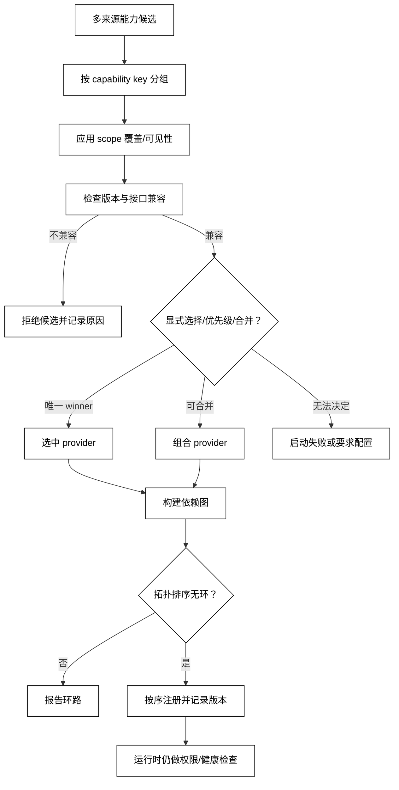

# 能力冲突、版本与依赖排序

## 学习目标

- 用 capability key、provider、版本约束和 scope 描述“两个扩展都提供同一能力”的冲突。
- 区分选择 winner、验证兼容性、排序依赖和处理失败，不把优先级当作万能解决方案。
- 用标准库实现确定性的 winner 选择和拓扑排序，并建立阅读 Plugin/Skill registry 冲突规则的心智模型。

## 前置知识

- 已阅读 [Skill 发现、匹配、加载与卸载](./03-Skill发现匹配加载与卸载)、[Plugin 注册与生命周期](./05-Plugin注册与生命周期) 和 [Dependency Injection 与能力容器](./06-Dependency-Injection与能力容器)。
- 已了解第 03 章的模型/Provider 能力声明与第 06 章的 MCP Capability 协商。
- 权限与失败传播不在本篇假设“选中就能执行”，详见[第09篇](./09-权限隔离失败传播与插件安全)。

## 四层判断不要混为一谈

### Capability Key：冲突的比较单位

**Capability Key** 是宿主用来比较能力的稳定标识，例如 `skills.list`、`workspace.read` 或 `tools.search`。一个 key 是否允许多个 provider 并存，要由宿主契约决定；同名不一定表示实现等价。

### Compatibility：能否满足契约

**Compatibility** 判断 provider 的接口、数据格式、行为前置条件和版本是否满足消费者要求。语义版本范围可以帮助筛选，但不能证明权限、性能、数据迁移或业务事实兼容。

### Conflict Resolution：选择或合并策略

**Conflict Resolution** 决定多个候选同时可见时选择哪一个、是否按 scope 覆盖、是否合并、是否拒绝启动。优先级、显式选择、最近 scope、provider order 都是可能的实现策略，不是通用协议。

### Dependency Ordering：先后关系

**Dependency Ordering** 把“Plugin A 依赖 Service B”转成有向图并拓扑排序。排序解决初始化先后，不会自动消除同一 key 的冲突，也不能替代运行时权限。

### 白话理解：选同一个岗位的人，再排上岗顺序

能力冲突像几个候选人竞争同一个岗位：先确认谁满足职位要求（兼容性），再按明确规则选人（winner），最后安排谁先入职（依赖排序）。排好入职顺序并不会自动给每个人发门禁卡，权限仍要单独检查。

## 冲突处理流水线



阅读提示：候选先按 key、scope 和兼容性筛选，再解决 winner，最后才排序和注册；“优先级高”不能跳过兼容性、冲突审计或运行时权限。

## 一个确定性的选择器和拓扑排序

下面的代码用简单的 major 版本和 provider rank 模拟选择，并用 Kahn 算法排序依赖；它把冲突和环路都变成可观察错误。

```python
from dataclasses import dataclass


@dataclass(frozen=True)
class Capability:
    key: str
    version: int
    provider: str
    rank: int
    depends_on: tuple[str, ...] = ()


def choose(candidates: list[Capability], key: str, required_version: int) -> Capability:
    matching = [
        item for item in candidates
        if item.key == key and item.version == required_version
    ]
    if not matching:
        raise LookupError(f"no compatible provider for {key}@{required_version}")
    return min(matching, key=lambda item: (-item.rank, item.provider))


def topo_sort(nodes: list[Capability]) -> list[str]:
    by_key = {node.key: node for node in nodes}
    indegree = {node.key: 0 for node in nodes}
    edges: dict[str, list[str]] = {node.key: [] for node in nodes}
    for node in nodes:
        for dependency in node.depends_on:
            if dependency not in by_key:
                raise LookupError(f"missing dependency: {dependency}")
            edges[dependency].append(node.key)
            indegree[node.key] += 1

    ready = sorted(key for key, degree in indegree.items() if degree == 0)
    ordered: list[str] = []
    while ready:
        key = ready.pop(0)
        ordered.append(key)
        for dependent in sorted(edges[key]):
            indegree[dependent] -= 1
            if indegree[dependent] == 0:
                ready.append(dependent)
                ready.sort()
    if len(ordered) != len(nodes):
        raise ValueError("dependency cycle")
    return ordered


candidates = [
    Capability("logger", 1, "basic", 10),
    Capability("logger", 1, "audit", 20),
]
print(choose(candidates, "logger", 1).provider)
print(topo_sort([
    Capability("logger", 1, "audit", 20),
    Capability("workspace.read", 1, "fs", 10, ("logger",)),
]))
try:
    topo_sort([
        Capability("a", 1, "one", 1, ("b",)),
        Capability("b", 1, "two", 1, ("a",)),
    ])
except ValueError as error:
    print(type(error).__name__, str(error))
# 输出：audit
# 输出：['logger', 'workspace.read']
# 输出：ValueError dependency cycle
```

生产实现应使用明确的版本范围、scope 和策略对象，并在选择结果中记录候选、拒绝理由、配置来源和最终 winner；本例用整数版本只为突出流程。

### SemVer：版本范围不是行为保证

语义版本可以表达 API 的 major/minor/patch 兼容意图，但实际系统还要检查 schema、配置、资源、数据迁移、权限和非功能约束。预发布版本尤其不能自动按稳定版本理解。

### Explicit Selection：显式配置优于隐式胜者

当两个 Plugin 都提供 `workspace.read` 时，要求用户或 profile 显式选择通常比“后来注册者覆盖”更可审计。若产品必须自动选择，也要记录 deterministic rule，并在冲突变化时让用户看到。

### Layered Scope：最近层覆盖的边界

分层 registry 可以让 workspace 或 Agent scope 覆盖全局 provider，也可以允许同层按 rank 决定。关键是明确“覆盖发生在哪一层”，避免同名 provider 在不同 scope 之间互相卸载。

### Dependency Graph：排序前先验证节点身份

依赖应引用稳定 capability key 或 Plugin ID，并在解析前检查缺失、重复、可选依赖和环路。对可选依赖要有显式 fallback；把所有 `KeyError` 变成“忽略依赖”会产生隐蔽的半功能 Plugin。

### Upgrade/Downgrade：先验证再切换

升级可以先在隔离 scope 加载新版本、执行健康检查和迁移，再切换 winner；失败时恢复旧版本。降级同样需要验证逆向 schema 和数据，不是简单改字符串。

## 源码阅读心智模型

### DeepSeek Harness：分层 registry 的具体实现

DeepSeek Harness 的 Skills 文档描述了 host+per-scope layers：读取时合并 scope 链，最近层同名项可遮蔽远层，同层再按 rank/provider/local order 决定；这些是当前实现的明确选择。阅读时把“scope 合并”“候选排序”“缓存 revision”“provider dispose”分别定位，不要把它们压缩成一个模糊的 `getSkill()`。

Cordis composition 还可能通过依赖注入决定某个 Plugin 何时 ready；因此 capability winner 确定后仍要看依赖图和 effect 生命周期。

### OpenAI Agents SDK：工具/模型选择的对照

OpenAI Agents SDK 中工具名、模型能力和 provider 解析也会遇到重复、能力不足和 fallback，但其具体优先级由 SDK/API 版本决定。源码阅读时记录候选生成、最终选择和错误分类，不要假定它采用 Plugin registry 的分层规则。

### MCP：协商不是本地冲突解决

MCP capability negotiation 说明连接双方支持什么；如果多个 MCP Server 暴露同名工具，Host 仍需要自己的命名、路由和冲突策略。协议成功初始化不代表本地 winner 已确定。

### 读源码的六个问题

1. capability key 的唯一范围是进程、scope、session 还是连接？
2. 同名候选何时被拒绝、覆盖、合并或要求显式配置？
3. 版本比较只看数字，还是同时检查 schema/行为？
4. 依赖图在什么阶段建，环路如何报错？
5. winner 切换时旧 provider 如何卸载和回滚？
6. 选择结果与拒绝候选是否写入审计事件？

## 易混点

- **优先级不是兼容性**：高 rank 的 provider 仍可能不满足 consumer 版本或权限。
- **版本相同不等于实现相同**：行为、配置和资源边界可能不同。
- **排序不解决冲突**：拓扑排序只回答先初始化谁，不回答同名能力选谁。
- **显式选择不等于授权**：profile 选中 Provider 后，调用者仍要经过 Permission。
- **覆盖不等于卸载**：子 scope 遮蔽父 scope，父实例仍可能被其他消费者使用。
- **循环不是网络错误**：依赖环路应在装配阶段确定性失败，不靠重试解决。

## 课后小问

1. 为什么“最后注册者覆盖”不适合作为唯一冲突策略？

   **答案**：它依赖加载顺序，结果不可审计，热重载或并发装配时还可能改变 winner。

   **解析**：如果必须自动选择，应使用 scope、rank、provider order 等固定规则并记录结果；对高风险能力更适合显式配置或直接拒绝冲突。

2. 依赖拓扑排序成功后，为什么仍需要 Permission 检查？

   **答案**：排序只证明初始化顺序可行，不证明当前 Agent/用户/资源允许调用这些能力。

   **解析**：能力容器、Plugin composition 和权限策略解决不同问题。把“能注入”当成“能执行”会导致跨 scope 或越权调用。

3. 什么时候应该拒绝自动升级？

   **答案**：版本范围、schema、迁移、权限或健康检查无法证明兼容，或冲突 winner 会发生未审计变化时。

   **解析**：升级/降级应有隔离加载、验证、切换和回滚；仅比较字符串或下载成功不足以保证行为安全。

## 本节小结

- 冲突处理依次涉及 key、scope、兼容性、winner、依赖排序和运行时权限。
- SemVer、优先级和拓扑排序各自解决一个问题，不能互相替代。
- 分层 registry 的 winner 规则是产品实现，应记录版本和来源，不当作行业协议。
- 选择、升级、降级和失败都应可回滚、可审计、可重放。

## 快速回顾

- 能区分兼容性、冲突选择和依赖排序。
- 能说明分层 scope 为什么会改变同名能力的可见 winner。
- 能指出高优先级 provider 仍需要版本和权限检查。
- 下一篇阅读 [权限隔离、失败传播与插件安全](./09-权限隔离失败传播与插件安全)。
