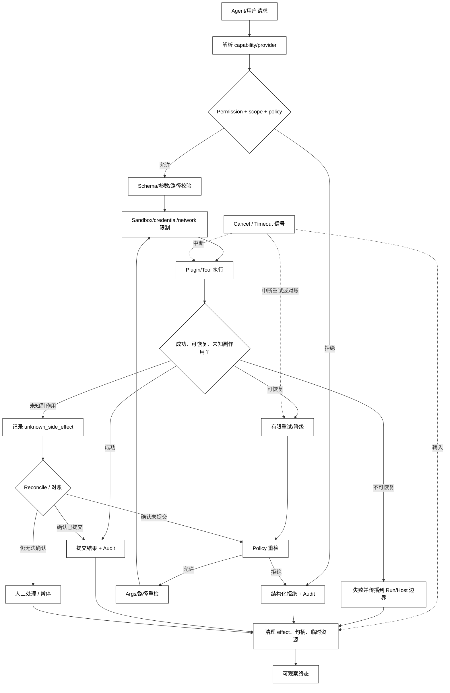

# 权限隔离、失败传播与插件安全

## 学习目标

- 区分能力解析、权限决策、资源隔离和失败传播四个安全层次。
- 设计最小权限、默认拒绝、失败可见、可取消和可回滚的 Plugin 运行边界。
- 用本地模拟展示拒绝、受控执行、Plugin 失败和清理，并建立阅读 DeepSeek Harness 安全/沙箱/Hook 代码的检查清单。

## 前置知识

- 已完成本章前八篇，理解 Skill/Tool/Plugin/Hook、Container、冲突选择和依赖排序。
- 已了解第 04 章的 Permission、Approval、Sandbox、Audit，第 05 章的 Session/Checkpoint 和第 06 章的 MCP 授权边界。
- 本篇讨论通用架构边界；DeepSeek Harness 的具体安全说明、平台沙箱和预览期 API 必须以当前仓库为准。

## 四层安全边界

### Capability Resolution：找到实现

Container 或 Plugin registry 回答“哪个 provider 可以实现这个 capability”。它不代表允许当前调用者执行，也不代表资源范围安全。

### Permission：谁能对什么做什么

**Permission** 是主体、动作、资源、作用域和条件的决策，例如“该 Agent 能否读取 workspace 下的某个文件”。决策应在副作用发生前执行，并把 allow/deny、策略版本和理由写入审计。

### Isolation：限制破坏半径

**Isolation** 使用 workspace 根目录、进程、容器、操作系统沙箱、凭证 audience 或网络策略，把一个 Plugin 的可见资源限制在最小范围。隔离降低影响半径，但不替代参数校验、权限和业务审批。

### Failure Propagation：让错误到达正确边界

插件失败可能只影响一个可选能力，也可能必须终止 Host/Run。错误要带来源、阶段、可恢复性和清理状态；把所有异常吞掉并继续，往往比直接失败更危险。

### 白话理解：有钥匙、能进房、只进允许的房间

解析能力像找到钥匙，Permission 像门卫确认身份和房间，Isolation 像只给一层楼的通行范围，Failure Propagation 像出了故障时拉响正确区域的警报。拿到钥匙不代表可以打开所有门，警报也不能因为“怕影响体验”就被静音。

## Plugin 安全数据流



阅读提示：`Resolve` 只找实现，`Policy` 决定主体与资源，`Args` 和 `Isolation` 防止策略绕过；Retry 必须回到 Policy/Args 重检，Unknown Side Effect 先 Reconcile 或人工处理；Cancel/Timeout 是贯穿执行的信号，进入 cleanup/final，不是普通后继步骤。

## 一个默认拒绝的本地 Plugin Host

下面的代码用标准库模拟资源策略、受控执行和 Plugin 失败清理；它不访问真实文件系统、不启动子进程，输出用于检查失败传播是否清晰。

```python
from dataclasses import dataclass, field


@dataclass(frozen=True)
class Request:
    subject: str
    action: str
    resource: str


@dataclass
class SecureHost:
    allowed_root: str
    audit: list[str] = field(default_factory=list)
    active_plugins: list[str] = field(default_factory=list)

    def authorize(self, request: Request) -> bool:
        allowed = request.subject == "reviewer" and request.action == "read" and request.resource.startswith(self.allowed_root)
        self.audit.append(f"authorize:{request.action}:{'allow' if allowed else 'deny'}")
        return allowed

    def run(self, plugin: str, request: Request) -> str:
        if not self.authorize(request):
            return "denied:permission"
        self.active_plugins.append(plugin)
        try:
            if plugin == "broken-check":
                raise RuntimeError("plugin check failed")
            self.audit.append(f"execute:{plugin}")
            return "completed:read-only"
        except RuntimeError as error:
            self.audit.append(f"failed:{plugin}:{error}")
            return "failed:plugin"
        finally:
            self.active_plugins.remove(plugin)
            self.audit.append(f"cleanup:{plugin}")


host = SecureHost("/workspace/project/")
print(host.run("report", Request("guest", "read", "/workspace/project/a.txt")))
print(host.run("report", Request("reviewer", "read", "/workspace/project/a.txt")))
print(host.run("broken-check", Request("reviewer", "read", "/workspace/project/a.txt")))
print(host.active_plugins)
print(host.audit)
# 输出：denied:permission
# 输出：completed:read-only
# 输出：failed:plugin
# 输出：[]
# 输出：['authorize:read:deny', 'authorize:read:allow', 'execute:report', 'cleanup:report', 'authorize:read:allow', 'failed:broken-check:plugin check failed', 'cleanup:broken-check']
```

示例把 `startswith` 仅作为内存字符串演示；真实路径策略必须做规范化、符号链接检查、跨平台根目录处理，并在执行器和 Sandbox 层重复验证。

### Least Privilege：只给本次所需能力

Plugin 应只拿到任务需要的 Service、目录、凭证 audience 和网络目的地。不要因为它“需要读一个文件”就注入整个文件系统或通用 shell；不要把 Host 的管理员对象直接放入 Agent Context。

### Default Deny：未知能力拒绝

名称不在 allowlist、scope 不匹配、参数无法校验或策略服务不可用时，默认拒绝或暂停。静默降级到“允许所有”会让插件发现、缓存和配置错误变成越权入口。

### Approval：对具体副作用作决定

Approval 是对一次具体动作、资源和参数的决定，不是对整个 Plugin 永久授权。恢复或重试前要重新检查参数、版本、scope 和幂等性；批准过一次不等于后续所有调用都安全。

### Isolation：凭证、路径和网络都要收窄

进程隔离、容器和操作系统 Sandbox 可以减少破坏半径，但仍要限制挂载目录、环境变量、网络出口和凭证。进程内 Plugin 若与 Host 共享内存，就不能把同一进程当作强安全边界。

### Failure Propagation：区分局部与致命

可选 Plugin 的故障可以让对应 capability 进入 unavailable 并继续其他功能；核心安全 Plugin、Policy provider 或清理失败可能必须终止 Host/Run。每条路径都要有用户可见状态、内部诊断和恢复策略。

### Retry Recheck：重试前回到策略和参数边界

重试不是从 `Execute` 直接跳回 `Plugin/Tool`。Runtime 必须重新执行 Policy、参数/schema、资源版本和幂等检查；调用者、workspace、配置或 Run deadline 变化时，原来的 allow 不能自动沿用。任何一次重检拒绝都进入明确的 deny/fail 终态并完成 cleanup。

### Unknown Side Effect：未知结果不能盲重试

Plugin 可能已发出外部请求但响应丢失。此时应 query/reconcile 或进入人工处理，不能因为调用抛异常就再次执行非幂等动作。第 04 章的重试与审计边界同样适用于 Plugin。

### Cancel/Timeout：贯穿执行的控制信号

取消和超时是贯穿 Execute、Retry 与 Reconcile 的信号，不是执行完成后才调用的普通后继函数。收到信号后应停止新的副作用、取消可取消的等待，进入统一 cleanup，再形成 cancelled/timeout 或人工处理等终态；已经发出的未知副作用仍需对账。

## 源码阅读心智模型

### DeepSeek Harness：插件组合和安全轴分开看

DeepSeek Harness 官方仓库标注 developer preview，并要求运行前阅读 safety notice。阅读源码时把 Plugin composition、Tool/Hook 决策、Approval、Sandbox 和 Session event 分成独立轴：

- composition 决定哪些能力被挂载；
- pre-execute 或策略服务决定某次动作是否允许；
- sandbox 限制进程、路径和网络破坏半径；
- event/audit 记录决定与结果，便于回放和失败传播。

官方扩展映射还强调 Sandbox/Approval 是独立的安全轴；Hook 可以参与 `tools/pre-execute`，但不能因此假设整个 Harness 的安全只靠 Hook。当前事件名、权限策略和平台后端必须以仓库版本和安全文档为准。

### OpenAI Agents SDK：guardrail、tool context 与外部执行

OpenAI Agents SDK 的 guardrail、工具函数、Runner 和 tracing 可提供输入输出约束、工具边界和观测，但 Python 进程内的函数调用是否有 OS Sandbox 仍需应用自行设计。源码阅读要找真正执行副作用的函数，以及错误如何回到 Run，而不是只看 guardrail 名称。

### MCP：协议授权不等于宿主最小权限

MCP Client/Server 有自己的连接和授权边界，远端 Tool 仍需 Host 映射到当前 Agent 的 allowlist、token audience 和资源策略。把“Server 支持某 Tool”当成“用户已经授权”是典型边界混淆。

### 读源码的七个问题

1. Plugin 以什么主体身份运行，拿到哪些凭证和 scope？
2. capability resolve 后在哪里做 Permission 和参数校验？
3. 路径、网络、环境变量和子进程是否真正被隔离？
4. Hook/Approval 被绕过或失败时，核心执行器是否仍执行不可绕过的最终校验？
5. 可选 Plugin 与核心安全 Plugin 的失败传播策略是否不同？
6. 未知副作用、取消和超时如何停止后续动作？
7. dispose/cleanup 失败是否可见，是否会阻止 Host/Run 继续？

## 易混点

- **注册能力不等于授权**：Plugin 能注入 Service，不代表每个调用者都能使用。
- **进程边界不等于安全边界**：共享凭证、目录挂载、网络和内存仍可能扩大破坏半径。
- **Hook 拒绝不等于完整防护**：基础执行器、参数校验和 Sandbox 仍需独立存在。
- **异常被捕获不等于已恢复**：必须说明副作用是否发生、状态是否可对账、资源是否清理。
- **Approval 不等于永久许可**：每次副作用的参数和 scope 可能不同。
- **失败继续运行不一定更好**：核心安全或清理失败应让 Host/Run 停止或进入明确人工处理。

## 课后小问

1. 为什么 capability resolve 之后还要做 Permission？

   **答案**：resolve 只找到实现，Permission 才判断主体、动作、资源和条件是否允许。

   **解析**：如果把容器可达当作授权，任意能获得 capability 引用的 Plugin 都可能越权。权限检查应在副作用前再次执行并记录策略版本。

2. Plugin 进程崩溃后，为什么不能直接把请求标为“失败可重试”？

   **答案**：进程可能已发出外部副作用但未返回结果，状态可能是 unknown side effect。

   **解析**：对账、幂等查询或人工处理比盲重试更安全；重试条件需要错误分类、deadline、幂等键和资源状态证据。

3. 什么时候可选 Plugin 失败可以继续 Host？

   **答案**：只有当其能力不是核心安全/数据一致性依赖，且宿主能把能力标记 unavailable、保留诊断并维持其他边界时。

   **解析**：继续运行不是吞错。用户需要看到降级范围，调用方不能拿到半注册对象，清理也必须完成；否则局部失败会变成隐式越权或脏状态。

## 本节小结

- Container 解析、Permission 决策、Isolation 隔离和 Failure Propagation 是四个不同安全层。
- 最小权限、默认拒绝、显式审批、可取消、可回滚和可审计构成插件安全的基本闭环。
- 未知副作用不能盲重试，Hook 不能替代核心执行器的最终校验。
- DeepSeek Harness 的具体安全行为属于其当前预览实现；阅读时分开看 composition、policy、sandbox、events 和 cleanup。

## 快速回顾

- 能画出从 capability resolve 到 permission、isolation、execute、cleanup 的链路。
- 能解释进程、Hook、Approval 为什么都不是单独的完整安全保证。
- 能为可选 Plugin、核心 Plugin 和未知副作用分别选择失败策略。
- 完成第07章后，继续阅读[第08章 RAG 与 Context Engineering](/courses/agent/08-RAG与上下文工程/01-RAG管线与适用边界)，再进入第11章源码精读。
