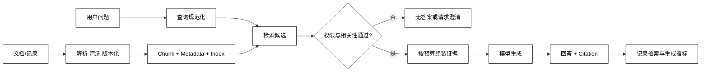

# RAG 管线与适用边界

## 学习目标

- 说清 RAG（Retrieval-Augmented Generation）为什么把“查证据”和“生成答案”拆开。
- 能从数据流定位 Ingestion、Retrieval、Augmentation、Generation 和 Citation 的责任。
- 知道什么时候应该检索文档，什么时候应该调用数据库、工具或直接回答。
- 能在源码中找到检索失败、权限过滤、无答案和降级出口。

## 前置知识

- 已完成第 02 章的 Agent Loop、第 03 章的 Message/Context，以及第 05 章的 State/Memory。
- 本章先看整条管线，文档导入见[解析与清洗](./02-Ingestion解析与清洗)，分块见[Chunking 与元数据](./03-Chunking与元数据)。

## RAG 到底解决什么问题

### Retrieval：从外部知识中找证据

**Retrieval** 是根据用户问题从外部知识库取回候选片段。它解决“模型上下文里没有这份资料”或“资料更新频繁”的问题，但不保证候选片段一定正确。

### Augmentation：把证据放进一次请求

**Augmentation** 是把检索结果按顺序、预算、来源和安全规则组装进模型输入。它解决“找到的片段如何被模型看到”的问题，不等于简单地把所有文本拼到 Prompt 后面。

### Generation：在证据约束下生成

**Generation** 是模型依据问题、指令和已注入证据生成回答。模型仍可能误读、遗漏或超出证据推断，所以需要无答案策略、引用和生成评测。

### Citation：让答案回到证据

**Citation** 是把回答中的事实与 `source_id`、章节、页码或片段 ID 关联起来。引用是可追溯性，不是事实正确的自动证明；引用了不相关片段仍然是错误答案。

## RAG 的最小数据流



阅读提示：左半部分是离线或准实时的数据准备，右半部分是一次请求的在线路径；`Gate` 不是模型自己做的决定，而是 Runtime 在把内容交给模型前做权限、版本和相关性检查。

## 什么时候适合使用 RAG

### 资料会更新或规模超过上下文窗口

用途：把知识放在可更新的索引中，回答时只取相关片段。产品文档、内部规范、代码说明和个人笔记通常适合这个模式。

### 回答需要给出来源

用途：让每条事实带着片段 ID 或 URL 回到原始资料，便于复核、审计和发现过期内容。

### 需要按用户或租户隔离知识

用途：在检索前或检索器内部应用 ACL、租户和数据版本过滤；“检索到了再让模型忽略”不是安全策略。

## 什么时候不要把 RAG 当成万能方案

### 精确计算交给数据库或工具

用途：订单金额、库存、权限状态和聚合统计应调用带事务语义的系统；文档检索最多提供解释，不应成为事实来源。

### 稳定常识不必为了形式检索

用途：如果答案不依赖私有或更新资料，直接使用模型或固定配置更简单；增加索引会带来延迟、成本和新的失败点。

### 需要全量分析时不能只取 Top-K

用途：审计全库、统计所有记录和证明不存在某项数据时，Top-K 检索不能提供完备性保证，应使用数据库查询、批处理或专用分析流程。

## 一个不依赖模型的最小 RAG 管线

下面用关键词重叠模拟 Retriever，用固定模板模拟 Generator；重点是看每个边界返回什么，不依赖网络、向量库或 API Key。

```python
from dataclasses import dataclass


@dataclass(frozen=True)
class Chunk:
    chunk_id: str
    text: str
    source: str
    allowed_users: frozenset[str]


KNOWLEDGE = [
    Chunk("java-01", "Java 的 List 保存有序元素，可以按索引读取。", "java.md", frozenset({"clint"})),
    Chunk("agent-01", "RAG 先检索证据，再把证据组装进模型上下文。", "agent.md", frozenset({"clint", "reader"})),
]


def retrieve(question: str, user: str, limit: int = 3) -> list[Chunk]:
    words = set(question.replace("，", " ").split())
    candidates = [item for item in KNOWLEDGE if user in item.allowed_users]
    ranked = sorted(candidates, key=lambda item: len(words & set(item.text)), reverse=True)
    return ranked[:limit]


def answer(question: str, user: str) -> str:
    evidence = retrieve(question, user)
    if not evidence or all(not item.text for item in evidence):
        return "没有找到足够证据，请换一种问法或补充资料。"
    body = "\n".join(f"[{item.chunk_id}] {item.text}" for item in evidence)
    return f"问题：{question}\n依据：\n{body}"


print(answer("RAG 先做什么", "reader"))
# 输出：问题：RAG 先做什么
# 输出：依据：
# 输出：[agent-01] RAG 先检索证据，再把证据组装进模型上下文。
```

这个例子里的 `allowed_users` 只演示责任位置；真实系统应在索引查询或数据访问层做不可绕过的 ACL，并把过滤条件记录到 Trace。关键词匹配也只是教学替身，正式检索会在第 04、05 篇展开。

## 无答案和降级边界

### 没有候选：明确说不知道

用途：当检索为空或分数低于阈值时返回澄清、人工转交或“资料中没有找到”，不要强迫模型凭常识补全。

### 候选冲突：保留版本与来源

用途：同一事实有多个版本时，把 `source_id`、`version`、更新时间带入上下文，让模型说明冲突或按业务规则选择。

### 检索服务不可用：区分安全降级和功能降级

用途：公共 FAQ 可以暂时返回固定错误；权限、财务和医疗资料不能静默退化到无来源生成，应停止或转人工。

## 源码阅读锚点

### LangChain / LangGraph

从 retriever 的 `invoke` 或图中的检索节点开始，向前看查询如何被规范化，向后看结果是否进入 State、Prompt 和最终回答。官方学习入口：[Semantic Search 与 RAG](https://docs.langchain.com/oss/python/learn)。

### OpenAI Retrieval / File Search

重点看文件如何进入 vector store、查询过滤和结果如何回填；向量库支持并不代表应用自动完成租户授权。可从[Vector Stores API](https://platform.openai.com/docs/api-reference/vector-stores)对照请求对象。

### DeepSeek Harness

沿着“资料来源 → Skill/Context 加载 → Tool 或模型请求”的调用链找 RAG 适配点；不要把某个 `knowledge` 或 `search` 命名的对象直接当成通用 RAG 标准。

## 易混点

- **检索命中不等于答案正确**：Retriever 只提供候选证据，生成仍需要约束和评测。
- **上下文变长不等于信息更多**：无关片段会稀释重点，还会增加延迟和成本。
- **引用不等于事实证明**：引用必须与答案中的具体主张相关，并且来源版本可追溯。
- **RAG 不替代数据库查询**：需要精确过滤、事务和全量统计时，应调用系统工具。
- **检索失败不能静默回退**：是否允许无来源回答必须由风险等级和业务策略决定。

## 课后小问（含解析）

1. 为什么模型已经“记住”某个知识，还要做 RAG？

   **答案**：因为私有资料、更新资料和可追溯来源不应只依赖模型参数。

   **解析**：RAG 把外部证据放进一次请求，便于更新和引用；它仍然需要检索、权限和生成评测，不能保证自动正确。

2. 检索为空时，为什么不让模型自由回答？

   **答案**：因为自由回答可能把不确定推断伪装成来自知识库的事实。

   **解析**：应按风险选择澄清、转人工、固定知识回答或明确无答案；关键是让“没有证据”成为可观察状态。

3. 为什么不能只在 Prompt 中写“不要访问其他租户资料”？

   **答案**：Prompt 是模型可见的指导，不是数据访问控制。

   **解析**：越权数据在进入模型上下文后已经发生泄露。ACL、租户过滤和权限审计必须位于检索或数据访问边界。

## 本节小结

- RAG 是 Retrieval、Augmentation、Generation 的组合，Citation 负责把主张回到证据。
- 离线 Ingestion 建索引，在线请求做查询、检索、权限过滤、上下文组装和生成。
- RAG 适合可更新、可追溯的外部知识；精确查询、全量分析和高风险决策应使用专用工具或数据库。
- 无答案、冲突、服务故障和权限拒绝都要有明确出口，不能把失败藏在模型文本里。

## 快速回顾

- 能画出从文档到索引、从问题到引用答案的两条路径。
- 能解释 Retrieval、Augmentation、Generation 和 Citation 各自负责什么。
- 能判断一个需求应使用 RAG、数据库查询、Tool 还是直接回答。
- 下一篇阅读[Ingestion、解析与清洗](./02-Ingestion解析与清洗)。
