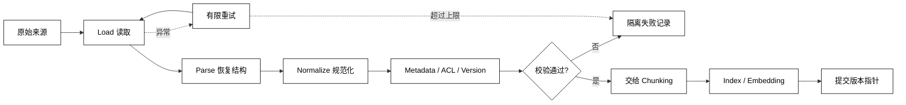

# Ingestion、解析与清洗

## 学习目标

- 理解 Ingestion 为什么是“把来源资料变成可检索记录”的独立流水线。
- 区分加载、解析、规范化、元数据、校验和索引提交，不把所有逻辑塞进一个 Loader。
- 能处理编码、空文档、解析失败、重复导入和版本更新。
- 阅读源码时能找到 checkpoint、幂等键、失败隔离和提交边界。

## 前置知识

- 已阅读 [RAG 管线与适用边界](./01-RAG管线与适用边界)；知道在线 Retrieval 与离线 Index 的边界。
- 已了解第 05 章的 State/Checkpoint；本篇把类似思想用到文档导入任务。

## Ingestion 是什么

### Source：外部来源

**Source** 是原始文件、网页、数据库行、代码仓库或消息流。Source 的 ID、版本、权限和更新时间必须保留下来，否则后面无法删除旧版本或解释引用来源。

### Loader：读取字节或记录

**Loader** 负责从文件系统、对象存储、HTTP 或数据库读取原始内容。它只负责输入，不应该在读取阶段偷偷做向量化、模型调用或权限放宽。

### Parser：恢复文档结构

**Parser** 把 PDF、HTML、Markdown、Office 或 JSON 转成统一的文档结构。解析阶段要尽量保留标题层级、页码、表格、代码块和原始定位信息。

### Normalizer：让文本可比较

**Normalizer** 处理编码、换行、空白、Unicode 和重复页眉等问题。清洗必须可解释；不能为了“看起来干净”删除会改变语义的符号、表格列或代码缩进。

## Ingestion 的边界流程



阅读提示：`Commit` 应在索引写入和校验成功之后发生；解析失败进入隔离区，不应让一份坏文档阻塞整批导入，也不应把半成品版本标成可用。

## 文档记录应该保存什么

### `source_id`：稳定来源身份

用途：在文件路径变化、重新上传或同步仓库后仍能识别“同一份来源”。不要把临时下载 URL 直接当永久 ID。

### `version` 与 `checksum`：判断是否变化

用途：用版本号或内容摘要检测重复导入、更新和删除。checksum 只能说明字节内容相同，不替代业务版本和权限判断。

### `locator`：回到原文的位置

用途：记录页码、HTML 锚点、Markdown 标题路径、代码文件与行号，让 Citation 可以指向具体位置而不是只指向一个大文件。

### `acl`：来源的访问边界

用途：把租户、主体、标签或策略版本带入每个 chunk，检索时做过滤。只在原始 Document 上保存 ACL、切块后丢掉，是常见的越权漏洞。

## 解析与规范化的常见用法

### UTF-8 解码与换行规范化

用途：统一输入编码和换行符，避免同一内容生成不同 checksum；解码失败应进入隔离或使用明确的替代编码，不能静默丢字节。

### HTML 正文提取

用途：去掉脚本、导航和广告后保留标题、链接文本与主体；要保存原 URL 和抓取时间，不能把网页展示文本当成永久事实。

### Markdown 标题路径

用途：保留 `#` 到 `###` 的层级作为 `section_path`，后续分块、引用和上下文组装都能用它解释来源。

### OCR 与表格

用途：OCR 结果应带置信度和页码；表格应保留行列关系。对低置信度文字或复杂布局，宁可标记“需复核”也不要伪装成普通正文。

## 一个可运行的文本 Ingestion 示例

下面用标准库实现 Markdown 文本的最小导入：计算 checksum、提取标题路径、规范化空白并输出统一记录。它不连接真实文件或索引，便于先理解数据形状。

```python
from dataclasses import asdict, dataclass
import hashlib
import json
import re


@dataclass(frozen=True)
class DocumentRecord:
    source_id: str
    version: str
    text: str
    section_path: tuple[str, ...]
    checksum: str


def ingest_markdown(source_id: str, raw: str) -> DocumentRecord:
    normalized = raw.replace("\r\n", "\n").replace("\r", "\n")
    normalized = re.sub(r"[ \t]+", " ", normalized)
    normalized = re.sub(r"\n{3,}", "\n\n", normalized).strip()
    headings = tuple(match.group(2).strip() for match in re.finditer(r"^(#{1,3})[ \t]+(.+)$", normalized, re.MULTILINE))
    checksum = hashlib.sha256(normalized.encode("utf-8")).hexdigest()[:12]
    return DocumentRecord(source_id, checksum, normalized, headings, checksum)


record = ingest_markdown("notes/rag.md", "# RAG\r\n\r\n## Pipeline\r\n\r\n\r\n检索。")
print(json.dumps(asdict(record), ensure_ascii=False, indent=2))
# 输出：包含 source_id、version、规范化后的 text、section_path 和 checksum 的 JSON 记录
# 输出：version 与 checksum 的示例值会随输入内容变化
```

示例把 `version` 简化为内容摘要；生产系统通常还要保存来源版本、导入时间、解析器版本、权限策略版本和原始对象地址，方便回滚和重建。

## 幂等、重试与失败隔离

### 幂等键：同一版本只提交一次

用途：用 `source_id + version + parser_version` 作为导入任务键，重复收到消息时返回已有结果，不重复写入 chunk 或触发向量计费。

### Parser 版本：代码变化要可重建

用途：解析器升级可能改变段落、表格和 checksum；把解析器版本写进记录，避免无法解释“同一文件为什么产生不同索引”。

### Quarantine：坏文档单独处理

用途：保存原始来源、阶段、异常、尝试次数和时间，允许人工修复后重放；不要吞掉异常后把空文本提交进索引。

### Commit：最后一步切换可见版本

用途：新索引全部完成并通过抽样校验后，原子地更新“当前版本”指针；失败时保留旧版本，避免读到半套数据。

## 源码阅读锚点

### LangChain Document Loader

先找 Loader 的输出 `Document(page_content, metadata)`，再看 Text Splitter 如何消费 `metadata`。不要只看 Loader 名称，要检查异常、编码和来源定位是否被保留。[LangChain 文档加载与 RAG 学习入口](https://docs.langchain.com/oss/python/learn)。

### LlamaIndex Ingestion Pipeline

重点看 transformations、缓存和文档/节点 ID 如何串起来；检查重复文档如何被识别，以及转换失败是否会阻塞整批任务。[LlamaIndex Ingestion 文档](https://docs.llamaindex.ai/en/stable/module_guides/loading/ingestion_pipeline/)。

### DeepSeek Harness 与项目知识源

如果源码把 Skill、文件、历史或远程资源统一成 context provider，先确认 provider 的版本、错误和权限边界，再追踪它何时进入模型上下文。名称相同不代表拥有相同生命周期。

## 易混点

- **Loader 不等于 Parser**：Loader 读到字节，Parser 才恢复结构；二者合并也要保持责任可测试。
- **清洗不等于删除所有标记**：标题、代码缩进、表格列和页码可能是检索与引用所需信息。
- **checksum 不等于业务版本**：内容相同不表示权限、来源状态或发布时间相同。
- **重试不等于重复提交**：重试前要用幂等键和阶段状态判断是否已有副作用。
- **解析失败不等于空文档**：空文档进入索引会制造“命中但没有证据”的假成功。

## 课后小问（含解析）

1. 为什么要把 parser_version 存进索引记录？

   **答案**：解析器变化可能改变文本、标题路径和分块结果，需要能够解释和重建。

   **解析**：只记录原文件 checksum，无法说明“文件没变但索引变了”的原因；版本化还能让回滚和 A/B 对比有依据。

2. 一批文件中有一份 PDF 解析失败，为什么不让整批事务全部失败？

   **答案**：文档通常可以独立处理，单个坏来源应进入隔离区并让其他来源继续。

   **解析**：整批失败会扩大故障半径；吞错继续提交则会产生缺失或空证据。隔离区兼顾可用性和可诊断性。

3. 为什么新索引完成后还需要切换版本指针？

   **答案**：让在线检索始终看到一套完整、可解释的版本。

   **解析**：逐条覆盖可能让查询同时看到新旧 chunk；用 staging index 加校验后原子切换，可以把半成品挡在读路径之外。

## 本节小结

- Ingestion 把来源变成带身份、版本、定位和权限的可检索记录。
- Load、Parse、Normalize、Enrich、Validate、Index 和 Commit 是可分别观测的阶段。
- 幂等键、解析器版本、失败隔离和原子版本切换是可靠导入的基础。
- 清洗的目标是提高可检索性和可追溯性，不是把资料改造成看似整齐的纯文本。

## 快速回顾

- 能说出 Loader、Parser、Normalizer 和 Index 的责任。
- 能设计 `source_id`、version、checksum、locator 和 ACL 的最小记录。
- 能为重复、解析失败和解析器升级选择正确的处理方式。
- 下一篇阅读[Chunking 与元数据](./03-Chunking与元数据)。
