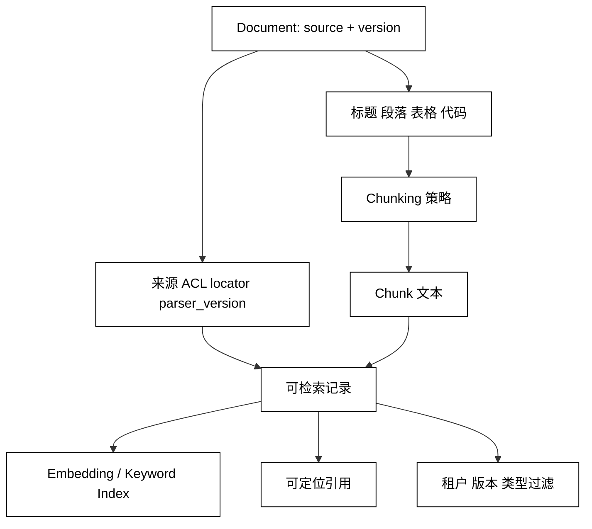

# Chunking 与元数据

## 学习目标

- 理解 Chunk 为什么同时影响召回、引用、上下文预算和更新成本。
- 能按文档结构选择固定长度、递归、语义、父子和代码专用分块。
- 能设计可过滤、可引用、可删除的 chunk metadata。
- 认识 overlap、边界、孤立表格和跨 chunk 关系带来的代价。

## 前置知识

- 已阅读 [Ingestion、解析与清洗](./02-Ingestion解析与清洗)，知道文档结构和来源版本如何保留。
- 已了解第 03 章 Context Window/Token，以及第 05 章的上下文预算。

## Chunking 为什么是检索质量的核心

### Chunk：一次检索返回的最小知识单元

**Chunk** 是从 Document 切出的、可嵌入、可检索和可引用的文本单元。太大时会带入无关内容，太小时会丢失定义、条件和结论之间的关系。

### Recall 与 Precision 的取舍

用途：大 chunk 往往更容易覆盖完整语义，小 chunk 往往更容易精确命中；最终要通过评测集选择，而不是迷信某个固定 token 数。

### Parent-Child：检索小片段，组装大上下文

用途：用 child 做精确召回，用 parent 或相邻片段补充上下文。它可以缓解“命中一句定义却缺少前置条件”，但需要处理重复、版本和引用映射。

## 常见分块策略

### Fixed-size：按字符或 token 上限切割

用途：实现简单、吞吐稳定，适合作为基线；边界可能切断标题、代码和句子，需要 overlap 或边界修正。

### Recursive：从段落到句子逐级切割

用途：优先保留段落和句子边界，超过预算时再细分，通常比纯固定长度更适合一般技术文档。

### Structure-aware：按标题、章节和元素切割

用途：把 `section_path`、表格、列表和代码块当作结构，适合知识库和 Markdown；要为超长单节设置兜底切割。

### Semantic：按语义变化切割

用途：用句向量相似度或主题变化判断边界，适合段落主题变化明显的资料；成本和参数调试复杂度更高。

### Code / Table-aware：保护语法和行列关系

用途：代码按文件、类、函数切，表格按表头和行组切，避免把一个可执行单元或列含义拆散。

## Chunk 与元数据的关系



阅读提示：文本和 metadata 必须一起进入索引；只保存 embedding 而丢掉 `source_id`、ACL 和 locator，后续即使召回正确也无法安全引用或删除。

## Metadata 速查

### `chunk_id`：稳定的片段身份

用途：关联向量、倒排项、引用、缓存和删除操作。可以由 `source_id + version + ordinal` 或内容摘要生成，但要考虑重分块后的稳定性。

### `source_id`、`version`：回到原始文档

用途：显示来源、过滤当前版本、删除旧版本和构建 Citation；不能只存文件名，因为不同租户可能有同名文件。

### `section_path`、`locator`：解释片段位置

用途：显示“第几章/第几节/第几页/第几行”，帮助模型和用户判断片段上下文。

### `tenant_id`、`acl`：检索前置过滤

用途：在候选进入模型上下文前限制可见范围。过滤字段需由受信任的索引流程写入，不能直接相信用户上传的 metadata。

### `parent_id`、`ordinal`、`token_count`：组装与预算

用途：把相邻 child 合并回 parent、恢复原顺序、估算上下文成本。token_count 应说明计算所用 tokenizer 版本。

## 一个结构感知的最小分块器

下面按 Markdown 标题建立 section path，再把正文按字符预算切成带位置的 chunk；代码只用标准库，便于理解数据如何流动。

```python
from dataclasses import asdict, dataclass
import json
import re


@dataclass(frozen=True)
class Chunk:
    chunk_id: str
    text: str
    section_path: tuple[str, ...]
    ordinal: int


def chunk_markdown(source_id: str, markdown: str, max_chars: int = 36) -> list[Chunk]:
    path: list[str] = []
    chunks: list[Chunk] = []
    buffer: list[str] = []
    ordinal = 0

    def flush() -> None:
        nonlocal ordinal
        text = " ".join(buffer).strip()
        if text:
            chunks.append(Chunk(f"{source_id}#{ordinal}", text, tuple(path), ordinal))
            ordinal += 1
        buffer.clear()

    for line in markdown.splitlines():
        heading = re.match(r"^(#{1,3})\s+(.+)$", line)
        if heading:
            flush()
            level = len(heading.group(1))
            path[:] = path[: level - 1] + [heading.group(2).strip()]
            continue
        if line.strip():
            buffer.append(line.strip())
            if len(" ".join(buffer)) >= max_chars:
                flush()
    flush()
    return chunks


items = chunk_markdown("rag.md", "# RAG\n## Chunking\nChunk 要保留标题。\n## Metadata\nMetadata 用于过滤。", 20)
print(json.dumps([asdict(item) for item in items], ensure_ascii=False))
# 输出：每个对象都有 chunk_id、text、section_path 和 ordinal
# 输出：section_path 会把 Chunking 或 Metadata 标题带到对应片段
```

示例用字符数代替 token 数，真实系统应使用目标模型或 embedding 模型对应的 tokenizer，并为代码块、表格、超长单句增加专门策略。

## Overlap、邻居和父子片段

### Overlap：保留跨边界语义

用途：把前一片段末尾的一部分复制到下一片段，降低句子被切断导致的召回损失；overlap 太大则增加重复和索引成本。

### Neighbor expansion：命中后取相邻片段

用途：先以小 chunk 精确召回，再按 `ordinal` 取前后邻居；必须限定同一 `source_id/version/tenant_id`，不能跨文档盲拼。

### Parent-child retrieval：小索引，大上下文

用途：child 保存精确 embedding，parent 保存完整小节。组装时应去重并保留 child 的 locator，避免引用只能指向 parent 大段文本。

## 源码阅读锚点

### LangChain Text Splitters

从 splitter 的输入输出和 `Document.metadata` 追踪 chunk 如何进入 retriever；重点看递归分隔符、长度计算和 metadata 是否复制。[LangChain 检索学习入口](https://docs.langchain.com/oss/python/learn)。

### LlamaIndex Node / Parent-Child

观察 Document、Node、relationships 和 `ref_doc_id` 如何关联；重点检查重建、删除和引用是否能回到原文。[LlamaIndex Node Parser 文档](https://docs.llamaindex.ai/en/stable/module_guides/loading/node_parsers/)。

### DeepSeek Harness

如果 Harness 把文件、Skill 或历史压缩成 context item，检查 item 是否有来源、顺序和截断标记；没有 metadata 的文本很难在后续模型调用中解释和审计。

## 易混点

- **chunk size 不是越大越好**：它改变召回精度、上下文噪声、成本和引用粒度。
- **overlap 不是免费上下文**：重复片段会挤占预算，还可能让同一事实被重复计数。
- **parent-child 不等于复制全文**：应有明确的关系、去重和版本边界。
- **metadata 不只是展示字段**：ACL、tenant 和 version 会直接决定数据是否可见。
- **字符数不等于 token 数**：中英文、代码和标点的 token 化差异需要真实 tokenizer 校准。

## 课后小问（含解析）

1. 为什么知识库里一个标题下有很长代码块时，不能直接按固定字符数切？

   **答案**：固定切割可能把函数、字符串或表格行拆开，召回后失去可解释语义。

   **解析**：应优先识别代码块/表格等结构，再对超长结构设置安全兜底；分块策略要围绕后续问题类型评测。

2. 为什么每个 chunk 都要带 tenant_id？

   **答案**：检索候选在进入模型上下文前需要做租户隔离，不能只依赖源文档级字段。

   **解析**：切块后索引记录可能被单独召回；如果 ACL 没有随 chunk 复制，查询层无法稳定执行不可绕过的过滤。

3. overlap 设置很大能否解决所有上下文丢失？

   **答案**：不能。

   **解析**：大 overlap 只复制邻近文本，无法补回远距离定义、表头或跨章节关系，还会增加成本；应结合 parent、邻居或结构化关系。

## 本节小结

- Chunk 是检索、上下文和引用共同使用的边界，策略应由资料结构与问题集驱动。
- 结构感知、代码/表格保护、适度 overlap 和 parent-child 能减少切割损失。
- chunk_id、source/version、locator、ACL、parent/ordinal 和 token_count 构成实用 metadata 基础。
- 重新分块会影响索引、引用和缓存，必须保留版本并能重建。

## 快速回顾

- 能解释 fixed、recursive、structure-aware、semantic 和 code-aware 的取舍。
- 能设计一个带 ACL、版本和定位信息的 chunk record。
- 能判断何时需要 overlap、邻居扩展或 parent-child。
- 下一篇阅读[Embedding 与向量检索](./04-Embedding与向量检索)。
