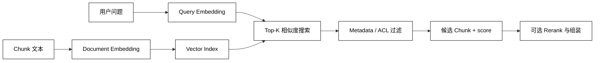

# Embedding 与向量检索

## 学习目标

- 理解 Embedding 把文本映射成向量，以及相似度、距离和 Top-K 的含义。
- 区分 query/document 编码、向量维度、归一化、索引和数据版本。
- 能用一个标准库小例子跑通“编码—写入—查询—排序”。
- 阅读源码时能找到 embedding provider、缓存、upsert、删除和过滤边界。

## 前置知识

- 已完成 [Chunking 与元数据](./03-Chunking与元数据)，知道什么内容进入 embedding。
- 已了解第 03 章的模型 Adapter、Token 和上下文预算；向量检索不是生成模型本身。

## Embedding 的基本概念

### Embedding：把内容映射到向量空间

**Embedding** 是把文本、图片或其他对象编码为固定维度的数值向量，使语义相近对象在某种距离度量下更接近。它不是关键词索引，也不是事实数据库。

### Document embedding 与 query embedding

用途：分别编码知识片段和用户问题；有些模型使用同一个接口，有些模型对 query/document 使用不同前缀或任务参数，必须遵守模型契约。

### Dimension 与 model version

用途：维度决定索引 schema，模型版本决定向量空间；更换维度或模型不能直接把旧向量与新向量混在一个索引中。

### Similarity：cosine、dot product 与 L2

用途：cosine 比较方向，dot product 同时受长度影响，L2 比较几何距离。索引和排序代码必须统一“分数越大越好”还是“距离越小越好”。

## 从文本到 Top-K



阅读提示：写入端和查询端必须使用兼容的 embedding 模型与预处理；`score` 只能用于当前索引的排序，不能直接跨模型或跨 metric 比较。

## 向量检索常用 API

### `embed_documents(texts)`：批量编码知识片段

用途：把一批 chunk 转为向量，适合 Ingestion 阶段批处理，并配合缓存避免重复计费。

### `embed_query(query)`：编码用户问题

用途：把在线问题转成查询向量；不要误把 query 的原始字符串直接与 document 向量做数学运算。

### `upsert(id, vector, metadata)`：新增或覆盖记录

用途：按稳定 ID 写入向量和 metadata；要明确覆盖是否代表版本更新，以及失败重试是否幂等。

### `delete(ids)`：删除失效或无权内容

用途：删除文档版本、租户数据或撤回内容；删除向量不一定自动删除倒排索引、缓存和 parent-child 关系。

### `similarity_search(query, k)`：取相似候选

用途：根据 query 返回 Top-K 文档和分数；生产用法还需要 filter、namespace、score threshold 和 timeout。

### `similarity_search_with_score`：同时查看排序信号

用途：调试阈值和评测检索质量；不同库可能返回相似度或距离，调用方要先确认方向。

## 一个可运行的向量检索替身

下面用字符计数向量模拟 embedding，用 cosine 完成 Top-K；它不代表真实 embedding 质量，只帮助理解 API 之间的数据形状。

```python
from collections import Counter
from dataclasses import dataclass
import math


VOCAB = tuple("rag检索证据java列表redis缓存")


def embed(text: str) -> tuple[float, ...]:
    counts = Counter(text.lower())
    return tuple(float(counts[char]) for char in VOCAB)


def cosine(left: tuple[float, ...], right: tuple[float, ...]) -> float:
    product = sum(a * b for a, b in zip(left, right))
    length = math.sqrt(sum(a * a for a in left) * sum(b * b for b in right))
    return product / length if length else 0.0


@dataclass(frozen=True)
class VectorRecord:
    record_id: str
    text: str
    vector: tuple[float, ...]


records = [
    VectorRecord("r1", "RAG 使用检索证据", embed("RAG 使用检索证据")),
    VectorRecord("r2", "Java List 保存列表", embed("Java List 保存列表")),
]
query_vector = embed("RAG 检索")
ranked = sorted(records, key=lambda item: cosine(query_vector, item.vector), reverse=True)
print([(item.record_id, round(cosine(query_vector, item.vector), 3)) for item in ranked])
# 输出：[('r1', 0.894), ('r2', 0.487)]
```

示例的具体分数只是这组字符词表下的结果；正式系统应使用经验证的 embedding 模型、目标语言数据和索引库，并把模型/维度/metric 写进索引配置。

## Index 与生产边界

### Exact search：小数据先求正确

用途：逐个计算距离，结果最容易解释，适合小知识库、测试集和建立 ANN 回归基线。

### ANN：大规模低延迟近似检索

用途：用 HNSW、IVF、PQ 等索引减少搜索成本；召回率会与内存、构建参数和查询延迟交换，必须用真实数据评测。

### Namespace 与 metadata filter

用途：按租户、知识库、版本或业务空间隔离搜索；namespace 不是 ACL 的全部，还要检查用户实际授权。

### Cache：复用编码与查询结果

用途：缓存相同内容的 document embedding 和短期 query 结果；缓存键必须包含模型版本、预处理版本、租户/权限条件和过期策略。

## 源码阅读锚点

### LangChain Embeddings / VectorStore

先找 `embed_documents`、`embed_query` 和 vector store 的 `add_documents`、`similarity_search`，确认 metadata 如何传递和分数如何解释。[Embedding 接口概览](https://docs.langchain.com/oss/python/integrations/embeddings)。

### OpenAI Vector Stores

关注文件批处理、属性过滤、chunking 配置和状态轮询；托管 vector store 简化了索引运维，但应用仍需管理来源版本和权限。[Vector store file batches API](https://platform.openai.com/docs/api-reference/vector-stores-file-batches)。

### FAISS / Qdrant 等索引实现

阅读时把“向量结构”“近似索引”“payload/filter”“持久化”分开。索引返回一个 ID 只是候选，最终文本、ACL 和引用仍来自 metadata/文档存储。

## 易混点

- **Embedding 相似不等于事实相同**：语义邻近可能包含相反版本或不同主体。
- **距离和相似度方向可能相反**：L2 常是越小越近，cosine/dot 常是越大越近。
- **改 embedding 模型不能直接混索引**：维度、空间和分布都可能不同，应重建或分 namespace。
- **Top-K 不是最终答案**：还需要权限过滤、阈值、去重、重排和上下文预算。
- **向量库不等于文档主库**：向量删除、原文删除、缓存失效和审计要保持一致。

## 课后小问（含解析）

1. 为什么 query embedding 和 document embedding 可能不是同一个函数调用？

   **答案**：模型可能为查询和文档使用不同的任务前缀、指令或编码策略。

   **解析**：即使 API 名称相似，也要遵守模型提供方的输入契约；两端预处理不一致会让向量空间失配。

2. 为什么小数据集仍要先做 exact search？

   **答案**：它能提供可解释的真实排序，作为 ANN 参数和新索引的回归基线。

   **解析**：如果一开始就用近似索引，召回损失可能被误认为 embedding 或分块问题；先得到正确答案再优化延迟更容易诊断。

3. 为什么缓存键需要包含权限条件？

   **答案**：同一个 query 在不同用户或租户下可见候选不同。

   **解析**：只按 query 缓存可能把一个用户的结果返回给另一个用户；过滤条件、身份范围和策略版本必须进入缓存边界。

## 本节小结

- Embedding 把 chunk 和 query 映射到向量空间，向量检索按统一的相似度/距离取候选。
- `embed_documents`、`embed_query`、`upsert`、`delete` 和 `similarity_search` 是理解源码的关键入口。
- 维度、模型版本、metric、namespace、metadata filter 和缓存共同决定结果是否可靠。
- exact search 是质量基线，ANN 是规模优化；两者都不能替代权限、重排和引用。

## 快速回顾

- 能区分 query/document embedding、cosine/dot/L2 和 similarity/distance。
- 能说明 Top-K 之后还要做哪些检查。
- 能找到向量写入、查询、删除和 metadata 过滤的源码入口。
- 下一篇阅读[关键词、混合检索与过滤](./05-关键词混合检索与过滤)。
