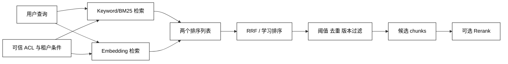

# 关键词、混合检索与过滤

## 学习目标

- 理解关键词检索、向量检索和混合检索各自擅长什么。
- 能说清 BM25/TF-IDF 类 lexical score、RRF 融合和 metadata filter 的边界。
- 能把 ACL/租户过滤放在正确位置，并避免“先取 Top-K 再过滤”造成漏召回或越权。
- 用标准库实现一个可观察的关键词 + 向量分数融合示例。

## 前置知识

- 已完成 [Embedding 与向量检索](./04-Embedding与向量检索)；知道 dense candidate 的来源和分数方向。
- 已了解 [Chunking 与元数据](./03-Chunking与元数据) 的 `tenant_id`、`version`、`locator`。

## 两类检索先分开

### Keyword / Lexical Search：精确匹配词项

用途：按词频、逆文档频率和位置匹配专有名词、错误码、类名、订单号和精确短语。它不要求“意思相近”，但对同义改写不敏感。

### Dense / Semantic Search：匹配语义邻近

用途：用 embedding 找到表达不同但意思相近的内容，适合自然语言问题；它可能把相似主题、相反结论或错误版本也召回。

### Hybrid Search：让两种信号互补

用途：分别取候选，再用 rank fusion 或学习排序合并；不要直接把未经校准的 BM25 分数和 cosine 分数相加。

## 关键词、融合与过滤数据流



阅读提示：`ACL` 的条件来自受信任的会话和授权上下文，而不是用户问题或模型生成的 filter；过滤越晚，越可能产生越权候选和无效 Top-K。

## 关键词检索常用 API

### `match(query)`：按词项召回

用途：把 query 分词后查倒排索引，适合错误码、API 名和专有名词；分词策略要覆盖中英文、大小写和代码符号。

### `phrase_match(query)`：按短语顺序召回

用途：保留词序以提高精确度，适合函数签名、产品名称和固定术语；过于严格会降低自然语言问题的召回。

### `filter(expression)`：限制候选范围

用途：按 tenant、ACL、source type、version 和时间范围缩小搜索域；过滤表达式必须经过解析和授权，不能直接执行用户拼接字符串。

### `min_score` / `threshold`：拒绝低质量候选

用途：丢掉分数明显低于验证集阈值的候选，形成无答案出口；阈值必须绑定模型、索引和查询类型。

## RRF：不直接比较两个分数

### `rank_fusion`：按名次合并列表

用途：用每个列表中的名次计算贡献，避免 lexical 与 dense 分数尺度不同；同一个文档在两边都出现时会获得互补优势。

一个常见的 Reciprocal Rank Fusion 形式是：

`RRF(d) = Σ 1 / (k + rank_i(d))`

其中 `k` 是平滑常数，`rank_i` 从 1 开始。公式是融合启发式，不代表概率，也不能替代离线评测。

## 一个可运行的混合检索示例

下面用词项重叠模拟 lexical 排名，用预先给出的 dense 排名模拟向量检索，再用 RRF 合并；示例不需要安装搜索引擎。

```python
from collections import defaultdict


DOCUMENTS = {
    "a": "Redis 使用 TTL 管理缓存过期时间",
    "b": "RAG 使用向量检索语义相近的证据",
    "c": "RAG 可以用关键词检索精确匹配 API 名",
}


def keyword_rank(query: str) -> list[str]:
    terms = set(query.lower().split())
    scored = [(doc_id, sum(term in text.lower() for term in terms)) for doc_id, text in DOCUMENTS.items()]
    return [doc_id for doc_id, score in sorted(scored, key=lambda item: (-item[1], item[0])) if score]


def rrf(lists: list[list[str]], constant: int = 60) -> list[tuple[str, float]]:
    scores: defaultdict[str, float] = defaultdict(float)
    for ranked in lists:
        for rank, doc_id in enumerate(ranked, start=1):
            scores[doc_id] += 1 / (constant + rank)
    return sorted(scores.items(), key=lambda item: (-item[1], item[0]))


lexical = keyword_rank("RAG 关键词")
dense = ["b", "c", "a"]
print(lexical)
# 输出：['c', 'b']
print(rrf([lexical, dense]))
# 输出：列表中 b、c 的融合分数高于只在一个列表中出现的 a
```

示例中的 dense 列表代表第 04 篇向量检索的结果；生产系统还要在两个检索器内部应用可表达的 metadata filter，并记录每个候选来自哪条路径。

## 过滤的正确顺序

### Pre-filter：先限制检索空间

用途：当向量库支持 payload/metadata filter 时，先按租户、ACL 和版本缩小候选，避免不可见记录进入排序。

### Post-filter：检索后再筛选

用途：对索引不支持的复杂条件做补充过滤；必须扩大候选窗口，否则 Top-K 中有很多不可见项时会返回不足或空结果。

### ACL filter：永远不是 Prompt 过滤

用途：把授权主体、资源范围和策略版本作为 Runtime 条件；模型只能看到过滤后的候选，不能承担访问控制。

### Filter audit：记录实际条件

用途：在 Trace 中保存租户、版本、过滤表达式摘要和候选数量，便于解释“为什么没有搜到”和追查越权。

## 源码阅读锚点

### Elasticsearch / OpenSearch

对照 `match`、`match_phrase`、`bool.filter`、BM25 和 hybrid/rank fusion 的执行位置；重点看 filter 是否参与召回还是只在结果阶段应用。[OpenSearch hybrid search](https://opensearch.org/docs/latest/vector-search/ai-search/hybrid-search/index/)。

### Qdrant / 向量库 filter

查看 payload filter、候选 limit 和 score threshold 如何组合；确认索引是否能在 ANN 阶段应用 filter，以及没有结果时 API 返回什么。[Qdrant filtering](https://qdrant.tech/documentation/concepts/filtering/)。

### LangChain Retriever

追踪 `invoke` 到底调用了哪个 retriever，filter 是在底层 vector store、数据库还是应用层执行；不要只根据 Runnable 链表面名称判断。

## 易混点

- **关键词命中不等于语义相关**：专有名词可能很准，但自然语言改写会漏召回。
- **混合分数不能随便相加**：BM25、cosine 和距离的尺度与方向不同，先做 rank fusion 或校准。
- **post-filter 不是安全兜底**：不可见内容已经进入排序和日志时，仍可能泄露分数、数量或片段摘要。
- **阈值不是全局常数**：不同模型、索引、语言和查询类型需要独立校准。
- **Top-K 不是最终 K**：应用 ACL、去重和版本过滤后，候选数可能减少，应有扩召回和无答案策略。

## 课后小问（含解析）

1. 为什么错误码问题通常需要关键词检索参与？

   **答案**：错误码、类名和 API 名的精确字符本身就是重要信号，语义向量可能把相似但不同的错误召回。

   **解析**：dense 负责改写和语义近似，lexical 负责精确符号；两者融合比单一检索更能覆盖代码知识库。

2. 为什么不能只取向量 Top-5 再做 tenant 过滤？

   **答案**：前五项可能全部属于其他租户，导致漏召回；更严重的是它们可能在排序、日志或错误信息中暴露。

   **解析**：尽量 pre-filter；只能 post-filter 时扩大候选并确保不可见记录不离开受控边界，同时记录过滤后的召回结果。

3. RRF 分数能否直接解释成“答案可信度”？

   **答案**：不能。

   **解析**：RRF 只是多个排序列表的融合信号，适合相对排序；答案可信度还要看来源质量、引用支持、生成评测和业务规则。

## 本节小结

- lexical 擅长精确词项，dense 擅长语义相似，hybrid 让两者互补。
- RRF 按 rank 融合，避免未经校准地相加不同检索器的分数。
- tenant、ACL、version 和 type 过滤应尽量在召回前应用，并记录实际边界。
- 过滤、阈值、扩召回和无答案要一起设计，不能把安全与质量交给 Prompt。

## 快速回顾

- 能说明关键词、向量和混合检索的优势与盲点。
- 能写出 RRF 的基本思路并解释为什么不直接相加分数。
- 能判断一个过滤条件该在哪一层执行。
- 下一篇阅读[Rerank、引用与上下文组装](./06-Rerank引用与上下文组装)。
