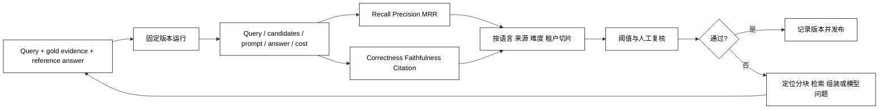

# 检索评测与生成评测

## 学习目标

- 区分“检索找没找到”和“生成答得对不对”两类问题。
- 会计算 Recall@K、Precision@K、MRR 等基础检索指标，并知道它们的盲点。
- 能评估答案的正确性、引用覆盖、忠实性、拒答和成本延迟。
- 能建立固定数据集、切片、Trace、回归阈值和人工复核闭环。

## 前置知识

- 已完成本章前六篇，理解 chunk、embedding、hybrid、rerank、citation 和上下文预算。
- 已了解第 04 章的 Trace、第 05 章的状态记录和第 10 章的评测/可观测性方向。

## 两个评测问题

### Retrieval Eval：相关证据有没有被找回来

**检索评测**把 query 与人工标注的相关 chunk/source 对比，回答“候选集是否覆盖了正确证据”。它不关心模型最后用了哪句话。

### Generation Eval：模型是否基于证据答对

**生成评测**把回答与参考答案、证据和规则对比，回答“答案是否正确、完整、可引用、不过度编造”。检索正确但生成错误仍然是失败。

### End-to-end Eval：整条链路是否有用

**端到端评测**同时经过 query rewrite、检索、组装、模型和 Citation，最接近用户体验；但定位问题更难，应与阶段指标一起使用。

## 从数据集到回归报告



阅读提示：固定数据集和固定版本才能比较变化；`Trace` 要同时记录候选、过滤、组装和答案，否则只有总分，无法知道是 chunk、retriever 还是 generator 出错。

## 检索指标

### Recall@K：前 K 是否包含正确证据

用途：衡量漏召回风险。若 gold 集合为 `G`、前 K 候选为 `R`，常见形式是 `|G ∩ R| / |G|`；对于“必须找齐多段证据”的问题尤其重要。没有 gold 证据的无答案样本不应记为 1.0，而应返回 `None` 并单独统计无答案处理效果。

### Precision@K：前 K 有多少是相关的

用途：衡量候选噪声。`|G ∩ R| / |R|` 越高，后续 rerank 和上下文预算压力通常越小；如果 K 不同，比较时要保持定义一致。

### MRR：第一个正确结果排得多靠前

用途：关注用户通常只看前几个结果的场景；第一个相关项在 rank 1 得分最高，完全没有相关项得 0。

### nDCG：相关程度和位置一起算

用途：当 gold 不只有“相关/不相关”，而是有多个相关等级时使用；要明确 gain 和 discount 的定义，不能把不同实现的数值直接比较。

## 生成指标

### Correctness：回答是否正确

用途：将答案与参考答案、领域规则或人工判断比较；开放式回答常需要 rubric，而不是只做字符串相等。

### Faithfulness：答案是否被给定证据支持

用途：把答案拆成可验证主张，检查每个主张能否由检索证据推出；“回答正确但证据不支持”也暴露了无来源生成问题。

### Citation completeness：主张是否都有引用

用途：检查需要引用的事实是否关联到正确 citation ID；引用数量多不等于覆盖率高，错误 citation 应计为失败。

### Abstention：证据不足时能否拒答

用途：构造无答案和相似干扰样本，判断模型是否说“资料不足”而不是编造；高风险系统应把拒答质量单独统计。

## 一个可运行的基础评测示例

下面使用标准库计算 Recall@K、MRR、跳过无答案样本的平均 Recall 和 citation 覆盖率；输出是可重复的，适合作为后续替换真实 retriever/generator 的基线。

```python
from typing import Optional


def recall_at_k(retrieved: list[str], relevant: set[str], k: int) -> Optional[float]:
    if not relevant:
        return None
    return len(set(retrieved[:k]) & relevant) / len(relevant)


def mean_reciprocal_rank(ranked_lists: list[list[str]], relevant: set[str]) -> float:
    scores = []
    for ranked in ranked_lists:
        rank = next((index for index, item in enumerate(ranked, start=1) if item in relevant), None)
        scores.append(1 / rank if rank else 0.0)
    return sum(scores) / len(scores) if scores else 0.0


def mean_recall(values: list[Optional[float]]) -> Optional[float]:
    measured = [value for value in values if value is not None]
    return sum(measured) / len(measured) if measured else None


def citation_coverage(claim_ids: list[str], cited_ids: set[str]) -> float:
    return sum(claim in cited_ids for claim in claim_ids) / len(claim_ids) if claim_ids else 1.0


retrieved = ["chunk-b", "chunk-x", "chunk-a"]
recalls = [
    recall_at_k(retrieved, {"chunk-a", "chunk-b"}, 3),
    recall_at_k(["chunk-x"], set(), 3),
]
print(recalls)
# 输出：[1.0, None]；无 gold 的无答案样本不伪装成召回成功
print(mean_recall(recalls))
# 输出：1.0；均值只计算有 gold 证据的样本
print(mean_reciprocal_rank([retrieved], {"chunk-a", "chunk-b"}))
# 输出：1.0
print(citation_coverage(["claim-1", "claim-2"], {"claim-1"}))
# 输出：0.5
```

这些函数没有判断“证据是否真的支持主张”，因为那需要参考答案、领域规则或人工/模型裁判；指标先把可计算边界写清楚，再扩展判断质量。

## 数据集和实验设计

### Gold evidence：标注正确来源

用途：每个问题至少标记相关 chunk/source、版本和可接受答案范围；没有 gold，Recall 只能凭感觉判断。

### Positive / negative / no-answer：覆盖三种状态

用途：正例测试能否找到，难负例测试能否区分相似内容，无答案测试能否拒答；三者缺一会让系统在某一类输入上过拟合。

### Slice：按条件拆分报告

用途：按语言、文档类型、难度、来源新旧、租户和查询长度切片，避免平均分掩盖某类用户严重退化。

### Version pinning：固定依赖和数据版本

用途：记录 chunking、embedding、index、reranker、prompt、模型和评测脚本版本；否则无法解释一次分数变化来自哪里。

### Cost / latency：质量不是唯一目标

用途：同时记录检索延迟、模型 token、Rerank 次数、失败率和单位请求成本；更高 Recall 如果让 P95 延迟翻倍，可能不是可接受升级。

## 源码阅读锚点

### LangSmith / LangChain evaluation

看 evaluator 如何取得输入、输出、参考答案和 trace；确认一个“correct”评分是规则、人工还是 LLM judge，并把 judge 版本和 rubric 记录下来。[LangChain Learn](https://docs.langchain.com/oss/python/learn)。

### LlamaIndex Evaluation

对照 RetrieverEvaluator、faithfulness、context relevancy 和 citation 相关评测入口，检查评测使用的是候选、组装上下文还是最终答案。[LlamaIndex evaluation 文档](https://docs.llamaindex.ai/en/stable/module_guides/evaluating/root/)。

### OpenAI Evals / Tracing

阅读时把 dataset case、grader、trace span 和发布门禁分开；LLM judge 是一种带偏差的测量工具，需要人工校准和金标准切片。[OpenAI Evals](https://platform.openai.com/docs/guides/evals)。

## 易混点

- **Recall 高不等于答案好**：候选很多但组装、重排或生成失败仍会答错。
- **Precision 高不等于找全**：只返回一个很准的片段可能遗漏第二个必要条件。
- **LLM judge 不是真理**：评判模型可能有位置偏差、长度偏差和与生成模型同源偏差。
- **citation 存在不等于引用正确**：必须检查 citation 是否支持具体主张。
- **平均分通过不等于所有用户通过**：难例、无答案、权限和语言切片可能已经退化。
- **测试集不能反复泄露给 Prompt**：过度针对固定题目调参会失去泛化能力。

## 课后小问（含解析）

1. 检索 Recall@5 100%，为什么最终答案仍可能错误？

   **答案**：正确证据虽然在候选里，但可能被 Rerank 丢掉、被预算截断或被模型误读。

   **解析**：要把阶段指标串起来看，记录 candidates、assembled context、answer 和 citations，不能只看 retriever 分数。

2. 为什么要加入 no-answer 样本？

   **答案**：检验系统在没有支持证据时是否拒答或澄清，而不是凭常识编造。

   **解析**：只有正例会鼓励“总要回答”；无答案集能测量拒答精度、误拒答和风险边界。

3. 为什么评测报告要按切片展示？

   **答案**：平均值可能隐藏某类语言、来源或难度样本的严重退化。

   **解析**：上线风险通常集中在少数切片；切片与 Trace 关联后，才能定位是解析、分块、过滤、检索还是生成问题。

## 本节小结

- Retrieval Eval 衡量证据是否找回，Generation Eval 衡量答案是否正确、忠实并有完整引用。
- Recall、Precision、MRR、nDCG 是检索信号；Correctness、Faithfulness、Citation Completeness 和 Abstention 是生成信号。
- 固定数据、版本、切片、Trace 和金标准，才能让评测成为回归门禁。
- 质量、成本、延迟、失败和安全要一起看，不能只优化一个分数。

## 快速回顾

- 能解释 Recall@K、Precision@K、MRR 和 citation coverage 的含义。
- 能为正例、难负例和无答案设计一个最小数据集。
- 能从 Trace 判断问题出在 Ingestion、Chunking、Retrieval、Assembly 还是 Generation。
- 下一步可进入第 09 章工作流与多 Agent，或回到第 01 章的项目资源导航查阅具体框架。
