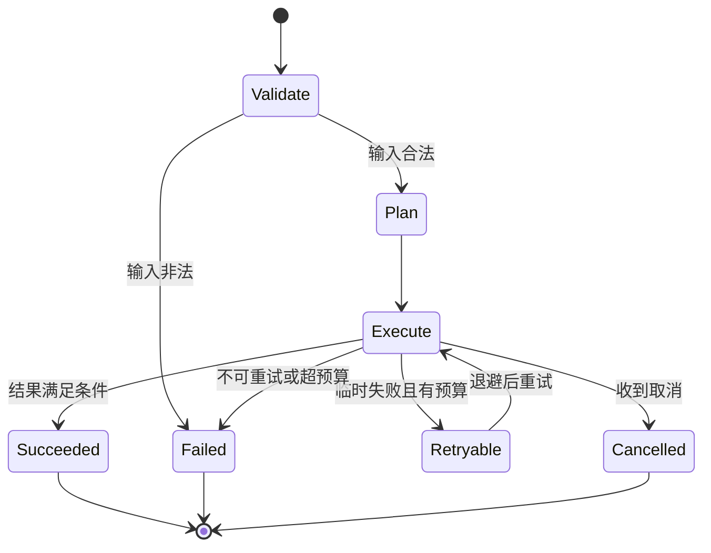

# Workflow 与状态机

## 学习目标

- 能把一个 Agent 任务拆成有明确状态、节点和转移的流程，而不是把所有逻辑塞进一个不可观察的 Loop。
- 能区分“当前状态是什么”和“下一步怎么走”，并为成功、失败、取消和恢复分别定义出口。
- 能判断哪些节点可以重放，哪些节点已经产生外部副作用，必须使用幂等键或补偿。

## 前置知识

- 已完成第 02–08 章，知道 `State`、`Checkpoint`、`Tool`、`Memory`、`Context` 和 RAG 的基本边界。
- 推荐先读[Agent Loop](/courses/agent/02-Agent基础/04-Observation-Action与Agent-Loop)和[Checkpoint、Suspend 与 Resume](/courses/agent/05-状态上下文会话与记忆/04-Checkpoint-Suspend与Resume)。

## Workflow 是什么

**Workflow** 是一组有明确顺序、条件和终点的任务流程。它可以包含普通函数、工具调用、模型决策和人工审批，但每个步骤都应该能说明输入、输出、状态变化和失败处理。

白话说，Workflow 像一张流程图：模型可以参与某个节点的判断，不能因此让整张流程图失去边界。固定流程用代码表达，开放决策才交给模型。

### Workflow 与自由 Agent Loop 的区别

自由 Agent Loop 适合目标不明确、需要探索的任务；Workflow 适合步骤、权限和完成条件相对稳定的任务。工程中经常把二者组合：Workflow 控制大方向，某个节点内部再运行一个有步数上限的 Agent Loop。

### 状态机、Node 与 Edge

**StateMachine** 用有限状态表示运行阶段；**Node** 是一次可执行的处理单元；**Edge** 是从一个节点到下一个节点的转移规则。边可以是无条件的，也可以根据状态、工具结果或审批结果选择目标。

状态机的关键不是画图，而是让这些问题有唯一答案：谁写状态、什么条件允许转移、失败是否重试、恢复从哪个版本继续。

## 最小状态机



阅读这张图时，先看每个节点的责任，再看每条边的条件。`Retryable` 不是“失败后必然重试”，它仍然要经过重试预算、幂等性和取消状态检查。

## Node 的输入输出契约

节点至少要声明读取哪些状态、产生哪些状态，以及是否可能产生外部副作用。把返回值约束为结构化结果，后续的边才不会依赖异常字符串或日志文本。

### Node 的纯计算边界

纯节点只根据输入计算输出，例如解析、校验、选择路由。它可以安全重放，测试也容易写。

### Node 的副作用边界

副作用节点会写数据库、发消息、调用支付或修改文件。它必须携带 `idempotency_key`，并在状态里记录执行结果；仅仅把函数包在 `try/except` 中不能让副作用变得可重放。

下面的案例用本地字典模拟订单审批流程：校验和计划是纯节点，执行节点通过幂等键避免重复扣库存。

```python
from __future__ import annotations

from dataclasses import dataclass, replace
from typing import Literal


Status = Literal["new", "validated", "executed", "succeeded", "failed", "cancelled"]


@dataclass(frozen=True)
class WorkflowState:
    order_id: str
    quantity: int
    status: Status = "new"
    idempotency_key: str = ""
    error: str | None = None


inventory = {"book": 3}
executed_keys: set[str] = set()


def validate(state: WorkflowState) -> WorkflowState:
    if state.quantity <= 0:
        return replace(state, status="failed", error="quantity must be positive")
    return replace(state, status="validated", idempotency_key=f"{state.order_id}:reserve")


def execute(state: WorkflowState) -> WorkflowState:
    if state.status != "validated":
        return replace(state, status="failed", error="unexpected state")
    if state.idempotency_key in executed_keys:
        return replace(state, status="succeeded")
    if inventory["book"] < state.quantity:
        return replace(state, status="failed", error="out of stock")
    inventory["book"] -= state.quantity
    executed_keys.add(state.idempotency_key)
    return replace(state, status="succeeded")


state = WorkflowState(order_id="o-100", quantity=1)
state = validate(state)
state = execute(state)
retry_state = validate(WorkflowState(order_id="o-100", quantity=1))
again = execute(retry_state)
print(state.status, inventory["book"])
print(again.status, inventory["book"])
# 输出：succeeded 2
# 输出：succeeded 2
```

这里的输入是 `order_id=o-100、quantity=1`；两次执行都先经过 `validated` 状态检查，再由同一个幂等键识别第二次请求。非法状态不会因为碰巧复用了幂等键而被当成成功。

## Edge 如何表达转移

边应该读取结构化状态，而不是重新猜测模型输出。常见边类型如下。

### 无条件边

当前节点成功后固定进入下一个节点，适合“解析 → 校验”这类确定顺序。

### 条件边

根据 `state.status`、`state.retry_count` 或业务结果选择目标。条件函数要保持纯，不能在判断时偷偷写数据库。

### 错误边

把可恢复错误、不可恢复错误、取消和超预算分别送到不同出口。所有错误都跳到一个 `failed` 节点，会丢失重试和补偿语义。

## 终点、失败与取消

`Succeeded` 表示满足业务完成条件，不等于“函数没有抛异常”；`Failed` 表示流程无法继续，并应携带可审计原因；`Cancelled` 表示外部请求主动停止，不能被误报成业务失败。

### 完成条件

完成条件应该验证最终状态，例如“库存预留成功且审计事件已写入”，不能只用“最后一个节点返回了 `None`”。

### 取消检查点

长任务应在节点开始前、外部调用返回后和批处理分段之间检查取消信号。已经提交的外部副作用不能靠取消回滚，必须进入补偿或人工处理。

### Checkpoint 与恢复

Checkpoint 至少保存状态版本、当前节点、输入摘要和已完成副作用的幂等键。恢复时先检查版本是否仍匹配，再决定从当前节点重试还是走补偿分支。

## 可重放性与幂等

**重放**是再次执行相同的状态机记录；**幂等**是同一个业务操作执行一次或多次，外部可观察结果相同。两者相关但不相同：纯节点通常可重放，副作用节点必须额外实现幂等。

### 事件记录

记录 `run_id`、`node_id`、输入摘要、状态版本、开始/结束时间和结果分类，才能解释恢复为何重复执行某个节点。

### 不要把日志当状态

日志适合诊断，不适合作为恢复唯一依据。恢复需要结构化 checkpoint 或 append-only 事件记录，并且要能判断某个副作用是否已经提交。

## 源码阅读锚点

### LangGraph：图、节点和检查点

阅读 LangGraph 时先找 StateGraph 的节点/边定义，再看编译后的执行器如何推进状态和写 checkpoint。重点不是记住某个装饰器，而是确认 reducer 如何合并并行节点输出、何时保存版本，以及恢复时从哪个节点继续。

### smolagents 与 OpenAI Agents SDK：Loop 内嵌 Workflow

smolagents 的 `run`/工具执行循环和 OpenAI Agents SDK 的 Runner 都可以作为“节点内部的 Agent Loop”来观察。沿调用链确认 stop condition、tool result 回填和异常传播，避免把每一次模型循环都误认为持久化 Workflow 节点。

## 易混点

- **状态机不是只有一张流程图**：真正的状态机还要定义状态结构、转移条件、错误出口和恢复规则。
- **重试不等于幂等**：网络重试可能让支付、写库等副作用重复发生，必须用幂等键或查询已提交结果。
- **异常不等于取消**：异常说明节点失败，取消说明调用方停止；两者的审计和补偿策略不同。
- **模型决定不等于状态转移**：模型只能提出候选动作，运行时仍要验证边条件和权限。
- **Checkpoint 不会撤销副作用**：它只记录可恢复位置；已提交的外部操作需要幂等查询或补偿。

## 课后小问（含解析）

1. 为什么 `execute` 节点要携带幂等键？

   **答案**：因为节点可能在超时、恢复或消息重复投递后再次执行。

   **解析**：状态机只能控制自己的执行记录，不能保证外部系统只收到一次请求。幂等键让外部系统返回已有结果，或让本地先判断已提交记录，从而避免重复副作用。

2. `Failed` 和 `Cancelled` 为什么要分开？

   **答案**：前者是流程无法完成，后者是调用方主动停止。

   **解析**：失败可能触发重试、降级或告警；取消通常应尽快停止后续工作，并记录取消者和取消时间。混在一起会让运营无法判断是系统故障还是用户行为。

3. 一个节点抛出异常后，是否可以直接从下一个节点恢复？

   **答案**：只有在确认该节点没有未确认的副作用，或已经通过幂等查询确认结果后才可以。

   **解析**：超时并不代表远端没有执行。没有确认副作用状态就跳过节点，可能造成状态和外部事实不一致。

## 本节小结

- Workflow 用状态、节点和边把 Agent 的开放决策放进可观察的流程边界。
- 节点要区分纯计算和外部副作用，副作用必须考虑幂等、审计和补偿。
- 成功、失败、取消和恢复是不同的终态或转移，不应靠一个布尔值混在一起。
- Checkpoint 记录恢复位置，不会自动撤销已经提交的外部操作。

## 快速回顾

- 能画出一个包含成功、可重试失败和不可重试失败的状态机。
- 能说出 Node、Edge、Checkpoint、Idempotency Key 各自负责什么。
- 能判断一个节点是否适合重放，以及需要什么保护。
- 下一篇阅读 [Planning 与 Plan-and-Execute](./02-Planning与Plan-and-Execute)。
