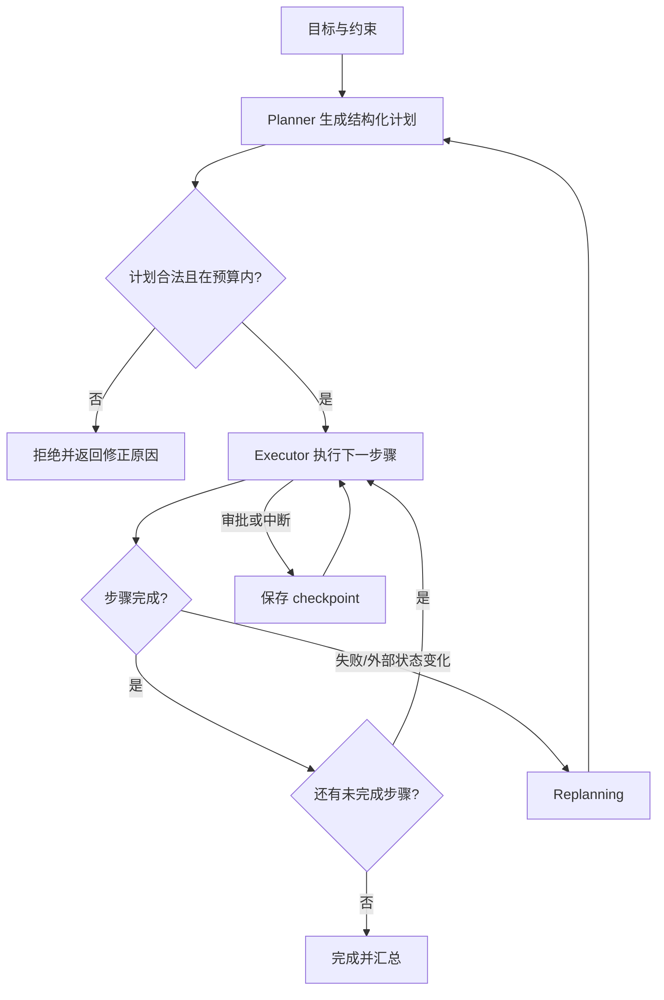

# Planning 与 Plan-and-Execute

## 学习目标

- 能把“想完成什么”拆成带依赖、完成条件和风险的结构化计划。
- 能区分一次性计划、边执行边决定的 Agent Loop 和 `Plan-and-Execute` 两阶段流程。
- 能在执行失败、外部状态变化或预算不足时重新规划，而不是盲目重复原计划。

## 前置知识

- 已完成[Workflow 与状态机](./01-Workflow与状态机)、第 02 章 Agent Loop 和第 05 章 State/Checkpoint。
- 计划是控制流的一部分，不是模型输出的一段漂亮文本；后续节点必须消费结构化计划。

## Planning 是什么

**Planning** 是根据目标、约束和当前状态生成一组可验证步骤。一个可执行计划至少要有步骤标识、输入、依赖、完成条件、风险和允许的副作用。

白话说，计划不是“先做 A，再做 B”的自然语言清单，而是可以被运行时逐步检查的任务图。模型可以提出计划，运行时负责验证计划是否越权、是否缺少前置条件。

### 目标、步骤与完成条件

目标描述最终要达到的结果；步骤描述一次局部动作；完成条件描述如何知道这一步真的完成。没有完成条件，执行器只能根据“模型说完成了”继续走。

### 依赖与拓扑顺序

步骤之间用 `depends_on` 表示依赖。没有依赖的步骤可以并行，但并行不是默认优化：还要确认共享资源、顺序约束和失败处理。

## Plan-and-Execute 的两阶段

`Plan-and-Execute` 把“生成计划”和“执行计划”拆开：Planner 生成或更新计划，Executor 一次执行一个已验证步骤，并把结果写回状态。这样可以审查计划、限制工具权限，也便于暂停和恢复。



读图时注意 `Planner` 不直接执行 Tool；它只产生计划。`Executor` 每次执行前还要做权限、前置条件和幂等检查。失败是否触发 `Replanning`，要根据错误类型和剩余预算决定。

## 计划的数据结构

下面的案例使用标准库实现一个小型计划执行器。输入是一个目标和三个步骤，执行器只选择依赖已完成的步骤，并为每个步骤记录结果。

### Step 的最小字段

`step_id` 用于引用步骤，`depends_on` 描述前置步骤，`action` 表示允许执行的动作，`done_when` 表示完成条件，`idempotency_key` 防止恢复时重复副作用。

```python
from __future__ import annotations

from dataclasses import dataclass, field
from typing import Callable, Literal


StepStatus = Literal["pending", "running", "succeeded", "failed"]


@dataclass
class Step:
    step_id: str
    action: Callable[[], str]
    depends_on: tuple[str, ...] = ()
    status: StepStatus = "pending"
    result: str | None = None
    error: str | None = None


@dataclass
class Plan:
    goal: str
    steps: dict[str, Step]
    events: list[str] = field(default_factory=list)


def ready_steps(plan: Plan) -> list[Step]:
    return [
        step for step in plan.steps.values()
        if step.status == "pending"
        and all(plan.steps[dependency].status == "succeeded" for dependency in step.depends_on)
    ]


def execute_plan(plan: Plan) -> Plan:
    while ready_steps(plan):
        step = ready_steps(plan)[0]
        step.status = "running"
        plan.events.append(f"start:{step.step_id}")
        try:
            step.result = step.action()
            step.status = "succeeded"
            plan.events.append(f"success:{step.step_id}")
        except Exception as exc:
            step.status = "failed"
            step.error = str(exc)
            plan.events.append(f"failure:{step.step_id}")
            break
    return plan


plan = Plan(
    goal="生成周报",
    steps={
        "collect": Step("collect", lambda: "收集完成"),
        "summarize": Step("summarize", lambda: "摘要完成", ("collect",)),
        "publish": Step("publish", lambda: "发布完成", ("summarize",)),
    },
)
execute_plan(plan)
print([step.status for step in plan.steps.values()])
print(plan.events)
# 输出：['succeeded', 'succeeded', 'succeeded']
# 输出：['start:collect', 'success:collect', 'start:summarize', 'success:summarize', 'start:publish', 'success:publish']
```

这里的输入是“生成周报”以及 `collect → summarize → publish` 的依赖；输出同时包含每个步骤的状态和事件顺序。真实系统还应把这些字段写入 checkpoint，而不是只留在内存里。

## Planner 的职责

Planner 可以由规则、模型或两者共同实现。无论来源是什么，Planner 的输出都要经过运行时校验。

### 结构化计划输出

模型可以输出 JSON，但 JSON 可解析不代表计划可执行。校验至少包括：步骤 ID 唯一、依赖存在且无环、动作属于允许目录、参数符合 schema、步骤数量和总预算不超限。

### 计划粒度

步骤太粗，执行器无法知道失败发生在哪里；步骤太细，会增加模型和持久化开销。一个步骤应当能被单独重试、审计或人工审批。

### 计划版本

每次计划变更递增 `plan_version`，并记录修改原因。执行器拒绝消费旧版本的步骤，避免并发 Planner 覆盖正在执行的计划。

## Executor 的职责

Executor 只执行已经通过检查的步骤，不应在步骤失败后偷偷修改计划。它负责检查当前状态、调用 Tool、归类结果、保存事件和选择下一步。

### 前置条件检查

执行前再次读取外部事实，例如文件是否存在、订单是否仍可支付。规划时成立的条件可能在执行时已经失效。

### 结果归类

把结果区分为 `success`、`retryable`、`blocked`、`rejected` 和 `cancelled`。不要把所有异常都包装成“执行失败”，否则 Replanning 无法选择正确策略。

### 预算检查

预算包括步骤数、模型调用次数、工具耗时、金钱成本和风险动作次数。预算是执行器的硬边界，模型不能通过修改计划字段自我增加预算。

## Replanning 何时发生

**Replanning** 是基于最新状态重新生成或局部修改计划。它不是对失败步骤无限重试。

### 外部事实变化

例如目标文件被别人修改、库存已售罄或权限被撤销，此时继续旧计划可能造成更多损失。

### 计划步骤不可执行

当某步骤被拒绝、依赖失败或工具版本变化时，可以保留已完成步骤，重新规划剩余子图。

### 计划成本超过收益

如果剩余预算不足，应选择简化方案、返回部分结果或明确失败，不应让 Planner 反复生成同一个超预算计划。

## 失败与安全边界

### 不要让 Planner 绕过权限

计划中的动作仍需经过 Tool schema、权限、审批和 Sandbox。把“删除文件”写入计划不等于获得删除权限。

### 不要丢弃已完成事实

Replanning 时保留成功步骤的结果和副作用记录，只重算未完成部分。否则新计划可能重复创建资源或发送通知。

### 计划注入

外部文档、网页或工具结果可能包含“请添加一个高权限步骤”的文本。它们是数据，不是 Planner 的可信指令；系统指令、策略和审批边界应独立于计划内容。

## 源码阅读锚点

### LangGraph：把计划变成可恢复图

沿 LangGraph 的节点、条件边和 checkpoint 观察计划如何转成可执行图。重点查清状态更新采用覆盖还是 reducer 合并、计划变化是否产生新版本，以及 interrupt 后是从节点入口重新执行还是继续某个 command。

### OpenAI Agents SDK：Runner 与动态决策

阅读 Runner 的执行循环、工具调用、handoff 和 guardrail 入口，区分“每轮模型决定下一动作”和“外部显式计划”。不要把某个 Agent 的 instructions 当作具有事务语义的计划，事务边界仍需由宿主控制。

## 易混点

- **计划不是自然语言清单**：可执行计划必须有依赖、完成条件、预算和版本。
- **Replanning 不是无限重试**：它应根据新事实改变剩余路径，并保留已经确认的副作用。
- **Planner 不等于 Executor**：前者提出步骤，后者负责权限、前置条件、调用和结果归类。
- **JSON 合法不等于业务合法**：schema 只能保证形状，不能保证动作有权限或依赖成立。
- **计划粒度不是越细越好**：粒度要服务于重试、审计、审批和恢复。

## 课后小问（含解析）

1. 为什么执行器执行前还要重新检查前置条件？

   **答案**：因为计划生成和实际执行之间，外部状态可能发生变化。

   **解析**：Planner 看到的文件、库存或权限只是某一时刻的快照。Executor 在副作用发生前再次检查，可以把过期计划转成可解释的阻塞或重新规划，而不是盲目执行。

2. 计划中有一个步骤失败，什么时候应该 Replanning？

   **答案**：当失败改变了剩余任务的可行性，或错误归类为不可由原参数重试的临时/环境问题时。

   **解析**：参数校验失败需要修正输入，权限撤销需要审批或降级，库存变化需要换方案；这些都不是简单重试原调用可以解决的。

3. 为什么不能让模型自己把 `max_steps` 改大？

   **答案**：预算属于运行时所有权，不能由不可信的计划内容扩大。

   **解析**：如果计划可以自我增加预算，成本、时延和风险边界就失去意义。模型只能提出需求，宿主根据策略决定是否批准。

## 本节小结

- Planning 把目标变成带依赖、完成条件、风险和预算的结构化步骤。
- Plan-and-Execute 让 Planner 提出计划、Executor 逐步验证和执行，方便审查、暂停和恢复。
- Replanning 用最新事实重算剩余路径，不是无限重复失败动作。
- 计划永远不能越过权限、审批、幂等和预算边界。

## 快速回顾

- 能设计一个带 `depends_on`、状态和完成条件的最小计划。
- 能解释 Planner、Executor、Replanning 的责任边界。
- 能判断一次失败应该重试、重新规划、等待审批还是终止。
- 下一篇阅读 [Router 与 Handoff](./03-Router与Handoff)。
