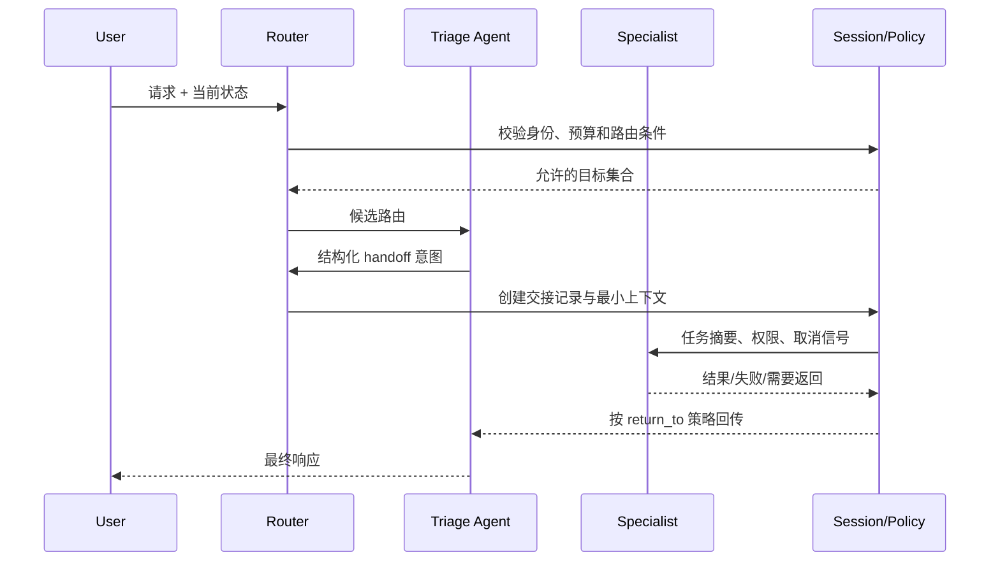

# Router 与 Handoff

## 学习目标

- 能用确定性条件或结构化分类结果把请求路由到合适的 Agent、Workflow 或 Tool。
- 能理解 `Handoff` 不只是“换一个模型”，还涉及上下文、权限、所有权和返回路径的交接。
- 能防止路由循环、上下文泄漏、越权转交和取消信号丢失。

## 前置知识

- 已完成[Planning 与 Plan-and-Execute](./02-Planning与Plan-and-Execute)、第 03 章的 Message/Role 和第 05 章的 Context/Session。
- `Router` 解决“下一步交给谁”，`Handoff` 解决“交接后谁拥有这次工作”。

## Router 是什么

**Router** 是根据输入、状态和策略选择下一处理者的组件。处理者可以是一个 Tool、专门 Agent、Workflow 节点或人工队列。

白话说，Router 像分诊台：它只负责判断去哪个窗口，不应该在分诊时完成整个业务动作。路由条件最好可审计、可测试，模型分类也必须得到结构化结果和默认回退。

### RouteCondition

`RouteCondition` 是路由所需的输入条件，例如意图、租户、风险等级、语言、当前步骤和剩余预算。条件要来自可信状态或经过校验的模型输出，不能直接信任用户说“我是管理员”。

### 确定性路由与模型路由

规则路由适合权限、协议和硬业务边界；模型路由适合自然语言意图和模糊分类。常见做法是模型先给候选标签，再由规则校验标签是否允许进入目标。

## Handoff 是什么

**Handoff** 是把当前任务的控制权、必要上下文和继续执行的责任交给另一个处理者。它至少要说明来源、目标、任务摘要、允许的能力、返回策略和交接版本。

Handoff 后，原处理者是否等待、结束、可被召回，取决于协议。不要把“模型回复里提到另一个 Agent”当作真实交接；真实交接需要运行时记录和权限变化。



图中最重要的是 `Session/Policy`：它不是传话筒，而是交接的所有权和安全边界。目标 Agent 只得到完成任务所需的最小上下文，不应自动拿到完整历史和来源 Agent 的全部权限。

## 路由的最小实现

下面的例子用规则和可信风险标签路由客服请求。输入是请求文本和已经由上游校验的风险等级；输出包括目标、原因和是否需要人工兜底。

```python
from __future__ import annotations

from dataclasses import dataclass
from typing import Literal


Target = Literal["billing", "technical", "human"]


@dataclass(frozen=True)
class RouteRequest:
    text: str
    risk: Literal["low", "high"]
    route_hops: int = 0


@dataclass(frozen=True)
class RouteDecision:
    target: Target
    reason: str
    requires_handoff: bool


def route(request: RouteRequest) -> RouteDecision:
    if request.route_hops >= 2:
        return RouteDecision("human", "route loop guard", False)
    if request.risk == "high":
        return RouteDecision("human", "high-risk request", False)
    if "退款" in request.text or "账单" in request.text:
        return RouteDecision("billing", "billing keywords", True)
    if "报错" in request.text or "接口" in request.text:
        return RouteDecision("technical", "technical keywords", True)
    return RouteDecision("human", "no safe route", False)


decision = route(RouteRequest("接口返回 500", "low"))
print(decision)
# 输出：RouteDecision(target='technical', reason='technical keywords', requires_handoff=True)
```

这里的输入是低风险的接口故障文本；路由器只返回结构化决定，并没有假装技术 Agent 已经执行。真正的 Handoff 还要调用交接服务创建记录。

## RouteCondition 的设计

### 优先级

先检查取消、权限和高风险条件，再检查业务意图。安全条件不能被一个更具体的关键词规则覆盖。

### 默认路由

当没有匹配、分类置信度不足或目标不可用时，进入人工或安全的通用处理器。默认路由不是把请求随便交给第一个 Agent。

### 循环计数

交接记录携带 `route_hops` 或 `visited_targets`。到达上限后停止自动转交并给出可解释原因；只依赖模型自觉停止不可靠。

### 版本与回滚

路由策略应带版本号。审计日志记录使用的规则和模型版本，策略更新后才能解释为什么同一输入去向不同。

## Handoff 的上下文交接

### 最小上下文

交接内容通常包括用户目标、已确认事实、待完成子目标、输入引用、结果格式和截止时间。原始敏感消息、无关工具输出和系统提示不应默认转发。

### 权限降级

目标 Agent 获得的是“本次子任务允许的能力集合”，不是来源 Agent 的权限副本。交接要经过新的权限检查，并把租户、用户和审计 ID 固定在不可由模型修改的 envelope 中。

### 返回策略

`return_to` 可以是来源 Agent、父 Workflow 或最终用户。明确返回策略才能避免 Specialist 完成后又自动创建一个新的 Handoff。

## 取消、超时与失败

### 交接前失败

如果目标不可用，Router 应进入回退目标或报告不可用，不应标记 Handoff 成功。交接记录要区分“请求已创建”和“目标已接受”。

### 交接中取消

取消信号必须与 `handoff_id` 关联，并传递到目标执行器。来源 Agent 结束并不代表目标工作自动停止；运行时需要显式取消或等待目标终止。

### 交接后部分成功

如果目标已经产生副作用但回传超时，来源 Agent 不能直接重发。先根据 `handoff_id` 查询结果，确认是否需要补偿或人工接管。

## 源码阅读锚点

### OpenAI Agents SDK：Handoff 的控制权变化

阅读 OpenAI Agents SDK 时沿 handoff 配置、Runner 执行循环和结果类型追踪：哪个 Agent 被选中、上下文如何过滤、工具权限如何变化、原 Runner 如何结束或继续。重点检查它的具体版本语义，不要把某个 SDK 的 handoff 自动行为当作所有 Agent 系统的保证。

### LangGraph：条件边与子图

沿 conditional edge 的路由函数和子图入口观察状态如何进入目标节点。重点关注共享 State 的字段是否被目标节点覆盖、如何避免节点返回后再次命中同一个路由，以及 checkpoint 如何记录路由决定。

## 易混点

- **Router 不是负载均衡器**：它根据任务语义和策略选择处理者，还要处理权限、风险和默认回退。
- **Handoff 不是一条消息**：真实交接要有所有权、上下文、权限和生命周期记录。
- **模型分类不是安全授权**：模型给出的标签需要经过规则和权限检查。
- **目标 Agent 完成不代表父流程完成**：父流程仍要校验结果、更新状态并决定返回或补偿。
- **上下文越多不一定越好**：交接应采用最小必要上下文，防止敏感数据泄漏和目标被无关历史干扰。

## 课后小问（含解析）

1. 为什么高风险检查要放在关键词路由前面？

   **答案**：因为关键词只能表达业务意图，不能替代风险和权限策略。

   **解析**：一个包含“退款”的请求也可能涉及高金额或身份不明。先做硬边界检查，可以防止更具体的路由规则绕过人工审批。

2. Handoff 时为什么不直接复制完整消息历史？

   **答案**：完整历史可能含有无关上下文、敏感信息和来源 Agent 的内部指令。

   **解析**：目标只需要完成子任务的事实和约束。最小上下文能降低泄漏和 token 成本，也使目标 Agent 的责任更清晰。

3. 目标 Agent 超时后能不能立即再次 Handoff？

   **答案**：不能直接重发，应先用原 `handoff_id` 查询目标是否已执行。

   **解析**：调用方超时不代表目标没有完成。先查询、再决定重试或补偿，才能避免重复副作用。

## 本节小结

- Router 选择下一处理者，Handoff 交接任务控制权和最小必要上下文。
- 路由先检查取消、权限和风险，再做业务分类；必须有默认目标和循环保护。
- 交接要记录所有权、权限、版本、返回策略和副作用状态。
- 超时、取消和部分成功都需要查询原交接记录，不能简单重复发送。

## 快速回顾

- 能写出一个带风险优先级、默认回退和循环上限的 Router。
- 能列出 Handoff envelope 中不可缺少的字段。
- 能解释为什么“模型提到另一个 Agent”不等于运行时完成交接。
- 下一篇阅读 [Supervisor 与 Multi-Agent](./04-Supervisor与Multi-Agent)。
