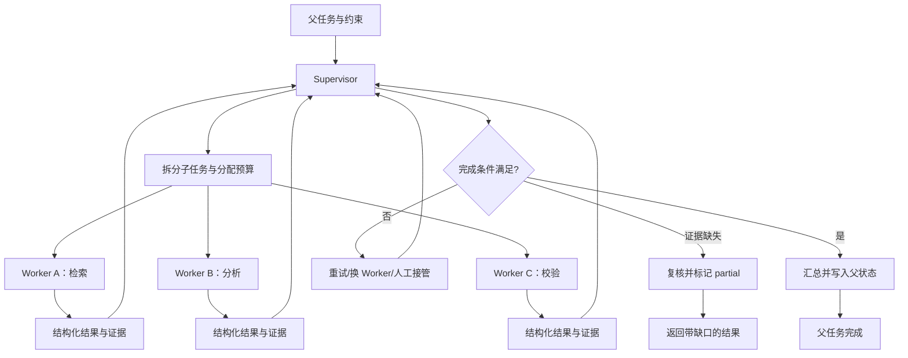

# Supervisor 与 Multi-Agent

## 学习目标

- 能判断什么时候需要多个 Agent，什么时候一个 Agent 加几个 Tool 就足够。
- 能区分 Supervisor、Worker、Delegation、共享状态和隔离状态的责任。
- 能处理 Worker 超时、部分失败、重复汇报、共享写入冲突和成本失控。

## 前置知识

- 已完成[Router 与 Handoff](./03-Router与Handoff)、第 05 章的 Session/MemoryScope 和第 06 章 MCP。
- 多 Agent 是控制流和所有权的设计，不是把一个 Prompt 复制三份。

## Multi-Agent 的基本结构

**Multi-Agent** 系统让多个具有不同职责、工具或上下文边界的 Agent 协作完成一个目标。每个 Agent 应有清晰的输入、输出和权限，不要让所有 Agent 共享一个可任意修改的全局变量。

### Worker

Worker 负责一个可验收的子任务，例如检索资料、分析日志或生成测试报告。Worker 返回结构化结果和证据，不应擅自改变父任务的目标。

### Supervisor

**Supervisor** 负责拆分任务、选择 Worker、检查结果、决定继续/重试/换人/终止和汇总。它拥有协调权，但不应默认拥有每个 Worker 的全部工具权限。

### Delegation

**Delegation** 是把一个有边界的子目标交给 Worker，并带上输入、完成条件、预算、权限、截止时间和返回格式。没有完成条件的委派很容易变成“让 Worker 自己看看”。

## Supervisor 数据流



这张图表达两个边界：Worker 的结果先回到 Supervisor，不能直接互相覆盖父状态；Supervisor 汇总前要检查证据和完成条件，不能按“最后返回的结果”盲选。

## 什么时候需要多个 Agent

### 角色真的不同

如果任务需要互相冲突的上下文、不同权限或不同验收标准，多 Agent 可以提供隔离。例如检索 Worker 只读资料，执行 Worker 才能修改文件。

### 任务可以独立验收

子任务要能在有限输入下完成，并返回稳定结构。若每一步都依赖前一步的自然语言内部思考，多 Agent 只会增加传话成本。

### 需要并行但有汇总边界

多个独立资料源可以并行检索，最后由 Supervisor 做去重和冲突处理。并行本身不是使用多 Agent 的理由，独立性和汇总质量才是。

### 不适合 Multi-Agent 的信号

单 Agent 已能稳定完成、任务很短、子任务强耦合、共享状态写入频繁、或者每个 Worker 都需要完整历史时，多 Agent 通常只会增加 token、时延、失败点和调试难度。

## Worker 契约与状态隔离

### 输入契约

每个 Worker 接收 `task_id`、目标、事实引用、约束、允许的工具和截止时间。不要把整个父 Session 无过滤地传入。

### 输出契约

结果至少包括 `status`、`facts`、`evidence`、`warnings` 和 `side_effects`。Supervisor 通过 schema 校验结果，缺少证据的“成功”应进入复核或失败分支。

### MemoryScope

Worker 的短期上下文只属于当前子任务；长期记忆写入要经过父流程批准和租户隔离。共享 Memory 不是方便就能全局开放的缓存。

下面的案例模拟一个 Supervisor 委派两个 Worker，并只把结构化结果汇总到父状态。输入是子任务列表，输出是完成状态和证据清单。

```python
from __future__ import annotations

from dataclasses import dataclass
from typing import Literal


WorkerStatus = Literal["succeeded", "failed"]


@dataclass(frozen=True)
class WorkerResult:
    task_id: str
    status: WorkerStatus
    facts: tuple[str, ...]
    evidence: tuple[str, ...]
    warnings: tuple[str, ...] = ()
    side_effects: tuple[str, ...] = ()
    error: str | None = None


def run_worker(task_id: str, topic: str) -> WorkerResult:
    if topic == "billing":
        return WorkerResult(task_id, "succeeded", ("金额已核对",), ("invoice-42",))
    if topic == "unknown":
        return WorkerResult(task_id, "failed", (), (), ("worker failed",), (), "unsupported topic")
    if topic == "no-evidence":
        return WorkerResult(task_id, "succeeded", ("草稿已生成",), (), ("missing evidence",), ())
    return WorkerResult(task_id, "succeeded", (f"{topic} 已检查",), (f"source:{topic}",))


def supervise(tasks: list[tuple[str, str]]) -> dict[str, object]:
    results = [run_worker(task_id, topic) for task_id, topic in tasks]
    accepted = [result for result in results if result.status == "succeeded" and result.evidence]
    failed = [result.task_id for result in results if result.status == "failed"]
    review = [result.task_id for result in results if result.status == "succeeded" and not result.evidence]
    status = "succeeded" if not failed and not review else "partial" if accepted or review else "failed"
    return {
        "status": status,
        "facts": [fact for result in accepted for fact in result.facts],
        "evidence": [source for result in accepted for source in result.evidence],
        "failed_tasks": failed,
        "review_tasks": review,
        "warnings": [warning for result in results for warning in result.warnings],
        "side_effects": [effect for result in results for effect in result.side_effects],
    }


report = supervise([("t-1", "billing"), ("t-2", "unknown"), ("t-3", "no-evidence")])
print(report)
# 输出：{'status': 'partial', 'facts': ['金额已核对'], 'evidence': ['invoice-42'], 'failed_tasks': ['t-2'], 'review_tasks': ['t-3'], 'warnings': ['worker failed', 'missing evidence'], 'side_effects': []}
```

输入中的 `t-2` 故意失败，`t-3` 返回成功但没有证据；Supervisor 不会静默丢弃 `t-3`，而是放进 `review_tasks` 并标记整体 `partial`。`warnings` 和 `side_effects` 也随结果汇总，真实系统还要把每个 Worker 的重试、超时和权限决策写入审计事件。

## 共享状态与消息汇总

### 只读共享上下文

多个 Worker 可以读取同一份版本化事实快照，但不能直接修改。Supervisor 收到结果后再决定哪些事实进入父状态。

### 受控写入

如果 Worker 必须写状态，使用命名空间、版本号和条件更新，例如 `worker/{task_id}/result`，由 Supervisor 在汇总时做一次合并。

### 冲突解决

两个 Worker 对同一事实给出不同结果时，不能按到达顺序覆盖。需要证据优先级、人工复核、确定性合并规则或明确返回冲突。

## 调度、成本与停止

### 并行上限

Supervisor 要限制活跃 Worker 数、总 token、工具调用次数和 wall-clock deadline。并行开得越多，协调和失败传播成本越高。

### Worker 重试

重试要按照 Worker 的副作用和幂等键决定。只读检索通常可重试；发送通知、写数据库等动作必须先查询提交状态。

### 停止条件

父任务满足完成条件、预算耗尽、无法获得足够证据、用户取消或触发安全策略时停止。Supervisor 不能因为还有 Worker 可启动就无限扩张任务树。

## 失败传播与部分成功

### fail-fast

关键 Worker 失败时立即取消兄弟任务，适合必须全部成功的事务型流程。取消前要处理已提交副作用。

### best-effort

允许部分 Worker 失败，Supervisor 汇总成功结果并明确缺口。适合资料收集，但最终输出不能隐藏缺失来源。

### compensation

如果多个 Worker 已产生不可自动回滚的副作用，父流程需要执行补偿步骤或进入人工队列。补偿不是“把状态字段改回去”，而是对外部事实做相反或修正操作。

## 源码阅读锚点

### LangGraph 的 supervisor/子图

阅读 LangGraph 的子图、条件边和 reducer 时，重点跟踪父图如何把任务交给子图、子图结果怎样回到父状态，以及 checkpoint 是否按父/子作用域隔离。不要只看 Agent 名称，要找真正的 state merge 和终止条件。

### OpenAI Agents SDK 的 handoff 与 Runner

把 SDK 的 handoff 看作一种控制权交接实现，沿 Runner 观察当前 Agent、工具、guardrail 和最终结果如何变化。注意“多个 Agent 配置存在”不等于并行执行；并发和聚合仍是宿主的调度策略。

### DeepSeek Harness 的插件和 Session 边界

阅读 Harness 时可从 Driver、Session、Plugin/Hook 入口追踪多角色协作。重点查谁拥有会话、谁写事件、插件能否直接修改父状态，以及失败时是否有统一的取消和清理路径。

## 易混点

- **多个 Agent 不等于更聪明**：拆分带来上下文、调度、成本和失败传播开销。
- **Supervisor 不是全能管理员**：协调权不自动包含 Worker 的所有工具权限。
- **共享状态不等于共享可写对象**：共享读快照通常安全，共享写入必须有版本和合并策略。
- **部分成功不是成功**：汇总必须公开失败任务、证据缺口和下一步处理。
- **Worker 输出不是事实**：需要 schema、证据和父流程验收，不能只看自然语言结论。

## 课后小问（含解析）

1. 什么情况下一个 Agent 加 Tool 比 Multi-Agent 更合适？

   **答案**：任务短、步骤强耦合、共享状态频繁变化，且没有明显的权限或上下文隔离需求时。

   **解析**：Multi-Agent 会引入任务拆分、消息交接、状态合并和多个失败点。如果这些边界没有带来独立验收或安全收益，增加 Agent 只会提高复杂度。

2. 两个 Worker 对同一个字段给出不同值，Supervisor 能按完成时间选吗？

   **答案**：不能默认按完成时间选。

   **解析**：到达顺序受网络和调度影响，不代表事实更可信。应使用证据、来源优先级、版本条件或人工复核，并保留冲突记录。

3. 为什么父任务要给 Worker 单独的 `task_id`？

   **答案**：用于隔离状态、幂等重试、审计结果和取消特定子任务。

   **解析**：没有稳定子任务标识，重复投递和超时回传无法关联，Supervisor 也无法判断某个结果是否属于当前计划版本。

## 本节小结

- Multi-Agent 的价值来自角色、权限、上下文和验收标准的隔离，不是 Agent 数量。
- Supervisor 拆分任务、分配预算、验收结果、处理失败并汇总父状态。
- Worker 通过结构化契约返回事实和证据，共享状态要版本化，部分失败要显式暴露。
- 并行、重试和补偿都必须服从停止、成本、幂等和安全边界。

## 快速回顾

- 能判断一个任务是否真的需要 Multi-Agent。
- 能设计 Supervisor/Worker 的输入、输出、权限和 MemoryScope。
- 能区分 fail-fast、best-effort 和 compensation 三种失败策略。
- 下一篇阅读 [Interrupt、审批与恢复](./05-Interrupt审批与恢复)。
