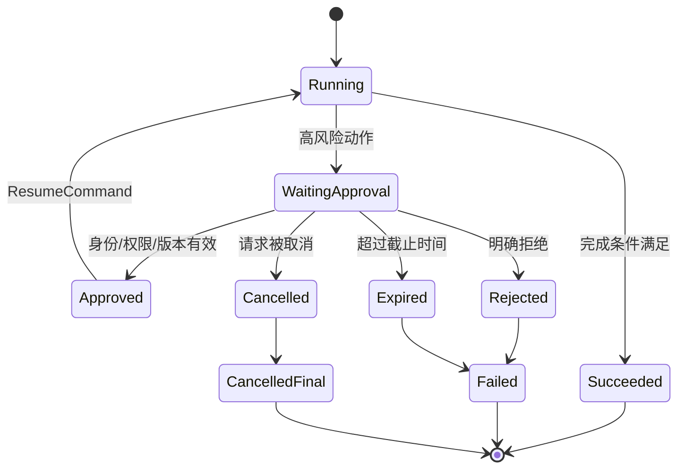

# Interrupt、审批与恢复

## 学习目标

- 能区分“流程主动暂停”“调用方取消”和“节点失败”，并为每种情况保存足够的状态。
- 能设计带审批人、理由、权限、过期时间和幂等键的人工审批边界。
- 能在恢复时重新校验版本、身份和副作用，不把恢复误解为从内存中的下一行代码继续。

## 前置知识

- 已完成第 05 章的 `Interrupt`、`Checkpoint`、`Recovery`，以及第 04 章的 Tool 审批和权限边界。
- 推荐先读[Workflow 与状态机](./01-Workflow与状态机)，理解中断发生在哪个节点和哪条边上。

## Interrupt 是什么

**WorkflowInterrupt** 是运行时把流程置为“等待外部决定”的可观察状态。它不是异常，也不是简单的 `sleep`：流程要持久化当前状态、等待原因、待审批内容和恢复入口。

白话说，中断像把书签夹在流程里并合上书。恢复时要重新打开正确版本的书，确认审批人有权翻到这一页，再决定继续、拒绝、修改还是终止。

### 主动中断与取消

主动中断通常是“需要人工审批/补充信息”，可以在外部输入到达后恢复；取消是调用方不再需要结果，通常不应等待审批后继续。两者都要停止后续副作用，但终态和审计意义不同。

### 中断与失败

失败表示当前路径无法继续；中断表示路径仍然有效，但缺少外部决定。把中断写成失败会触发不必要重试，把失败写成中断则会让危险操作一直挂起。

## 审批状态机



图中的 `Approved` 只是允许恢复，不代表动作已经执行。真正的执行仍要经过版本检查、幂等检查和工具权限校验。

## 审批请求的数据结构

### HumanApproval

审批请求要让人知道批准什么、影响范围和拒绝后果。最小字段包括 `approval_id`、`run_id`、`checkpoint_version`、请求摘要、风险级别、审批人范围、过期时间和 `idempotency_key`。

### 不能让模型决定的字段

审批人身份、租户、权限范围、过期策略和审计时间由运行时填充。模型可以生成理由或摘要，但不能通过输出把自己指定为审批人。

下面的案例模拟高风险文件删除：输入是 checkpoint 和审批命令；输出是安全的状态变化与审计事件。示例不会真的删除文件。

```python
from __future__ import annotations

from dataclasses import dataclass, replace
from typing import Literal


Status = Literal["running", "waiting", "approved", "rejected", "succeeded", "expired"]


@dataclass(frozen=True)
class Checkpoint:
    run_id: str
    version: int
    action: str
    status: Status
    approval_id: str | None = None
    expires_at: int = 0
    executed_keys: frozenset[str] = frozenset()
    allowed_actors: frozenset[str] = frozenset()


@dataclass(frozen=True)
class ResumeCommand:
    run_id: str
    expected_version: int
    approval_id: str
    decision: Literal["approve", "reject"]
    actor: str
    idempotency_key: str
    now: int


def resume(checkpoint: Checkpoint, command: ResumeCommand) -> Checkpoint:
    if command.run_id != checkpoint.run_id:
        raise ValueError("run mismatch")
    if command.actor not in checkpoint.allowed_actors:
        raise PermissionError("actor is not authorized")
    if command.idempotency_key in checkpoint.executed_keys:
        raise ValueError("duplicate approval")
    if checkpoint.status != "waiting":
        raise ValueError("checkpoint is not waiting")
    if command.expected_version != checkpoint.version:
        raise ValueError("stale checkpoint")
    if command.approval_id != checkpoint.approval_id:
        raise ValueError("approval mismatch")
    if command.now >= checkpoint.expires_at:
        return replace(checkpoint, version=checkpoint.version + 1, status="expired")
    if command.decision == "reject":
        return replace(checkpoint, version=checkpoint.version + 1, status="rejected")
    return replace(
        checkpoint,
        version=checkpoint.version + 1,
        status="approved",
        executed_keys=checkpoint.executed_keys | {command.idempotency_key},
    )


checkpoint = Checkpoint(
    run_id="run-7",
    version=4,
    action="delete-temp",
    status="waiting",
    approval_id="approval-9",
    expires_at=100,
    allowed_actors=frozenset({"alice"}),
)
command = ResumeCommand("run-7", 4, "approval-9", "approve", "alice", "resume-1", now=20)
approved = resume(checkpoint, command)
print(approved.status, approved.version)
try:
    resume(approved, command)
except ValueError as exc:
    print(exc)
# 输出：approved 5
# 输出：duplicate approval
```

输入是版本为 4、只允许 Alice 审批的等待状态 checkpoint；第一次恢复进入 `approved`，重复提交同一个命令会被明确拒绝。批准后是否执行动作，还应由后续节点根据新版本继续。

## ResumeCommand 的校验

### 身份与授权

恢复接口重新验证调用者身份和审批权限，不能只相信 checkpoint 中保存的显示名称。审批人是否属于允许的角色、是否能操作当前租户，都要由策略服务判断。

### 版本条件

`expected_version` 相当于乐观锁。审批期间如果另一个操作已经拒绝、取消或重新规划，旧命令必须被拒绝，不能覆盖新状态。

### 过期时间

审批请求过期后，应进入明确的 `expired` 分支。不要把过期审批当作自动批准，也不要让恢复接口用客户端时间绕过服务端截止时间。

### 幂等键

同一个恢复请求因网络重试重复到达时，服务端应返回第一次处理结果。幂等键要与 `run_id`、checkpoint 版本或 approval ID 绑定，防止跨流程复用。

## 恢复后的执行顺序

恢复不是简单地把状态改成 `running`。安全顺序通常是：读取最新 checkpoint → 校验身份/版本/策略 → 记录审批结果 → 再次校验工具参数 → 检查副作用幂等状态 → 执行或进入下一中断。

### 重新检查外部事实

批准可能在几分钟后才到达，目标文件、订单状态或权限可能已经变化。恢复节点应重新获取事实，不能使用审批时的陈旧快照直接执行高风险动作。

### 执行与审批解耦

审批记录回答“允许不允许”，工具执行记录回答“做没做、结果是什么”。两者要有不同事件，方便审计和补偿。

### 审批拒绝后的出口

拒绝可以终止、返回用户修改、改走只读方案或重新规划。不要把所有拒绝都当成系统异常重试。

## 与框架能力的关系

框架提供 interrupt、checkpoint 或 command API 时，仍需确认它们的持久化、版本和权限语义。一个 API 能让流程暂停，不代表它替你实现了审批授权和外部副作用一致性。

## 源码阅读锚点

### LangGraph：interrupt 与 Command

阅读 LangGraph 的 interrupt/checkpointer/Command 入口时，重点看中断值如何持久化、恢复时使用什么标识、节点是否从头重跑，以及副作用是否在 interrupt 前已经执行。不要把“可以 resume”理解成事务回滚。

### OpenAI Agents SDK：guardrail 与人工介入

沿 guardrail、tool approval 和 Runner 结果处理入口，区分“阻止一次 Tool Call”和“把整个 Run 持久化等待”。如果当前版本没有完整的 durable workflow，需要由宿主补充 checkpoint、审批存储和恢复 API。

### DeepSeek Harness：事件和插件边界

阅读 Harness 时寻找 interrupt/event、Session 和 Plugin/Hook 的所有权：谁发起暂停、谁写事件、谁释放资源、谁接收恢复命令。重点检查插件不能绕过统一权限和恢复状态机。

## 易混点

- **Interrupt 不是异常**：中断表示等待外部决定，异常表示当前路径出错。
- **批准不等于执行**：批准事件和工具执行事件必须分开记录。
- **Resume 不是跳过校验**：恢复仍需身份、版本、权限、过期和幂等检查。
- **Checkpoint 不是数据库事务回滚**：已经提交的副作用不会因为流程暂停自动消失。
- **拒绝不一定要重试**：拒绝可能是终止、降级、修改输入或重新规划。

## 课后小问（含解析）

1. 为什么恢复命令要带 `expected_version`？

   **答案**：防止旧审批覆盖已经变化的流程状态。

   **解析**：审批等待期间可能发生取消、过期或重新规划。版本条件能把并发恢复变成明确的冲突，而不是最后写入者静默覆盖。

2. 审批通过后，为什么还要重新检查文件或订单状态？

   **答案**：因为审批依据的外部事实可能已经过期。

   **解析**：审批通常只授权某个范围内的动作，不保证目标资源一直存在或仍满足条件。执行前重读事实可以避免把旧批准用于新风险。

3. 重复收到同一个 ResumeCommand 时，正确结果是什么？

   **答案**：返回第一次处理的结果，不重复执行恢复或副作用。

   **解析**：网络重试和消息重复是正常情况。稳定的幂等键和 checkpoint 记录让恢复接口可以安全重入。

## 本节小结

- Interrupt 把流程置为可持久化、可审计的等待状态；审批、取消和失败要分开建模。
- ResumeCommand 需要身份、权限、版本、过期和幂等检查。
- 批准只表示允许继续，恢复后的执行仍需重读外部事实并检查副作用。
- 框架的 interrupt/checkpoint API 不自动提供业务审批、事务回滚或安全授权。

## 快速回顾

- 能画出等待审批、批准、拒绝、过期、取消和恢复的状态机。
- 能列出 checkpoint 与 ResumeCommand 的关键字段。
- 能解释为什么恢复不是“把状态改成 running”。
- 下一篇阅读 [并发竞态与失败传播](./06-并发竞态与失败传播)。
