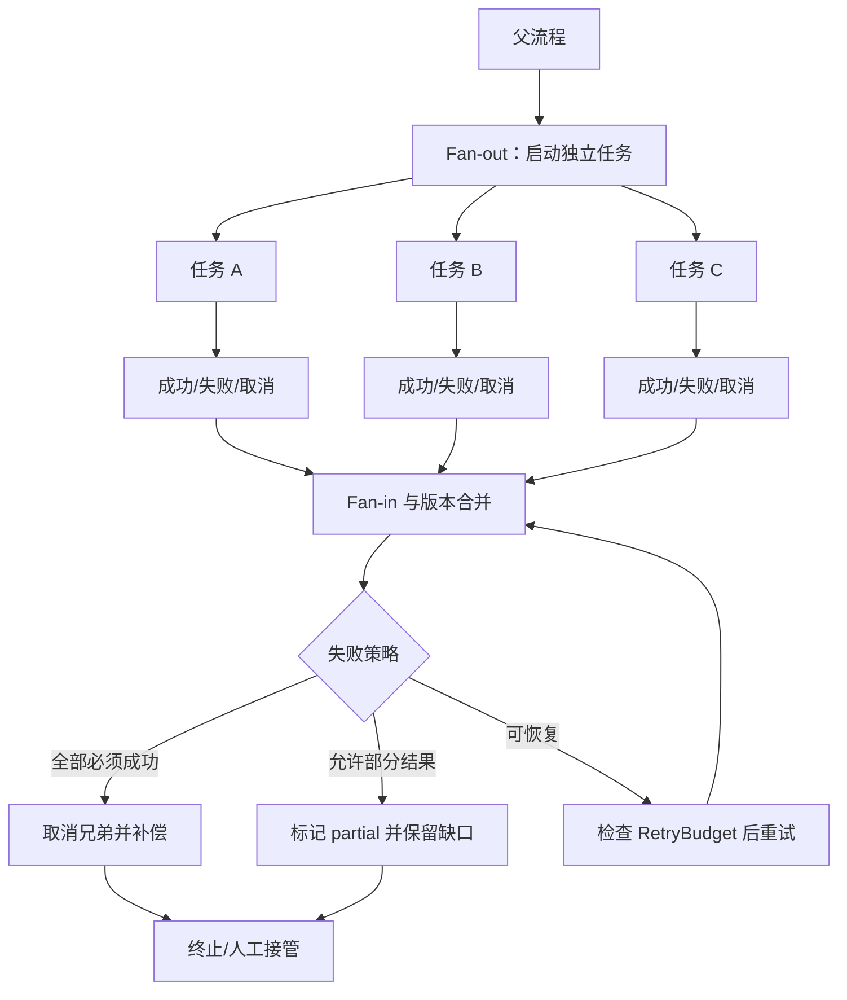

# 并发竞态与失败传播

## 学习目标

- 能识别并行节点同时读写同一状态时的竞态，并使用版本、锁、条件更新或 reducer 处理。
- 能选择 fail-fast、best-effort、重试、补偿和人工接管等失败策略。
- 能把取消信号、超时和资源清理传播到所有子任务，避免孤儿任务和重复副作用。

## 前置知识

- 已完成[Workflow 与状态机](./01-Workflow与状态机)、[Supervisor 与 Multi-Agent](./04-Supervisor与Multi-Agent)和第 04 章的并行工具、RetryBudget、幂等。
- 并发优化只适用于彼此独立或有明确合并规则的工作；无法定义合并语义时，应保持串行。

## 并发中的三个问题

**RaceCondition** 是结果依赖不可控的执行顺序；**FailurePropagation** 是一个子任务失败后，父流程和兄弟任务如何响应；**Cancellation** 是主动停止仍在运行的任务并清理资源。

白话说，并发不是“同时启动几个函数”就结束了。你还要回答：谁拥有状态写入权、谁发现失败、谁取消别人、已经成功的副作用怎么办。

### Fan-out 与 Fan-in

Fan-out 把一个任务分成多个子任务，Fan-in 等待并汇总结果。Fan-in 要有超时、缺失结果和冲突策略，不能默认所有分支一定返回。

### 状态版本

状态携带 `version`，写入时使用 compare-and-set（CAS）或事务条件，能发现两个并发分支基于同一个旧快照写入。发现冲突后应重新读取和合并，而不是静默覆盖。

## 并发与失败传播图



阅读时把 `Join` 当作真正的控制点：它要知道每个分支的状态和版本，再根据策略决定继续。一个分支抛异常不能让其他任务悄悄失去取消和清理机会。

## 一个可运行的并发案例

下面用 `asyncio` 模拟三个只读 Worker。输入是任务列表，输出包含成功结果、失败任务和整体状态；失败不会被 `gather` 静默吞掉。

```python
from __future__ import annotations

import asyncio
from dataclasses import dataclass


@dataclass(frozen=True)
class Result:
    task_id: str
    status: str
    value: str | None = None
    error: str | None = None


async def worker(task_id: str) -> Result:
    await asyncio.sleep(0)
    if task_id == "B":
        return Result(task_id, "failed", error="source unavailable")
    return Result(task_id, "succeeded", value=f"data-{task_id}")


async def fan_out_and_join(task_ids: list[str]) -> dict[str, object]:
    results = await asyncio.gather(*(worker(task_id) for task_id in task_ids))
    failed = [result for result in results if result.status == "failed"]
    return {
        "status": "partial" if failed else "succeeded",
        "values": [result.value for result in results if result.value is not None],
        "failed": {result.task_id: result.error for result in failed},
    }


report = asyncio.run(fan_out_and_join(["A", "B", "C"]))
print(report)
# 输出：{'status': 'partial', 'values': ['data-A', 'data-C'], 'failed': {'B': 'source unavailable'}}
```

这里的 `B` 是可观察的失败，`A` 和 `C` 的结果仍然被保留。真实的写入型任务还需要为每个分支增加幂等键、checkpoint 和补偿动作；`asyncio.gather` 本身不会提供这些业务保证。

## RaceCondition 如何产生

### 丢失更新

两个 Worker 读取版本 4，分别修改同一个字段并写回；如果存储层允许无条件覆盖，后写入者会抹掉先写入者的结果。

### 重复副作用

超时分支不知道远端是否已提交，于是重试发消息或扣款。解决方案是幂等键、查询提交状态或使用外部系统提供的事务语义。

### 乱序事件

恢复事件、取消事件和结果事件到达顺序不固定。事件要携带单调版本或序列号，消费者拒绝过期事件，不能仅按接收时间更新状态。

## 并发写入策略

### 串行合并

Worker 只返回结果，父流程在一个节点中按固定顺序合并。实现简单，适合小批量和冲突复杂的对象。

### 乐观并发控制

写入时携带 `expected_version`；版本不匹配就重新读取、合并或报告冲突。不要自动以最后写入者为准，除非业务明确允许。

### Reducer

对可交换、可结合的增量数据使用 reducer，例如追加独立证据列表或计数。但“最后一个文本答案”通常不是安全 reducer，需要来源和优先级。

## 失败传播策略

### Fail-fast

一个关键分支失败就取消兄弟并终止父流程，适合所有步骤必须完成的任务。取消前记录已完成分支和待补偿副作用。

### Best-effort

保留成功结果并明确缺口，适合多来源检索、非关键统计或报告草稿。最终状态应为 `partial`，而不是伪装成 `succeeded`。

### Retry

只对可恢复错误重试，并受 `RetryBudget`、退避、抖动、截止时间和幂等键约束。参数错误、权限拒绝和业务冲突通常不应盲目重试。

### Dead letter 与人工接管

超过预算或无法自动分类的任务进入 dead-letter/人工队列，保留原始输入、版本、错误分类和尝试记录。删除失败消息会让系统看起来“成功”，但会失去恢复入口。

## Cancellation 与资源清理

### 取消传播

父流程取消时，向所有未完成子任务发送取消信号，并等待它们确认退出。只取消父协程而不等待子任务，可能留下后台网络请求、文件句柄或锁。

### 超时分层

为单个 Tool、单个 Worker、Fan-in 和整个 Run 设置不同 deadline。子任务 deadline 不应晚于父任务；父任务超时后不能继续等待子任务无期限返回。

### finally 清理

网络连接、临时文件、锁和事件订阅都要在 `finally` 或等价资源管理器中释放。清理失败也要写入审计并进入人工处理，而不是覆盖原始业务错误。

## Compensation 的边界

补偿是对已经发生的副作用执行业务上的修正动作，例如取消预留、撤销待发通知或创建退款任务。它不一定能恢复到原始世界状态，必须记录补偿结果和人工后续。

### 补偿顺序

按已提交副作用的反向依赖顺序补偿，先处理可逆且影响大的动作，再处理低风险记录。补偿动作本身也要幂等。

### 不要补偿纯计算

模型生成、排序和本地解析没有外部副作用，通常只需丢弃临时结果，不要为它们构造虚假的“撤销”。

## 源码阅读锚点

### LangGraph：并行 State 更新与 checkpoint

沿并行节点、state reducer 和 checkpoint 保存入口观察并行输出如何合并，以及冲突字段如何处理。重点确认失败节点是否取消其他节点、恢复时是否可能重复执行带副作用的节点。

### OpenAI Agents SDK：并行工具与 Runner 取消

沿 Runner 的任务调度、并行 tool call、结果回填和取消异常追踪。要区分模型一次返回多个 Tool Call 与宿主真正并发执行；并发上限、失败策略和资源清理需要看运行时实现。

### DeepSeek Harness：事件顺序和插件清理

阅读 Driver/Session 的事件写入顺序、Plugin/Hook 的取消通知和资源释放。重点查重复事件、过期事件和插件失败是否会被统一记录，避免把局部协程的异常当成完整 Run 的状态。

## 易混点

- **并发启动不等于并发安全**：共享状态和外部副作用仍需版本、锁或幂等设计。
- **取消父任务不等于取消子任务**：要传播取消并等待清理完成。
- **部分成功不等于成功**：必须暴露失败分支和证据缺口。
- **补偿不等于回滚**：外部世界可能已经被观察到，补偿只能尽量修正。
- **重试不等于恢复**：重试执行当前动作，恢复需要从 checkpoint 重新建立一致状态。

## 课后小问（含解析）

1. 两个 Worker 同时把版本 4 写成版本 5，为什么要拒绝其中一个？

   **答案**：因为两个更新都基于同一个旧快照，至少有一个可能覆盖另一个的事实。

   **解析**：CAS 失败能把隐式丢失更新变成显式冲突，之后可以重新读取和合并，或交给人工判断。无条件接受最后写入会让事件顺序决定业务事实。

2. Fan-in 时一个分支失败，什么时候可以返回部分结果？

   **答案**：只有父任务的完成条件允许缺口，并且响应明确标记 `partial`、失败分支和缺失证据。

   **解析**：检索报告可能允许少一个来源，扣款流程则不允许少一个关键步骤。失败策略由业务完成条件决定，不能由 `gather` 的默认行为决定。

3. 为什么补偿动作也要幂等？

   **答案**：补偿本身也可能因超时、恢复或重复消息执行多次。

   **解析**：例如取消预留重复请求可能报错或产生新的副作用。补偿必须能查询已完成状态并安全返回已有结果。

## 本节小结

- 并发流程要显式定义状态所有权、版本合并、失败传播和取消清理。
- Fan-out/Fan-in 必须有超时、部分结果、冲突和失败策略。
- fail-fast、best-effort、retry、dead letter 和 compensation 适用于不同业务边界。
- 外部副作用、取消和补偿都要考虑幂等、审计和恢复。

## 快速回顾

- 能识别丢失更新、重复副作用和乱序事件三类竞态。
- 能为一个并行 Workflow 选择失败传播策略。
- 能说清取消、重试、恢复和补偿的区别。
- 至此第 09 章完成；下一章阅读[评测、可观测性与安全](/courses/agent/10-评测可观测性与安全/01-Trace-Span与事件日志)。
