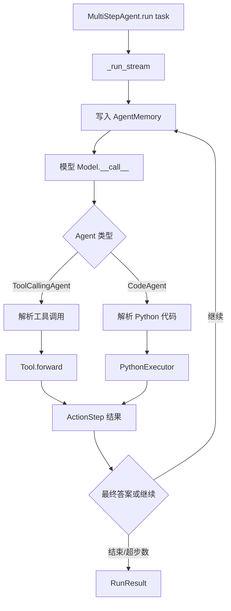

# smolagents 源码导读

smolagents 是五个项目里最适合先读的一个：它把 Agent Loop、模型适配、工具调用和代码执行压缩在很小的 Python 代码面里。本文的目标不是背 API，而是沿着一次 `run()` 找到“模型决定什么、框架保存什么、执行器做什么、何时结束”。

## 学习目标

- 能从 `MultiStepAgent.run()` 追到一次模型调用、动作解析、工具或代码执行和最终答案。
- 能分清 `CodeAgent`、`ToolCallingAgent`、`Model`、`AgentMemory` 与执行器的责任。
- 能解释为什么 `LocalPythonExecutor` 的限制不是安全沙箱，以及真正的隔离边界在哪里。

## 前置知识

- 第 02–10 章的 Agent Loop、Tool、State、Trace、Sandbox。
- Python 的类、生成器、异常和上下文管理器；不要求先学完整框架。

## 版本与源码范围（2026-10-09）

本次核对的是官方仓库 `huggingface/smolagents` 的 `main` 分支。仓库语言为 Python；`pyproject.toml` 当前开发版本为 `1.27.0.dev0`，最近稳定发布为 `v1.26.0`。版本号会继续变化，读源码时应以提交或 release tag 固定环境。

| 先看什么 | 当前路径 | 解决什么问题 |
| --- | --- | --- |
| Agent 运行骨架 | [`src/smolagents/agents.py`](https://github.com/huggingface/smolagents/blob/main/src/smolagents/agents.py) | Loop、步骤、工具调用、代码 Agent |
| 步骤记忆 | [`src/smolagents/memory.py`](https://github.com/huggingface/smolagents/blob/main/src/smolagents/memory.py) | 将 system/task/action/result 组织成历史 |
| 模型适配 | [`src/smolagents/models.py`](https://github.com/huggingface/smolagents/blob/main/src/smolagents/models.py) | 不同供应商的消息与流式结果 |
| Python 执行 | [`src/smolagents/local_python_executor.py`](https://github.com/huggingface/smolagents/blob/main/src/smolagents/local_python_executor.py) | 解析、限制并执行模型生成的代码 |
| 工具抽象 | [`src/smolagents/tools.py`](https://github.com/huggingface/smolagents/blob/main/src/smolagents/tools.py) | 工具描述、参数 schema 与调用 |

## 先看懂整体调用链



阅读提示：图中的“继续”不是递归调用一个新 Agent，而是同一个 `MultiStepAgent` 把新步骤追加到 memory，再生成下一轮模型输入。先在 `run` 设置断点，再沿 `_run_stream → _step_stream` 下钻，比从工具类随机阅读更容易建立主线。

## `MultiStepAgent`：公共运行骨架

`MultiStepAgent` 是抽象基类，负责通用的运行生命周期：初始化 system prompt、准备工具和托管 Agent、建立 memory、循环执行步骤、达到最终答案或最大步数后返回 `RunResult`。它不决定“动作是 JSON 工具调用还是 Python 代码”，这个差异交给子类的 `_step_stream()`。

### `MultiStepAgent.__init__`

入口会保存 `model`、`tools`、`managed_agents`、`max_steps` 和回调，并把基础工具加入工具表。读这里时重点问两个问题：工具描述什么时候生成？托管 Agent 以什么形式暴露给模型？这两个答案直接影响模型能否发现能力。

### `MultiStepAgent.run`

`run(task, ...)` 是同步外观；真正的步骤流在 `_run_stream()`。它通常负责创建一次运行的 memory、把任务放到历史、逐步消费 step stream，并把中间结果或最终结果返回。不要把 `run()` 当作“只调用一次模型”的函数。

### `MultiStepAgent._run_stream`

这里是最值得下断点的位置：它把“开始一轮”“执行一步”“记录步骤”“检查最终答案”“超过 `max_steps` 的错误处理”串起来。源码阅读时在循环体旁记录一张表：输入 memory、模型输出、执行副作用、写回 memory、停止原因。

### `MultiStepAgent._step_stream`

这是子类扩展点。`ToolCallingAgent` 在这里解析模型的工具调用；`CodeAgent` 在这里提取代码块并交给 Python 执行器。若要实现新的 Agent 形式，先确认该方法要返回哪些 step/stream 事件，再决定是否复用父类的停止与持久化逻辑。

## `CodeAgent`：模型写代码，执行器解释代码

`CodeAgent` 不是“让模型写一个项目然后直接运行”，而是让模型在固定的 action 格式里写一段可执行代码，用工具、变量和 `final_answer` 产生下一步结果。它的核心风险也因此从“参数校验”变成了“代码解释和副作用隔离”。

### `CodeAgent.create_python_executor`

该方法选择执行器。默认本地执行器适合学习和受信输入；接入 Docker、E2B、Modal 等外部执行器时，真正的安全边界由外部运行环境提供，而不是由 Agent 类本身提供。

### `CodeAgent._step_stream`

阅读顺序是：拿到模型文本 → 提取代码 → 将工具和受控变量送入 executor → 收集 `CodeOutput` → 识别 `final_answer` 或错误 → 写入 `ActionStep`。注意“模型生成了代码”和“代码产生了副作用”是两个不同事件，审计和重试策略不能混在一起。

## `ToolCallingAgent`：结构化工具调用路径

`ToolCallingAgent` 让模型输出结构化工具调用，而不是 Python 程序。它更容易做参数 schema 校验和工具级授权，但多步表达能力由模型的多次调用与工具结果回填提供。

### `ToolCallingAgent.process_tool_calls`

该方法把模型响应中的调用逐个转换为工具执行，处理工具不存在、参数错误和工具自身异常。源码阅读时要看异常是“返回给模型继续修正”，还是“直接终止这次 run”；这决定了错误属于可恢复观察，还是终止条件。

### `ToolCallingAgent.execute_tool_call`

这里是工具名到 Python `Tool` 对象的派发点。重点观察名称查找、参数转换、状态变量替换和输出格式化；不要只看 `Tool.forward`，因为真正的权限、超时、去重可能在派发前后完成。

## `Model`、`ChatMessage` 与模型适配

`models.py` 将供应商差异收敛到 `Model` 接口附近，返回 `ChatMessage` 或流式 delta。Agent Loop 只关心“这一步模型给了什么文本/调用”，而不应知道某一家 HTTP SDK 的请求字段。

### `Model`

抽象模型的关键不是类名，而是调用契约：输入消息、工具描述、生成参数、流式与非流式结果、token usage 和错误。切换模型时，先检查这几个契约有没有保持，而不是只替换一个构造函数。

### `ChatMessageToolCall`

工具调用应包含稳定的调用 id、工具名和参数。这个 id 用于把工具结果回填到同一条对话链；如果重试时生成了新 id，必须确认下游是否会重复执行副作用。

## `AgentMemory` 与 `MemoryStep`

`memory.py` 将 system prompt、任务、规划、动作、工具结果和最终答案表示为不同的 step。它不是数据库，也不是长期记忆；它首先是本次 run 的“可重新渲染输入”。

### `AgentMemory`

阅读 `AgentMemory` 时看三个边界：step 是追加还是可变更新；重新渲染成消息时是否保留工具输出；`replay()` 展示的内容是否等于真正发送给模型的内容。日志里出现一段文本，不代表它一定被放回下一次请求。

### `ActionStep`

`ActionStep` 连接模型动作、工具/代码执行结果、错误和 token/timing 元数据。它是定位“模型说了什么”和“执行器做了什么”的好入口。

## `LocalPythonExecutor`：限制不等于沙箱

`LocalPythonExecutor` 会解析 AST、限制 import、提供受控变量和工具，并捕获执行错误；但它仍在宿主 Python 进程内工作。官方 README 明确警告：它不是安全沙箱，限制可能被绕过，不应运行不受信代码。

### `LocalExecutor`：路线中的泛称

路线里的 `LocalExecutor` 是“本地执行器”的概念名；当前仓库已核对的具体实现叫 `LocalPythonExecutor`，并通过 `PythonExecutor` 抽象连接到 `CodeAgent`。搜索源码时以具体名称为准，不要假设存在一个同名 `LocalExecutor` 类。

### `evaluate_python_code`

它负责把代码转成 AST 并执行支持的节点。断点应放在 import 检查、调用表达式、异常包装和 `FinalAnswerException` 处理处，观察“禁用语法”与“允许的副作用”是否是同一层策略。

### `check_import_authorized`

它只回答某个 import 是否在允许列表，不等于模块本身安全，也不等于文件、网络、进程权限已经被隔离。生产方案必须把它与容器、工作目录、凭据和系统权限一起评估。

### `LocalPythonExecutor.__call__`

这个调用把 action 字符串变为 `CodeOutput`。对照 `CodeAgent._step_stream` 阅读，能看清 executor 只负责执行和报告，最终是否继续由 Agent Loop 决定。

## 一次最小运行：用 Python 伪代码复盘

下面的代码是概念性伪代码，故意不依赖网络和模型；它对应源码中“memory → model → executor → stop”的关系。

```python
class TinyAgent:
    def __init__(self, model, executor, max_steps=3):
        self.model = model
        self.executor = executor
        self.max_steps = max_steps
        self.memory = []

    def run(self, task):
        self.memory.append({"kind": "task", "text": task})
        for step in range(self.max_steps):
            action = self.model(self.memory)
            result = self.executor(action)
            self.memory.append({"kind": "action", "action": action, "result": result})
            if result.get("final"):
                return result["value"]
        raise RuntimeError("maximum steps reached")

# 输入：一个任务；输出：最终答案或最大步数错误。
```

这段代码不是 smolagents 的复制品，而是读源码时的导航尺：真正实现多了流式事件、不同 step 类型、工具 schema、回调、异常包装和模型适配。

## 源码阅读锚点

1. 在 `MultiStepAgent.run` 入口记录 `task`、`max_steps` 和初始 tools。
2. 进入 `_run_stream`，确认每个 step 的创建和结束位置。
3. 选择一个分支：工具调用看 `ToolCallingAgent.process_tool_calls`，代码调用看 `CodeAgent._step_stream`。
4. 下钻到 `Model`，记录消息渲染、工具 schema 和 provider adapter 的边界。
5. 回到 `AgentMemory`，验证执行结果如何进入下一轮输入。
6. 最后读 `LocalPythonExecutor` 和安全文档，单独标注宿主副作用。

推荐搜索词：`_run_stream`、`_step_stream`、`process_tool_calls`、`execute_tool_call`、`create_python_executor`、`AgentMemory`、`FinalAnswerException`、`max_steps`。

## 易混点

- `CodeAgent` 的“代码执行”不是自动获得安全隔离；`LocalPythonExecutor` 只做尽力而为的限制。
- `AgentMemory` 是 run 级步骤历史，不等同于跨会话长期记忆。
- `run()` 返回最终值，不代表中间每一个模型输出都已持久化或可重放。
- 工具调用 id、工具名和参数分别承担关联、派发和校验责任。
- `ToolCallingAgent` 与 `CodeAgent` 共用父类停止逻辑，但动作格式和副作用边界不同。

## 课后小问（含解析）

### 为什么不能只读 `Tool.forward` 就认为工具安全？

答案：工具执行前后还有名称发现、参数转换、授权、超时、错误回填和重试边界。`Tool.forward` 只描述工具本身的业务动作；要判断安全，必须沿 `execute_tool_call` 和外层 loop 一起看。

### 为什么 `LocalPythonExecutor` 不能替代容器？

答案：它运行在当前 Python 进程和宿主权限中，AST/import 限制不是进程、文件系统、网络或凭据隔离。官方 README 也明确把它标成非安全沙箱。

### 读到 `AgentMemory` 时最先验证什么？

答案：验证“写进 memory 的 step”与“下一次真正发送给模型的消息”之间的转换，避免把日志、展示文本误认为模型上下文。

## 本节小结

smolagents 的主线是 `MultiStepAgent` 驱动循环，`CodeAgent`/`ToolCallingAgent` 只替换动作解释方式，`Model` 负责供应商适配，`AgentMemory` 负责步骤重渲染，执行器负责执行并报告。安全性尤其要沿执行器边界单独核查。

## 快速回顾

- 入口：`MultiStepAgent.run → _run_stream → _step_stream`。
- 代码路径：`CodeAgent → LocalPythonExecutor → CodeOutput`。
- 工具路径：`ToolCallingAgent → process_tool_calls → execute_tool_call`。
- 状态路径：`MemoryStep/ActionStep → AgentMemory → 下一轮模型输入`。
- 关键风险：本地 Python 执行器不是安全沙箱。

## 官方源码与文档

- [smolagents 官方仓库](https://github.com/huggingface/smolagents)
- [`agents.py`](https://github.com/huggingface/smolagents/blob/main/src/smolagents/agents.py)
- [`memory.py`](https://github.com/huggingface/smolagents/blob/main/src/smolagents/memory.py)
- [`models.py`](https://github.com/huggingface/smolagents/blob/main/src/smolagents/models.py)
- [`local_python_executor.py`](https://github.com/huggingface/smolagents/blob/main/src/smolagents/local_python_executor.py)
- [smolagents 安全说明](https://github.com/huggingface/smolagents#security)
