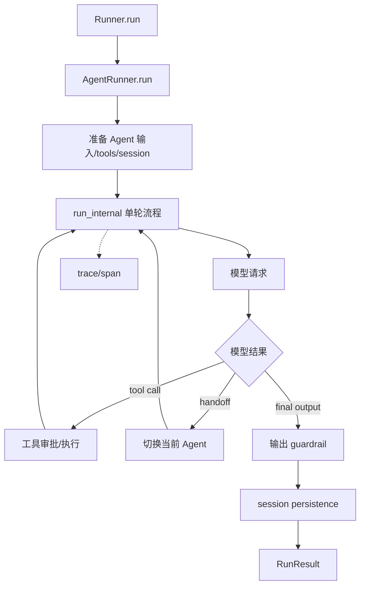

# OpenAI Agents SDK 源码导读

OpenAI Agents SDK 的阅读重点是 `Runner` 如何组织一次 run：准备输入和 tools，调用模型，执行工具或 handoff，运行 guardrail，持久化 session，并把每一层包进 tracing。它比 smolagents 分层更多，适合用来理解“运行时编排”和“可观测性”如何互相约束。

## 学习目标

- 能从 `Runner.run()` 追到 `AgentRunner`、单轮执行、工具/转交和停止原因。
- 能区分 `Agent` 的声明、`Runner` 的调度、`Session` 的对话存储和 tracing 的观测职责。
- 能沿源码判断 guardrail、handoff、tool approval 和错误处理发生在副作用之前还是之后。

## 前置知识

- 第 02–10 章的 Agent Loop、Model/Provider、Tool Calling、Handoff、Guardrails、Session、TraceSpan。
- Python async、Protocol 和泛型的基本阅读能力。

## 版本与源码范围（2026-10-09）

本次核对官方仓库 `openai/openai-agents-python` 的 `main` 分支。当前 `pyproject.toml` 的包版本是 `0.23.1`，语言为 Python，最低 Python 版本为 3.10。源码会持续变化，建议把阅读提交记录在自己的笔记中。

| 先看什么 | 当前路径 | 责任 |
| --- | --- | --- |
| 公共运行入口 | [`src/agents/run.py`](https://github.com/openai/openai-agents-python/blob/main/src/agents/run.py) | `Runner` 与 `AgentRunner` |
| Agent 声明 | [`src/agents/agent.py`](https://github.com/openai/openai-agents-python/blob/main/src/agents/agent.py) | instructions、tools、handoffs、output type |
| 单轮内部流程 | [`src/agents/run_internal/run_loop.py`](https://github.com/openai/openai-agents-python/blob/main/src/agents/run_internal/run_loop.py) | 模型、工具、流式和停止边界 |
| 转交 | [`src/agents/handoffs/__init__.py`](https://github.com/openai/openai-agents-python/blob/main/src/agents/handoffs/__init__.py) | handoff 描述与调用 |
| 守卫 | [`src/agents/guardrail.py`](https://github.com/openai/openai-agents-python/blob/main/src/agents/guardrail.py) | 输入/输出 guardrail |
| 会话 | [`src/agents/memory/session.py`](https://github.com/openai/openai-agents-python/blob/main/src/agents/memory/session.py) | Session Protocol 与持久化边界 |
| tracing | [`src/agents/tracing/`](https://github.com/openai/openai-agents-python/tree/main/src/agents/tracing) | trace/span 创建与导出 |

## 先看懂一次 run



阅读提示：当前 Agent 变化后仍可能回到同一个 run loop，因此不要把 handoff 理解成创建一个完全独立的进程。源码阅读时同时看“当前 Agent”“run context”“session”和“trace parent”四个变量。

## `Runner` 与 `AgentRunner`

### `Runner.run`

`Runner` 是用户最常见的公共入口，提供 `run`、`run_sync` 和 `run_streamed` 三种形式。它主要是稳定的调用面，不要在这里寻找全部业务逻辑；下一步进入 `AgentRunner`。

### `Runner.run_sync`

同步入口只是为同步程序包一层 async 执行。阅读时要留意已有 event loop、取消和异常传播；它不是一套独立的同步 Agent 实现。

### `Runner.run_streamed`

流式入口返回可消费的运行结果对象，模型 delta、工具事件、handoff 和完成事件会分层暴露。不要把“已经收到一个事件”当成 run 已经成功结束，终态仍要看 result 和停止原因。

### `AgentRunner.run`

`AgentRunner` 才是默认运行器的实现边界。它准备 run state、配置、tracing 和 session，再进入 `_run_impl`。如果要理解自定义 runner 或测试替身，应从这个类的构造和默认 runner 注册处读起。

### `AgentRunner._run_impl`

这里把一整个 run 拆成多个 turn，并调用内部 run-loop 处理当前 Agent 的模型响应、工具、handoff、guardrail 和最大 turn。源码中看到 `turn` 时，先区分“模型的一次响应”与“用户理解的一轮对话”，两者不一定相同。

## `Agent`：声明能力，不负责调度

### `Agent`

`Agent` 是声明对象，包含 name、instructions、model、tools、handoffs、output type 和相关策略。它描述“当前 Agent 能做什么”，不应该承担跨 turn 的循环状态；那是 Runner 的责任。

### `AgentBase.get_all_tools`

当前源码会从本地 function tools、MCP tools 和其他延迟工具来源组装可用工具。读这里时看工具发现是否每次重新发生、是否有缓存、MCP 工具名冲突怎么处理。工具列表是模型输入的一部分，也是授权边界的一部分。

### `Agent.get_system_prompt`

system prompt 可能是字符串，也可能由动态 prompt provider 产生。调试时记录最终送给模型的 prompt，而不是只看 Agent 构造时的 instructions；这是定位“代码看起来没变但行为变化”的关键。

## `AgentRunner` 的单轮内部流程

### `run_internal.run_single_turn`

该函数把一次当前 Agent turn 拆开：准备模型输入、调用模型、处理响应、执行 action，并决定是否继续。它是理解普通 tool call 和 handoff 的主线。

### `run_internal.run_single_turn_streamed`

流式版本在输出 delta 的同时等待工具/guardrail/完成事件。阅读时关注取消发生在哪里、已经产生的流式 item 是否持久化、异常是否会被转换成可观察事件。

### `get_new_response`

它负责获取新的模型响应，是 provider/model adapter 与 Agent loop 的接缝。下断点记录输入 item、tools、model settings 和返回 response；不要直接把 provider 的原始响应当作最终 SDK item。

### `RunConfig`

`RunConfig` 把 tracing、模型 provider、工具执行并发、错误策略和输入过滤等运行级选择集中起来。配置对象不是全局常量；同一个 Agent 可以由不同 run 使用不同的运行策略。

## Handoff：一种带元数据的工具式转交

### `Handoff`

当前源码中的 handoff 包含目标 Agent、名称/描述、输入过滤和调用逻辑。模型看到的 handoff 通常表现为可选择的工具能力，但执行后会改变当前 Agent；因此它既是 Tool Calling，也是运行上下文切换。

### `handoff(...)`

工厂函数把目标 Agent 包装成可被模型选择的转交描述，可附加 `on_handoff`、输入类型或 enabled 条件。阅读时核查 enabled 判断和真正切换之间是否存在副作用。

### `_invoke_handoff_impl`

这是值得下断点的转交执行点。它会处理 handoff 输入、调用回调并返回目标 Agent 的运行信息。重点看原 Agent 的历史、目标 Agent 的输入、trace parent 和 session 是否按设计继承。

### `HandoffRuntime`：路线中的职责名

路线里的 `HandoffRuntime` 表示“执行 handoff 并切换当前 Agent”的运行时职责；当前 SDK 的源码入口主要分布在 `src/agents/handoffs/`、`run_internal` 和 `AgentRunner`，不要据此臆造一个必须存在的顶层 class。

## Guardrail 与工具审批

### `InputGuardrail.run`

输入 guardrail 默认 `run_in_parallel=True`，会与 Agent 执行并发；因此 tripwire 触发时，模型可能已经消耗 token，甚至已经执行工具，不能绝对说它发生在所有副作用之前。若必须先检查、通过后才启动 Agent，设置 `run_in_parallel=False`。源码阅读时要沿并发分支和阻塞分支分别确认失败时模型/工具是否已经启动。

### `FunctionTool.tool_input_guardrails` 与 `tool_output_guardrails`

工具级 guardrail 绑定具体的 `FunctionTool`：`tool_input_guardrails` 在调用工具前检查参数，`tool_output_guardrails` 在工具返回后检查结果；它们比 Agent 级 input guardrail 更适合保护某一个有副作用的工具。工具若还配置 approval，审批会改变“检查—暂停—执行”的时序；`ToolExecutionConfig.pre_approval_tool_input_guardrails=True` 可在发出审批中断前先检查一次，获批后仍会在真正执行前再次检查。

### `OutputGuardrail.run`

输出 guardrail 检查最终输出，避免模型已经完成但结果不满足业务约束。它和工具 guardrail 的时机不同：输出 guardrail 失败不应被误认为工具执行失败。

### `ToolApproval` 与工具执行

在工具调用前还可能经过 approval。把“模型选择工具”“框架认可工具”“用户批准工具”“工具真正执行”分成四个事件，否则审计日志会把意图和副作用混为一谈。

## `Session`：历史存储，不是 Runner 本身

### `Session` Protocol

当前 SDK 用 `Session` Protocol 描述 `get_items`、`add_items`、`pop_item`、`clear_session` 等能力。路线中常说的 `SessionService` 是概念名；当前代码的公共事实是 Protocol 加上具体实现，例如 `SQLiteSession`。

### `SessionService`：概念到实现的映射

如果旧资料写 `SessionService`，把它理解为“Runner 使用的会话服务边界”；本版本不应直接搜索一个同名核心类，而应从 `Session` Protocol、具体 session 和 `run_internal/session_persistence.py` 追读。

### `SQLiteSession`

它为本地开发提供持久化会话，Runner 在 run 前读取历史，run 后写入新增 item。源码阅读时验证写入时机和错误处理：模型已经成功但 session 写入失败时，调用者应看到什么终态。

### `to_input_list`

不使用 Session 时，`RunResult.to_input_list()` 可以把结果转为下一次输入。它是显式历史传递方案，不等于一个服务器端长期会话；理解这点有助于对照 OpenAI Conversations 或 `previous_response_id`。

## Tracing：让运行过程可解释

### `trace`

默认 Runner 会把一个完整 workflow 包成 trace，再为 turn、agent、generation、function、guardrail、handoff 等操作建立 span。读 tracing 源码时先画出父子关系，再看 exporter；不要先从网络发送代码读起。

### `SpanData`

不同 span 的 data 表示不同事实：模型 generation、工具调用、Agent、guardrail 和 handoff。敏感数据配置会影响输入/输出是否进入 trace，因此 tracing 不是纯日志，而是数据治理边界。

## Python 伪代码：把源码主线缩成一段

```python
async def run_once(agent, user_input, session=None):
    # 输入：Agent 声明、用户输入、可选 Session；输出：最终结果。
    history = await session.get_items() if session else []
    current = agent

    for turn in range(8):
        response = await current.model(current, history + [user_input])
        if response.kind == "tool":
            approved = await approve(response.tool)
            if not approved:
                return {"status": "rejected"}
            history.append(await response.tool.run())
            continue
        if response.kind == "handoff":
            current = response.target_agent
            continue
        await output_guardrail(response.output)
        if session:
            await session.add_items(history + [response.output])
        return {"status": "completed", "output": response.output}

    return {"status": "max_turns"}

# 输出示意：completed、rejected 或 max_turns。
```

这是教学用伪代码，不代替 SDK 的类型、错误、流式和 tracing 实现，但可以用来对照每个源码函数的责任。

## 源码阅读锚点

1. `Runner.run`：记下输入形态、Agent、session、run config。
2. `AgentRunner._run_impl`：确定 turn 和最大 turn 的边界。
3. `run_internal/run_loop.py`：跟一条 tool call 从模型到工具结果回填。
4. `handoffs/__init__.py`：跟一次 handoff 的输入、目标 Agent 和 trace。
5. `guardrail.py` 与内部 guardrail 流程：确认 tripwire 时机。
6. `memory/session.py`：验证历史读写和失败后的状态。
7. tracing：最后回看哪些动作被记录以及敏感数据策略。

推荐搜索词：`Runner.run`、`AgentRunner._run_impl`、`run_single_turn`、`get_new_response`、`Handoff`、`_invoke_handoff_impl`、`InputGuardrail.run`、`OutputGuardrail.run`、`Session`、`trace`。

## 易混点

- `Runner` 是调度入口，不是模型；`Agent` 是声明，不是完整 run loop。
- handoff 表面像工具调用，但成功后会改变当前 Agent 和后续工具集合。
- Session 负责历史存储；`RunResult.to_input_list()` 是显式传递，两者不是同一机制。
- tracing 记录运行事实，但 trace 是否包含敏感输入由配置决定。
- guardrail 的“拒绝”与工具业务返回的“失败”属于不同层级。

## 课后小问（含解析）

### 为什么要从 `Runner.run` 继续读到 `run_internal`？

答案：公共入口只提供 API 稳定性；真正的 turn、工具、handoff、guardrail 和停止原因在内部 run-loop。只看入口无法判断副作用发生前后的顺序。

### Handoff 和普通工具调用最关键的差别是什么？

答案：普通工具返回结果给当前 Agent；handoff 返回或切换到另一个 Agent，后续 instructions、tools 和输出责任可能都改变。

### Session 写入失败应该归到模型失败吗？

答案：不应直接归类为模型失败。模型生成、工具副作用、最终输出和持久化是不同阶段；源码和应用应保留阶段信息，否则恢复和重试可能重复工具动作。

## 本节小结

OpenAI Agents SDK 的主线是 `Runner → AgentRunner → run_internal`。Agent 声明能力，Runner 管理 turn，handoff 切换 Agent，guardrail 控制输入/输出和副作用前后，Session 保存历史，tracing 把过程组织成可观测层。

## 快速回顾

- 运行入口：`Runner.run / run_sync / run_streamed`。
- 核心实现：`AgentRunner.run → _run_impl → run_single_turn`。
- 转交：`Handoff → _invoke_handoff_impl → 新 Agent`。
- 存储：`Session.get_items/add_items`，或显式 `to_input_list`。
- 观测：trace 包含 turn、generation、tool、guardrail、handoff 等 span。

## 官方源码与文档

- [OpenAI Agents SDK 官方仓库](https://github.com/openai/openai-agents-python)
- [`run.py`](https://github.com/openai/openai-agents-python/blob/main/src/agents/run.py)
- [`agent.py`](https://github.com/openai/openai-agents-python/blob/main/src/agents/agent.py)
- [`run_internal/run_loop.py`](https://github.com/openai/openai-agents-python/blob/main/src/agents/run_internal/run_loop.py)
- [`handoffs`](https://github.com/openai/openai-agents-python/blob/main/src/agents/handoffs/__init__.py)
- [`guardrail.py`](https://github.com/openai/openai-agents-python/blob/main/src/agents/guardrail.py)
- [`memory/session.py`](https://github.com/openai/openai-agents-python/blob/main/src/agents/memory/session.py)
- [Running agents 官方文档](https://openai.github.io/openai-agents-python/running_agents/)
- [Guardrails 官方文档](https://openai.github.io/openai-agents-python/guardrails/)
- [Tracing 官方文档](https://openai.github.io/openai-agents-python/tracing/)
